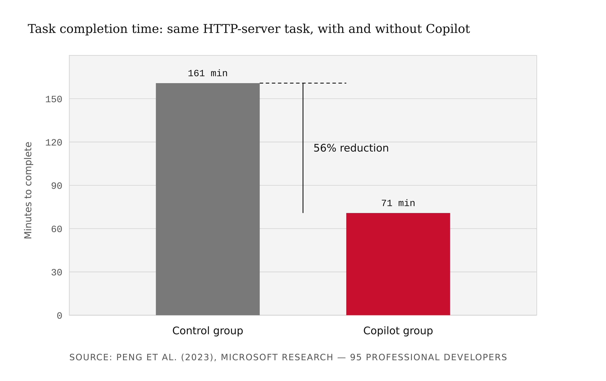
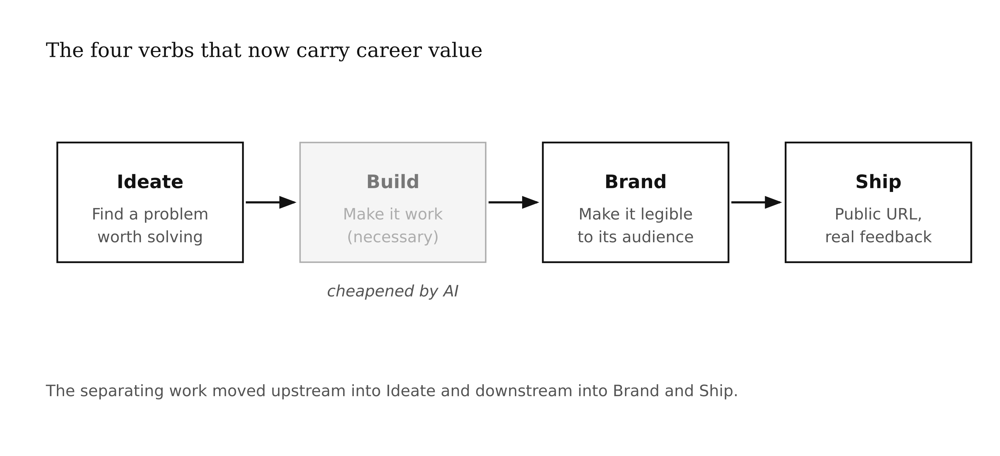
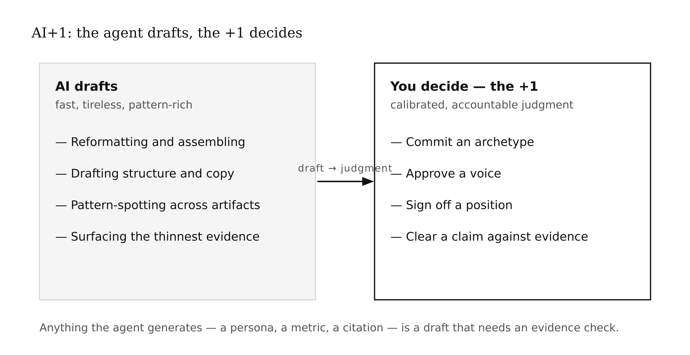
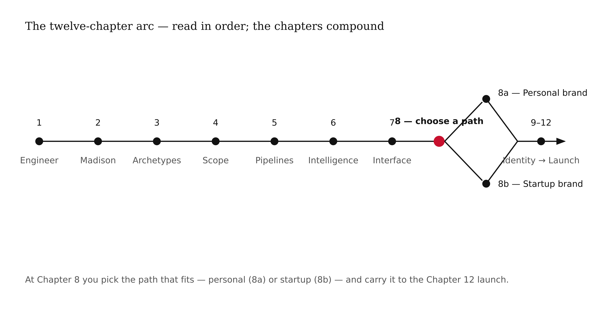
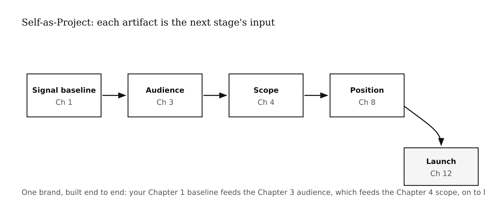

# Introduction

In 2022 a controlled experiment at Microsoft Research gave ninety-five professional
developers the same task and handed half of them GitHub Copilot. The Copilot group
finished in 71 minutes; the control group took 161. That 56% collapse in the cost of
*building* is where this book starts — because when building gets cheap, the scarce skill
is no longer the ability to build. It is knowing **what** to build and making that work
**legible** to the people it is for.

That is a branding problem. *Branding and AI* teaches brand strategy for technical
practitioners whose credentials no longer separate them — and it teaches you to do the work
with AI as your tool, not your replacement.

## What This Book Is

A graduate-level, hands-on branding course. It reads the cheapening of technical signals
through Spence's signaling mechanism, names the four verbs that now carry career value —
**Ideate, Build, Brand, Ship** — and walks the brand disciplines that make a *Creative
Engineer* recognizable: archetype, scope, pipelines, interface, positioning, visual
identity, storytelling, portfolio, and launch. Every chapter opens on a **brand decision**,
then uses AI to execute it.

## What This Book Is Not

Not a tour of AI tools, and not a substitute for taste, practice, or judgment. The tool
changes every quarter; the brand decision does not. When a chapter reaches for AI, the
decision leads and the model follows.

## The Idea Running Through the Book

**AI+1.** The agent drafts; you — the +1 — own the decision. Across the book you build one
brand end to end (the **Self-as-Project** thread), and at every chapter you run a real
branding task through Madison and then exercise the judgment AI cannot: committing an
archetype, approving a voice, signing off a position, accepting a persona as real, clearing
a claim. Anything the agent generates — a persona, a metric, a citation — is a draft that
needs an evidence check.

## Madison: the AI you run

This book ships the AI it teaches you to use. The `madison/` directory is a self-contained
copy of the **Madison** framework — an open-source, agent-based marketing-intelligence
system ([humanitarians.ai/madison](https://www.humanitarians.ai/madison)) organized into
five agent roles plus orchestration. Download this repository and the end-of-chapter
exercises are runnable; no other clone required. Madison is the *tool*; this book is the
*branding course* that uses it.

## How This Book Is Organized

- **Chapter 1 — The Creative Engineer.** *When the cost of building collapses, the value of knowing what to build rises.* Spence signaling and the four verbs.
- **Chapter 2 — The Madison Framework.** *Five roles, one pipeline, and the moment you realize architecture is brand.* The four meanings of "agent," read as brand surface.
- **Chapter 3 — Jungian Brand Archetypes as a System.** *The constraint that makes every downstream decision decidable.* Twelve archetypes and their shadows.
- **Chapter 4 — Product Requirements and Scope.** *The $100,000 no — what you refuse to build defines the product.*
- **Chapter 5 — Data Pipelines and Workflow Automation.** *Every external dependency is a contract, and every contract will change.*
- **Chapter 6 — AI Intelligence and Multi-Agent Systems.** *The hard decision is where the AI decides and where it does not.*
- **Chapter 7 — Interface Design and Deployment.** *The interface is a contract the user re-checks every session.*
- **Chapter 8 — Brand Strategy (two paths).** Positioning as a defensible claim, on two tracks you choose between (or run both):
  - **8a — Personal Brand Path.** Position a person.
  - **8b — Startup Brand Path.** Position a venture.
- **Chapter 9 — Visual Identity Systems.** *Strategy and design together — the system, not the Pepsi document.*
- **Chapter 10 — Brand Storytelling.** *A brand telling the wrong story burns faster than none.*
- **Chapter 11 — Portfolio as Product.** *The artifact you build once whose returns compound.*
- **Chapter 12 — Professional Presence and Launch.** *The final deliverable is you.*

## How to Read This Book

Read in order if the field is new; the chapters compound — your Chapter 1 signal baseline
feeds your Chapter 3 audience, which feeds your Chapter 4 scope, and so on to the Chapter 12
launch. At Chapter 8, pick the path that fits — personal (8a) or startup (8b) — and carry it
to the end. Each chapter closes with a five-part **AI+1** block that advances your own brand
by running the mapped Madison recipe (see `madison/README.md`).

## A Note About AI

The point of this book is not that AI writes your brand for you. It cannot — generic copy,
fabricated personas, and unprovable claims are exactly what destroy a brand at first contact.
The point is the division of labor: AI is excellent at reformatting, drafting, and
pattern-spotting, and unreliable at the calibrated, accountable judgments brand work turns
on. The book trains you to tell the difference, run the tool, and own the result. Like other
Bear Brown books it is also built to be legible to an intelligent textbook system, but it
stands on its own as readable prose.

## Closing Return

Building got cheap. Knowing what to build, and making it legible, did not. This book is the
path from one to the other — run end to end on your own brand.

Let's go.

## Tags

Branding and AI, Creative Engineer, Spence signaling, four verbs, Madison framework, Jungian archetypes, AI+1, Self-as-Project, brand strategy, Medhavy, Bear Brown
