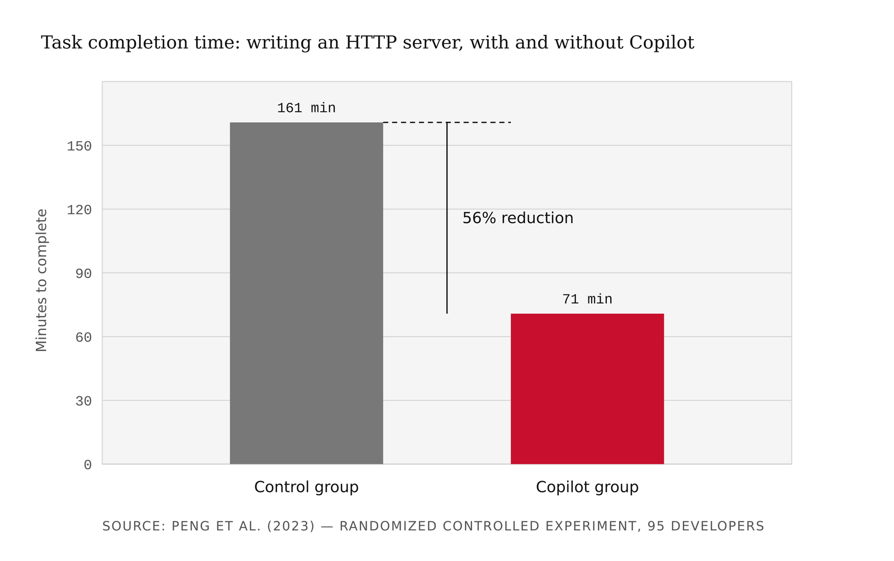
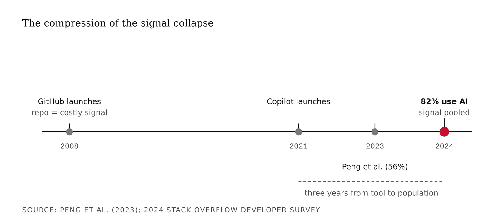
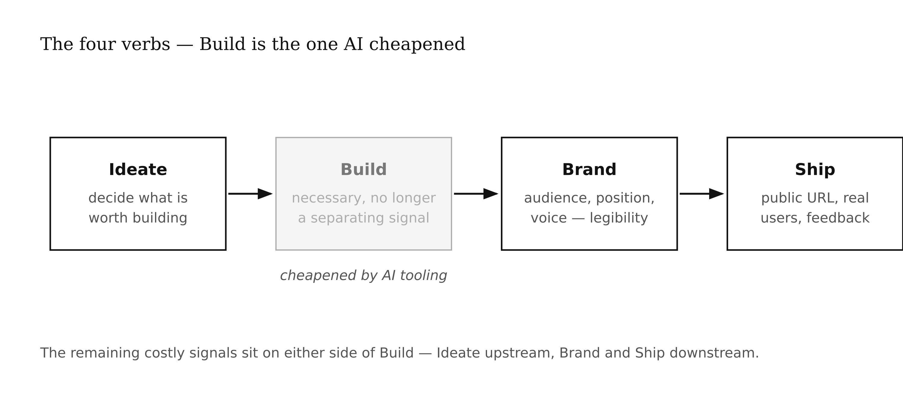
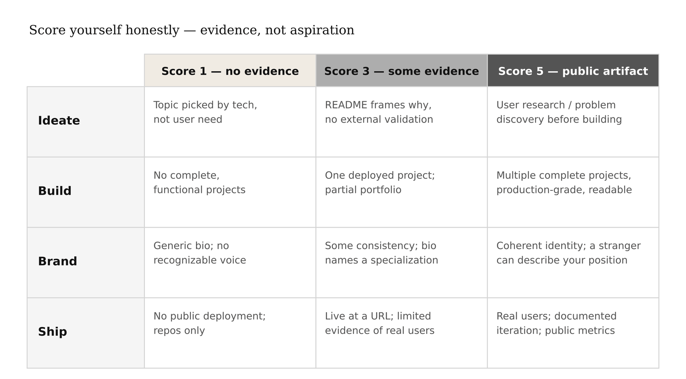
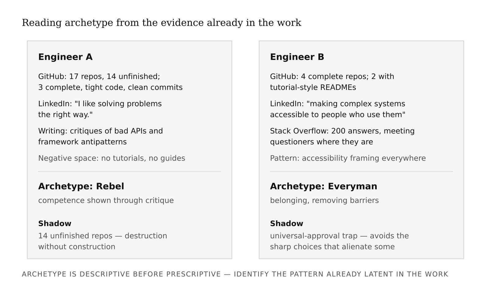
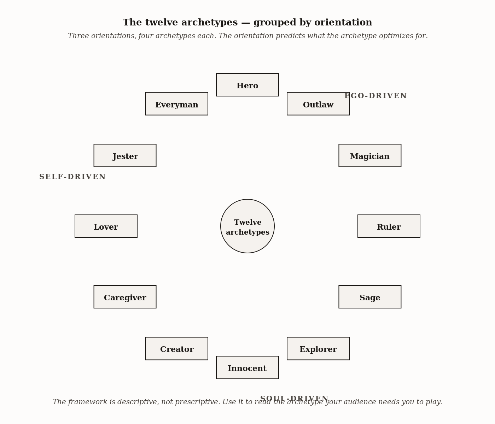
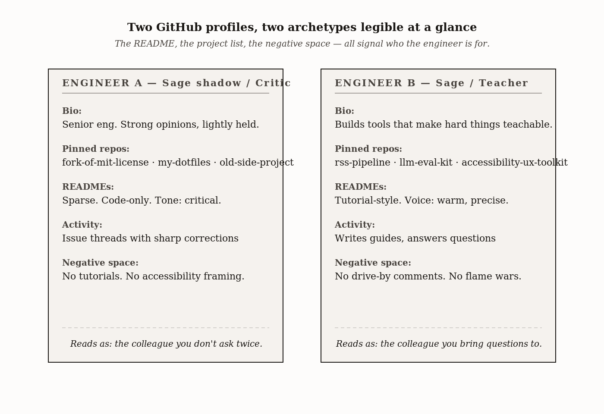
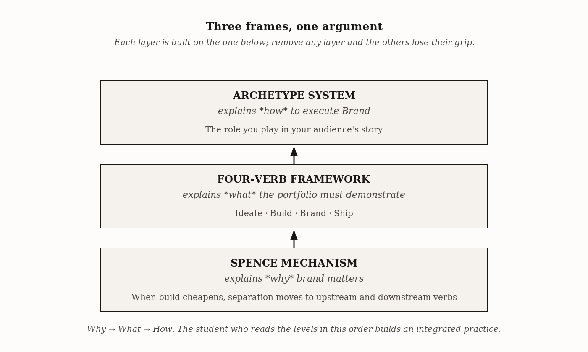

# Chapter 1 — The Creative Engineer
*When the cost of building collapses, the value of knowing what to build rises.*

---

In 2022, a team of researchers at Microsoft Research ran what is, to my knowledge, the cleanest controlled experiment on AI-assisted software development yet published. The paper — Peng et al., "The Impact of AI on Developer Productivity: Evidence from GitHub Copilot" — took ninety-five professional developers and gave them a single task: write an HTTP server in JavaScript.

Half the developers got nothing extra. Half got GitHub Copilot.

The control group finished in 161 minutes. The treatment group finished in 71 minutes.

That is a 56% reduction in task completion time. Two hours and forty-one minutes versus one hour and eleven minutes — for a task that, a decade ago, was a standard job-interview filter.

Spend a moment with that number before you react to it. 56% is not a rounding error. It is not a cherry-picked outlier from a startup press release. It is a peer-reviewed, randomized controlled experiment on professional developers doing real work. The researchers were careful about confounds: same task, same environment, randomized assignment, professional developers not novices.

Here is the reaction most people have: *"Great — engineers got more productive."*

Here is the reaction I want you to have: *"What exactly got cheaper, and what does that do to the market?"*

Those are different questions. The first is about individual performance. The second is about market structure. This chapter is about the second question.


*Figure 1.1 — Task completion time, Peng et al. (2023)*

<!-- → [CHART: Bar chart — Control Group (161 min) vs. Copilot Group (71 min) with 56% reduction labeled prominently; helps anchor the empirical claim before signaling theory is introduced] -->

---

## The Machinery: Spence's Signaling Mechanism

To understand what the Peng et al. result means for your career, you need a piece of mid-twentieth-century economics. Bear with me — this is one of the most useful frameworks in labor economics, and once you have it, you will see it everywhere.

In 1973, Michael Spence published "Job Market Signaling" in the *Quarterly Journal of Economics*. The paper earned him a Nobel Prize. The mechanism is elegant and uncomfortable in equal measure.

Here is the problem Spence was trying to solve. An employer wants to hire productive workers. Productivity is not directly observable — you cannot measure it without actually doing the job, and by the time you have measured it, you have already made the hire. So employers use *signals*: things candidates show or do that correlate with the thing they cannot observe directly.

The canonical example is education. A college degree, in Spence's model, functions as a signal of productive capacity. Not because the courses necessarily produce the capacity — Spence was deliberately agnostic about whether education is causally productive — but because getting a degree is *costly*, and the cost is structured in a way that correlates with productivity. Less-capable candidates either do not enroll, do not finish, or take longer. The signal carries information *because it is hard to fake cheaply*.

Here is the critical insight: **a signal works only as long as its cost-structure holds**. If the cost of producing the signal falls — if everyone can produce it easily — the signal stops sorting. It ceases to be informative. The employer is back to guessing.

Spence called this a *separating equilibrium*: a state in which signals successfully separate high-productivity candidates from lower-productivity ones. When the cost-structure of the signal is disrupted, the separating equilibrium collapses. You get a *pooling equilibrium* — everyone looks the same on the credential, and the credential stops doing its job.

<!-- → [INFOGRAPHIC: Two-column schematic — separating equilibrium (signal sorts high from low productivity) vs. pooling equilibrium (signal stops distinguishing); use simple candidate-pool diagrams with arrows showing employer inference] -->


*Figure 1.3 — Separating vs. pooling equilibrium*

For roughly twenty years, "I have a working app on GitHub" was a separating signal for software engineers. Think about what it actually cost to produce that signal in 2010. You needed to know version control, a language, a framework, a deployment environment. You needed to debug something that broke at 11pm. You needed to persist through the project long enough to have something worth showing. The entire project might have taken six weekends of genuine effort. That cost correlated with productive engineering capacity. Recruiters used GitHub the way they used GPA — as a noisy but real proxy.

Now apply the Peng et al. result. The activation cost of producing a "working app" signal has fallen by more than half for straightforward tasks, and continues to fall as tooling improves. The 2024 Stack Overflow Developer Survey found 82% of developers using AI tools for code, and 76% currently using or planning to. These are not edge-case early adopters. They are the population.

When 82% of developers are using AI code assistance, a GitHub repository no longer tells a recruiter whether they are looking at someone who built the project over six weekends of craft or someone who scaffolded it in a Tuesday afternoon with Claude Code. The signal did not vanish. It *pooled*. Everyone produces it, so it stops sorting.


*Figure 1.4 — The compression of the signal collapse*

<!-- → [CHART: Timeline — 2004 (GitHub launches), 2021 (Copilot launches), 2023 (Peng et al. study published), 2024 (82% Stack Overflow survey); shows how fast the collapse compressed] -->

The question that follows from the mechanism is unavoidable: what is still costly after AI tooling?

Not writing the code. Building has not become free — production-grade systems still require deep technical judgment — but the *threshold* work, the work that used to be the demonstration, has cheapened substantially. What has not cheapened is identifying a problem worth solving, positioning a solution for a specific audience, and shipping to real users with real feedback loops. These require human contact with reality. They cannot be prompted away.

The labor-market evidence is consistent with this prediction. Recent analyses of AI engineering salaries report base compensation averaging around $206,000, with specialists pulling 30–50% above generalists at the same seniority level. The market is re-pricing. The new separating signals are the ones AI tooling did not make cheap.

---

## The Four Verbs

I use the term *Creative Engineer* throughout this book. Let me specify what it means, because terms like this are usually trying to do too many jobs at once.

The Creative Engineer is an engineer who has noticed that the costly signals have shifted, and has invested accordingly. The framework has four verbs: **Ideate. Build. Brand. Ship.**

<!-- → [INFOGRAPHIC: Four-verb sequence — Ideate → Build → Brand → Ship — with Build visually de-emphasized or marked as "cheapened" to show where the signal collapse occurred] -->


*Figure 1.5 — The four verbs of the Creative Engineer*

**Ideate** is the hardest move, and the one generative AI cannot yet do for you. Generative tools are excellent at producing solutions. Given a specification, they will build it. What they cannot do is decide whether the specification is worth building. Talking to potential users, finding a real gap, refusing to build the wrong thing — this requires human judgment operating in the world. The failure mode I see most often in engineering students: they pick a technology they want to learn, build a project around the technology, and then try to retrofit a user need onto the artifact. The result is a technically competent thing that nobody wanted. The project demonstrates Build. It does not demonstrate Ideate.

**Build** is the verb AI cheapened. A critical distinction: production-grade systems still require deep technical judgment. The 56% reduction in task completion time from Peng et al. was on a specific, bounded task. The judgment required to architect a system that scales, that doesn't leak credentials, that survives the edge cases real users will find — that has not been automated. Technical depth still matters. The point is that *demonstrating* Build through a GitHub repository has stopped being a separating signal. Build is necessary. It is not sufficient.

**Brand** is where the most resistance lives among technically trained students. In this book, Brand means something specific: the set of decisions — about audience, positioning, archetype, voice, and visual identity — that determine whether a stranger in your target audience can find your work and recognize why it is for them. Brand is not decoration. The engineering analogy: an API without documentation is technically complete. It does the computation. It returns the right values. But if the developer who needs it cannot understand what it is for, it is useless. Documentation is not decoration on the API — it is the part that makes the API connectable to the world that needs it. Brand is documentation for your career. The common objection is that your work should speak for itself. The honest response: your work cannot speak at all if the person it is for cannot find it.

**Ship** means a public URL, an audience that found it, feedback from real use. Not committed to GitHub. Not published as a paper. Not demoed in class. Ship is what makes the difference — and it is the verb that generates the most learning, because every assumption you made during Ideate and Build gets tested when real users encounter the thing.

| Verb | Score 1 — no evidence | Score 3 — some evidence | Score 5 — clear public artifact |
|---|---|---|---|
| **Ideate** | Project topics chosen by technology or assignment, not user need; no documented problem discovery | README or write-up frames why the project exists, but not tied to external validation or user contact | Public artifact showing user research, gap identification, or problem discovery before building (interview notes, problem statement, iteration log) |
| **Build** | No complete, functional projects in any public repository | At least one complete, deployed project; partial portfolio with some finished work alongside abandoned repos | Multiple complete projects with documented technical decisions; production-grade deployment visible; code is readable by a stranger |
| **Brand** | No consistent positioning; bio is generic or absent; no recognizable voice or audience across artifacts | Some consistency in tone or topic area; bio names a specialization; writing samples suggest an emerging voice | Coherent public identity across platforms; a specific audience is identifiable from the work; a stranger could describe your positioning without prompting |
| **Ship** | No public-facing deployment; projects exist only as repos or class submissions | At least one project live at a public URL; limited evidence of actual users beyond the builder | Deployed product with real users; documented iteration based on use; public metrics, testimonials, or engagement visible |

Consider Anthropic and OpenAI as a firm-level illustration. Both train large language models. Both were founded by technically excellent people with overlapping backgrounds — Anthropic was started in 2021 by former OpenAI researchers, including Dario and Daniela Amodei. The technical foundations are not radically different; both labs publish frontier research, both hit competitive capability benchmarks.

What is radically different is Brand.

In December 2022, Anthropic published Bai et al., "Constitutional AI: Harmlessness from AI Feedback" — a training method in which the model is guided by a written set of principles and trained to critique and revise its own outputs against those principles. This is a methodological contribution. It is also, and not by accident, a *brand* contribution. Anthropic chose to name a specific technical commitment to safety as the front door of their public identity. OpenAI's positioning chose differently: frontier capability first, moving fast, betting on AGI proximity as the primary signal. Two companies, similar technical work, very different market positions. Brand carved out two audiences that could each sustain a viable company.

| | **Anthropic** | **OpenAI** |
|---|---|---|
| **Primary audience** | Enterprise buyers, regulated industries, safety-conscious deployers | Consumer market, developer ecosystem, frontier-capability accounts |
| **Brand positioning** | "Honest, harmless, helpful" — safety as a first-order commitment | "Ensure AGI benefits all of humanity" — frontier capability first |
| **Flagship signal** | Constitutional AI (Bai et al., 2022) — a published, named method for value alignment | GPT capability announcements — benchmark performance and consumer adoption as primary signals |
| **Market captured** | Enterprise and API accounts where compliance and brand safety matter | Consumer mindshare; developer-first integrations; raw-capability accounts |

<!-- → [TABLE: Anthropic vs. OpenAI brand differentiation — audience, positioning, flagship signal, market captured; placed here to anchor the firm-level illustration before returning to individual career strategy] -->


*Figure 1.8 — Anthropic / OpenAI brand differentiation*

The same mechanism — explicit audience, differentiated positioning, chosen archetype — determines which slice of the market can recognize you, want you, and hire you. Not a company. A career.

---

## The Twelve Archetypes

We have established that Build has cheapened, and that Ideate, Brand, and Ship are the remaining costly signals. We have established that Brand means choosing an audience, a position, and a voice. Now the question is: *how do you choose?*

The framework I use throughout this book is the twelve Jungian archetypes as a strategic positioning system. Carl Jung proposed that certain recurring character patterns appear across cultures and myths — that the Hero, the Sage, the Trickster, the Caregiver are not inventions of specific cultures but structures of how humans organize meaning around persons and roles. Brand strategists Margaret Mark and Carol Pearson adapted this into a twelve-archetype model in their 2001 book *The Hero and the Outlaw*: Hero, Sage, Explorer, Innocent, Creator, Ruler, Caregiver, Magician, Lover, Jester, Everyman, Rebel.

The framework has two things going for it in this context. First, archetypes give you a vocabulary for the thing you are trying to specify: *who am I to the people I am trying to reach?* Not "what can I do" — that is skill. But "what role do I occupy in their story?" An advisor. A challenger. A builder. A guide. This is a different and harder question, and the archetype framework forces you to answer it.

Second, the twelve are internally coherent — each comes with a shadow, a failure mode that is specifically the archetype's strength taken too far. The Hero's shadow is recklessness. The Sage's shadow is paralysis-by-analysis. The Creator's shadow is perfectionism that never ships. These shadows are predictive: once you identify your archetype, the shadow tells you which failure mode to watch for in yourself.

What the framework does *not* do: it does not tell you which archetype to choose. That choice requires evidence from your actual work, your actual voice, your actual patterns. The archetype is descriptive before it is prescriptive. You are not inventing a persona. You are identifying one that is already latent in how you work and communicate.

| Archetype | Core drive | Signature phrase | Shadow failure mode |
|---|---|---|---|
| **Hero** | Mastery and winning through effort | "I'll find a way to win." | Recklessness dressed as determination |
| **Sage** | Understanding, truth, and the sharing of insight | "Let me show you how this actually works." | Analysis without action |
| **Explorer** | Freedom, discovery, and the avoidance of constraint | "There's something better out there." | Seventeen unfinished repositories |
| **Innocent** | Safety, simplicity, and doing things the right way | "If we just do this right, it will work out." | Naivety as comfort |
| **Creator** | Making things of enduring quality and craft | "It's not ready yet." | Perfectionism that never ships |
| **Ruler** | Order, control, and the building of lasting systems | "Here's how this should be structured." | Rigidity over responsiveness |
| **Caregiver** | Service and the removal of friction for others | "What do you need right now?" | Martyrdom as identity |
| **Magician** | Transformation and making the impossible possible | "What if we changed the frame entirely?" | Transformation as self-aggrandizement |
| **Lover** | Connection, intimacy, and specificity of address | "This is made for you, specifically." | Losing distinctiveness to avoid rejection |
| **Jester** | Joy, levity, and using humor to reveal truth | "Can't we see how absurd this is?" | Humor as deflection from accountability |
| **Everyman** | Belonging and making complexity accessible to all | "Anyone can do this — let me show you." | Populism over precision |
| **Rebel** | Disruption and breaking rules that deserve breaking | "That rule deserves to be broken." | Nihilism without a next move |

<!-- → [INFOGRAPHIC: Twelve-archetype wheel arranged in three groups of four — ego-driven, soul-driven, self-driven — with shadow failure mode visible for each; readers use this to locate their provisional archetype] -->


*Figure 1.10 — The twelve archetypes, grouped by orientation*

Here is the method for reading yourself into the framework. It is evidence-based, not introspective — you are not trying to decide what you wish you were. You are looking at the work you have already produced and finding the pattern.

Read your public writing. LinkedIn bio, GitHub readme, any technical writing you have published. What tone shows up? Are you teaching, demonstrating, provoking, synthesizing, building, advising? The archetype is audible in the voice before it is legible in the content.

Look at the projects you chose — not what you built for class, but what you built because you wanted to. The project choices reveal motivation. Did you build something to help a specific person? To demonstrate a capability? To solve a problem that annoyed you? To make something beautiful? Each of those is a different archetype at work.

Find the negative space. What do you *not* do in your public artifacts? The Sage typically does not post hot takes. The Rebel rarely posts polished tutorials. The Creator rarely writes about process; they show output. What is absent tells you as much as what is present.

Name the shadow. Once you have a provisional archetype, look for its shadow in your own work history. Have you held onto a project past the point of useful revision because it was not perfect yet? (Creator shadow.) Have you analyzed a decision so thoroughly that the window for making it closed? (Sage shadow.) Have you picked up a new framework every six months without finishing anything in the last one? (Explorer shadow.) The shadow is usually visible before you name it.

To make this concrete: consider two engineers. Engineer A has a GitHub with seventeen repositories, fourteen unfinished. The three that are complete are technically elegant — tight code, minimal features, clean commit messages. Her LinkedIn bio says "I like solving problems the right way." Her writing is full of posts critiquing poorly-designed APIs and framework antipatterns. She has never published a tutorial. Provisional archetype: Rebel. The pattern is legible — she is drawn to what is wrong and broken, demonstrates competence through critique, and the negative space confirms it: no teaching, no guides, nothing that positions her as a guide. Shadow: fourteen unfinished repositories. Breaking the wrong way of doing something is only half the job. A Rebel who never ships a replacement is a complaint, not a contribution.

Engineer B has four repositories, all complete. Two have README files that read like tutorials. His LinkedIn bio talks about "making complex systems accessible to people who need to use them." He has answered 200 Stack Overflow questions. Provisional archetype: Everyman. The disambiguation from Sage rests on the Stack Overflow evidence — he is meeting questioners where they are, not elevating them toward understanding. Shadow: the universal-approval trap. He may find it difficult to take an unpopular position, or to make the sharp choices that would serve some users well at the cost of alienating others.

| Evidence source | What it reveals | Archetype implication | Shadow to watch for |
|---|---|---|---|
| **Engineer A** — GitHub: seventeen repos, fourteen unfinished; three complete with tight code and clean commits. LinkedIn: "I like solving problems the right way." Writing: critiques of poorly-designed APIs; no tutorials. | Strong opinions about what is broken; competence shown through critique; absence of teaching confirms the pattern | **Rebel.** Motivated by identifying dysfunction and attacking it; voice is adversarial and diagnostic. | Fourteen unfinished repos: destruction without construction. Sharp critique that stops before follow-through. |
| **Engineer B** — GitHub: four complete repos; two with tutorial-style READMEs. LinkedIn: framing around accessibility. Stack Overflow: 200 answers. | Teaching impulse and accessibility framing consistent across every channel; meets people where they are | **Everyman.** Motivated by belonging and the removal of barriers; meets questioners at their level rather than instructing from above. | Universal-approval trap: difficulty making sharp choices that serve some users at the cost of alienating others. |


*Figure 1.12 — Two GitHub profiles, two archetypes*

---

## Three Frames, One Argument

The Spence mechanism, the four verbs, and the archetype system are not three independent frameworks. They are one argument at three levels of resolution.

The Spence mechanism explains *why* the market is shifting: the signal that used to work has pooled. The four verbs explain *what* the new costly signals are: Ideate, Brand, and Ship, built on a necessary Build foundation. The archetype system explains *how* to execute Brand specifically: by naming the role you occupy for your audience, making your positioning coherent, and building a portfolio that expresses a single legible identity rather than a collection of disconnected projects.

The connection between the four verbs and the archetype is this: Brand without archetype is a set of style decisions without a strategic foundation. Archetype without the four-verb framework is identity work without a market position. You need both. The archetype tells you *who you are* to your audience. The four-verb framework tells you *what you are doing* to demonstrate it.

And the Spence layer underneath both explains why any of this matters. If building were still a separating signal, you would not need Brand and you would not need archetype. You would just build more and better things, and the market would find you. The reason you need these additional layers is that the build signal has cheapened — which means the separation work has moved upstream and downstream of build, into Ideate and Brand and Ship.

<!-- → [INFOGRAPHIC: Three-level stack — Spence Mechanism (why the market is shifting) → Four-Verb Framework (what the new portfolio must demonstrate) → Archetype System (how to execute Brand); shows the logical dependency between the three frames] -->


*Figure 1.13 — Three frames, one argument*

| Framework | Question It Answers | What Breaks Without It |
|---|---|---|
| **Spence Mechanism** | *Why* brand matters at all in this market | The student treats brand as optional decoration — investing only in build, then wondering why the GitHub no longer separates them |
| **Four-Verb Framework** | *What* the portfolio must demonstrate | The student has identity but no market action — a clear sense of who they are with nothing in the world that proves it |
| **Archetype System** | *How* to execute Brand specifically | Brand decisions are arbitrary style choices with no strategic foundation; portfolio voice drifts and the audience cannot tell who the work is for |

---

## Chapter Summary

Before this chapter, you had a GitHub. You probably thought of it as your portfolio. You may have felt vaguely uneasy about the brand-and-positioning work that the tech industry increasingly asks for, without quite understanding why it felt like a category violation.

Here is what you can now do that you could not before. You can explain why GitHub has stopped functioning as a separating signal — using the Spence mechanism, not intuition. You can name the four verbs that constitute the Creative Engineer's value proposition, and score yourself honestly against each one. You can identify your archetype from a twelve-item framework using evidence from your actual work, not from what you wish were true about yourself. And you can see the connection between all three: the signal collapse explains *why* brand matters, the four verbs explain *what* the new portfolio must demonstrate, and the archetype explains *how* to make the Brand verb concrete.

The one idea from this chapter that matters most: **building has cheapened. Knowing what to build, for whom, and getting it to them has not.** The Creative Engineer is the practitioner who has internalized this and invested accordingly.

The common mistake to watch for: treating Brand as decoration. Students consistently underinvest in the positioning and audience-specification work because it feels less rigorous than building. The Spence framework is the corrective. Decoration does not produce separating signals. Strategy does.

The Feynman test: can you explain to someone with no economics background why a 56% reduction in task completion time changes what you should put in your portfolio? If you can, you understand this chapter. If you find yourself reaching for jargon, work through the signaling section again.

---

## Connections Forward

Chapter 2 takes your provisional archetype and uses it to make a specific choice: which layer of the Madison framework — Intelligence, Content, Research, Experience, Performance — maps most naturally to your career strategy.

The question Chapter 1 raised but did not fully answer: *how do you identify a problem worth solving?* Ideation was the first verb and the hardest, but I gave you the principle without the method. Chapter 2 develops the method — and the Madison framework is the structure that makes it concrete.

The question this chapter leaves open: is the four-verb framework the right decomposition, or is there a better one? The bet this book is making is that Ideate, Build, Brand, and Ship capture the costly signals that remain after AI cheapens Build. Chapter 3 will give you a stress test — a set of cases where the framework makes a clear prediction, and you will check whether the prediction holds.

**What would change my mind:** a controlled study showing that, after holding technical skill constant, brand-strategy and positioning skills do *not* predict career outcomes for AI engineers — that the market rewards only deep technical specialization. The data is not there yet in either direction. The bet here is that the current trajectory continues. That is a bet, not a proof.

**Still puzzling:** why technically excellent practitioners refuse brand work even when shown the labor-market evidence. Some of it is identity — "I am an engineer, not a marketer." Some of it is sunk cost — years of training for signals that are now depreciating. But there is a third thing I do not fully understand: brand work feels like a *category violation* to technical practitioners in a way that, say, project management does not. The violation feeling is real even when the resistance is unjustified. I suspect it has to do with the difference between making something and claiming something — and with a specific anxiety that claiming distorts or contaminates the making. That is worth more thought than I have given it here.

---

## AI Wayback Machine

The ideas in this chapter didn't appear from nowhere. **Thorstein Veblen** spent the 1890s at the University of Chicago working out a problem the chapter has been working on under a different name: why do humans signal? In *The Theory of the Leisure Class* (1899) Veblen named *conspicuous consumption* — the pattern of acquiring costly things specifically because their cost is observable, and therefore signals capacity to acquire them. Spence formalized the mechanism eighty years later in markets for jobs and credentials. Veblen saw it first in markets for status and class.


*Thorstein Veblen, c. 1880s. AI-generated portrait based on a public domain photograph.*

**Run this:**

```
Who was Thorstein Veblen, and how does his account of conspicuous consumption connect to Spence's signaling mechanism — and to the chapter's claim that *what* you signal has to change when the cost-structure of the old signal collapses? Keep it to three paragraphs. End with the single most surprising thing about his career or ideas.
```

→ Search **"Thorstein Veblen"** on Wikipedia after you run this. See what the model got right, got wrong, or left out.

**Now make the prompt better.** Try one of these:

- Ask it to explain *conspicuous consumption* in plain language, as if you've never read economic sociology
- Ask it to compare Veblen's leisure-class signaling to the GitHub-as-portfolio era of 2008–2020
- Add a constraint: "Answer as if you're writing the rationale for why Brand becomes the new costly signal when Build cheapens"

What changes? What gets better? What gets worse?

---

## Exercises

### Warm-Up

**W1.** In two sentences, explain the Spence signaling mechanism to someone who has never taken economics. Then name one signal that has *not* been disrupted by AI tooling and explain why its cost-structure remains intact.
*(Tests Objective 1 — signal mechanism comprehension)*

**W2.** Score yourself on each of the four verbs — Ideate, Build, Brand, Ship — on a 1–5 scale. For each score, write one sentence justifying it with a specific piece of evidence from your public work (or the absence of such evidence). A score of 4 on Build with no deployed product is not valid — the score must reflect observable artifacts.
*(Tests Objective 2 — four-verb framework self-application)*

**W3.** From the twelve archetypes listed in this chapter, pick your provisional archetype and its runner-up. For each, name one piece of evidence from your public work that supports it and one piece that contradicts it.
*(Tests Objective 4 — archetype identification)*

---

### Application

**A1.** Find a software product you use regularly. Apply the four-verb framework: does the product demonstrate strong Ideate (was there clearly a real user problem)? Strong Brand (is the positioning coherent for a specific audience)? Strong Ship (is the feedback loop visible — do they iterate based on real use)? Write a 200-word assessment using specific evidence from the product itself, not from press coverage.
*(Forces four-verb translation to a product outside your own work)*

**A2.** Choose one of the twelve archetypes that is *not* your own. Describe what a GitHub profile, LinkedIn bio, and project portfolio would look like for an engineer operating from that archetype with full intentionality. What would the voice sound like? What would the project choices reveal? What negative space would you expect? (200–300 words.)
*(Builds archetype-reading fluency by constructing an unfamiliar case)*

**A3.** Return to the Peng et al. 56% result. Identify a *second* category of engineering work — beyond writing an HTTP server — where you would expect AI tooling to produce a similar reduction in task time. Then identify a category where you would expect little or no reduction. Explain the difference using the Spence framework: what is different about the cost-structures of the two categories?
*(Tests application of signaling theory to novel examples)*

**A4.** Read the Anthropic vs. OpenAI illustration in the chapter. Identify a second pair of companies — in any industry, not just AI — where two technically similar competitors produce significantly different market outcomes through brand differentiation. Name the audience each company claimed, the positioning strategy each used, and which four-verb gaps (if any) are visible in each company's public story.
*(Forces Brand analysis in a context not provided in the chapter)*

---

### Synthesis

**S1.** A classmate argues: "The Spence framework explains credential signaling in job markets, but it doesn't apply to entrepreneurship — if you're building a startup, investors care about traction, not signals." Write a 300-word response evaluating this argument. Is the claim correct? Partially correct? Where does the Spence mechanism apply to startup fundraising and where does it not?
*(Tests cross-concept reasoning — Spence mechanism under a challenging reframe)*

**S2.** The four-verb framework places Brand as the third step. A product manager argues: "Brand should come first — you need to know your audience before you build, not after." Construct the strongest version of this argument. Then construct the strongest counterargument. Which do you find more persuasive, and why? (400 words.)
*(Tests whether the student can hold the framework in tension with a legitimate challenge)*

**S3.** You have identified your provisional archetype. Now apply the shadow: describe, in specific and honest terms, one decision in your most recent project where you can see the shadow operating. What did you do (or not do) because of it? What would you have done differently if you had caught the shadow earlier?
*(Connects archetype framework to personal retrospective — tests Objectives 4 and 5 together)*

---

### Challenge

**C1.** The chapter argues that Build has cheapened and that Ideate, Brand, and Ship remain costly signals. Design a counter-experiment: what evidence would convince you that the chapter's central bet is *wrong*? What data would you need to see, and where would you look for it? Be specific — name the study design, the population, the outcome variable, and the timeframe. (400–500 words.)
*(Open-ended — tests whether the student has genuinely internalized the argument or is just reciting it)*

**C2.** The archetype framework has a limitation the chapter acknowledges but does not fully develop: it is descriptive before it is prescriptive. A student could produce evidence that they are a Rebel archetype — and conclude they should therefore brand themselves as one. But what if the Rebel archetype is poorly matched to the specific job market or audience they are targeting? Write a 400-word analysis of this limitation. When does following your archetype help you, and when might it constrain you? What would you add to the framework to address this?
*(Stress-tests the framework's edges — points toward Chapter 2's archetype-to-market-fit discussion)*

---

*Tags: creative-engineer · signaling-theory · spence-mechanism · four-verb-framework · jungian-archetypes · brand-strategy · AI-tooling · GitHub-Copilot · labor-market · portfolio · INFO-7375*
