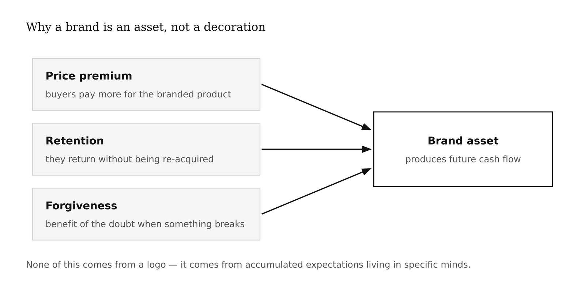
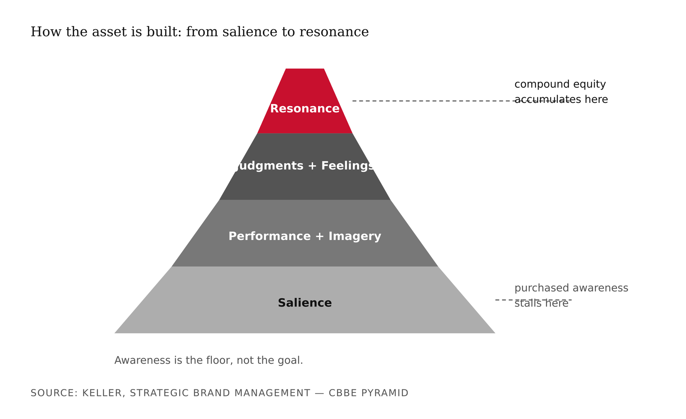
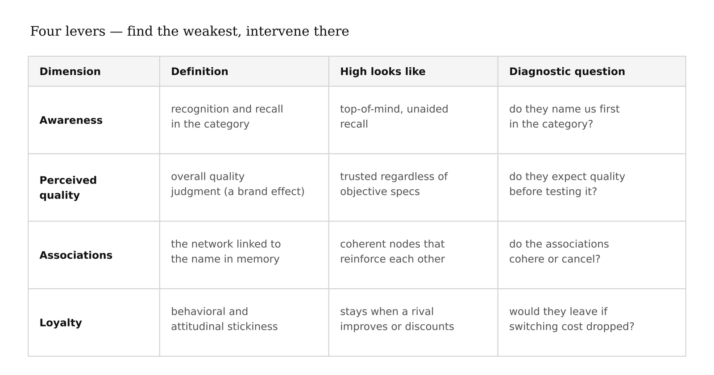
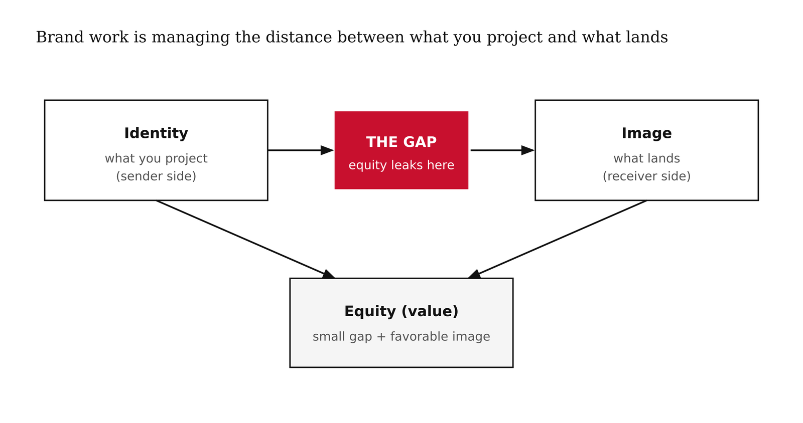
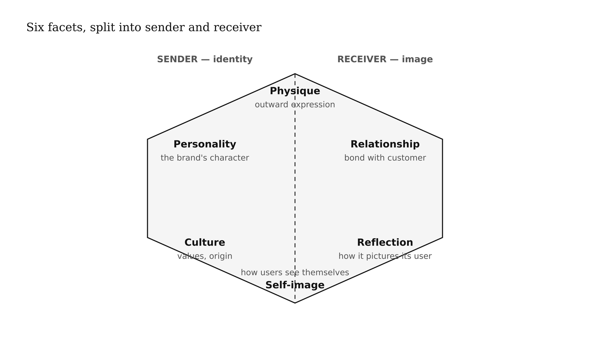
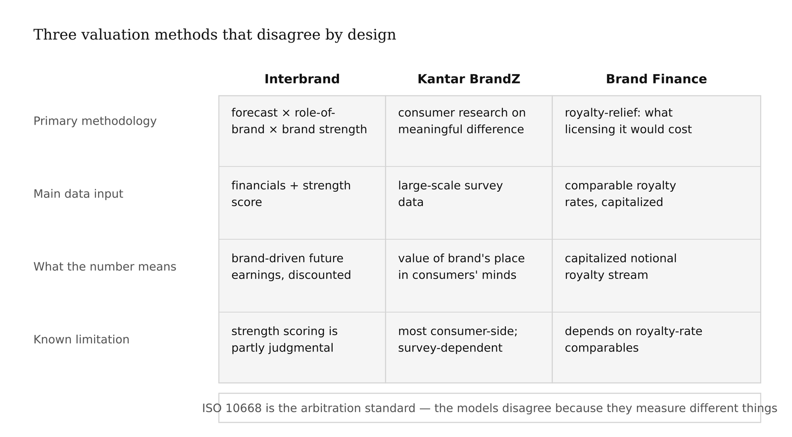

# Chapter 2 — What a Brand Is: Equity & Assets
*A logo is the cheapest part of a brand. The expensive part lives in someone else's head.*

> **TL;DR:** A brand is not a logo or a name — it is an *asset*, the accumulated set of expectations in customers' minds that changes their behavior and can be measured in money. This chapter defines brand equity through two canonical models (Keller's pyramid, Aaker's dimensions), shows how firms put a dollar figure on it, and has you run an AI-assisted equity audit of your chosen brand.
>
> | Section | Preview |
> |---|---|
> | The $20 Billion Line Item | Why brands appear on balance sheets, and what that says about what a brand really is. |
> | Equity: The Keller Pyramid | A four-level model of how brand strength is built, from bare recognition to genuine loyalty. |
> | Equity: The Aaker Dimensions | The four assets — awareness, perceived quality, associations, loyalty — that make up a brand's value. |
> | Identity vs. Image vs. Equity | Three terms people confuse, and why the gap between them is where brand work happens. |
> | Putting a Number on It | How Interbrand, Kantar, and Brand Finance turn a brand into a valuation. |
> | Worked Example: An Equity Audit | Running an AI-assisted equity read on a real brand, then grading it by hand. |

---

When Kraft acquired Cadbury in 2010 for about £11.5 billion, most of the reporting focused on the drama — the hostile bid, the factory promises, the political backlash. But there's a quieter number buried in the deal that tells you something more fundamental. A large fraction of that price was for something that doesn't exist anywhere you can point to. Not factories. Not cocoa contracts. Not machinery. Accountants have a name for it: *goodwill*. On large acquisitions it routinely dwarfs the physical assets. And what is goodwill, really? It's the word *Cadbury* — and specifically, what that word does inside millions of people's heads when they stand in front of a chocolate display.

That's the puzzle this chapter is about. Not what a brand looks like, but what it *is* — as a thing in the world that has weight, moves money, and can be destroyed.

## The Behavioral Test

Here is the most direct way I know to see whether a brand is real: take two chemically identical products — say, acetaminophen — and put one in a branded bottle and one in a generic. Price them differently. Then watch what happens.

A measurable fraction of buyers pay more for the branded one. Every time. Across categories. This is not irrationality, exactly. It's the buyers responding to something real — a reduction in risk, a bundle of associations, a signal about what the experience will be like — that the generic cannot provide. The *delta* in what they're willing to pay is brand equity made visible. It exists as surely as a machine that produces widgets, and it produces cash flows just as reliably.

This is why a brand is an asset and not a decoration. An asset is something that produces future value. A strong brand produces it through premium pricing (as above), through retention (people come back without being re-acquired), and through forgiveness (they give you the benefit of the doubt when something goes wrong). None of that happens from a logo. It happens because of accumulated expectations living in specific people's minds.

The entire business of brand management, at its root, is the management of that asset — building it, protecting it, measuring it, and occasionally harvesting it. Everything else is instrumental to that.



<!-- → [TABLE: side-by-side behavioral signals of brand equity — price premium, retention rate, forgiveness/recovery data — with a real brand example for each row] -->

## What the Pyramid Tells You About How the Asset Is Built

Kevin Lane Keller spent a career trying to answer a specific question: if brand equity lives in customers' minds, what exactly is its structure? His answer, from *Strategic Brand Management*, is a four-level pyramid — and it's worth understanding not just as a taxonomy but as a *theory of accumulation*.

The bottom level is **salience**. Does the brand come to mind? Does it come to mind at the right moment — when you're actually in a category-purchase situation? A brand that exists but doesn't surface at the moment of decision has no leverage. Salience is necessary. It is also, crucially, not sufficient. Every brand on the planet is trying to buy salience through advertising, and most of them stall there.

The second level splits into two: **performance** (what the product actually does, the functional facts) and **imagery** (what the brand *means* socially and psychologically — who uses it, what occasion it fits, what personality it projects). You need both sides of that level, because performance without imagery is a commodity and imagery without performance is a fraud.

The third level is where brand work starts to feel qualitatively different: **judgments** and **feelings**. Judgments are the customer's explicit evaluations — is this quality? Do I trust this company? Is this credible? Feelings are the emotional responses the brand reliably triggers. These are built slowly and degraded quickly. A product recall wipes out years of quality judgment in a news cycle.

The top level — **resonance** — is where the compounding asset actually lives. Resonance means genuine loyalty and attachment, the kind where customers seek out the brand rather than just accepting it, where they feel a sense of community with other users, where they evangelize. Apple's installed base is a resonance story. Harley-Davidson's tattoo culture is a resonance story. Resonance is rare. It cannot be bought directly. It is the output of doing every level below it well, consistently, over time.

The pyramid's core lesson: awareness is the floor, not the goal. The asset that produces premium and retention and forgiveness isn't built at the salience level — it's built by climbing to resonance. Most of this book is, in one form or another, about that climb.



<!-- → [DIAGRAM: Keller CBBE pyramid — four levels labeled with brief descriptors; annotation showing where "purchased awareness" stalls vs. where compound equity accumulates] -->

## What Aaker Adds: The Four Levers

Keller gives you the shape of the asset. David Aaker, in *Managing Brand Equity*, gives you something complementary: the *levers* you can actually pull. He decomposes equity into four dimensions.

**Brand awareness** is recognition and recall — the salience layer, quantified. Awareness has its own sub-structure that matters: unaided recall (the brand comes to mind spontaneously in the category) is more valuable than aided recognition (you recognize the name when you hear it). Top-of-mind awareness is the most valuable kind of all, because it captures the mental real estate that governs habitual purchase.

**Perceived quality** is the customer's overall quality judgment — and here's the interesting part: it regularly diverges from objective quality. Perceived quality is a brand effect, not a product effect. Blind taste tests routinely show preferences that reverse when brands are revealed. The perceived quality of a wine tracks its price label more than its chemistry. This isn't a market failure; it's how quality signals actually work when information is costly. The brand is doing real work here — reducing the buyer's estimation cost.

**Brand associations** is the richest and most defensible of the four dimensions. Associations are everything linked to the brand in memory — attributes, personalities, use occasions, emotions, symbolic meanings, spokespeople. They form a network. The brand name is the activation trigger; the network is the asset. Strong brands have coherent association networks where the nodes reinforce each other. Fractured brands have contradictory nodes that cancel. When I talk later in this book about brand positioning, what I mean at the cognitive level is: building a particular association network in your target customers' minds, and doing so before a competitor builds an incompatible one.

**Brand loyalty** is behavioral and attitudinal stickiness. Behavioral loyalty is what shows up in purchase data — repurchase rate, share of wallet. Attitudinal loyalty is the underlying commitment that makes behavioral loyalty durable even when a competitor offers a price promotion. The two don't always track each other. A customer who buys you every time because switching costs are high isn't loyal in the attitudinal sense — they'll leave the moment the switching cost drops. True loyalty is a commitment that persists when alternatives improve.

The diagnostic move Aaker gives you: map your brand on all four dimensions and find the weakest one. Intervening on a strong dimension produces little; intervening on the weak one produces the most lift.



<!-- → [TABLE: Aaker's four dimensions — column headers: dimension, definition, what high looks like, what low looks like, diagnostic question to ask] -->

## Three Words People Confuse

Brand identity, brand image, and brand equity are used interchangeably in most business conversation. They're not interchangeable, and the confusion produces actual strategic errors.

**Brand identity** is what you project — the intended meaning, the strategy made visible. When a company runs an ad, chooses a spokesperson, designs packaging, sets a price point, it is transmitting identity signals. Identity is the sender's side.

**Brand image** is what lands — the associations actually perceived by the receiver. It is empirically measurable: ask enough customers what they associate with the brand and you have the image. The image may match the intended identity closely or poorly.

**Brand equity** is the *value* generated when the image is favorable and the gap between identity and image is small. Equity isn't a message or a perception — it's the downstream consequence of managing that gap well over time.

Brand work, when it's working, is the management of the distance between identity and image. When a company says "premium" and customers experience "overpriced," that's a gap — equity is leaking. When a company projects "innovative" and customers encode "unreliable," that's a gap with a different leak. The job is to close gaps that matter and understand why they exist.



Jean-Noël Kapferer's identity prism is a useful diagnostic tool on the identity side: it maps a brand's physique, personality, relationship, culture, self-image, and reflection as a hexagon, forcing explicit articulation of each dimension. The image-side counterpart is qualitative research. The equity measurement is what we'll get to next.



<!-- → [DIAGRAM: Kapferer identity prism — hexagon with six labeled facets; left side labeled "sender" (physique, personality, culture), right side labeled "receiver" (self-image, reflection, relationship); annotation showing how the gap between projected identity and perceived image is where equity leaks] -->

<!-- → [DIAGRAM: Kapferer identity prism — six facets labeled; annotation distinguishing sender-side (identity) from receiver-side (image)] -->

## Putting a Number on It

If a brand is an asset, it can be valued. Three firms publish annual rankings using competing methodologies:

**Interbrand** ("Best Global Brands") builds its valuation from three inputs: a financial forecast of revenue attributable to the brand, a *role of brand* index estimating what fraction of that revenue the brand specifically drives versus other factors, and a brand strength score that discounts the forecast based on how secure the brand's position is. The strength score incorporates items like relevance, coherence, consistency, and engagement.

**Kantar BrandZ** anchors its method in large-scale consumer research, specifically measuring a brand's *meaningful difference* in consumers' minds and then connecting that measure to financial outcomes. It's the most consumer-side of the three major methods.

**Brand Finance** uses the *royalty-relief* method: the question they're answering is, "if you had to license this brand from someone else, what royalty rate would you pay?" That royalty stream, capitalized at an appropriate rate, is the brand's value. ISO 10668 provides a formal standard for brand valuation that all three firms reference. `[verify: check current methodology descriptions on each firm's website before citing specifics; they update their methods periodically]`

The valuations differ substantially across methods for the same brand. That's not a bug to be embarrassed about — it's the honest reality that brand valuation is a model, not a measurement. The models disagree on what they're measuring. What they agree on is that something real is there, worth enough that serious firms stake real money on estimating it, and that ISO 10668 exists because the disagreements need an arbitration standard.

The practical lesson for brand managers: use the valuation methods to understand the *logic* of where brand value comes from (the Interbrand method is especially transparent about this), not to get a single authoritative number. The number matters mostly in M&A, where someone has to actually write a check.



<!-- → [TABLE: side-by-side comparison of Interbrand, Kantar BrandZ, Brand Finance — rows: primary methodology, main data input, what the resulting number represents, known limitation] -->

## The Equity Audit

Now the machinery meets practice. An equity audit is a structured read of where a brand's equity actually stands — not where you hope it stands, not the internal narrative, but the public signal. It is the beginning of any honest brand project, and it is the only way to know what you're actually building on.

The audit has two layers that shouldn't be collapsed. The first layer is gathering the signal: what associations exist, what sentiment attaches to the brand, how it registers relative to competitors. This is a retrieval and pattern-recognition problem — exactly what AI handles well, at scale, without fatigue. The second layer is *grading* the signal against the models: which Keller level does the brand actually occupy? Which Aaker dimension is weakest? What gap exists between the identity the company is projecting and the image that's landing? That judgment requires understanding what the models mean, what the stakes are, and what specifically to look for. That's the +1.

The failure mode in AI-assisted audits is letting the output of the first layer do the work of the second. Sentiment is not equity. A brand can have positive sentiment at the salience level and still have no resonance. A brand can have negative press and still have the deepest loyalty in its category — Harley-Davidson's owners have complained about quality for fifty years and still tattoo the logo on their arms. Grading the signal requires the models. The models require a human who understands them.

That division is what I want you to carry out of this chapter, because it's the pattern that repeats across every AI-assisted brand task: machine gathers, human judges.


---

## LLM Exercises

### Exercise 1 — When to Use AI
*Run these tasks with an LLM and evaluate what it can and cannot do:*

Gather public awareness, association, and sentiment signals for a brand of your choosing. Ask the LLM to cluster raw associations into themes. Pull competitor mentions for a relative read. Then evaluate: where did the output serve as genuine evidence, and where did it produce confident-sounding noise you couldn't verify?

**The tell:** you can grade each signal against a named model yourself. If you can't, the signal isn't usable yet.

### Exercise 2 — When NOT to Use AI
*Identify the judgment the AI cannot make:*

After running Exercise 1, ask the LLM to assign an overall equity level to the brand — place it on the Keller pyramid. Evaluate the output critically. What information would you need to confirm or refute its placement? What is the LLM substituting for actual measurement?

**The tell:** you've crossed the line when a sentiment score becomes a verdict on equity. Calibration — knowing whether the associations at each level are load-bearing or noise — is a human judgment.

*Series connection:* This is a Tier 5 (causal) problem: distinguishing a measured signal from a claim about the asset that produced it.

### Exercise 3 — Recipe Exercise
**Build:** a brand-equity baseline.

```
Using public sources, assemble a brand-equity baseline for [MY BRAND]. Output:
(1) awareness signals, (2) the top associations clustered into themes, (3) a
sentiment read, (4) competitor contrast. Tag every claim you cannot tie to a
source [UNVERIFIED]. Do NOT assign an overall equity score — that is my call.
Cite no valuation figure unless I supply it.
```

**Adapt:** personal brand track — run on your own name and handles.

### Exercise 4 — CLI Exercise
**Build:** `your-brand/equity-audit.md`

```
Write your-brand/equity-audit.md: a table mapping each signal to a Keller level
(salience / performance-imagery / judgments-feelings / resonance) and an Aaker
dimension. Leave the "level" column blank for ME to fill. Tag unsourced rows
[UNVERIFIED]. Invent no valuation numbers. Stop after writing the file.
```

**Inspect:** every row sources a real signal; no invented figures. **If it goes wrong:** the model assigns equity levels itself — blank that column and reassign by hand.

### Exercise 5 — AI Validation Exercise
**Validate** the equity audit. Rate each criterion Pass / Fail / Cannot-determine with evidence:

- **Correctness:** does each signal map to the right Keller level?
- **Completeness:** all four Aaker dimensions covered?
- **Scope:** signal only — no fabricated valuation?
- **Brand-specific:** are "associations" actual associations, or product features restated?
- **Failure-mode check:** any sentiment score presented as an equity verdict? Any [UNVERIFIED] left untagged?

**AI Use Disclosure:** two sentences — what the recipe produced and how you used it; one thing it could not determine (the equity level) that required your judgment.

---

## AI Wayback Machine

The ideas in this chapter didn't appear from nowhere. **Edward Bernays** spent the early twentieth century arguing that the most valuable thing a company owned was not its factory but the attitudes it could cultivate in the public mind. A nephew of Sigmund Freud, he helped invent the field he called "public relations" and set out its program in *Propaganda* (1928) and *Crystallizing Public Opinion* (1923): you do not sell a product, you engineer the associations and expectations that make people want it. That is precisely this chapter's thesis — that a brand is an *asset* living in someone else's head, the accumulated expectations that produce price premium, retention, and forgiveness. Bernays understood, decades before Keller drew the pyramid or Aaker named the levers, that the expensive part of a brand is the meaning lodged in minds, not the thing in the box.


*Edward Bernays — the "father of public relations," who located a brand's value in the public mind, not the product.*

**Run this:**

```
Who was Edward Bernays, and how does his idea that companies cultivate
associations and expectations in the public mind connect to this chapter's claim
that a brand is an asset living in someone else's head — the accumulated
expectations that produce price premium, retention, and forgiveness? Keep it to
three paragraphs. End with the single most surprising thing about his career or
ideas.
```

→ Search **"Edward Bernays"** on Wikipedia after you run this. See what the model got right, got wrong, or left out.

**Now make the prompt better.** Try one of these:

- Ask it to explain, in plain language, the difference between selling a product's features and engineering the associations around it
- Ask it to map Bernays's "associations in the public mind" onto Aaker's *brand associations* dimension and Keller's *imagery* level
- Add a constraint: "Answer as if you are explaining why goodwill on a balance sheet is the dollar value of expectations Bernays would have called manufactured"

What changes? What gets better? What gets worse?

---

## Key Terms

brand equity · intangible asset · goodwill · price premium · CBBE pyramid (salience / performance / imagery / judgments / feelings / resonance) · Aaker dimensions (awareness / perceived quality / associations / loyalty) · brand identity vs. image · royalty-relief valuation · ISO 10668

## Bridge

You now have a baseline: what your brand's equity *is*. The next move is to decide who it's *for* — because equity is built in specific minds, not in general. Chapter 4 turns to the brand audience.
