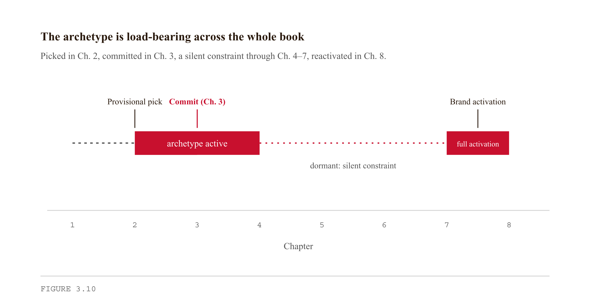
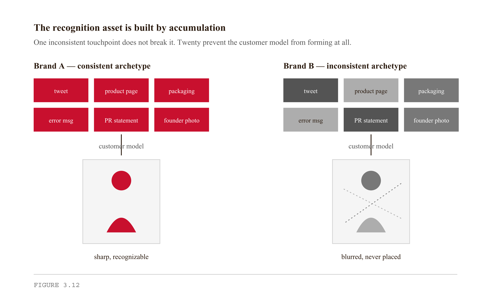
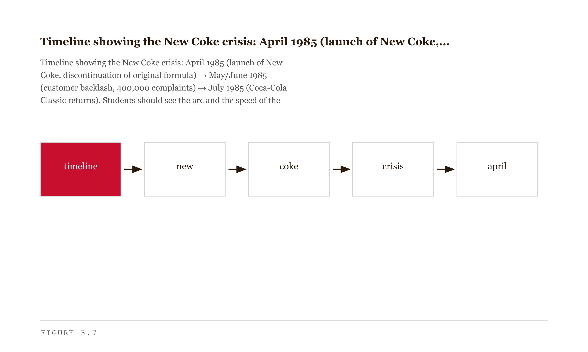
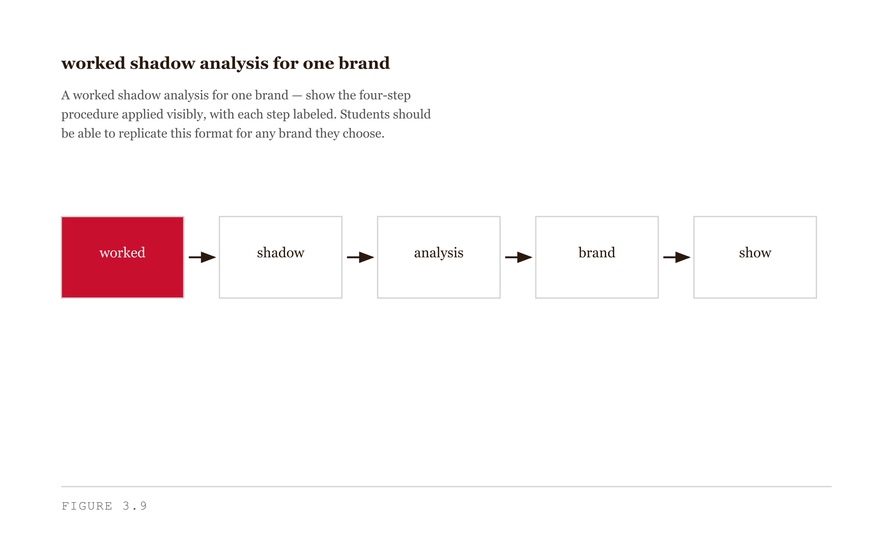

# Chapter 3 — Jungian Brand Archetypes as a System
*The constraint that makes every downstream decision decidable.*

> **TL;DR:** Choosing one of twelve brand archetypes turns vague brand questions into decidable ones. This chapter explains why a committed archetype makes every later decision easier, uses three famous failures (Tropicana, Gap, New Coke) to show what happens when a brand drifts from its archetype, and walks you through picking and stress-testing your own.
>
> | Section | Preview |
> |---|---|
> | What an Archetype Actually Is | A plain-language account of the twelve recurring identities and why each one carries a built-in failure mode (its "shadow"). |
> | Why an Archetype Is a Forcing Function | How committing to one identity makes downstream choices — features, copy, design — decidable instead of arbitrary. |
> | Three Cases of Archetype Drift | What went wrong when Tropicana, Gap, and New Coke moved away from the identity their customers expected. |
> | Reading Any Brand's Archetype | A five-input procedure for diagnosing the archetype of any brand from its public behavior. |
> | Picking Your Archetype | How to choose, and honestly test, the archetype for your own brand. |
> | A Note on the Framework's Limits | Where the archetype model stops being useful and what it cannot decide for you. |


Here is what I find strange about brand failure. The companies that fail most publicly — Tropicana, Gap, Coca-Cola in 1985 — rarely fail because they ran out of money or made a bad product. They fail because they changed something that was working. They changed the orange on the carton, the typeface on the logo, the formula in the bottle. And their customers, who had been buying without thinking for twenty years, suddenly stopped.

That seems like it should be simple to avoid. Don't change what's working. But it isn't simple, because nobody in the room understands what is actually working. They know the product works. They can measure sales. What they cannot see is the *recognition asset* — the accumulated pattern of touchpoints that lets a customer's eye snap to your product on a crowded shelf at 8 AM without engaging conscious thought. That asset is invisible until it is destroyed. And it is destroyed, specifically, by archetype drift.

That is the thing I want to teach you in this chapter. Not the twelve archetypes as a list to memorize — you could get that from a poster. The thing worth teaching is what an archetype actually does mechanically, why it is the cheapest consistency-enforcement device available, and how its failure mode is structurally embedded in its strength from the start. In Chapter 2 you surfaced your own provisional archetype from your public footprint — if you skipped that audit, go back, because the system makes considerably more sense when you have a working example to test it against. And in Chapter 4 you will write a product requirements document that commits to features, scope, and intended users. Before you can commit to product, you need to commit to identity. This chapter is where that happens.


*Figure 3.10 — The archetype is load-bearing across the whole book*

---

## What an Archetype Actually Is

The word *archetype* is doing at least four different jobs in current usage, and the confusion between them will cost you.

*Jungian psychological archetypes* are universal patterns Carl Jung proposed exist in the collective unconscious — the Mother, the Shadow, the Trickster, the Self. These are claims about human psychology, about patterns that recur across cultures and across the history of symbolic expression. Jung was not building a brand strategy framework.

*Personality typology archetypes* are the Myers-Briggs descendants — the sixteen types. These are claims about individual people.

*Genre archetypes* are patterns in literature and film — the Reluctant Hero, the Wise Mentor, the Threshold Guardian. These are claims about storytelling.

*Brand archetypes* are what this chapter is about: the 12-archetype system formalized by Margaret Mark and Carol Pearson in *The Hero and the Outlaw* (McGraw-Hill, 2001). These are claims about how brands organize identity and how customers form recognition.

<!-- → [TABLE: Side-by-side of all four usages — columns: name, what it is a claim about, primary use, source framework — makes the disambiguation concrete and scannable] -->

Mark and Pearson trace their system to Jung — their twelve archetypes share names with Jungian patterns — but the work itself is brand strategy, not psychology. The connection to Jung is useful for exactly one reason: it explains why the patterns feel *familiar*. The Innocent, the Hero, the Outlaw, the Caregiver — customers recognize these patterns at a level below conscious articulation. That pre-conscious recognition is what makes the archetype system more than a naming scheme. It is the reason consistency built around an archetype accumulates into something customers can feel without being able to describe.

Here are the twelve archetypes, each with its core motivation and its shadow. The shadow matters as much as the archetype. I will explain why in a moment.

**Innocent** — Motivation: simplicity, purity, optimism. Shadow: denial, naivety. The Innocent brand says the world is good and the product reflects that goodness. When it drifts, it refuses to acknowledge bad news and sounds out of touch. *(Tropicana, Dove, early Coca-Cola.)*

**Sage** — Motivation: wisdom, truth, expertise. Shadow: dogmatism. The Sage brand is the trusted source, the one that knows. When it drifts, it becomes preachy and intolerant of dissent. *(The Economist, early Google, TED.)*

**Explorer** — Motivation: freedom, discovery, autonomy. Shadow: aimlessness. The Explorer brand says the world is worth seeking out. When it drifts, it loses coherence and stands for nothing in particular. *(Patagonia, Jeep, REI.)*

**Hero** — Motivation: courage, mastery, victory. Shadow: arrogance, bullying. The Hero brand says you can be more than you are. When it drifts, it pushes customers around and sneers at failure. *(Nike, FedEx, the U.S. Army.)*

**Outlaw** — Motivation: disruption, rebellion, challenging authority. Shadow: nihilism, harm. The Outlaw brand says the system is broken and we are proof it does not have to be this way. When it drifts, it becomes destructive without purpose. *(Harley-Davidson, early Apple.)*

**Magician** — Motivation: transformation, vision, making the impossible possible. Shadow: manipulation. The Magician brand promises to change what you thought was fixed. When it drifts, it overpromises and hides the mechanism. *(Disney, Tesla, mature Apple.)*

**Everyman** — Motivation: belonging, equality, realism. Shadow: conformity. The Everyman brand says you belong here, exactly as you are. When it drifts, it becomes so broad it stands for nothing. *(IKEA, Target, original Twitter.)*

**Lover** — Motivation: intimacy, beauty, connection. Shadow: obsession. The Lover brand says life is better when it is beautiful and felt. When it drifts, it becomes suffocating or superficial. *(Chanel, Victoria's Secret.)*

**Jester** — Motivation: fun, lightness, irreverence. Shadow: cruelty, frivolity. The Jester brand says this is supposed to be enjoyable. When it drifts, it makes jokes at the wrong person's expense. *(Old Spice, Skittles.)*

**Caregiver** — Motivation: service, compassion, generosity. Shadow: martyrdom, enabling. The Caregiver brand says we are here to protect and nurture. When it drifts, it develops a tone of "we sacrifice for you; notice it." *(Johnson & Johnson, UNICEF.)*

**Ruler** — Motivation: control, leadership, prosperity. Shadow: tyranny. The Ruler brand says we are the standard. When it drifts, it becomes rigid and punishes deviation. *(Mercedes-Benz, Rolex, American Express.)*

**Creator** — Motivation: imagination, expression, originality. Shadow: perfectionism. The Creator brand says make something that was not there before. When it drifts, it becomes so invested in its own craft it forgets the audience. *(Lego, Adobe, Pixar.)*


*Figure 3.2 — visual map of all twelve archetypes arranged by their primary motivations*

Before we go further, a warning about the names. They will mislead you if you take them literally.

*Hero* does not mean your brand is heroic in the sense of noble and admirable. It means your brand is organized around the idea that its customer can become better through effort and that your brand is the instrument of that becoming. Nike is a Hero brand not because Nike is admirable, but because everything Nike makes is in service of the idea that *you* can push past your limit. The customer is the hero. The brand is the equipment.

*Outlaw* does not mean your brand is illegal or antisocial. Harley-Davidson is an Outlaw brand; its customers are accountants and lawyers who want, for the weekend, to feel like they have stepped outside the system.

*Caregiver* does not mean your brand is soft or low-status. Johnson & Johnson's entire product line — baby powder, bandages, surgical instruments — is a Caregiver's expression: *we protect the ones who cannot protect themselves.*

When you read these names, read the motivation. Not the dictionary definition.

<!-- → [INFOGRAPHIC: Three-panel contrast — literal reading of Hero, Outlaw, Caregiver (struck through) vs. brand-strategy reading — makes the name/meaning gap visceral] -->

---

## Why an Archetype Is a Forcing Function

Now let me show you what an archetype actually does in practice. Imagine you have just launched a tool. You have a working product and a handful of early users. In the next thirty days, someone will have to make decisions like these:

What should the homepage tagline say? What tone should the help documentation use? Should you sponsor a hackathon, an academic conference, or a street art festival? What color is the primary call-to-action button? What does the founder wear in the headshot? What does the error message say when something breaks?

Without an archetype, each decision is made in isolation — by the loudest voice in the room, the cheapest available option, or whoever happened to be awake at the time. Thirty days of those decisions accumulates into a brand that looks like it was designed by a committee that never met.

With an archetype, each decision has a constraint. You are a Sage. The tagline is plainspoken and confident. The help documentation has a teaching tone — it explains, it does not apologize. The hackathon is in scope; the street art festival is not. The primary button is a considered, authoritative color. The founder wears something that signals expertise, not performance. Jokes are dry; they are never loud. The error message says what went wrong in plain language and what to do next.

The Sage archetype made those decisions. Not perfectly, not finally — there is still room for craft within the constraint — but *decidably*. Each choice can be checked against the archetype and passed or rejected.

This is what I mean when I say an archetype is a forcing function. It is not a brand asset in the sense of a logo or a tagline. It is the constraint that makes all the other brand assets cohere.

<!-- → [FIGURE: Decision tree — one brand decision (e.g., "What tone should error messages use?") resolved differently for five different archetypes — shows the forcing function concretely] -->

The deeper reason an archetype matters is recognition. A customer does not experience your brand once. They experience it hundreds of times — a tweet, a Google result, a friend's recommendation, a product review, a push notification, a packaging design at the grocery store. Each of those experiences is a data point. If the data points are consistent, the customer builds a *model* of who the brand is. That model is the recognition asset — the thing that makes a customer, when standing in the juice aisle at 8 AM, reach for your product without thinking.

If the data points are inconsistent, the model never forms. The customer has encountered your brand before, but they cannot place you. You are new to them every time.

The recognition asset is built by accumulation. It requires that the hundredth touchpoint is consistent with the first. An archetype is the cheapest instrument available for enforcing that consistency, because it operates at the level of identity rather than execution. You do not have to tell every designer, writer, and engineer to produce exactly this output. You tell them who the brand is. A designer who knows the brand is a Sage will make different choices — consistently — than a designer who knows the brand is a Jester, even without a style guide.


*Figure 3.12 — The recognition asset is built by accumulation*

Now here is the part that took me a while to see clearly. Every archetype in the Mark/Pearson system carries a shadow — the form the archetype takes when its commitments curdle. And the shadow is not an accident. It is structurally related to the archetype's strength.

The Innocent's strength is purity and simplicity. The shadow of purity is denial: an Innocent brand that drifts starts refusing to acknowledge bad news, sticks with messaging that reads as willfully naive, and sounds out of touch with anything complicated or dark. The same commitment to simplicity that makes the Innocent recognizable becomes, under pressure, an inability to adapt.

The Sage's strength is expertise and truth. The shadow of expertise is dogmatism: a Sage brand that drifts becomes certain, preachy, intolerant of dissent, and unable to update its position when the evidence changes.

The Hero's shadow is contempt for people who have not become better: a Hero brand that drifts pushes customers around, equates winning with worth, and sneers at users who struggle.

The Caregiver's shadow is martyrdom: a Caregiver brand that drifts develops a tone of "we sacrifice for you, and you should notice that." It becomes manipulative and exhausting.

<!-- → [TABLE: All twelve archetypes — columns: archetype, core strength, shadow, structural relationship between the two — shows the pattern is not arbitrary] -->

The shadow is useful to you in exactly one way: it tells you where to watch. When you pick an archetype, you also pick your most likely failure mode. Knowing which shadow is yours means you know which early-warning signs to monitor.

---

## Three Cases of Archetype Drift

Let me walk through three documented cases. Each is real. Each has the same shape: the brand drifted from its archetype, customers rejected the drift, the company rolled back. The cases differ in direction and speed; the mechanism is the same in all three.

Before the cases, here is the analytical frame. A complete drift analysis has four elements: the original archetype, the drift direction, the customer rejection, and whether the failure was a shadow drift (the brand's own commitments curdling) or a category error (trying to become a completely different archetype).

**Tropicana, 2009.** Tropicana Pure Premium was an Innocent brand. The recognition handle was literal and wholesome: an orange with a striped straw poking out of it. The image made a simple promise — this is just orange juice, nothing complicated, good and natural. Customers had trained their eyes over two decades to scan for that specific image in the grocery aisle.

In January 2009, Tropicana replaced the orange-with-straw with a glossy glass of poured juice. The brand name moved to a vertical orientation. The new packaging was crisp, contemporary, minimal — the visual language of a Lover or a Ruler, not an Innocent. Within two months, sales dropped 20 percent. The company reported losses of more than $30 million in revenue. Regular buyers walked past the new cartons without seeing them. Their recognition handle was gone. On February 23, 2009 — less than two months after launch — Tropicana announced the rollback.

This is a category-error drift, not a shadow drift. Tropicana did not activate the Innocent's shadow. It tried to become a different archetype and in doing so erased the recognition cues its audience depended on. The lesson is precise: the recognition asset is built by the archetype's specific expression, not by the archetype's name. You cannot swap expressions without losing the recognition that accumulated in the original form.


*Figure 3.5 — Side-by-side comparison of the original Tropicana Pure Premium carton and the 2009 redesign*

**Gap, 2010.** For twenty years, Gap's logo had been an Everyman icon: a blue square, white serif type, balanced and slightly conservative. The Everyman archetype is organized around belonging — the brand says *you fit here, as you are*. The visual language of an Everyman brand is accessible, unpretentious, and deliberately unremarkable. The Gap logo was not exciting; it was *reliable*. Reliability is the Everyman's promise.

On October 6, 2010, Gap rolled out a new logo: a smaller blue square pushed into the upper-right corner of the word Gap, set in plain bold Helvetica. The serif was gone. The enclosing square was diminished. The new design was more sophisticated, more contemporary — visual language associated with a Creator or a Lover, not an Everyman. Within 24 hours, a fashion blog had collected more than 2,000 negative comments. On October 12 — six days after launch — Gap announced the rollback.

The speed of the rejection is diagnostic. Customers did not need time to be convinced the new logo was wrong. They knew immediately. That immediacy is the sign of a recognition asset being violated: when the recognition handle disappears, the mismatch between expectation and experience is felt before it is articulated. Six days from launch to rollback is the fastest documented major brand rollback on record.


*Figure 3.6 — Side-by-side of the original Gap logo and the 2010 redesign*

**New Coke, 1985.** Coca-Cola was — and remains — the canonical Innocent brand. Wholesome, all-American, the taste of childhood summers, the same formula since 1886. Innocent brands derive enormous power from *sameness*: the experience the customer had at age seven and the experience they have at age forty-seven are the same. That sameness is not a lack of innovation. It is the Innocent's deepest commitment.

In the early 1980s, Pepsi was running the "Pepsi Challenge" — a blind taste test campaign showing that consumers preferred Pepsi's sweeter formula. Pepsi was the Outlaw: the challenger, the disruptor, the choice of the new generation. Coca-Cola responded by reformulating its product. New Coke was sweeter, designed to win the taste test on Pepsi's own terms. In blind tests, it performed well. Coca-Cola's leadership announced the change in April 1985, simultaneously discontinuing the original formula.

The response was not disappointment. It was grief and rage. Within weeks, Coca-Cola received more than 400,000 letters and calls. Protest groups formed. A senator from Georgia entered a statement into the Congressional Record. Within three months, Coca-Cola brought back the original formula as "Coca-Cola Classic."

This is the deepest archetype failure of the three cases. Coca-Cola did not simply drift toward a new expression of its own archetype. It attempted to compete with Pepsi on Pepsi's own terms — to out-Outlaw the Outlaw. This is a category error of the highest order. The Outlaw archetype draws its energy from being the challenger. When the establishment *becomes* the challenger, the challenger wins by default. Pepsi no longer needed to say it was the choice of the new generation; Coca-Cola's own behavior was confirming that the old order was broken.

More importantly: Coca-Cola's customers were not buying Coke because it tasted better than Pepsi in a blind test. They were buying Coke because Coke was *Coke* — the same formula their parents drank, the same commitment to sameness that is the Innocent's deepest value. Changing the formula was not a product decision. It was an ontological violation of the archetype's core commitment.

There is also a shadow reading of New Coke. The Innocent's shadow is denial. Coca-Cola's leadership had been in denial about what their product actually was to their customers — they treated it as a taste preference rather than a symbolic commitment. That is the shadow activating before the category error: the Innocent's refusal to see the complexity of what it is.


*Figure 3.7 — Timeline of the New Coke crisis*

Three companies. Three archetype drifts. Three rollbacks. The pattern is consistent: when a brand's archetype shifts away from the one its customers have built a recognition model around, customers do not migrate to the new brand. They stop recognizing the brand entirely. The specific direction of the drift varies. The shape of the failure is the same.

<!-- → [TABLE: Comparison across all three cases — columns: brand, original archetype, drift direction, customer rejection mechanism, days to rollback — the pattern becomes unmistakable] -->

---

## Reading Any Brand's Archetype

Here is the analytical procedure for identifying a brand's archetype from its observable outputs. Five inputs, one conclusion.

**Input 1: The tagline or positioning statement.** Ignore what the brand says its archetype is. Read what the tagline commits to. "Just Do It" commits to effort and mastery — Hero. "Think Different" commits to rebellion against the norm — Outlaw. "Because You're Worth It" commits to self-worth through beauty — Lover. The tagline is the archetype compressed into its smallest communicable form.

**Input 2: The visual language.** Color, typeface, imagery, and composition all carry archetype signals. Innocent brands use natural colors, rounded forms, literal imagery. Sage brands use authoritative typography, measured layouts, evidence over decoration. Outlaw brands use asymmetry, high contrast, imagery that makes part of the audience uncomfortable.

**Input 3: What the brand will not do.** Archetypes are as legible in exclusions as in inclusions. Nike will not run a campaign built around rest and acceptance — that is antithetical to the Hero's commitments. Patagonia will not partner with fast-fashion brands — that violates the Explorer's ethic. The Innocent brand will not produce ironic or sarcastic advertising. Read the absences.

**Input 4: Who the brand treats as its customer.** The Hero brand's customer is someone who wants to become better. The Caregiver brand's customer is someone who needs protection. The archetype implies a customer; the customer implies an archetype.

**Input 5: What the brand does when things go wrong.** A Sage brand responds to a product failure with a detailed, honest explanation — here is what happened, here is what we are doing about it. A Hero brand responds with a challenge — we are going to fix this, and here is the proof. The crisis response reveals the archetype because the crisis removes the option of performance; you respond from who you actually are.

Five inputs. Name the archetype that accounts for all five. If you cannot reconcile all five with a single archetype, you have found either a genuine hybrid — common in mature brands — or evidence of drift in progress.

Once you have identified the archetype, you can predict the failure mode. Name the archetype, name the shadow, look for early signals that the shadow is activating, and name the consequence if it fully activates. I can walk through a live example. As of this writing, LinkedIn presents as a Sage brand: the trusted source of professional wisdom, the place experts go to establish authority. The Sage's shadow is dogmatism. Early signals of the shadow activating would include a shift in tone toward prescriptive content, amplification of authority signaling over genuine insight, and a product design that rewards performance of expertise rather than expression of it. Whether LinkedIn is currently activating its shadow is a question you can evaluate yourself by reading five minutes of its feed with this frame in mind. The prediction is not that the shadow *will* activate. The prediction is that *if* LinkedIn fails as a brand, this is the most likely shape of that failure.


*Figure 3.9 — Worked shadow analysis for one brand*

---

## Picking Your Archetype

When you pick an archetype for your own tool or brand, you are not choosing a personality. You are choosing a set of constraints you are willing to maintain for years under pressure.

The archetype that fits should satisfy three tests.

**The authenticity test.** Does this archetype match how you actually behave when you are not performing? Your Chapter 2 audit surfaced your natural tendencies. If you are, by nature, a researcher who cares about getting things right, the Sage fits better than the Hero — even if Hero feels more energetic. A forced archetype is exhausting to maintain and customers eventually feel the strain.

**The differentiation test.** What are your competitors? If your market is crowded with Sage brands — every player publishing authoritative content, competing on depth and expertise — becoming another Sage means competing on execution, not identity. A less-popular archetype in a crowded market may be the strategically correct pick.

**The stress test.** Suppose your tool grows ten times larger. Suppose a well-funded competitor enters your market and executes your archetype better than you do. Does your archetype still fit? Does it still differentiate you? The archetype that survives these three tests is the one to commit to.

<!-- → [INFOGRAPHIC: Three-panel checklist — Authenticity (mirror), Differentiation (compass), Stress (x10 gauge) — each with a pass question and what failure looks like] -->

Your archetype goes dormant during the build sequence. In Chapter 4, you will write a product requirements document. You will not be talking about archetypes while you are writing feature specs and user stories. But the archetype will quietly shape your decisions: what you scope, what you cut, what you name the tool, how you describe it in the README. A Sage tool does not have a gamified onboarding sequence. An Outlaw tool does not have a corporate pricing page. A Caregiver tool does not use high-contrast alerts that feel like warnings. These are archetype decisions disguised as product decisions.

The archetype reactivates with full strategic force in Chapter 8, when the build is done and the brand work begins. By that point, you will have made fifty archetype decisions without calling them that. Chapter 8 will help you audit whether they cohered.

---

## A Note on the Framework's Limits

I should be honest about what this framework cannot do.

The 12-archetype system is *a* taxonomy, not *the* taxonomy. Other brand-strategy frameworks exist — David Aaker's brand-personality dimensions, values-based positioning approaches from the marketing literature. The choice of Mark and Pearson here is a working decision: the system is concrete enough to teach, general enough to apply across industries, and has enough documented case history to defend in a portfolio review. It is not a claim about the deep structure of brand identity.

Real brands often combine archetypes. Apple has operated as an Outlaw ("Think Different"), a Magician (the iPhone launch), and arguably a Ruler (the current App Store era). The archetype shifted — whether successfully or not is worth debating. The chapter's framework handles single-archetype analysis cleanly; multi-archetype evolution is more complex, and I do not have a clean account of how brands navigate archetype transitions without triggering the same customer rejection mechanisms we saw in the three cases.

**What would change my mind:** Strong evidence that brands without explicit archetype commitments perform comparably to brands with them, when controlling for product quality and marketing spend. The Mark/Pearson framework's empirical base is primarily case study; large-N studies treating archetype-consistency as a variable in brand-equity outcomes would either solidify or undermine the chapter's central claim.

**Still puzzling:** How brands successfully *evolve* their archetype without losing their audience. Apple shifted from Outlaw to Magician. Disney has carried Magician for decades but with periodic re-pitches. The mechanism seems to involve gradual shift, narrative continuity, and treating the new archetype as a deepening rather than a replacement. But I do not have a clean account of it, and I would not trust anyone who claims they do.

---

## Summary

Here is what you can now do that you could not at the start of this chapter.

You can identify the archetype of any brand you encounter by reading five inputs: the tagline, the visual language, what the brand refuses to do, who it treats as its customer, and how it responds to failure. You do not need to be told what archetype a brand has chosen; you can derive it from the evidence.

You can name the shadow of any archetype in the Mark/Pearson system and describe the specific failure mode it predicts. More practically: you can look at a brand operating at full strength and identify the early-warning signals of its most likely breakdown before the breakdown happens.

You can diagnose a historical case of archetype drift — name the original archetype, name what the drift moved toward, and explain why customers rejected the shift. Tropicana, Gap, and New Coke are your worked models. The analytical frame generalizes to any brand you examine.

**The one idea from this chapter that matters most:** An archetype is not a personality layer added to a brand for warmth. It is a consistency-enforcement device — the constraint that makes every downstream decision decidable and that accumulates, touchpoint by touchpoint, into the recognition asset customers use to find you.

**The common mistake:** Treating archetype selection as a branding exercise rather than a strategic one. Students pick the archetype that sounds most exciting or most aspirational. The right pick is the one you can sustain authentically, that differentiates you in your market, and that survives the stress test of growth and competition.

**The Feynman test:** By the end of this chapter, you should be able to sit down with a friend who knows nothing about brand archetypes, hand them three brand examples, and walk them through an archetype analysis of each — naming the archetype, explaining what it commits the brand to, naming the shadow, and predicting the failure mode. If you can do that for three brands you have not studied before, you have it.

---

## Connections Forward

Chapter 4 asks you to write a product requirements document. The first decision in that document — scope — is an archetype decision. What your tool does and does not do is a statement of identity before it is a statement of engineering constraints.

Carry your archetype into Chapter 4 without announcing it. Let it constrain your decisions silently. The question to hold is not *what features should this tool have* but *what would the brand I am building include, and what would it refuse?*

The archetype you commit to in this chapter is the longest-lived decision you will make in this book. The PRD will change. The feature set will change. The name will probably change. The archetype, if you pick it right and pick it honestly, should still be recognizable when someone looks at your work five years from now and asks: *who were they trying to be?*

---

## Exercises

### Warm-Up

**W1. Archetype Identification (Single Brand)**
Choose one brand you interact with daily — an app, a grocery product, a clothing brand, anything with a visible identity. Using the five-input procedure from Part IV, identify its archetype. Write two sentences: one naming the archetype and the specific evidence that led you there, one naming the shadow and describing what early-warning behavior would look like for that brand.

*Tests Objectives 2 and 4. Difficulty: Low.*

**W2. Shadow Matching**
For each of the following shadow descriptions, name the archetype it belongs to and explain in one sentence the structural relationship between the archetype's strength and its shadow:

- A brand once celebrated for its expertise starts refusing to acknowledge when it was wrong.
- A brand once celebrated for its rebellious energy starts advocating for disruption without any coherent alternative.
- A brand once celebrated for its service starts implying that customers are ungrateful.

*Tests Objective 4. Difficulty: Low.*

**W3. Quick Drift Diagnosis**
Read the following scenario and answer the two questions below:

*A children's toy brand has built twenty years of recognition on bright colors, rounded shapes, and simple messaging about imagination and joy. In 2024, it hires a new creative director who moves the visual identity toward a muted, sophisticated palette and begins running campaigns with complex emotional themes aimed at adult collectors.*

Questions: (a) What archetype was the original brand expressing? (b) What archetype is the new creative direction moving toward, and what customer rejection mechanism would you predict?

*Tests Objective 5. Difficulty: Low–Medium.*

---

### Application

**A1. Five-Input Brand Analysis**
Select a brand you have not studied before — choose something outside your usual category. Run the full five-input analysis: tagline/positioning, visual language, what it refuses to do, who it treats as its customer, and crisis behavior (find a documented PR moment or product failure and read the response). Produce a one-page analysis identifying the archetype and providing evidence for each of the five inputs.

*Tests Objectives 2 and 3. Difficulty: Medium.*

**A2. Shadow Watchlist**
For the archetype you committed to in your Chapter 2 audit, write a shadow watchlist with the following structure: the shadow's name and definition in your own words; three specific behaviors you might exhibit — in product decisions, marketing copy, or public communication — that would be early warning signs you are activating the shadow; and one observable check you could run monthly to catch shadow behavior before it compounds.

*Tests Objective 4, applied to your own brand. Difficulty: Medium.*

**A3. Competitor Archetype Map**
Identify three direct or indirect competitors to the tool you are designing. For each: identify their archetype using the five-input procedure, note their shadow, and assess whether their current trajectory shows any shadow activation signals. Then identify any archetype that none of the three competitors occupies. Is that unoccupied archetype viable for your tool?

*Tests Objectives 2 and 6. Difficulty: Medium.*

**A4. Drift Scenario Analysis**
Find a real brand that has undergone a significant visual or positioning change in the last five years (not one covered in this chapter). Reconstruct the drift analysis: original archetype, drift direction, customer or market response, and your assessment of whether it was a shadow drift or a category-error drift. Use documented sources.

*Tests Objective 5. Difficulty: Medium–High.*

---

### Synthesis

**S1. Archetype as Product Constraint**
Write a one-page memo addressed to a hypothetical co-founder, explaining why your chosen archetype should shape three specific product decisions for the tool you are building. The decisions must be real and specific — not "we should have a friendly tone" but "we should not include gamification mechanics in our onboarding sequence, because our Sage archetype commits us to treating users as professionals who do not need to be rewarded for attention." For each decision, name the archetype constraint being applied and name what an alternative archetype would do differently.

*Tests Objectives 3 and 5. Difficulty: Medium–High.*

**S2. Cross-Case Pattern Extraction**
Review all three case studies (Tropicana, Gap, New Coke). Write a 400-word synthesis identifying the single underlying mechanism that explains all three failures. Your explanation should be specific enough that someone could use it as a prediction tool — not just "brands should not change their identity" but a precise account of the cognitive or behavioral mechanism by which the customer rejection operates. Use the case evidence to support your account.

*Tests Objectives 5 and 6. Difficulty: High.*

**S3. Archetype and Audience Mismatch**
Construct a hypothetical scenario (clearly labeled as such) in which a brand correctly identifies its archetype but selects an audience that is incompatible with that archetype. Describe the specific ways the mismatch would manifest in product decisions, marketing, and customer response. Then explain how the brand should resolve the mismatch — by changing the archetype, changing the audience, or something else. Defend your recommendation.

*Tests Objectives 3, 5, and 6. Difficulty: High.*

---

### Challenge

**C1. Archetype Evolution Hypothesis**
The chapter's "Still Puzzling" section acknowledges an unresolved question: how do brands successfully evolve their archetype without triggering customer rejection? Using Apple's transition from Outlaw ("Think Different," 1997–2007) to Magician (iPhone era, 2007–present) as your primary case, develop a hypothesis about the mechanism that makes archetype evolution possible. Your hypothesis should be falsifiable — state what evidence would confirm or disconfirm it — and should account for why the Apple transition succeeded where Tropicana, Gap, and New Coke failed.

*Tests Objectives 5 and 6, and challenges the chapter's stated limits. Difficulty: Very High.*

**C2. Framework Stress Test**
Identify the strongest counterexample you can find: a brand that significantly changed its archetype and *succeeded* — retained or grew its audience through the transition, without a forced rollback. Analyze the case. Does it falsify the chapter's argument, or does it reveal a condition under which archetype evolution is possible? What are the implications for the chapter's central claim?

*Tests all objectives and the chapter's own argument against the best available evidence. Difficulty: Very High.*

---

## LLM Exercise — Self-as-Project

**Project:** Self-as-Project
**What you're building this chapter:** An "Archetype Commitment" — your final archetype call after stress-testing against your actual work, plus a documented shadow watchlist.
**Tool:** Claude Project.

**The Prompt:**

```
In Chapter 1 I committed provisionally to an archetype based on my public footprint. Now I want to stress-test that pick.

Step 1 — I'll paste 3–5 samples of my actual writing below. Could be email drafts, code comments, project READMEs, social media posts, anything I wrote without trying to perform an archetype. Read them. Tell me what archetype the writing actually expresses, and how confident you are.

Step 2 — Compare your reading of my actual writing to the provisional archetype I committed to in Chapter 1. If they match, tell me. If they don't, tell me which one wins and why. ("Wins" means: which archetype is more honest? Which one can I sustain over years?)

Step 3 — For my final archetype pick (whether it's the same as Chapter 1 or revised), write me a Shadow Watchlist. Include:
- The shadow's name (e.g., the Sage's shadow is dogmatism; the Hero's is bullying; the Caregiver's is martyrdom)
- Three specific behaviors that would be early warning signs I'm slipping into the shadow
- One ritual or habit I can install to catch the shadow before it lands

Step 4 — Write a one-paragraph "Archetype Manifesto" — first person, my voice, naming my archetype and what it means I commit to. Should be specific enough that someone reading it could predict three things I would say no to. No "passionate" or "innovative." No marketing-speak.

Output a Markdown document called "Archetype Commitment — [my name]" with:
- The committed archetype + confidence level + reasoning
- The Shadow Watchlist
- The Archetype Manifesto

Here are my writing samples:
[PASTE 3–5 SAMPLES]
```

**What this produces:** A locked archetype with a falsifiable test (the manifesto's "predict three nos" check) plus a shadow watchlist you'll reference all year.

**How to adapt:** If you don't have writing samples, paste the longest piece of professional communication you've sent in the last month. Validates or revises Chapter 1's provisional archetype.

**Preview of next chapter:** Chapter 4 turns your job search into a one-page PRD with a "$100,000 no" clause.

---

## AI Wayback Machine
The ideas in this chapter didn't appear from nowhere. **Carl Jung** is the source the chapter has been borrowing from. The twelve archetypes Margaret Mark and Carol Pearson catalogued for marketing in *The Hero and the Outlaw* (2001) are downstream of Jung's argument that certain figures — Hero, Sage, Caregiver, Trickster, Lover — recur across cultures because they correspond to durable patterns in human psychology, not to any particular author's invention. The chapter has used the framework as a strategic instrument; Jung intended it as a description of the unconscious. The shadow side of the archetype, which the chapter takes seriously, is also Jung's idea — the failure mode that the strength of an archetype tends to produce when taken too far.


*Carl Jung, c. 1910s. AI-generated portrait based on a public domain photograph.*


*Puppet Art by [Nik Bear Brown](https://www.nikbearbrown.com/).*

**Run this:**

```
Who was Carl Jung, and how does his concept of *archetypes* connect to using a twelve-figure framework as a strategic anchor for brand decisions — including the chapter's argument that the *shadow* of an archetype is as load-bearing as the archetype itself? Keep it to three paragraphs. End with the single most surprising thing about his career or ideas.
```

→ Search **"Carl Jung archetypes"** on Wikipedia after you run this. See what the model got right, got wrong, or left out.

**Now make the prompt better.** Try one of these:

- Ask it to explain *the collective unconscious* in plain language, as if you've never read psychoanalytic theory
- Ask it to compare Jung's account of the shadow to the chapter's worked examples of archetypes failing under pressure
- Add a constraint: "Answer as if you're writing the warning about archetype-shadow risk in a startup's brand strategy doc"

What changes? What gets better? What gets worse?

---

---

## AI+1 — Self-as-Project on Madison

**Project:** Self-as-Project — *your brand, end to end*
**This chapter adds:** a committed archetype and the audience definition it implies.
**Madison recipes:** [`madison-audience-definition`](../madison/recipes/madison-audience-definition.md), [`madison-persona-generation`](../madison/recipes/madison-persona-generation.md)

> Run the Self-as-Project "Archetype Commitment" exercise above first; this block turns that commitment into an evidence-checked audience. You commit the archetype; Madison drafts the audience; you verify the personas are real.

### Exercise 1 — When to Use AI
- *Extract the five archetype inputs (tagline, visual language, refusals, customer, crisis behavior) for three competitors into a grid.* **Why it works:** reformatting.
- *Draft candidate personas implied by your committed archetype.* **Why it works:** drafting structure you then ground in evidence.
- *Surface the unoccupied archetype in your competitive set.* **Why it works:** pattern-spotting you confirm.

**Tell:** you can independently check each persona against real audience evidence.

### Exercise 2 — When NOT to Use AI
- *Committing your final archetype.* **Why it fails:** an identity choice that must be sustainable for years — yours alone.
- *Deciding a generated persona is real.* **Why it fails:** models produce fluent personas with no referent; acceptance is judgment.
- *Naming your shadow watchlist's true triggers.* **Why it fails:** self-knowledge the model can only guess at.

**Tell:** you've crossed the line when a persona enters your strategy without an evidence check.
**Series connection:** trains archetype-as-constraint — the choice that makes downstream decisions decidable.

### Exercise 3 — Recipe Exercise
**Build:** an audience definition anchored to your committed archetype. **Run:** [`madison-audience-definition`](../madison/recipes/madison-audience-definition.md) then [`madison-persona-generation`](../madison/recipes/madison-persona-generation.md) on the Archetype Commitment from the Self-as-Project exercise above. **Tool:** Claude Project.

```
Using the Madison audience-definition + persona-generation recipe approach, and
MY committed archetype (pasted below), draft: (1) a one-paragraph audience
definition consistent with the archetype; (2) two personas, each with a real
behavior I could verify and a [NEEDS EVIDENCE] tag on anything I'd have to confirm.
Reject any persona detail that the archetype would not actually attract. Invent no
statistics.

My Archetype Commitment:
[PASTE]
```
**Adapt:** if archetype and a tempting audience conflict, surface the mismatch (exercise S3) rather than smoothing it.

### Exercise 4 — CLI Exercise
**Build:** `your-brand/audience.md`. **Tool:** [`wrap-your-tool`](../madison/wrap-your-tool/) or Claude Code.

```
Write your-brand/audience.md: the archetype, the audience definition, and two
personas (table: persona | core need | verifiable behavior | evidence status).
Tag unconfirmed details [NEEDS EVIDENCE]. Do not invent demographics or sizes.
Stop after writing the file.
```
**Inspect:** every persona has at least one behavior you could actually verify; no invented market sizes.
**If it goes wrong:** the model produces a demographically detailed but evidence-free persona — strip every unverifiable specific.

### Exercise 5 — AI Validation Exercise
**Validate:** the audience definition. Pass / Fail / Cannot-determine + evidence:
- **Correctness:** is the audience consistent with the committed archetype (not a generic ideal customer)?
- **Completeness:** archetype + audience + ≥2 personas with evidence status?
- **Scope:** audience only — no campaign or copy yet?
- **Brand-specific:** would the named shadow show up if this audience were over-served? Note it.
- **Failure-mode (fabricated persona):** which persona details are [NEEDS EVIDENCE] and how would you confirm each?

*Tags: brand-archetypes · jung · mark-pearson · tropicana · gap · new-coke · innocent · sage · archetype-drift · shadow · INFO-7375*
