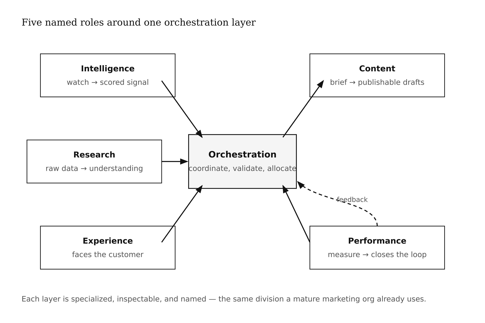
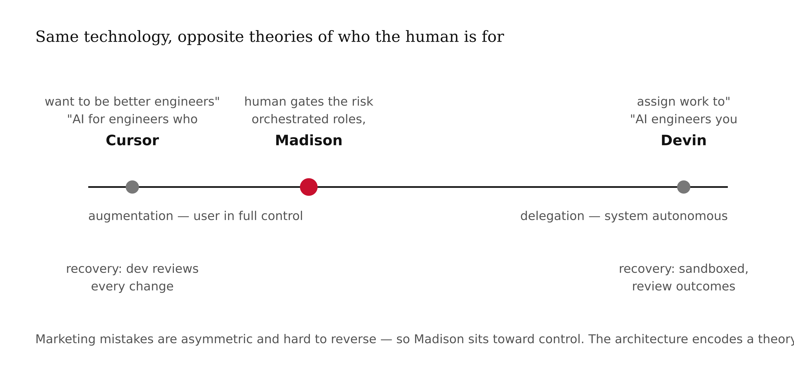

# Chapter 3 — The AI Toolchain: Cowork, Codex & Madison
*Five roles, one pipeline, and the moment you realize architecture is brand.*

> **TL;DR:** This chapter teaches you to read an AI system's architecture the way you would read a blueprint, using the open-source Madison framework as the worked example. Its core lesson: how you split an AI product into parts decides how it fails, how it is sold, and how much customers can trust it — so architecture is itself a branding decision.
>
> | Section | Preview |
> |---|---|
> | The four meanings of "agent" | Why one word means four different things in 2026, and why confusing them produces the wrong product. |
> | What Madison is | The five specialized roles — intelligence, content, research, experience, performance — plus the layer that coordinates them. |
> | Five roles vs. one mega-agent | Why splitting the work beats a single do-everything model on cost, on locating failures, and on having something to sell. |
> | Cursor vs. Devin | Two real AI coding tools that show how the same technology yields opposite products depending on how much control the user keeps. |
> | The ReAct loop | The small think–act–observe cycle running inside each role, and the three places it tends to fail. |
> | Orchestration and humans | How the parts are wired together, and where to place a human so a costly mistake fails safely. |
> | Architecture as a brand decision | Why engineering choices quietly decide what customers can see, name, trust, and buy. |

---

Here is a thing I find genuinely strange. You can hand two engineering teams the same frontier language model — identical weights, identical API — and one builds Cursor, a tool that makes senior developers faster, and the other builds Devin, a tool that runs software tasks while the developer sleeps. Same capability. Opposite products. Opposite brand positions. Opposite theories of what the human is for.

The thing that made them different wasn't the model. It was the architecture. The choice of where to put the seams.

I want to trace that choice carefully, because it is the central skill in AI product design — and it is almost never taught. Most people approaching an AI system have a vivid sense of what they want the thing to *do*, and no framework at all for how the internal structure of that thing determines how it fails, how it scales, and what a customer can trust about it. We are going to fix that. We will use a real open-source framework called Madison as the specimen — trace its anatomy layer by layer — and by the end you should be able to look at any multi-agent system and immediately ask the questions that separate a robust product from a clever demo.

One prerequisite: from Chapter 1, you need your archetype. From Chapter 2, you need a working mental model of what a language model actually does — takes text in, produces text out, with no persistent memory between calls. Everything else I will build as we go.

---

Let me start with a word that has broken more product meetings than any other in the last three years.

*Agent.*

In 2026, this word carries at least four distinct meanings, and the speaker rarely signals which one they intend. This is not a minor ambiguity. Each meaning implies a different architecture, a different failure mode, and a different relationship between the system and the human supervising it.

**Meaning one** is the most common on LinkedIn: "I built an agent that summarizes my emails." Translation: I wrote a prompt. I call an API. I get text back. This is a function with a prompt wrapped around it. Useful. Not what researchers mean by the word.

**Meaning two** is closer to the formal definition: an LLM with tools and a loop. The system can reach into the world — call APIs, read files, write to databases — and then it reasons about what those actions returned before deciding what to do next. This is roughly what Yao et al. described in their 2023 ReAct paper. I will show you the mechanical details of this loop shortly.

**Meaning three** is the science-fiction meaning, which is approximately real: an LLM running autonomously over a sustained horizon, planning its own work, sequencing its own actions, reporting outcomes rather than asking for guidance at each step. Devin 2.0 lives here. Multiple instances, parallel sandboxed environments, working through complex tasks while you are in a meeting.

**Meaning four** is how a framework like Madison uses the word. An agent is a specialized *role* in a larger system — a named component with defined inputs and outputs, optimized for one kind of work, coordinated by an orchestration layer. Agent as module. Agent as job title, not agent as autonomous being.

These four meanings are not in conflict. They are different levels of abstraction. A Madison Intelligence Agent (meaning four) is implemented using a ReAct loop (meaning two). Devin probably contains many sub-agents in meaning two arranged into something like meaning three. The email summarizer (meaning one) might live inside a Madison workflow as one step in meaning four.

What matters for the product you are building is knowing which meaning you are operating in — because meaning three and meaning four produce completely different failure modes. An autonomous system that hallucinates partway through a twelve-step task has corrupted its own output by the time you notice. A role-in-pipeline that hallucinates at step three fails loudly, immediately, at a known location. You can fix it. You can tell a customer exactly what broke. The architecture is the difference between a recoverable error and a silent disaster.


<!-- → [TABLE: Four meanings of "agent" — columns: meaning number, informal label, example product, what it implies architecturally, dominant failure mode. Row for each meaning in this section.] -->

---

Madison's answer to the question "which meaning are you?" is unambiguous: meaning four. An agent is a role. So let me show you what that looks like in practice.

The [Madison project page](https://www.humanitarians.ai/madison) describes itself as an open-source, agent-based AI marketing intelligence framework. Strip past the marketing copy and you find the operative architecture: five specialized layers connected through a sixth coordinating layer. Each layer is a named role with a defined job.

**Intelligence Agents** watch the world — reputation monitoring, trend analysis, sentiment scoring from the morning news cycle. They produce rated information the other layers can act on.

**Content Agents** create, optimize, and distribute marketing materials. Brand voice consistency. Multi-platform adaptation. Headline variants. They consume briefs and brand parameters; they produce publishable drafts.

**Research Agents** process data to uncover customer insights — automated survey analysis, synthetic persona development, segmentation. They take raw input; they produce structured understanding.

**Experience Agents** manage customer interactions. AI concierge systems. Customer journey mapping. They face outward, toward the person on the other end of the brand.

**Performance Agents** measure and optimize outcomes. Multi-armed bandit experiments. Predictive analytics. They close the feedback loop — turning outcomes back into signal the other layers can learn from.

And above all of them, the **Orchestration Layer** coordinates: cross-project validation, dynamic resource allocation, continuous learning from performance metrics.

If you are a working marketer reading that list, something should feel familiar. This is the same division of labor you would find in any reasonably mature marketing organization. A research team. A content team. An analytics function. A customer experience team. A market intelligence group. Madison has made those organizational boundaries machine-readable.

That borrowing is not accidental, and it is not trivial. Organizations learned to divide marketing this way because the functions have genuinely different information needs, different output cadences, and different success metrics. An Intelligence function needs fresh data every morning. A Content function needs a brief and brand guidelines. A Performance function needs experiment results and statistical patience. Designing agents along the same boundaries means each can be optimized for its specific job without knowing how the others work internally. The orchestration layer handles the connective tissue.



Now I want to show you what the alternative looks like — because the choice of five layers over one is the most consequential architectural decision Madison makes, and understanding why it is the right choice will carry you through most of what you need to know about building with AI.

Suppose you designed Madison as a single large model with a long prompt and access to every data source. On a demo, this works. In production, three things break, in sequence.

Token costs become unsustainable. Every time the system runs, it re-reads all available context: the news feed, the brand brief, the experiment results, the customer journey data. The same news article gets embedded in twenty prompts by end of day. You are paying to re-read work you have already done.

Failure modes blur. When the system gives a wrong answer — a miscategorized sentiment, a misaligned headline, a broken recommendation — you cannot locate the fault. Did the model misread the news? Build a flawed persona? Draft a tone-deaf message? In a mega-agent, the answer is somewhere in the model, which is not actionable. You cannot fix what you cannot find.

The product has no surfaces. From the customer's perspective, the mega-agent is a black box. Nothing to name. Nothing to version. Nothing to sell separately or improve in isolation. No feature roadmap. No pricing tier. No partner integration. The architecture is also an invisibility trap.


<!-- → [FIGURE: Side-by-side diagram — left: five labeled agent boxes connected through a central orchestration node with labeled input/output arrows; right: one opaque "mega-agent" box annotated "no surfaces, no fault location." Caption: the same capability, two different architectures, two different products.] -->

The layered design solves all three problems at once. Each layer is specialized, inspectable, and named. The Intelligence Agent delivers scored news to the orchestrator. The Content Agent takes a brief and returns variants. The Performance Agent runs experiments and allocates. Each can be tested, versioned, swapped, and — this matters enormously — *named* in the product. A customer can say: "Our Intelligence layer is running correctly; our Content layer is returning off-brand output." That is diagnostic capability. It is also a sales capability. You can sell tiers. You can sell the Intelligence layer to a customer who does not yet need the Content layer. You can hire a vendor to replace one layer without rebuilding the system.

The engineering choice and the brand choice are the same choice. I will come back to this.

---

Before I take apart the machinery running inside each Madison layer, I want to anchor the discussion with two products you may already use — because Madison's choices look different once you have seen the same underlying technology produce radically different architectures.

[Cursor](https://cursor.com/) is a fork of Visual Studio Code with AI woven into the editing surface. The architectural commitment is augmentation: the developer stays in the driver's seat at all times. Real-time completions, inline chat, multi-file agent mode — but always with the developer reviewing and approving. The brand position is "AI for engineers who want to be better engineers."

[Devin](https://devinai.ai/), built by Cognition Labs, runs in a sandboxed cloud environment with its own IDE, browser, and shell. Devin 2.0 introduced parallel instances in isolated virtual machines, each working through a well-specified task. The brand position is "AI engineers you assign work to."

Same underlying technology. Wildly different architectures. Wildly different products.

A senior developer choosing between them is not comparing capability benchmarks. They are comparing models of agency and trust. Cursor says: you remain expert; we accelerate you. Devin says: we handle the defined work; you handle the judgment calls that fall outside the spec.

Madison's choice of a five-layer orchestrated pipeline puts it on the Cursor end of this spectrum. Not because autonomy is inherently wrong. Because marketing decisions that go wrong in the wild are expensive in ways that a sandboxed coding task is not. A tone-deaf campaign post, a mispriced offer, a misread sentiment trend — these have real costs that are asymmetric and difficult to reverse. The architecture encodes a theory of risk.

When you choose your own architecture, you are choosing a theory of risk. That choice deserves to be made explicitly, not inherited from a tutorial.



<!-- → [FIGURE: Horizontal spectrum from "user in full control / augmentation" (left) to "system autonomous, human reviews outcomes / delegation" (right). Cursor at left, Devin at right, Madison left-of-center highlighted. Each endpoint annotated with brand position and recovery model.] -->

---

Now I want to show you the small machine running inside each Madison layer. This is where the mechanistic understanding lives — the thing that changes how you reason about failure, performance, and where the system can actually break.

The pattern comes from Yao et al.'s 2023 paper, "ReAct: Synergizing Reasoning and Acting in Language Models." ReAct's core observation is straightforward once you hear it: an LLM doing useful work in the world needs to interleave two operations. *Reasoning* — thinking in natural language about what to do next. And *acting* — calling a tool, querying an API, modifying state. Pure chain-of-thought reasoning is all thinking, no reaching. Pure tool-use without reasoning is reactive, with no coherent plan threading the actions together. ReAct interleaves the two. Yao et al. showed a 34 percentage point improvement over imitation learning on ALFWorld, a household task benchmark. That is not a marginal gain. The pattern works.

Here is the loop:

```
THOUGHT:      [LLM reasons about the current state and what to do next]
ACTION:       [LLM calls a tool — search, API, file read, write]
OBSERVATION:  [Tool returns a result]
THOUGHT:      [LLM updates its reasoning in light of the result]
ACTION:       [LLM takes the next action]
              ... [loop continues until goal reached or stopping condition fires]
```

Watch what this looks like when you trace an actual Madison Intelligence Agent reasoning its way through a morning news run:

```
THOUGHT: It is 7 a.m. Time to pull the daily news cycle for Brand X.
ACTION:  Pull RSS feeds, Google News API, watched subreddits.
OBSERVATION: 870 articles received.

THOUGHT: Deduplicating before scoring saves tokens and prevents
         counting the same story multiple times.
ACTION:  Run MD5 hash on titles; Levenshtein distance on near-matches.
OBSERVATION: 87 unique articles remaining.

THOUGHT: Score each article for sentiment and topic relevance.
ACTION:  Send each article to GPT-4o-mini with sentiment scoring prompt.
OBSERVATION: 87 articles returned with scores and relevance tags.

THOUGHT: Write results to storage and trigger dashboard refresh.
ACTION:  Append to Google Sheet; fire Plotly dashboard webhook.
OBSERVATION: Dashboard updated. Job complete.
```

Each cycle is thought-action-observation. The LLM is not just calling APIs — it is reasoning about *why* it is calling them and *what to do* with what comes back. That is what distinguishes this from meaning one (a function with a prompt). The same loop structure runs in every Madison layer, with different tools and different reasoning prompts. The Research Agent reasons about survey data and acts on clustering calls. The Content Agent reasons about brand voice parameters and acts on generation calls. The Performance Agent reasons about experiment results and acts on Thompson sampling allocation calls.


<!-- → [FIGURE: One complete ReAct cycle for the Intelligence Agent — four nodes in a loop: THOUGHT → ACTION → OBSERVATION → THOUGHT. The feedback arrow from OBSERVATION back to THOUGHT highlighted. Annotated with the actual content from the news-scoring trace above.] -->

Understanding the loop also teaches you exactly where it fails — and there are three distinct failure modes, each requiring a different design response.

A *reasoning failure* is when the model decides to do the wrong thing because it misread the state. Scoring all 870 articles without deduplicating first. Expensive, recoverable — it produces a result, just an overpriced one. You can add a guard.

An *action failure* is when the tool call fails, returns an error, or returns data in an unexpected format. A well-designed agent treats the error itself as the observation and reasons about recovery. A poorly designed agent either crashes or — worse — hallucinates a response as if the tool call had succeeded. The second failure mode is far more dangerous because it is silent. The loop continues on false premises and you will not know until the dashboard shows nonsense.

An *observation failure* is the most dangerous category. The tool returns a plausible-looking but incorrect result, the model's reasoning does not catch it, and the loop propagates the error downstream. This is why the Performance layer in Madison matters disproportionately to its apparent function. It is not just measuring outcomes. It is closing a feedback loop that can catch errors the upstream layers never detected — because eventually real-world performance tells the truth, even when every intermediate step looked correct.

If you are designing your own agent loop, these three failure modes give you a design checklist. Make action failures loud. Make observation failures recoverable. Put at least one layer in the system whose explicit job is questioning whether the other layers were right.


---

Each Madison layer runs its own ReAct loop. The orchestration layer connects them. This is where the most consequential design decisions in the whole framework live — and where the most costly mistakes tend to happen.

There are two dominant orchestration patterns in production systems in 2026.

**Graph-based orchestration** — n8n and LangGraph are the leading implementations — treats the workflow as a directed graph. Nodes are operations: a Python function, an LLM call, a database write. Edges are data flows. The workflow is defined in advance. Every path through the graph is explicit and testable. Madison's reference implementation uses n8n for exactly this.

**Conversation-based orchestration** — Microsoft AutoGen is the leading example — treats agents as conversation participants. The orchestrator is a meta-agent communicating with sub-agents in natural language. Agents can negotiate directly with each other and self-organize to handle task sequences that were not pre-specified.

The trade-off is between predictability and flexibility. Graph-based orchestration is predictable: every step is defined, every failure is locatable, every path is auditable. Conversation-based is flexible: agents can handle novel task sequences, but the failure modes are harder to isolate and the debugging surface is enormous.

Madison chose predictability — and this is the correct choice for a system that needs to run at 7 a.m. every day, write clean data to a stable schema, and feed a dashboard a marketing director is going to stake decisions on. The operational question is not "can this system handle a task I didn't anticipate?" It is "can this system be trusted to execute a known task correctly, day after day, without surprising anyone?"


<!-- → [TABLE: Graph-based vs. conversation-based orchestration — columns: property, graph-based (n8n/LangGraph), conversation-based (AutoGen). Rows: failure locatability, handling of novel task sequences, auditability, debugging surface, best fit use case.] -->

The core technologies Madison deploys reflect the same commitment. GPT-4o and BERT for language tasks. PCA and clustering for data analysis. Thompson sampling and contextual bandits for content optimization. Neo4j and RDF for knowledge graph work. Each is a production choice, not a novelty demonstration. Neo4j because graph databases represent relationships between brand entities naturally — a brand is not a table, it is a network of associations. Thompson sampling because it handles the exploration-exploitation trade-off in multi-armed bandit experiments better than naive approaches, accumulating evidence before committing. These choices compound: each one makes the system more legible to the engineer maintaining it and more trustworthy to the customer paying for it.

One design choice worth naming explicitly before we move on: where humans sit in the pipeline. Madison includes human-in-the-loop validation as an explicit architectural feature, not an afterthought. Consequential decisions — what content to publish, how to allocate campaign budget, what persona to deploy in a customer interaction — are reviewed by a human before execution. This is the right call for marketing work in 2026. The downside of a bad autonomous marketing decision is severe and difficult to reverse; the upside of eliminating the human review step is modest. Where you place humans in your own pipeline is not a philosophical question about autonomy. It is a risk-engineering question. Find the decisions in your system where a wrong answer is expensive and hard to correct. Put humans there. Automate everything else.


---

Now I want to make the brand argument explicit, because it is the integrating insight this chapter was written to produce.

Marshall McLuhan spent the 1960s arguing — to audiences that mostly lacked the vocabulary for the claim — that the medium shapes the message more powerfully than any individual transmission through it. He meant that the structure of a communication system carries its own meaning, independent of content. What he could not have anticipated is how precisely this applies to software architecture.

Every architectural choice in Madison has a brand consequence. Not in the sense of logos or color palettes. In the sense of what customers can see, name, trust, and rely on.

Five named layers instead of one mega-agent means a customer can say: "Our Intelligence layer is running correctly; our Content layer is returning off-brand output." That sentence encodes diagnostic capability. It also encodes a sales capability: you can sell tiers, sell the Intelligence layer to a customer who does not yet need the Content layer, version each layer independently, communicate changes clearly. None of this is possible with a black box.

The Cursor-Devin comparison makes the same point from a different direction. Cursor's architecture — AI embedded in the editor, developer always in control — produces a brand position: *we trust developers*. Devin's architecture — autonomous agent in a sandboxed environment — produces a different one: *we handle defined work so you don't have to*. Neither position was written in a marketing document first. Both emerged from architectural commitments made for technical reasons, whose brand implications became visible later.

This is how most product positioning actually works. Engineers make choices. Choices create affordances. Affordances create user experience. Marketing writes copy that describes the experience the engineers already produced.

You are in the rare position of designing a product from scratch. You can run this process deliberately. Choose the architecture with the brand consequences you want, rather than discovering your brand in the choices you made for entirely other reasons. Most AI product books do not contain that sentence. It belongs here because it is true and because the window for making it deliberately is narrow — it closes the moment you commit to a data model.

<!-- → [TABLE: Madison layers by best-fit archetype — columns: layer name, primary function, best-fit archetype, what to customize, one failure mode to watch. One row per layer.] -->

---

Madison is a reference architecture, not a template. Reading it well teaches you what to do. Copying it produces a worse Madison.

Start with the overview before the code. The [Madison project page](https://www.humanitarians.ai/madison) names the five-layer architecture, the orchestration approach, and the core technology choices in language any practitioner can parse. You need that mental model before any implementation detail makes sense.

Pick one layer and trace it end to end. Find the Intelligence Agent in the [GitHub repository](https://github.com/Humanitariansai/Madison). Look for the workflow definition and the LLM call. You will not understand every detail on a first reading. You are looking for the shape — ingestion, reasoning, action, observation, output. Once you can see that shape in one Madison layer, you will recognize it in every agent system you encounter.

Let your archetype from Chapter 1 pick your layer. A Sage archetype — analytical, insight-driven — belongs in the Intelligence layer. A Creator belongs in the Content layer. A Caregiver belongs in the Experience layer. The archetype narrows the vast design space to the piece of Madison that corresponds to the problem you actually care about solving.

And notice what Madison does not solve. The framework assumes you already have data sources, brand guidelines, and marketing workflows worth coordinating. The Knowledge Graph infrastructure assumes you already have brand perception worth tracking. Every architecture embeds assumptions about who the user is and what state they arrive in. Reading those assumptions teaches you what the architecture is actually for — and what you will need to supply differently when you build your own.

---

Let me close by pulling the connections into one place.

The four meanings of "agent" are not a taxonomy for its own sake. They are a diagnostic tool. When you hear the word, you ask: which meaning? That question routes you to the right failure modes, the right orchestration pattern, and the right brand consequences. Most people building AI products in 2026 cannot ask it cleanly. You can.

Madison's five-layer architecture solves three compounding problems simultaneously: token economics, failure isolation, and product legibility. These are not independent — they compound. A system with poor failure isolation is also unsellable, because customers cannot identify what went wrong or trust that the fix holds. The architecture that makes the system debuggable is the same architecture that makes it saleable.

The ReAct loop is the small machine inside each layer. Three failure modes: reasoning failures, action failures, observation failures. Each has a different design response. The Performance layer closes the feedback loop that catches what the other layers miss.

Graph-based orchestration connects the loops and encodes a theory of risk. Human-in-the-loop placement is not a philosophical stance — it is an answer to the question "where is a wrong answer expensive and hard to reverse?"

And all of it has a brand consequence. McLuhan was right: the medium is the message, and the architecture is the brand. Not as a metaphor. As a literal description of how product positions get created.

The integrating principle to carry forward:

> A multi-agent system is a theory of how a job should be decomposed, written in code. The decomposition determines how the system fails, how it is sold, and how it is trusted. Design the decomposition first. The code is implementation.

---

## What Would Change My Mind

A production deployment study showing that conversation-based multi-agent systems outperform graph-orchestrated systems on production reliability metrics — not capability benchmarks, but uptime, debuggability, and mean time to recovery — would revise my recommendation toward AutoGen-style orchestration. The current evidence from production deployments suggests graph orchestration is winning the reliability fight. That could change as conversation-based coordination matures.

## Still Puzzling

The exact boundary between "agent as role" and "agent as autonomous system" has not stabilized in 2026. Devin claims autonomy; in practice it runs in sandboxed environments with humans reviewing most pull requests. Madison uses orchestrated roles; in practice the LLM inside each layer makes local decisions that look agentic when observed from outside. I used four meanings as a scaffold in this chapter. I expect a cleaner taxonomy to emerge within two years, probably driven by the liability question — when something goes wrong in an autonomous system, who is accountable?

---

## Exercises

### Warm-Up

**W1.** List the four meanings of "agent" from this chapter. For each, give one real product or tool from 2025–2026 that uses that meaning. Which meaning does Madison use?
*Tests: ability to define agent with precision across meanings.*
*Difficulty: Low.*

**W2.** Name Madison's five agent layers and the orchestration layer. For each, write one sentence: what does this layer take as input, and what does it produce as output?
*Tests: recall of the five-layer architecture and its I/O structure.*
*Difficulty: Low.*

**W3.** The ReAct loop has three steps: Thought, Action, Observation. Write out a five-step ReAct trace for the Madison Performance Agent optimizing between two headline variants. You can invent plausible data; label it as hypothetical.
*Tests: ability to trace the ReAct loop through a specific layer.*
*Difficulty: Low-medium.*

### Application

**A1.** Take a marketing task you have actually done — sending a campaign, writing a social post, analyzing survey results — and map it to one Madison layer. Write a ReAct trace showing how the corresponding agent would do that task. Identify one place where the agent's reasoning might fail and one where the observation might be unreliable.
*Tests: application of both the layer model and the ReAct loop to real work.*
*Difficulty: Medium.*

**A2.** A startup tells you they built a "unified AI marketing agent" — one model that does everything Madison distributes across five layers. Using the three failure modes from this chapter (token costs, failure blur, no product surfaces), write a two-paragraph technical critique. Be specific: give one example of each failure mode as it would manifest in their product.
*Tests: the case for layered vs. mega-agent architecture.*
*Difficulty: Medium.*

**A3.** Graph-based and conversation-based orchestration are described in this chapter. Suppose you are building a competitive intelligence tool for a hedge fund — daily sentiment scoring on 500 public companies, delivered to analysts at 6 a.m. Which orchestration model do you choose and why? Now suppose you are building a research assistant for a pharmaceutical scientist exploring an unknown disease mechanism. Which model do you choose and why? Two paragraphs, one per scenario.
*Tests: the trade-off between predictability and flexibility in orchestration.*
*Difficulty: Medium.*

**A4.** The chapter argues that "architecture is brand." Find one product you use regularly — any software, not necessarily AI — and make the argument that one of its architectural choices is also a brand choice. What was the engineering reason? What is the brand consequence? What would the brand position be if they had made the opposite choice?
*Tests: transfer of the architecture-as-brand principle outside the AI context.*
*Difficulty: Medium.*

### Synthesis

**S1.** The Cursor / Devin comparison uses two products with the same underlying technology and different architectures to illustrate different brand positions. Find a second pair of products from any domain that makes the same point: same underlying capability, different architecture, different brand position. Write a structured comparison: architecture of each, how they differ, what brand position each produces, what theory of risk each encodes.
*Tests: cross-domain application of the architecture-as-brand argument.*
*Difficulty: Medium-high.*

**S2.** Design a sixth Madison layer — name it whatever you want — that addresses a gap you see in the five existing layers. Specify: what it does, what it takes as input, what it produces, how it connects to at least two existing layers through the orchestration layer, and what failure mode is specific to your layer. Then argue whether your layer should use graph-based or conversation-based orchestration, and why.
*Tests: synthesis of the layer model, ReAct loop, orchestration trade-offs, and failure-mode reasoning.*
*Difficulty: High.*

### Challenge

**C1.** The chapter ends with a "Still Puzzling" note: the boundary between "agent as role" and "agent as autonomous system" has not stabilized. Propose a taxonomy that resolves this ambiguity. Your taxonomy should use at least three dimensions (not just a binary), correctly classify Madison, Cursor, Devin, and one other system of your choosing, and predict what a "fully autonomous marketing agent" would look like on your taxonomy — and whether it would be desirable.
*Tests: all chapter concepts plus original theoretical work.*
*Difficulty: Very high.*

---

## LLM Exercise — Self-as-Project

**Project:** Self-as-Project
**What you're building this chapter:** A "Personal Career Architecture" doc that treats your job search as a multi-agent system you orchestrate.
**Tool:** Claude Project (your *"My Personal Brand"* project from Chapter 1).

**The Prompt:**

```
Use my Personal Brand Baseline (already in this project's files / context) as the starting point.

Chapter 2 teaches the Madison framework: a five-layer agent architecture
(Intelligence, Content, Research, Experience, Performance) plus an
orchestration layer. Each layer is a specialized role with defined inputs
and outputs.

I want to apply that pattern to my own job search. Treat me as the
orchestration layer. Treat the work my career requires as a set of
specialized roles I either do myself or delegate to AI tools.

For each of the five Madison layers, write:

1. Intelligence — what I need to know about the AI / tech / brand-AI job
   market. What signals matter (job posting trends, companies hiring, recent
   funding, recent layoffs, technology shifts). What sources feed this.
   How often I should refresh.

2. Content — what I need to publish to be visible. What kinds of artifacts
   (blog posts, GitHub commits, LinkedIn updates, portfolio pieces, comments
   on others' work). What cadence is sustainable for me.

3. Research — what I need to learn about specific employers I'm targeting.
   How I research a company before applying or before an interview.
   What I should know that most candidates won't bother to find.

4. Experience — what the people-facing work looks like. Networking
   conversations, informational interviews, follow-ups, recruiter
   relationships. Who I should talk to. How often.

5. Performance — what I measure. Application count is wrong; outcomes per
   application is closer. Networking conversations per week. Response rate
   on outreach. What metrics actually predict offers.

For each layer, give me:
- One concrete weekly action I commit to
- One AI tool that could augment that layer (Claude, Cursor, an n8n
  workflow, a custom GPT, etc.) — name it specifically
- One failure mode I should watch for in that layer

Then — based on my archetype from Chapter 1 — tell me which layer is most
load-bearing for my brand. A Sage gets traction through Intelligence +
Content. A Hero through Performance + Experience. A Magician through
Content + Experience. A Caregiver through Experience + Research.
Pick mine and justify.

Output a Markdown document called "Personal Career Architecture — [my name]"
with the five layer plans plus the load-bearing-layer call.
```

**What this produces:** A career-systems document. Five named layers, weekly commitments, tool suggestions, failure-mode watch list, and a clear answer to "where should I put the most energy."

**How to adapt:** If you're not job-searching (e.g., applying to PhD programs or starting a company), reframe the layers — Intelligence becomes program/market research; Performance becomes publication count or revenue. Builds directly on the archetype from Chapter 1.

**Preview of next chapter:** Chapter 4 stress-tests your provisional archetype against richer evidence and forces you to commit — or revise.

---

## AI Wayback Machine

The ideas in this chapter didn't appear from nowhere. **Marshall McLuhan** spent the 1960s arguing — to a public that mostly didn't yet have the vocabulary for it — that the *medium* shapes the message it carries, and that the architecture of a communication system is the message far more than any individual transmission through it. The Madison framework's central claim is the same shape, applied to AI tooling: the structural choices in the workflow (parallel ingestion branches, audit logs, the role split across the five agents) are the brand long before the marketing copy is written.


*Marshall McLuhan, c. 1960s. AI-generated portrait based on a public domain photograph.*


*Puppet Art by [Nik Bear Brown](https://www.nikbearbrown.com/).*

**Run this:**

```
Who was Marshall McLuhan, and how does his claim that *the medium is the message* connect to the Madison framework's argument that an AI system's architecture *is* the brand — that the role split, the contracts, the audit trail are the message far more than any UI copy? Keep it to three paragraphs. End with the single most surprising thing about his career or ideas.
```

→ Search **"Marshall McLuhan"** on Wikipedia after you run this. See what the model got right, got wrong, or left out.

**Now make the prompt better.** Try one of these:

- Ask it to explain "the medium is the message" in plain language, without quoting *Understanding Media*
- Ask it to compare McLuhan's hot-vs-cool media distinction to the difference between a chatbot interface and an agentic workflow
- Add a constraint: "Answer as if you're writing the architectural rationale for a five-agent Madison-style system"

What changes? What gets better? What gets worse?

---

## AI+1 — Self-as-Project on Madison

**Project:** Self-as-Project — *your brand, end to end*
**This chapter adds:** the role map for your brand's pipeline — which Madison roles you need, and where humans gate.
**Madison recipes:** [`madison-marketing-intelligence-orchestrator`](../madison/recipes/madison-marketing-intelligence-orchestrator.md), [`intelligence-agent`](../madison/recipes/intelligence-agent.md)

> The architecture *is* a brand surface (this chapter's thesis). You decide the decomposition; Madison runs the roles; you gate the decisions that carry brand risk.

### Exercise 1 — When to Use AI
- *Map your brand tasks onto the five roles + orchestration.* **Why it works:** drafting a structure you then correct.
- *Draft the input/output contract for each role.* **Why it works:** reformatting a known division of labor.
- *Spot which role your brand currently has no coverage for.* **Why it works:** pattern-spotting a gap you confirm.

**Tell:** you can independently evaluate the role map against your real work.

### Exercise 2 — When NOT to Use AI
- *Deciding which brand decisions stay human-gated.* **Why it fails:** accountability is non-delegable — the chapter's whole point.
- *Choosing graph- vs. conversation-based orchestration for your case.* **Why it fails:** a design trade-off the model will paper over.
- *Accepting a vendor's "one autonomous agent does everything" claim.* **Why it fails:** failure-blur — you must reason about where it fails loudly vs. silently.

**Tell:** you've crossed the line when "the orchestrator decided" replaces your reasoning.
**Series connection:** trains architecture literacy — hearing "agent" and asking *which of four meanings*.

### Exercise 3 — Recipe Exercise
**Build:** a one-page role map for your brand pipeline. **Run:** [`madison-marketing-intelligence-orchestrator`](../madison/recipes/madison-marketing-intelligence-orchestrator.md) over your Chapter 1 signal baseline. **Tool:** Claude Project.

```
Using the Madison orchestrator recipe approach, draft the agent role map for MY
brand pipeline. For each of the five roles (Intelligence, Content, Research,
Experience, Performance) plus the orchestration layer, state: input, output,
cadence, and the named failure mode if this role hallucinates. Then mark which
TWO decisions in this pipeline must stay human-gated and why. Use my Ch 1 signal
baseline as context. Invent no metrics; this is a structural draft.
```
**Adapt:** drop roles your brand genuinely doesn't need yet — name the omission as a scope choice, not an oversight.

### Exercise 4 — CLI Exercise
**Build:** `your-brand/role-map.md`. **Tool:** [`wrap-your-tool`](../madison/wrap-your-tool/) or Claude Code.

```
Write your-brand/role-map.md: a table (role | input | output | cadence | failure
mode | human-gated?) for the five roles + orchestration, tuned to my brand. End
with one line naming the role with no current coverage. Do not invent performance
numbers. Stop after writing the file.
```
**Inspect:** every role has typed I/O and a named failure mode; at least one decision is human-gated.
**If it goes wrong:** the model marks everything "human-gated" to be safe — force it to choose exactly the decisions where brand accountability actually lives.

### Exercise 5 — AI Validation Exercise
**Validate:** the role map. Pass / Fail / Cannot-determine, one line of evidence each:
- **Correctness:** does each role's I/O match the four-meanings-of-agent distinction (role-in-pipeline, not autonomous)?
- **Completeness:** five roles + orchestration all present with failure modes?
- **Scope:** a *map*, not a build plan?
- **Brand-specific:** is "architecture as brand surface" reflected — does the map imply something a customer would feel?
- **Failure-mode:** does any role silently depend on another's unverified output? Name it.

**Tags:** madison-framework · multi-agent-systems · ReAct · n8n · architecture-as-brand · cursor · devin · agent-loop · orchestration · INFO-7375
