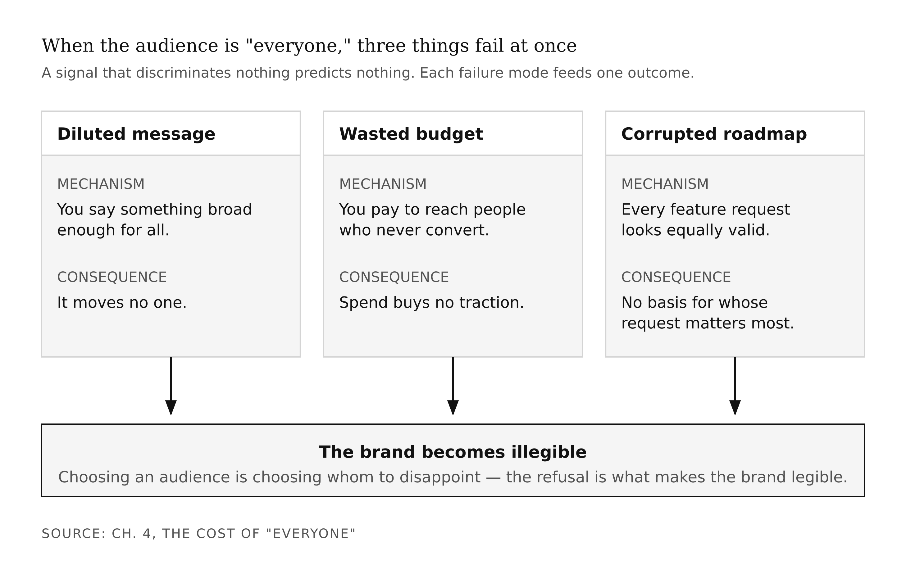
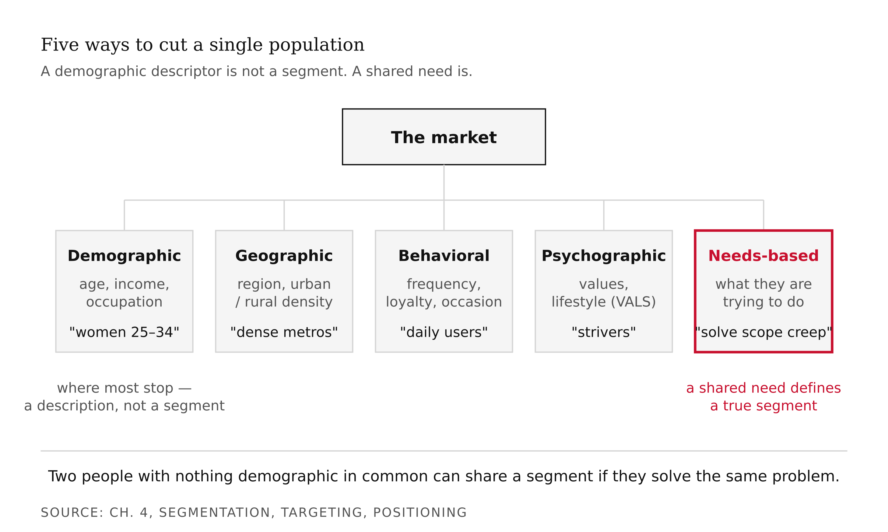
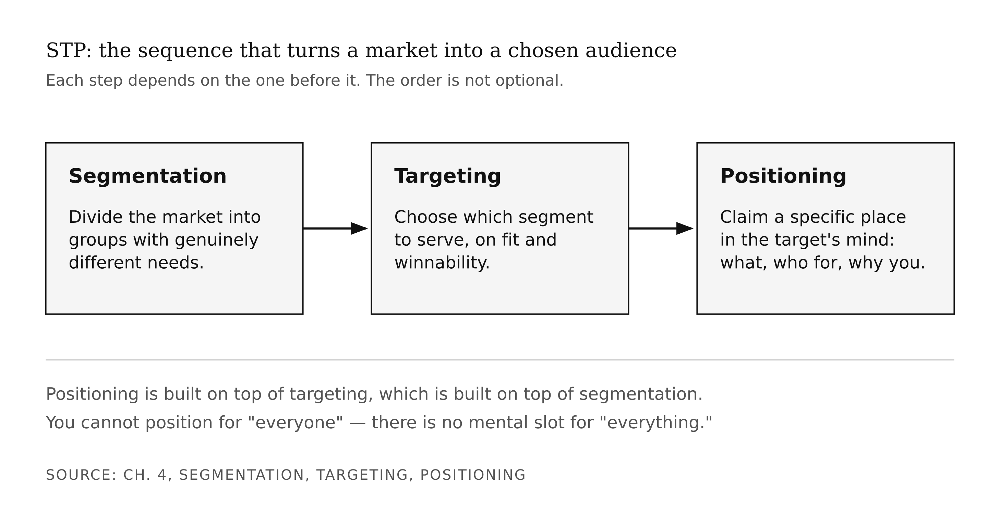
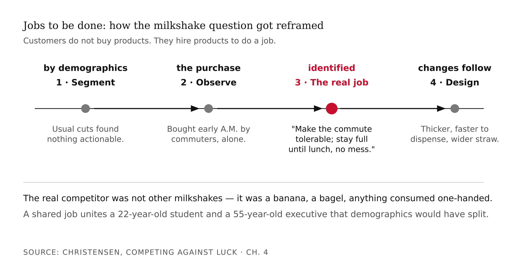
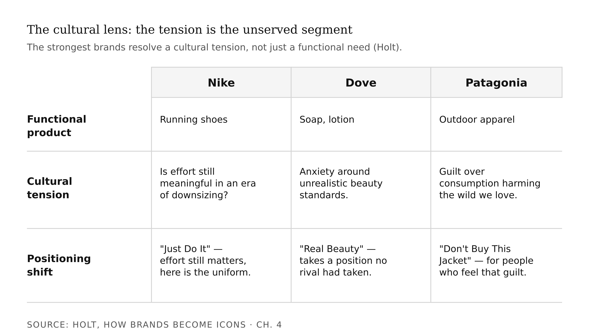
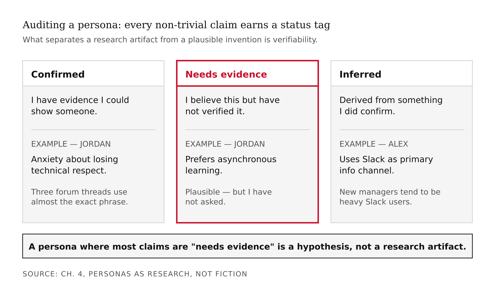
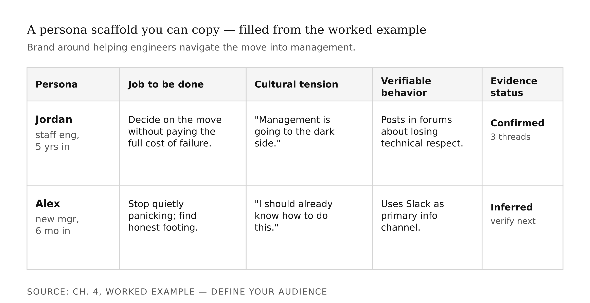

# Chapter 4 — The Brand Audience
*"Everyone" is not an audience. It is the most expensive way to reach no one.*

> **TL;DR:** A brand is built in specific minds, so the first strategic act is deciding *whose*. This chapter installs the discipline of audience — segmentation, targeting, and the jobs-to-be-done and cultural lenses that find an under-served group — and has you produce an evidence-backed audience definition and personas for your brand, with AI drafting and you verifying.
>
> | Section | Preview |
> |---|---|
> | The Cost of "Everyone" | Why an undefined audience quietly defeats positioning, budget, and product. |
> | Segmentation, Targeting, Positioning | The three-step sequence that turns a market into a chosen audience. |
> | Jobs To Be Done | A way to segment by the job people "hire" a brand for, not by who they are on paper. |
> | The Cultural Lens | How brands win by addressing a cultural tension, not just a functional need. |
> | Personas as Research, Not Fiction | What separates a real persona from a plausible invention. |
> | Worked Example: Define Your Audience | Drafting segments and personas with Madison, then grounding them in evidence. |

---

A founder once told me his app was "for everyone with a smartphone." He had a beautiful product and no traction, and the two facts were related.

"Everyone" gave him no one to design for. No message to sharpen. No channel to choose. His ad targeted all demographics and resonated with none. The day he decided his product was *for freelance designers who bill hourly and lose money to scope creep*, the copy wrote itself, the channel was obvious, and the first hundred users arrived.

This is not a coincidence. It is a mechanism. And understanding the mechanism — rather than just accepting the prescription — is what this chapter is for.

---

## The Cost of "Everyone"

Let me start with why the instinct to say "everyone" is so persistent, because it does not come from laziness. It comes from something that looks like ambition.

If your product is good, you think, why would you *voluntarily* exclude anyone? The founder with the scope-creep app did not start with "everyone" because he was sloppy. He started there because he genuinely believed his product would help any kind of knowledge worker — and he was probably right. The problem is that being useful to many people is not the same as being *for* a specific person. Those are different claims, and they activate different things in a buyer's mind.

"This is for you" is a signal that requires specificity to carry. "This is for everyone" carries no signal at all, because it requires no discrimination — and a signal that discriminates nothing predicts nothing. We are back in Spence territory: a signal is only as useful as the cost-structure that makes it informative. "For everyone" is zero cost to say. It tells the listener nothing about whether the product understands their specific problem.

The empirical consequences are predictable. An undefined audience dilutes the message — you say something broad enough for all, which moves none. It wastes budget — you pay to reach people who will never convert. And it corrupts the product roadmap — every feature request looks equally valid because you have no principled basis for deciding whose request matters most. Choosing an audience is choosing whom to disappoint. That refusal is not a limitation. It is what makes the brand legible.



---

## Segmentation, Targeting, Positioning

The canonical spine from marketing theory is **STP**: Segmentation, Targeting, Positioning. The sequence matters.

**Segmentation** is the act of dividing a market into groups with genuinely different needs. The bases available to you are demographic (age, income, occupation), geographic (region, urban/rural density), behavioral (purchase frequency, loyalty, usage occasion), psychographic (values, lifestyle, personality type), and needs-based (what the person is actually trying to accomplish). Each basis gives you a different cut through the same population.



Here is the most common mistake: stopping at demographics. "Women 25–34" is a description. It is not a segment. The women in that description want dozens of different things — they have different jobs, different anxieties, different purchasing criteria. What makes a group a *segment* is a shared need, not a shared demographic. Two people with nothing demographically in common can belong to the same segment if they are trying to solve the same problem.

**Targeting** is choosing which segment to serve. This is a strategic bet with two inputs: fit (does the segment's need connect to what you actually do well?) and winnability (can you reach this segment, and can you be meaningfully better for them than what they currently use?). A segment that is a perfect fit but unreachable is not a target. A reachable segment where you offer nothing distinctive is not a target either.

**Positioning** — which Chapter 6 develops fully — is claiming a specific place in the target's mind: what you are, who you are for, and why you over the alternatives. Positioning is built on top of targeting. You cannot position for "everyone" because there is no mental slot for "everything."



The STP model was formalized in the mid-twentieth century when marketing data was largely demographic and survey-based — the tools available shaped the bases of segmentation. Needs-based segmentation became more tractable as behavioral data (purchase history, clickstream, usage logs) became available. JTBD is the conceptual refinement that comes from taking needs-based segmentation seriously all the way down.

---

## Jobs To Be Done

Clayton Christensen's reframing, developed in *Competing Against Luck*, starts from an uncomfortable observation: customers do not buy products. They *hire* products to do a **job**.

The famous case study: a fast-food chain hired a research firm to increase milkshake sales. The firm segmented by demographics and psychographics in the usual way and found nothing actionable. Christensen's team reframed the question: what job are customers hiring the milkshake to do? They observed the purchase patterns directly. The majority of milkshakes were bought early in the morning by commuters eating alone. The job was not "dessert." The job was "make my boring commute tolerable and keep me full until lunch without making a mess." The real competitor was not other milkshakes. It was a banana, a granola bar, a bagel — anything that could be consumed one-handed on a highway. The design implications changed completely: make it thicker (lasts longer), make it easier to dispense (faster in the drive-through), make the straw wider (more satisfying).

The power of JTBD for audience work is that it cuts across demographics in a way demographics cannot cut across itself. A 22-year-old graduate student and a 55-year-old executive may hire the same brand for the same job — and that shared job is the real segment. If you had segmented by demographics, you would have separated them. The shared job unites them in a way that actually predicts purchase and retention.

For your own brand, the JTBD question is: what does your audience *hire* your work to do? Not "what do they get" — that is the feature. But what does having your work accomplish for them, in the context of the moment they turn to you? A technical writer might segment by job title (software engineers) and find the audience too diffuse. But if the real job is "I need to look competent in front of a nontechnical executive in forty-eight hours," that job is specific enough to design for — and specific enough that the person who needs it will recognize it instantly when your brand addresses it.



---

## The Cultural Lens

Douglas Holt's *How Brands Become Icons* adds a layer that JTBD alone does not capture. The strongest brands, Holt argues, do not just perform a functional job. They resolve a **cultural tension** — a contradiction or anxiety in the broader culture that a significant group of people feel but that is not being addressed.

Nike in its early mass-market phase was not selling shoes to athletes. It was speaking to a cultural anxiety about personal achievement in an era of corporate downsizing, when "working hard enough" felt newly uncertain as a life strategy. "Just Do It" was not a product promise. It was a resolution to that tension: effort is still meaningful, and here is the uniform for it. The functional product (running shoes) was the vehicle. The cultural job was the actual purchase driver.

Dove's "Real Beauty" campaign worked on the same structure. The functional product (soap, lotion) had not changed. What changed was that the brand took a position in a cultural conversation — the anxiety around unrealistic beauty standards — that many women felt but that no major personal-care brand had directly addressed. The cultural tension was the unserved segment.

For audience work, the implication is this: once you have identified a segment by need or JTBD, ask one more question. What cultural tension does this group live with that no brand in your space is currently resolving? The answer narrows your positioning from "we do X" to "we do X for people who feel Y about the world" — and the second formulation is dramatically more magnetic to the right people.



---

## Personas as Research, Not Fiction

A persona is a research artifact: a concrete portrait of a target segment member, grounded in evidence. The failure mode — especially with AI-assisted work — is the **plausible invention**: a demographically detailed, emotionally vivid portrait with no referent in reality.

The plausible invention is insidious because it feels like knowledge. It has a name (Jordan, 34), a job title, a commute, a weekend hobby, a fear. It is specific enough to design for, which is precisely the problem: you will design for a person who may not exist, optimize for a problem they may not have, and ship a product into a gap that is not there.

What separates a real persona from a plausible invention is the same thing that separates a separating signal from a pooling one: verifiability. A real persona has at least one behavioral claim — a specific, observable thing this person does — that you can tie to evidence you could show someone. An interview quote. A support ticket pattern. A behavioral cohort in your analytics. A forum thread where people in this segment describe the problem in their own words.

The rule I use: every non-trivial claim in a persona earns a status tag. *Confirmed:* I have evidence. *Needs evidence:* I believe this but have not verified it. *Inferred:* I derived this from something I did confirm. Any persona where the majority of claims are "needs evidence" is a hypothesis, not a research artifact — and it should be treated as one.

This is the exact point where AI assistance is most useful and most dangerous. AI can draft persona scaffolds from your archetype and any qualitative data you provide — pulling structure, flagging tensions, generating hypotheses. What it cannot do is decide that any particular claim is true. That decision requires evidence, and evidence requires contact with real humans. The +1 in the AI+1 frame is the researcher who goes to find out.



---

## Worked Example: Define Your Audience

Suppose I am building a brand around technical education — specifically, helping working engineers navigate the transition to engineering management. My archetype from Chapter 1 is Sage: I am drawn to making complex things legible, and my work pattern is explanation before prescription.

I start with segmentation by need. The demographic descriptor "software engineers at mid-sized tech companies, ages 28–40" is where most people stop. But the need that cuts across that population is more specific: *I have been told I should become a manager, and I do not know whether I want to, and I cannot find honest information about what the transition actually costs.* That is a need. The demographic description does not capture it — there are people inside those demographics who are not experiencing that tension, and there are people outside those demographics who are.

The JTBD framing sharpens it further: what are people in this segment *hiring* content to do? Not to learn management theory — there is no shortage of that. They are hiring it to *make a decision under uncertainty without having to pay the full cost of learning through failure.* That job — decision support under uncertainty — is specific enough to design a brand voice around, specific enough that when someone in that situation encounters the right headline, they will stop scrolling.

The cultural tension: in engineering culture, becoming a manager is frequently coded as "going to the dark side" — abandoning technical craft for politics and process. People considering the move live with a genuine anxiety that they will lose the thing they were good at without being certain they will gain anything they want. A brand that addresses this tension directly — rather than pretending the anxiety does not exist — will be hired by the people feeling it.

Now I draft two personas. I bring in everything I know about this audience — forum threads I have read, conversations I have had, the support emails that came in on previous content — and I ask Madison to structure two candidate portraits. The draft comes back with Jordan (staff engineer, five years in, being pushed by management) and Alex (recently promoted manager, six months in, quietly panicking). For each persona, I go through every non-trivial claim and assign a status tag. Jordan's anxiety about losing technical respect: *confirmed* — I have three forum threads where engineers in this position use almost the exact phrase. Jordan's preference for asynchronous learning: *needs evidence* — I believe this but have not asked. Alex's use of Slack as a primary information channel: *inferred* from the observation that newly promoted managers in this space tend to be heavy Slack users, but I have not directly confirmed it for this specific persona.

The personas I submit to strategy are not the ones Madison drafted. They are the ones I can defend.



---

## What Would Change My Mind

The JTBD framework assumes that the "job" a customer hires a product to do is stable enough to be discoverable through observation. If purchasing behavior is substantially shaped by social contagion — buying because others buy, with no stable underlying job — then JTBD loses explanatory power and the segmentation it enables may be post-hoc rationalization. The evidence for social contagion effects in consumer markets is real. I do not know how to fully reconcile this with the JTBD model, and I have not seen a satisfying attempt to do so.

## Still Puzzling

Why the cultural tension lens works when it works, and fails when it fails, is not fully understood. Nike and Dove hit genuine cultural moments and their campaigns became iconic. Plenty of brands have attempted the same structure and produced campaigns that felt opportunistic or tone-deaf — same methodology, opposite result. The difference seems to have something to do with whether the brand's action in the cultural space is consistent with its behavior over time, or whether the campaign is the first time the brand has shown up in that conversation. But I cannot reduce this to a clean principle.

---

## AI Wayback Machine

The segmentation-targeting-positioning spine is most associated with Philip Kotler, who formalized and popularized it across decades of editions of *Marketing Management* (first edition 1967). But the intellectual ancestry runs to **Wendell Smith**, whose 1956 paper "Product Differentiation and Market Segmentation as Alternative Marketing Strategies" in the *Journal of Marketing* is the first rigorous treatment of segmentation as a strategic choice rather than a descriptive observation. Smith's paper appeared in the same decade as Spence's signaling work was being conceptualized — two economists, both trying to understand how markets actually clear when information is asymmetric and preferences are heterogeneous.

**Run this:**

```
Who was Wendell Smith, and what was the argument in his 1956 paper on market
segmentation? How does his framing differ from how segmentation is typically
taught today? Keep it to three paragraphs. End with the single most surprising
thing about the paper's reception or influence.
```

→ Search **"Wendell Smith market segmentation 1956"** after you run this. See what the model got right, got wrong, or left out.

**Now make the prompt better.** Try one of these:

- Ask it to explain the difference between *product differentiation* (Smith's alternative strategy) and *segmentation* — and when each is the right choice
- Ask it to apply Smith's original framing to a modern platform company and describe what "segmentation" would mean in that context
- Add a constraint: "Answer as if you are explaining why a founder who wants to serve 'everyone' is actually making a product-differentiation argument, not a segmentation argument"

What changes? What gets better? What gets worse?

---

## Exercises

### Warm-Up

**W1.** In two sentences, explain the difference between a demographic descriptor and a segment defined by need. Give one example of each for the same population.
*(Tests segmentation concept — difficulty: low)*

**W2.** Apply the JTBD frame to a product you use regularly. Name the functional job you would describe if asked, and then name the actual job you hired it to do the last time you used it. Are they the same? If not, explain the gap.
*(Tests JTBD application to a familiar case — difficulty: low)*

**W3.** Name a brand you believe is successfully addressing a cultural tension. Identify the tension, the brand's position in it, and whether the brand's behavior over time is consistent with that position or appears opportunistic.
*(Tests cultural lens comprehension — difficulty: low)*

---

### Application

**A1.** Take your own brand archetype from Chapter 1. Generate three candidate segments defined by need or JTBD — not by demographic descriptor. For each segment, write one sentence naming the job and one sentence naming the cultural tension. Do not accept any segment that could be summarized as "people who like [adjective] things."
*(Forces needs-based segmentation from the archetype anchor — difficulty: medium)*

**A2.** Draft a single persona for your chosen target segment. For each non-trivial claim in the persona, assign a status tag: Confirmed, Needs Evidence, or Inferred. You should have at least one Confirmed claim with evidence you could show someone, and at least two Needs Evidence claims you have a plan to verify.
*(Tests the persona-as-research-artifact discipline — difficulty: medium)*

**A3.** The milkshake case study produced a redesign recommendation: make the straw wider, make the shake thicker. Apply the same logic to your brand. Given the job you have identified for your target segment, name one design or content decision that the JTBD framing makes obvious — and that a demographic-only segmentation would have missed.
*(Forces JTBD from description to design implication — difficulty: medium)*

---

### Synthesis

**S1.** A colleague argues: "Personas are useful for product teams, but for a personal brand — especially a one-person operation — they're unnecessary overhead. Just talk to real people and respond to what they say." Construct the strongest version of this argument, then construct the strongest counterargument. Which do you find more persuasive, and why? (300 words.)
*(Tests whether the student understands what personas are actually doing — difficulty: high)*

**S2.** The chapter argues that "everyone" is not an audience. But some brands — Google Search, WhatsApp, iMessage — genuinely do serve nearly everyone in a developed market. Does the chapter's argument fail for these cases, or does it apply in a modified form? What would "targeting" mean for a platform at that scale? (300–400 words.)
*(Tests the limits of the framework — difficulty: high)*

---

### Challenge

**C1.** The chapter presents JTBD and the cultural tension lens as complementary. But they could be in tension: JTBD is ultimately functionalist (people hire products to accomplish tasks), while the cultural lens suggests that what people are really buying is a resolution to an identity or social anxiety that has nothing to do with functional task completion. Design an example where the two frameworks would recommend different audiences or different positioning. What does that tension reveal about the limits of each? (400–500 words.)
*(Open-ended — tests genuine synthesis rather than recitation — difficulty: challenge)*

---

## AI+1 — Self-as-Project on Madison

**Project:** Self-as-Project — *your brand, end to end*
**This chapter adds:** an evidence-backed audience definition + two personas.
**Madison recipes:** [`madison-audience-definition`](../madison/recipes/madison-audience-definition.md), [`madison-persona-generation`](../madison/recipes/madison-persona-generation.md), [`survey-analysis`](../madison/recipes/survey-analysis.md)

> Madison drafts segments and personas; *you* accept a persona as real only on evidence. The acceptance is the +1.

### Exercise 1 — When to Use AI
- *Draft candidate segments by need/JTBD from your archetype.* **Why it works:** generating options you select among.
- *Extract patterns from survey/interview text.* **Why it works:** summarization (`survey-analysis`).
- *Reformat raw notes into persona scaffolds.* **Why it works:** structure-drafting.

**Tell:** you can verify each persona claim against real evidence.

### Exercise 2 — When NOT to Use AI
- *Committing to a target segment.* **Why it fails:** a strategic bet, not an output.
- *Accepting a persona as real.* **Why it fails:** models produce fluent personas with no referent.
- *Inventing market size / behavior stats.* **Why it fails:** hallucination; unverifiable numbers mislead.

**Tell:** you've crossed the line when a fabricated persona detail enters your strategy unchecked.
**Series connection:** Tier 4 (metacognitive) — knowing which "facts" about your audience you actually know.

### Exercise 3 — Recipe Exercise
**Build:** an audience definition + personas. **Run:** [`madison-audience-definition`](../madison/recipes/madison-audience-definition.md) → [`madison-persona-generation`](../madison/recipes/madison-persona-generation.md). **Tool:** Claude Project.

```
Using the Madison audience-definition + persona-generation recipe approach, and my
archetype + any data below, draft: (1) 2–3 candidate segments defined by NEED or
JOB-TO-BE-DONE (not demographics); (2) one cultural tension each segment lives
with; (3) two personas, each with one VERIFIABLE behavior and [NEEDS EVIDENCE]
tags on anything I must confirm. Invent no statistics. I choose the target.

Archetype + data:
[PASTE]
```
**Adapt:** if you have survey data, run `survey-analysis` first and feed its themes in.

### Exercise 4 — CLI Exercise
**Build:** `your-brand/audience.md`. **Tool:** [`wrap-your-tool`](../madison/wrap-your-tool/) or Claude Code.

```
Write your-brand/audience.md: the chosen segment (by need/JTBD), its cultural
tension, and two personas (table: persona | job | verifiable behavior | evidence
status). Tag unconfirmed details [NEEDS EVIDENCE]. Invent no demographics or sizes.
Stop after writing the file.
```
**Inspect:** segments are need-based; every persona has ≥1 verifiable behavior. **If it goes wrong:** strip demographically detailed but evidence-free personas.

### Exercise 5 — AI Validation Exercise
**Validate:** the audience definition. Pass / Fail / Cannot-determine + evidence:
- **Correctness:** are segments defined by need, not demographic descriptor?
- **Completeness:** segment + tension + ≥2 personas with evidence status?
- **Scope:** audience only — no positioning or campaign yet?
- **Brand-specific:** does the target fit the archetype?
- **Failure-mode:** which persona details are [NEEDS EVIDENCE], and how will you confirm each?
**AI Use Disclosure:** two sentences — what the recipes produced; one thing they could not determine (which persona is real) that needed your judgment.

---

## Key Terms

segment vs. demographic · STP (segmentation / targeting / positioning) · bases of segmentation · jobs-to-be-done · cultural tension · psychographics (VALS) · persona as research artifact

## Bridge

You know whose minds you're building in. Chapter 5 gives you the identity that makes every downstream decision for them decidable — the archetype.

*Tags: brand-audience · segmentation · targeting · positioning · STP · jobs-to-be-done · cultural-tension · personas · audience-definition · Christensen · Holt · Kotler · INFO-7375*
