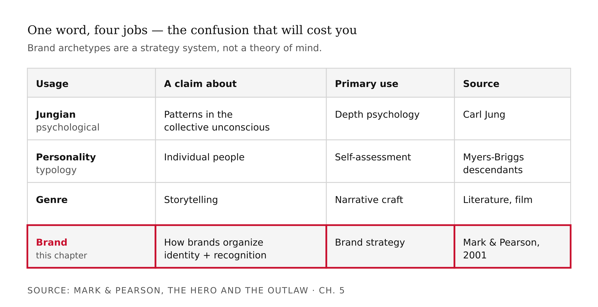
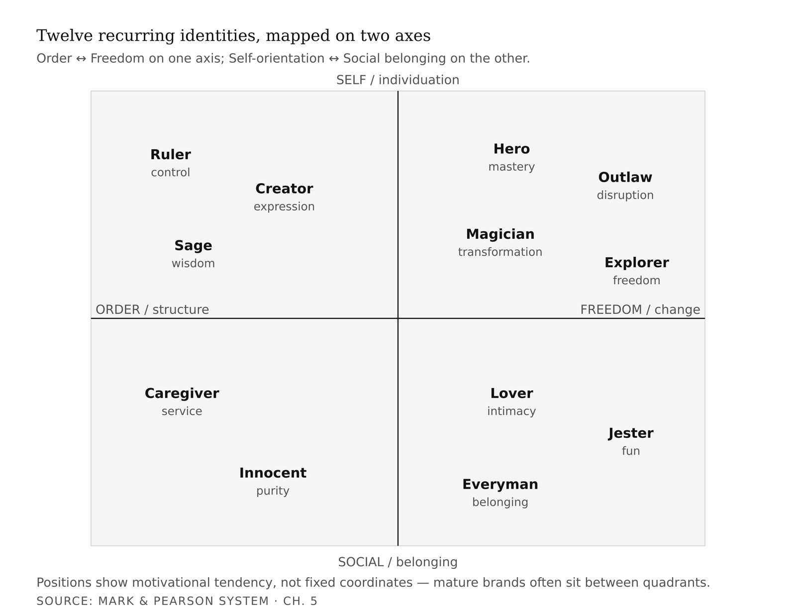
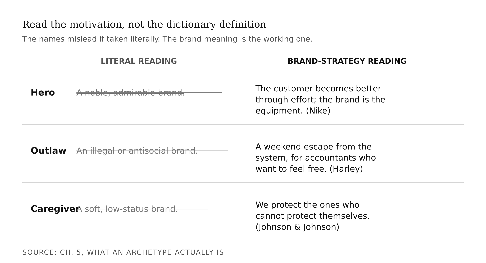
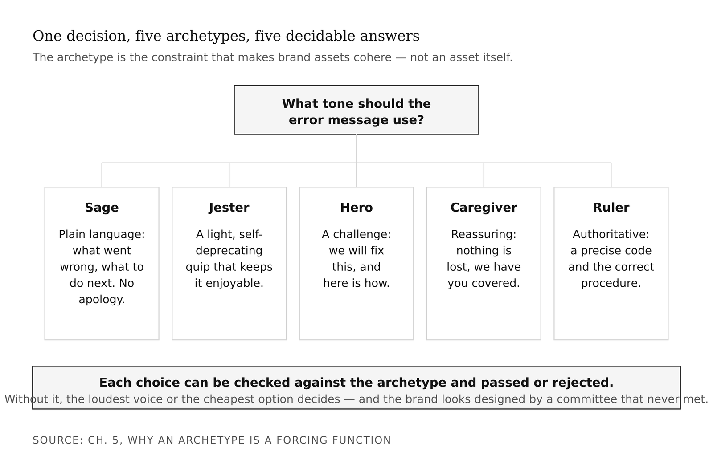
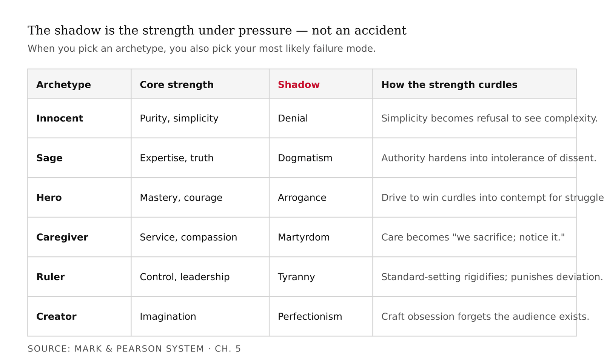
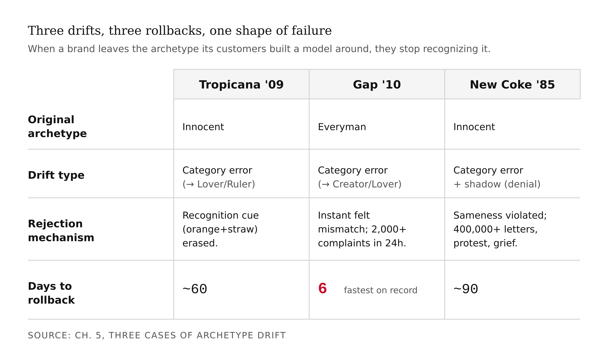
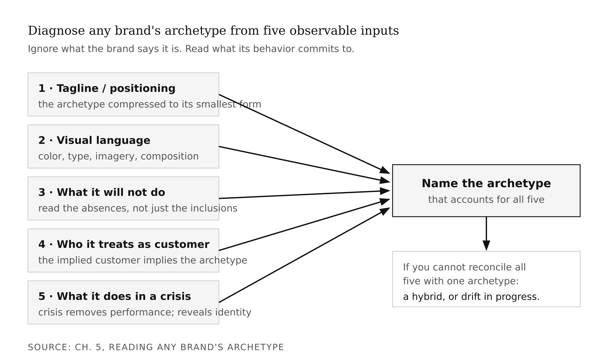
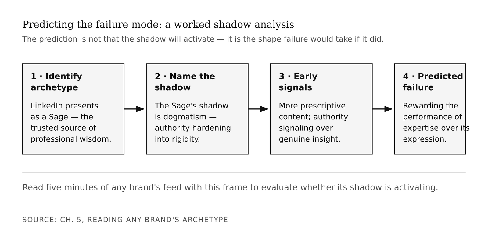
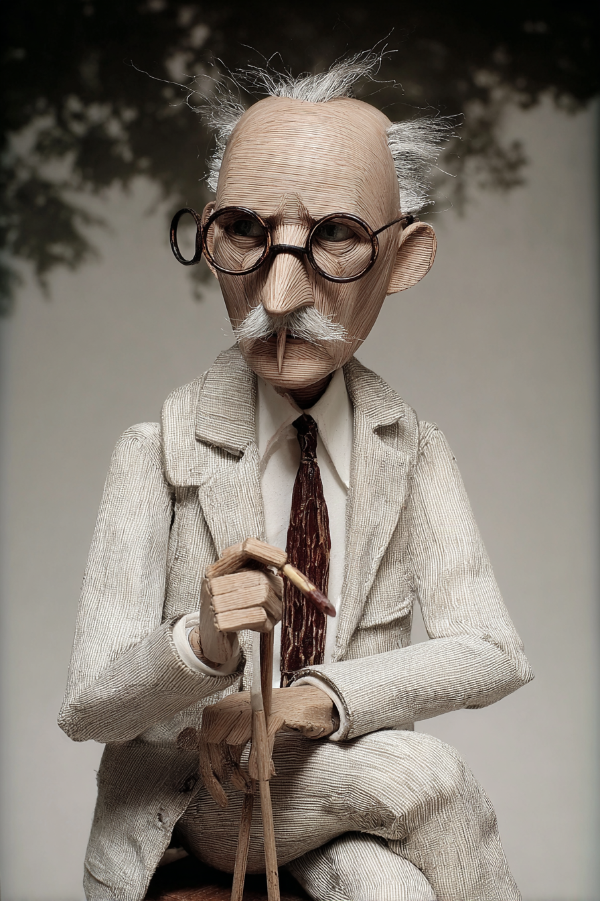

# Chapter 5 — Brand Archetypes as a System
*The constraint that makes every downstream decision decidable.*

> **TL;DR:** Choosing one of twelve brand archetypes turns vague brand questions into decidable ones. This chapter explains why a committed archetype makes every later decision easier, uses three famous failures (Tropicana, Gap, New Coke) to show what happens when a brand drifts from its archetype, and walks you through picking and stress-testing your own.
>
> | Section | Preview |
> |---|---|
> | What an Archetype Actually Is | A plain-language account of the twelve recurring identities and why each one carries a built-in failure mode (its "shadow"). |
> | Why an Archetype Is a Forcing Function | How committing to one identity makes downstream choices — features, copy, design — decidable instead of arbitrary. |
> | Three Cases of Archetype Drift | What went wrong when Tropicana, Gap, and New Coke moved away from the identity their customers expected. |
> | Reading Any Brand's Archetype | A five-input procedure for diagnosing the archetype of any brand from its public behavior. |
> | Picking Your Archetype | How to choose, and honestly test, the archetype for your own brand. |
> | A Note on the Framework's Limits | Where the archetype model stops being useful and what it cannot decide for you. |

---

Here is what I find strange about brand failure. The companies that fail most publicly — Tropicana, Gap, Coca-Cola in 1985 — rarely fail because they ran out of money or made a bad product. They fail because they changed something that was working. They changed the orange on the carton, the typeface on the logo, the formula in the bottle. And their customers, who had been buying without thinking for twenty years, suddenly stopped.

That seems like it should be simple to avoid. Don't change what's working. But it isn't simple, because nobody in the room understands what is actually working. They know the product works. They can measure sales. What they cannot see is the *recognition asset* — the accumulated pattern of touchpoints that lets a customer's eye snap to your product on a crowded shelf at 8 AM without engaging conscious thought. That asset is invisible until it is destroyed. And it is destroyed, specifically, by archetype drift.

This is the thing I want to teach in this chapter. Not the twelve archetypes as a list to memorize — you could get that from a poster. The thing worth teaching is what an archetype actually does mechanically, why it is the cheapest consistency-enforcement device available, and how its failure mode is structurally embedded in its strength from the start.

<!-- → [INFOGRAPHIC: Horizontal timeline showing where the archetype decision sits relative to the book's chapter arc — picked early, dormant through product build, reactivated at brand launch] -->

---

## What an Archetype Actually Is

The word *archetype* is doing at least four different jobs in current usage, and the confusion between them will cost you.

*Jungian psychological archetypes* are universal patterns Carl Jung proposed exist in the collective unconscious — the Mother, the Shadow, the Trickster, the Self. These are claims about human psychology, about patterns that recur across cultures and across the history of symbolic expression. Jung was not building a brand strategy framework.

*Personality typology archetypes* are the Myers-Briggs descendants. These are claims about individual people.

*Genre archetypes* are patterns in literature and film — the Reluctant Hero, the Wise Mentor. These are claims about storytelling.

*Brand archetypes* are what this chapter is about: the twelve-archetype system formalized by Margaret Mark and Carol Pearson in *The Hero and the Outlaw* (McGraw-Hill, 2001). These are claims about how brands organize identity and how customers form recognition.



Mark and Pearson trace their system to Jung — their twelve archetypes share names with Jungian patterns — but the work itself is brand strategy, not psychology. The connection to Jung is useful for exactly one reason: it explains why the patterns feel *familiar*. The Innocent, the Hero, the Outlaw, the Caregiver — customers recognize these patterns at a level below conscious articulation. That pre-conscious recognition is what makes the archetype system more than a naming scheme. It is the reason consistency built around an archetype accumulates into something customers can feel without being able to describe.

Here are the twelve, each with its core motivation and its shadow. The shadow matters as much as the archetype. I will explain why in a moment.

**Innocent** — Motivation: simplicity, purity, optimism. Shadow: denial, naivety. The Innocent brand says the world is good and the product reflects that goodness. When it drifts, it refuses to acknowledge bad news and sounds out of touch. *(Tropicana, Dove, early Coca-Cola.)*

**Sage** — Motivation: wisdom, truth, expertise. Shadow: dogmatism. The Sage brand is the trusted source, the one that knows. When it drifts, it becomes preachy and intolerant of dissent. *(The Economist, early Google, TED.)*

**Explorer** — Motivation: freedom, discovery, autonomy. Shadow: aimlessness. The Explorer brand says the world is worth seeking out. When it drifts, it loses coherence and stands for nothing in particular. *(Patagonia, Jeep, REI.)*

**Hero** — Motivation: courage, mastery, victory. Shadow: arrogance, bullying. The Hero brand says you can be more than you are. When it drifts, it pushes customers around and sneers at failure. *(Nike, FedEx, the U.S. Army.)*

**Outlaw** — Motivation: disruption, rebellion, challenging authority. Shadow: nihilism, harm. The Outlaw brand says the system is broken and we are proof it does not have to be this way. When it drifts, it becomes destructive without purpose. *(Harley-Davidson, early Apple.)*

**Magician** — Motivation: transformation, vision, making the impossible possible. Shadow: manipulation. The Magician brand promises to change what you thought was fixed. When it drifts, it overpromises and hides the mechanism. *(Disney, Tesla, mature Apple.)*

**Everyman** — Motivation: belonging, equality, realism. Shadow: conformity. The Everyman brand says you belong here, exactly as you are. When it drifts, it becomes so broad it stands for nothing. *(IKEA, Target, original Twitter.)*

**Lover** — Motivation: intimacy, beauty, connection. Shadow: obsession. The Lover brand says life is better when it is beautiful and felt. When it drifts, it becomes suffocating or superficial. *(Chanel, Victoria's Secret.)*

**Jester** — Motivation: fun, lightness, irreverence. Shadow: cruelty, frivolity. The Jester brand says this is supposed to be enjoyable. When it drifts, it makes jokes at the wrong person's expense. *(Old Spice, Skittles.)*

**Caregiver** — Motivation: service, compassion, generosity. Shadow: martyrdom, enabling. The Caregiver brand says we are here to protect and nurture. When it drifts, it develops a tone of "we sacrifice for you; notice it." *(Johnson & Johnson, UNICEF.)*

**Ruler** — Motivation: control, leadership, prosperity. Shadow: tyranny. The Ruler brand says we are the standard. When it drifts, it becomes rigid and punishes deviation. *(Mercedes-Benz, Rolex, American Express.)*

**Creator** — Motivation: imagination, expression, originality. Shadow: perfectionism. The Creator brand says make something that was not there before. When it drifts, it becomes so invested in its own craft it forgets the audience. *(Lego, Adobe, Pixar.)*



Before going further, a warning about the names. They will mislead you if you take them literally.

*Hero* does not mean your brand is heroic in the sense of noble and admirable. It means your brand is organized around the idea that its customer can become better through effort and that your brand is the instrument of that becoming. Nike is a Hero brand not because Nike is admirable, but because everything Nike makes is in service of the idea that *you* can push past your limit. The customer is the hero. The brand is the equipment.

*Outlaw* does not mean your brand is illegal or antisocial. Harley-Davidson is an Outlaw brand; its customers are accountants and lawyers who want, for the weekend, to feel like they have stepped outside the system.

*Caregiver* does not mean your brand is soft or low-status. Johnson & Johnson's entire product line — baby powder, bandages, surgical instruments — is a Caregiver's expression: *we protect the ones who cannot protect themselves.*

When you read these names, read the motivation. Not the dictionary definition.



---

## Why an Archetype Is a Forcing Function

Now let me show you what an archetype actually does in practice. Imagine you have just launched a tool. You have a working product and a handful of early users. In the next thirty days, someone will have to make decisions like these:

What should the homepage tagline say? What tone should the help documentation use? Should you sponsor a hackathon, an academic conference, or a street art festival? What color is the primary call-to-action button? What does the founder wear in the headshot? What does the error message say when something breaks?

Without an archetype, each decision is made in isolation — by the loudest voice in the room, the cheapest available option, or whoever happened to be awake at the time. Thirty days of those decisions accumulates into a brand that looks like it was designed by a committee that never met.

With an archetype, each decision has a constraint. You are a Sage. The tagline is plainspoken and confident. The help documentation has a teaching tone — it explains, it does not apologize. The hackathon is in scope; the street art festival is not. The primary button is a considered, authoritative color. The founder wears something that signals expertise, not performance. Jokes are dry; they are never loud. The error message says what went wrong in plain language and what to do next.

The Sage archetype made those decisions. Not perfectly, not finally — there is still room for craft within the constraint — but *decidably*. Each choice can be checked against the archetype and passed or rejected.

This is what I mean when I say an archetype is a forcing function. It is not a brand asset in the sense of a logo or a tagline. It is the constraint that makes all the other brand assets cohere.



The deeper reason an archetype matters is recognition. A customer does not experience your brand once. They experience it hundreds of times — a tweet, a Google result, a friend's recommendation, a product review, a push notification, a packaging design at the grocery store. Each of those experiences is a data point. If the data points are consistent, the customer builds a *model* of who the brand is. That model is the recognition asset — the thing that makes a customer, when standing in the juice aisle at 8 AM, reach for your product without thinking.

If the data points are inconsistent, the model never forms. The customer has encountered your brand before, but they cannot place you. You are new to them every time.

The recognition asset is built by accumulation. It requires that the hundredth touchpoint is consistent with the first. An archetype is the cheapest instrument available for enforcing that consistency, because it operates at the level of identity rather than execution. You do not have to tell every designer, writer, and engineer to produce exactly this output. You tell them who the brand is. A designer who knows the brand is a Sage will make different choices — consistently — than a designer who knows the brand is a Jester, even without a style guide.

<!-- → [DIAGRAM: Two brands side by side — Brand A's touchpoints uniformly coded and accumulating into a sharp customer-model silhouette; Brand B's mismatched and accumulating into a blurred, fragmented shape] -->

Now here is the part that took me a while to see clearly. Every archetype in the Mark/Pearson system carries a shadow — the form the archetype takes when its commitments curdle. And the shadow is not an accident. It is structurally related to the archetype's strength.

The Innocent's strength is purity and simplicity. The shadow of purity is denial: an Innocent brand that drifts starts refusing to acknowledge bad news, sticks with messaging that reads as willfully naive, and sounds out of touch with anything complicated or dark. The same commitment to simplicity that makes the Innocent recognizable becomes, under pressure, an inability to adapt.

The Sage's strength is expertise and truth. The shadow of expertise is dogmatism: a Sage brand that drifts becomes certain, preachy, intolerant of dissent, and unable to update its position when the evidence changes.

The Hero's shadow is contempt for people who have not become better: a Hero brand that drifts pushes customers around, equates winning with worth, and sneers at users who struggle.

The Caregiver's shadow is martyrdom: a Caregiver brand that drifts develops a tone of "we sacrifice for you, and you should notice that." It becomes manipulative and exhausting.

The shadow is useful to you in exactly one way: it tells you where to watch. When you pick an archetype, you also pick your most likely failure mode. Knowing which shadow is yours means you know which early-warning signs to monitor.



---

## Three Cases of Archetype Drift

Let me walk through three documented cases. Each is real. Each has the same shape: the brand drifted from its archetype, customers rejected the drift, the company rolled back. The cases differ in direction and speed; the mechanism is the same in all three.

The analytical frame has four elements: the original archetype, the drift direction, the customer rejection, and whether the failure was a shadow drift (the brand's own commitments curdling) or a category error (trying to become a completely different archetype).

**Tropicana, 2009.** Tropicana Pure Premium was an Innocent brand. The recognition handle was literal and wholesome: an orange with a striped straw poking out of it. The image made a simple promise — this is just orange juice, nothing complicated, good and natural. Customers had trained their eyes over two decades to scan for that specific image in the grocery aisle.

In January 2009, Tropicana replaced the orange-with-straw with a glossy glass of poured juice. The brand name moved to a vertical orientation. The new packaging was crisp, contemporary, minimal — the visual language of a Lover or a Ruler, not an Innocent. Within two months, sales dropped 20 percent. The company reported losses of more than $30 million in revenue. Regular buyers walked past the new cartons without seeing them. Their recognition handle was gone. On February 23, 2009 — less than two months after launch — Tropicana announced the rollback.

This is a category-error drift, not a shadow drift. Tropicana did not activate the Innocent's shadow. It tried to become a different archetype and in doing so erased the recognition cues its audience depended on. The lesson is precise: the recognition asset is built by the archetype's specific expression, not by the archetype's name. You cannot swap expressions without losing the recognition that accumulated in the original form.

<!-- → [IMAGE: Side-by-side comparison of the original Tropicana Pure Premium carton (orange with straw) and the 2009 redesign (glass of juice) — make the visual difference unmistakable] -->

**Gap, 2010.** For twenty years, Gap's logo had been an Everyman icon: a blue square, white serif type, balanced and slightly conservative. The Everyman archetype is organized around belonging — the brand says *you fit here, as you are*. The visual language of an Everyman brand is accessible, unpretentious, and deliberately unremarkable. The Gap logo was not exciting; it was *reliable*. Reliability is the Everyman's promise.

On October 6, 2010, Gap rolled out a new logo: a smaller blue square pushed into the upper-right corner of the word Gap, set in plain bold Helvetica. The serif was gone. The enclosing square was diminished. The new design was more sophisticated, more contemporary — visual language associated with a Creator or a Lover, not an Everyman. Within 24 hours, a fashion blog had collected more than 2,000 negative comments. On October 12 — six days after launch — Gap announced the rollback.

The speed of the rejection is diagnostic. Customers did not need time to be convinced the new logo was wrong. They knew immediately. That immediacy is the sign of a recognition asset being violated: when the recognition handle disappears, the mismatch between expectation and experience is felt before it is articulated. Six days from launch to rollback is the fastest documented major brand rollback on record.

<!-- → [IMAGE: Side-by-side of the original Gap logo (blue square, white serif type) and the 2010 redesign (smaller square, Helvetica) — annotation marking what changed and why it reads as a different archetype] -->

**New Coke, 1985.** Coca-Cola was — and remains — the canonical Innocent brand. Wholesome, all-American, the taste of childhood summers, the same formula since 1886. Innocent brands derive enormous power from *sameness*: the experience the customer had at age seven and the experience they have at age forty-seven are the same. That sameness is not a lack of innovation. It is the Innocent's deepest commitment.

In the early 1980s, Pepsi was running the "Pepsi Challenge" — a blind taste test campaign showing that consumers preferred Pepsi's sweeter formula. Pepsi was the Outlaw: the challenger, the disruptor, the choice of the new generation. Coca-Cola responded by reformulating its product. New Coke was sweeter, designed to win the taste test on Pepsi's own terms. In blind tests, it performed well. Coca-Cola's leadership announced the change in April 1985, simultaneously discontinuing the original formula.

The response was not disappointment. It was grief and rage. Within weeks, Coca-Cola received more than 400,000 letters and calls. Protest groups formed. A senator from Georgia entered a statement into the Congressional Record. Within three months, Coca-Cola brought back the original formula as "Coca-Cola Classic."

This is the deepest archetype failure of the three cases. Coca-Cola did not simply drift toward a new expression of its own archetype. It attempted to compete with Pepsi on Pepsi's own terms — to out-Outlaw the Outlaw. This is a category error of the highest order. The Outlaw archetype draws its energy from being the challenger. When the establishment *becomes* the challenger, the challenger wins by default. Pepsi no longer needed to say it was the choice of the new generation; Coca-Cola's own behavior was confirming that the old order was broken.

More importantly: Coca-Cola's customers were not buying Coke because it tasted better than Pepsi in a blind test. They were buying Coke because Coke was *Coke* — the same formula their parents drank, the same commitment to sameness that is the Innocent's deepest value. Changing the formula was not a product decision. It was an ontological violation of the archetype's core commitment.

There is also a shadow reading of New Coke. The Innocent's shadow is denial. Coca-Cola's leadership had been in denial about what their product actually was to their customers — they treated it as a taste preference rather than a symbolic commitment. That is the shadow activating before the category error: the Innocent's refusal to see the complexity of what it is.

<!-- → [CHART: Timeline of the New Coke crisis — April 1985 (launch, discontinuation of original) → May/June 1985 (400,000+ letters, protest groups, Congressional Record) → July 1985 (return of Classic) — with a secondary line showing Pepsi market share across the same period] -->

Three companies. Three archetype drifts. Three rollbacks. The pattern is consistent: when a brand's archetype shifts away from the one its customers have built a recognition model around, customers do not migrate to the new brand. They stop recognizing the brand entirely. The specific direction of the drift varies. The shape of the failure is the same.



---

## Reading Any Brand's Archetype

Here is the analytical procedure for identifying a brand's archetype from its observable outputs. Five inputs, one conclusion.

**Input 1: The tagline or positioning statement.** Ignore what the brand says its archetype is. Read what the tagline commits to. "Just Do It" commits to effort and mastery — Hero. "Think Different" commits to rebellion against the norm — Outlaw. "Because You're Worth It" commits to self-worth through beauty — Lover. The tagline is the archetype compressed into its smallest communicable form.

**Input 2: The visual language.** Color, typeface, imagery, and composition all carry archetype signals. Innocent brands use natural colors, rounded forms, literal imagery. Sage brands use authoritative typography, measured layouts, evidence over decoration. Outlaw brands use asymmetry, high contrast, imagery that makes part of the audience uncomfortable.

**Input 3: What the brand will not do.** Archetypes are as legible in exclusions as in inclusions. Nike will not run a campaign built around rest and acceptance — that is antithetical to the Hero's commitments. Patagonia will not partner with fast-fashion brands — that violates the Explorer's ethic. Read the absences.

**Input 4: Who the brand treats as its customer.** The Hero brand's customer is someone who wants to become better. The Caregiver brand's customer is someone who needs protection. The archetype implies a customer; the customer implies an archetype.

**Input 5: What the brand does when things go wrong.** A Sage brand responds to a product failure with a detailed, honest explanation — here is what happened, here is what we are doing about it. A Hero brand responds with a challenge — we are going to fix this, and here is the proof. The crisis response reveals the archetype because the crisis removes the option of performance; you respond from who you actually are.

Five inputs. Name the archetype that accounts for all five. If you cannot reconcile all five with a single archetype, you have found either a genuine hybrid — common in mature brands — or evidence of drift in progress.



Once you have identified the archetype, you can predict the failure mode. Name the archetype, name the shadow, look for early signals that the shadow is activating, and name the consequence if it fully activates. Consider LinkedIn as a working example. As of this writing, LinkedIn presents as a Sage brand: the trusted source of professional wisdom, the place experts go to establish authority. The Sage's shadow is dogmatism. Early signals of the shadow activating would include a shift in tone toward prescriptive content, amplification of authority signaling over genuine insight, and a product design that rewards performance of expertise rather than expression of it. Whether LinkedIn is currently activating its shadow is a question you can evaluate yourself by reading five minutes of its feed with this frame in mind. The prediction is not that the shadow *will* activate. The prediction is that *if* LinkedIn fails as a brand, this is the most likely shape of that failure.



---

## Picking Your Archetype

When you pick an archetype for your own tool or brand, you are not choosing a personality. You are choosing a set of constraints you are willing to maintain for years under pressure.

The archetype that fits should satisfy three tests.

**The authenticity test.** Does this archetype match how you actually behave when you are not performing? Your earlier equity audit surfaced your natural tendencies. If you are, by nature, a researcher who cares about getting things right, the Sage fits better than the Hero — even if Hero feels more energetic. A forced archetype is exhausting to maintain and customers eventually feel the strain.

**The differentiation test.** What are your competitors? If your market is crowded with Sage brands — every player publishing authoritative content, competing on depth and expertise — becoming another Sage means competing on execution, not identity. A less-popular archetype in a crowded market may be the strategically correct pick.

**The stress test.** Suppose your tool grows ten times larger. Suppose a well-funded competitor enters your market and executes your archetype better than you do. Does your archetype still fit? Does it still differentiate you? The archetype that survives all three tests is the one to commit to.


Your archetype goes dormant during the build sequence. You will not be talking about archetypes while writing feature specs and user stories. But the archetype will quietly shape your decisions: what you scope, what you cut, what you name the tool, how you describe it in the README. A Sage tool does not have a gamified onboarding sequence. An Outlaw tool does not have a corporate pricing page. A Caregiver tool does not use high-contrast alerts that feel like warnings. These are archetype decisions disguised as product decisions.

---

## A Note on the Framework's Limits

I should be honest about what this framework cannot do.

The twelve-archetype system is *a* taxonomy, not *the* taxonomy. Other brand-strategy frameworks exist — David Aaker's brand-personality dimensions, values-based positioning approaches from the marketing literature. The choice of Mark and Pearson here is a working decision: the system is concrete enough to teach, general enough to apply across industries, and has enough documented case history to defend in a portfolio review. It is not a claim about the deep structure of brand identity.

Real brands often combine archetypes. Apple has operated as an Outlaw ("Think Different"), a Magician (the iPhone launch), and arguably a Ruler (the current App Store era). The archetype shifted — whether successfully or not is worth debating. The framework handles single-archetype analysis cleanly; multi-archetype evolution is more complex, and I do not have a clean account of how brands navigate archetype transitions without triggering the same customer-rejection mechanisms we saw in the three cases.

**What would change my mind:** Strong evidence that brands without explicit archetype commitments perform comparably to brands with them, when controlling for product quality and marketing spend. The Mark/Pearson framework's empirical base is primarily case study; large-N studies treating archetype-consistency as a variable in brand-equity outcomes would either solidify or undermine the chapter's central claim.

**Still puzzling:** How brands successfully *evolve* their archetype without losing their audience. Apple shifted from Outlaw to Magician. Disney has carried Magician for decades but with periodic re-pitches. The mechanism seems to involve gradual shift, narrative continuity, and treating the new archetype as a deepening rather than a replacement. But I do not have a clean account of it, and I would not trust anyone who claims they do.

---

## LLM Exercises

### Exercise 1 — When to Use AI
*Run these tasks with an LLM and evaluate what it can and cannot do:*

Extract the five archetype inputs (tagline, visual language, refusals, customer treatment, crisis behavior) for three competitors and arrange them in a grid. Then ask the LLM to identify each competitor's archetype from the grid. Evaluate: where did the output give you genuine analytical traction, and where did it produce a plausible-sounding label without the evidence to back it?

**The tell:** you can check each label against the five inputs independently. If the label doesn't follow from the inputs, the model was pattern-matching to brand reputation, not doing analysis.

### Exercise 2 — When NOT to Use AI
*Identify the judgment the AI cannot make:*

Ask an LLM to commit an archetype for your own brand or project. Then ask it to write the shadow watchlist — the three early-warning behaviors specific to you, not to the archetype in general. Evaluate the output: is the watchlist genuinely about your tendencies, or is it a generic description of the archetype's shadow applied to a placeholder called "you"?

**The tell:** you've crossed the line when a generated persona or commitment enters your strategy without self-knowledge checking it. The model can name the shadow. Only you know which triggers actually apply.

*Series connection:* Archetype-as-constraint — the choice that makes downstream decisions decidable.

### Exercise 3 — Recipe Exercise
**Build:** an archetype commitment grounded in your actual writing.

```
I'll paste 3–5 samples of my actual writing below — emails, code comments,
READMEs, social posts, anything I wrote without performing a persona. Read them.

Step 1: Tell me what archetype the writing actually expresses and how confident
you are.

Step 2: Compare that to the provisional archetype I've been working with: [MINE].
If they match, confirm. If they don't, tell me which one wins and why.

Step 3: For the committed archetype, write a Shadow Watchlist with: the shadow's
name; three specific early-warning behaviors I might exhibit in product decisions,
copy, or public communication; one monthly check I could run to catch it early.

Step 4: Write a one-paragraph Archetype Manifesto in my voice — first person,
naming what I commit to. Specific enough that someone could predict three things
I'd say no to. No "passionate," no "innovative," no marketing-speak.

Here are my writing samples:
[PASTE 3–5 SAMPLES]
```

**What this produces:** a locked archetype with a falsifiable test (the manifesto's "predict three nos" check) plus a shadow watchlist you'll reference all year.

### Exercise 4 — CLI Exercise
**Build:** `your-brand/archetype-commitment.md`

```
Write your-brand/archetype-commitment.md: the committed archetype, confidence
level, and reasoning; the Shadow Watchlist (shadow name, three early-warning
behaviors, one monthly check); the Archetype Manifesto (one paragraph, first
person, three implied nos). Tag anything you inferred about the user's tendencies
as [INFERRED — needs self-verification]. Do not invent personality details. Stop
after writing the file.
```

**Inspect:** every watchlist item is specific to the archetype's shadow, not generic advice; every [INFERRED] tag flags a claim that needs the user's confirmation. **If it goes wrong:** the manifesto contains marketing-speak or makes no specific commitments — rewrite the manifesto by hand.

### Exercise 5 — AI Validation Exercise
**Validate** the archetype commitment. Rate each criterion Pass / Fail / Cannot-determine with evidence:

- **Correctness:** does the committed archetype reconcile all five inputs from the procedure?
- **Shadow specificity:** do the watchlist items describe actual behaviors, or the archetype's shadow in generic terms?
- **Manifesto test:** can someone reading the manifesto predict three specific nos?
- **Differentiation check:** does the committed archetype distinguish you from the competitors you mapped?
- **Failure-mode check:** any archetype label assigned to a competitor without five-input support? Any [INFERRED] left unverified?

**AI Use Disclosure:** two sentences — what the model produced and how you used it; one judgment it could not make (the authenticity test) that required your own self-knowledge.

---

## AI Wayback Machine

The ideas in this chapter didn't appear from nowhere. **Carl Jung** was the Swiss psychiatrist who proposed that beneath each person's individual mind lies a *collective unconscious* — a shared inheritance of recurring patterns he called *archetypes*: the Mother, the Shadow, the Trickster, the Self. He developed these ideas across works including *Psychological Types* (1921) and the essays collected as *The Archetypes and the Collective Unconscious*. The chapter is built directly on this lineage: Mark and Pearson borrowed Jung's archetypes to build their twelve-brand system, and the borrowing is the reason the patterns *feel familiar* to customers below the level of conscious articulation — which is what makes archetype-based consistency accumulate into a recognition asset. Even the chapter's most useful tool comes straight from Jung: the *shadow* — the failure mode structurally embedded in each archetype's strength — is his term for the disowned part of the self that the persona refuses to show.


*Carl Jung — the source of the archetypes and the shadow, the two ideas this chapter runs on.*

**Run this:**

```
Who was Carl Jung, and how do his concepts of archetypes and the shadow connect
to this chapter's claim that a brand archetype is a forcing function whose
strength carries a built-in failure mode (its shadow)? Keep it to three
paragraphs. End with the single most surprising thing about his career or ideas.
```

→ Search **"Carl Jung"** on Wikipedia after you run this. See what the model got right, got wrong, or left out.

**Now make the prompt better.** Try one of these:

- Ask it to explain, in plain language, the difference between Jung's *psychological* archetypes and the *brand* archetypes Mark and Pearson built from them
- Ask it to apply Jung's idea of the shadow to one of the three drift cases — Tropicana, Gap, or New Coke
- Add a constraint: "Answer as if you are explaining why an archetype's shadow is not an accident but the same commitment that makes the archetype recognizable, taken too far"

What changes? What gets better? What gets worse?

---

## Key Terms

brand archetype · Mark/Pearson system · archetype shadow · recognition asset · forcing function · category-error drift · shadow drift · Innocent · Sage · Hero · Outlaw · Magician · Everyman · Caregiver · Lover · Jester · Ruler · Explorer · Creator

## Bridge

You have now committed to an identity — the constraint that makes every downstream decision decidable. The next move is to turn that identity into a product: a specific tool with defined scope, named users, and a "$100,000 no" clause that protects the archetype from feature creep. That is the work of the next chapter.
