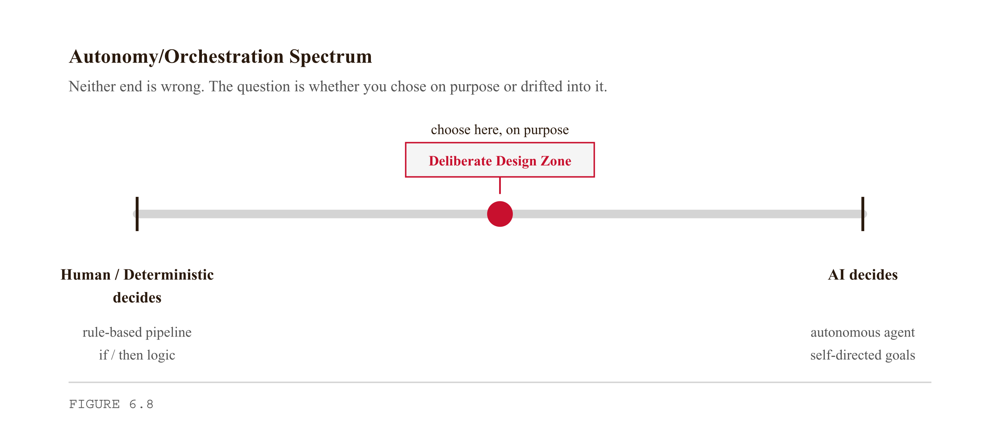
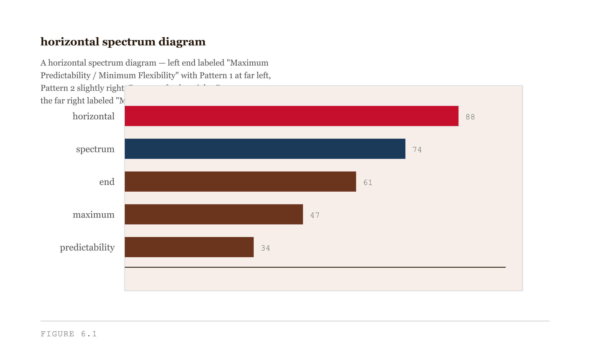
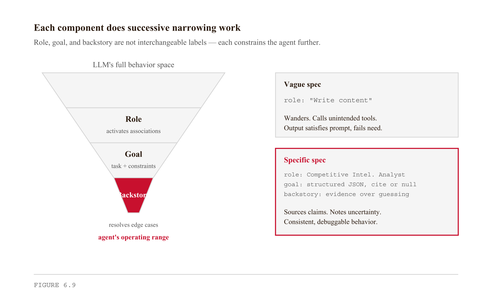
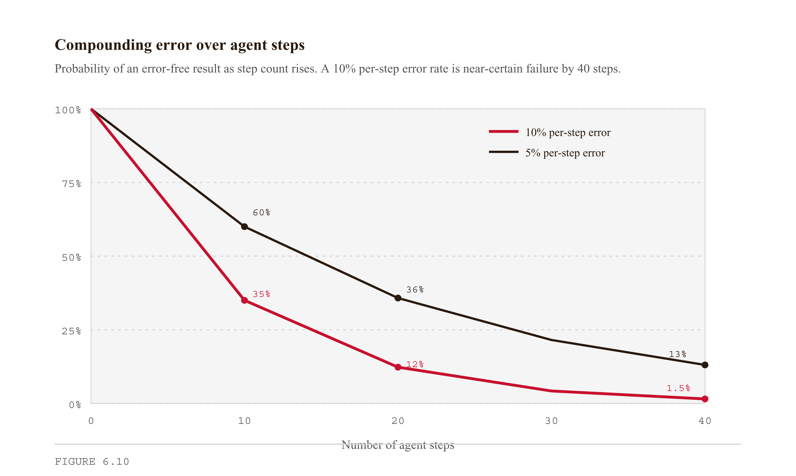
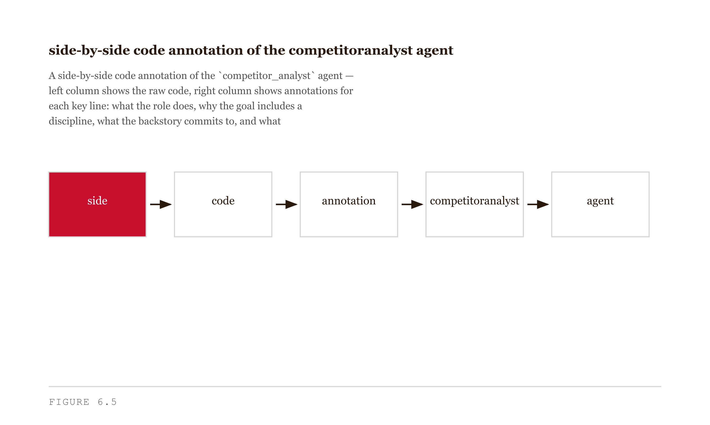
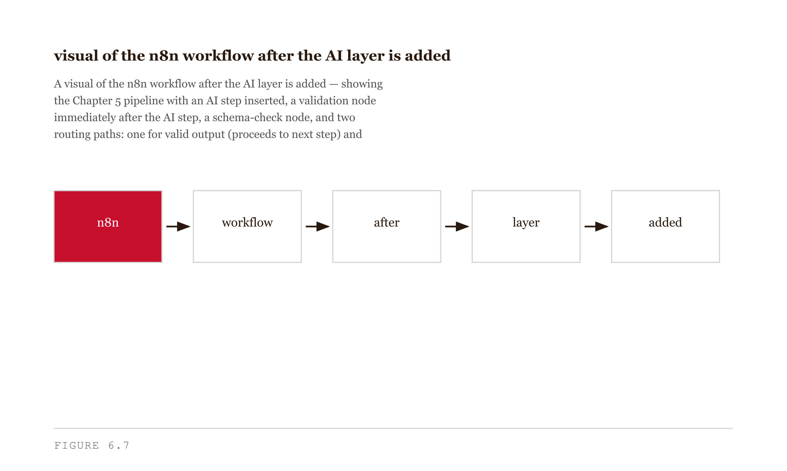

# Chapter 6 — AI Intelligence and Multi-Agent Systems
*The hardest design decision is not which model to use — it is where the AI decides and where it does not.*

> **TL;DR:** This chapter is about the hardest choice in adding AI to a product: where the AI gets to decide, and where a human must. It lays out four patterns of AI involvement, shows why that choice shapes what customers trust, what fails when systems run too autonomously, and how to write clear specifications for each AI role.
>
> | Section | Preview |
> |---|---|
> | Four Patterns of AI Intelligence | The four ways AI can sit in a workflow, from simple assistant to fully autonomous actor. |
> | Why Architecture Is the Brand Decision | How the placement of AI decisions shapes what customers can trust about the product. |
> | What Goes Wrong in the Autonomous Quadrant | The failure modes that appear when AI is allowed to act without human checkpoints. |
> | The Madison Agents as a Worked Case | How Madison divides AI work across roles to keep failures locatable. |
> | Writing Agent Specifications | How to specify an AI role's inputs, outputs, and limits so it can be built and tested. |
> | Building the AI Layer in Your Pipeline | Adding the AI step to the pipeline from the previous chapter. |
> | A Note on What Is Changing | Which parts of this advice are stable and which will shift as the tools evolve. |


---

Here is a question worth sitting with before we start building anything. Why did AutoGPT cost $80 and deliver nothing, while Cursor works reliably enough that professional developers trust it with production code?

Both systems use large language models. Both are trying to help with technical work. Both were built by smart people who understood the underlying technology. The difference is not the model — it is the architecture. Specifically, it is where in the workflow the AI makes decisions and where a deterministic system makes them instead. AutoGPT handed decision-making to the AI. Cursor keeps it with the developer. That single choice determines everything downstream: reliability, cost, debuggability, and what the user experiences when something goes wrong.

In Chapter 5 you built a pipeline. It fetches data, transforms it, stores it, maybe sends a notification. It does what you told it to do, every time, in the same order, without deviation. That predictability is valuable. It is also a ceiling. A rule-based pipeline cannot synthesize a research memo from forty web pages, or rewrite a resume bullet to match a job description, or read a competitor's press release and flag the two sentences that change your product strategy. Those tasks require judgment. This chapter is about adding judgment to your pipeline — more precisely, about choosing how much judgment to add, and where, and what you give up at each level of the dial. Your Chapter 3 archetype becomes directly relevant here: the architectural choice you make in this chapter is a brand commitment, not just a technical one, and the failure mode most likely to destroy your brand is the one that looks most like your archetype's shadow in code.


*Figure 6.8 — The autonomy/orchestration spectrum as a deliberate-design dial*

---

## Four Patterns of AI Intelligence

"Adding AI to a workflow" is not one thing. It covers at least four distinct patterns, each with a different risk profile, a different maintenance cost, and a different user experience. Treating them as interchangeable is the most common mistake in student projects, and the source of most agentic failures in production.

**Pattern 1 — Single LLM call.** Send a prompt, get a response. The workflow treats the LLM like an API — a function that takes a string and returns a string. The LLM has no memory of what came before, no ability to call tools, no ability to loop. This is the most predictable pattern. It is also the most constrained. Use it when the task can be fully specified in a single prompt and the output can be validated deterministically.

**Pattern 2 — Chained calls.** The output of one LLM call becomes the input to the next. A research-summary pipeline might chain: extract key facts from raw text, then group facts by theme, then write a summary paragraph for each theme, then assemble and edit. Each step is a separate LLM call. The overall sequence is deterministic — n8n decides the order — but each step introduces non-determinism. Errors at step 2 propagate to steps 3 and 4. Use this when the task has a natural decomposition into sequential sub-tasks and each sub-task's output can be inspected before the next step runs.

**Pattern 3 — Tool-using agent (ReAct).** The LLM reasons about what to do, calls a tool, observes the result, reasons again, and decides whether to call another tool or produce a final answer. The loop is controlled by the LLM, not by a workflow graph. This is the pattern underlying ChatGPT with plugins, Claude with tools, and early Devin. It is more flexible than chained calls — the agent adapts its behavior based on what it finds — but much harder to predict, debug, and cost-bound. Use this when the task requires genuinely adaptive reasoning and the space of sub-tasks cannot be fully enumerated in advance.

**Pattern 4 — Multi-agent system.** Multiple LLM-driven agents with specialized roles coordinate through an orchestrator or shared state. Each agent does one thing well; the orchestrator decides which agent runs when. This is the pattern underlying CrewAI, LangGraph, and Microsoft's AutoGen. It buys specialization and modularity at the cost of upfront design work. Use this when the task decomposes into genuinely distinct specializations and you need each to be independently debuggable and improvable.

<!-- → [TABLE: Four patterns — columns: name, who controls the next step, representative tools/products, best used when, primary failure mode — makes the trade-offs scannable] -->


*Figure 6.1 — The four patterns on the predictability/flexibility spectrum*

In your Chapter 5 pipeline, you already have Pattern 1 if you used an OpenAI or Claude node anywhere — a prompt in, a response out, the pipeline moves on. This chapter is about deciding when and whether to move toward Patterns 2, 3, or 4, and what you are actually buying at each step up.

Pattern 4 has its own internal spectrum. **Autonomous agents** give each agent the ability to decide its own next step within a goal — the user provides a high-level objective, the agents decompose it, plan sub-tasks, execute them, and loop until done. AutoGPT and BabyAGI operate this way. These systems are maximally flexible and, for exactly the same reason, maximally unpredictable. **Orchestrated multi-agent systems** let a workflow — a graph or state machine — decide which agent runs when; the agents do specialized work and the orchestrator handles flow control. CrewAI Flows and LangGraph operate this way. They require upfront design work and reward that investment with debuggability, cost-predictability, and consistent user experience. **Conversational multi-agent systems** have agents communicate with each other, often in a moderated conversation, until they collectively converge on a result — Microsoft AutoGen's original pattern. It sits between the other two: more structured than autonomous, less predictable than orchestrated.


*Figure 6.2 — Multi-agent architectures on the autonomy/orchestration grid*

Madison lives firmly in the orchestrated quadrant. The five layers — Intelligence, Content, Research, Experience, Performance — are specialized agents; the n8n orchestration layer decides which runs when. The user of a Madison-powered tool sees neither the agents nor the orchestrator. They request marketing intelligence; they receive marketing intelligence. The system's internal structure is invisible to them, by design.

One more thing about the four patterns before we move on, and it is worth naming precisely: the naming convention in agent specifications is not cosmetic. When CrewAI requires you to write a `role`, a `goal`, and a `backstory` for each agent, it is not asking for personality flourishes. It is forcing you to specify each agent's job clearly enough that the LLM can operate within it.

An agent without a clear role wanders. It interprets its task as broadly as possible, calls tools that were not intended for it, produces outputs that satisfy the prompt but fail the downstream requirement. This is not a failure of the LLM — it is a failure of the specification. The LLM does what it was told; if what it was told was vague, the result is vague. The titles — *Market Strategy Consultant*, *Competitive Intelligence Analyst*, *Customer Persona Analyst* — act as activation prompts. The LLM has training data that associates "Competitive Intelligence Analyst" with specific behaviors: sourcing claims, noting uncertainty, producing structured comparisons. The role primes that behavior. The goal and backstory narrow it further. This is one of the few cases where naming something correctly actually changes how it performs.


*Figure 6.9 — Role, goal, and backstory each narrow the LLM's behavior space*

---

## Why Architecture Is the Brand Decision

I want to revisit a claim from Chapter 3 because it lands hardest here. When you choose between an autonomous agent and an orchestrated multi-agent system, you are not making a purely technical decision. You are choosing what your product feels like. That feeling is the brand experience. The architectural choice and the archetype choice are not independent.

Consider two products built on identical underlying capability — the same model, the same data, the same general task (research assistance for marketing managers). Architecture A is autonomous: the user types a question, the agent decides what to search, reads what it finds, decides what to read next, and produces a report. The agent's reasoning trace is visible — the user watches it work. Architecture B is orchestrated: the user fills out a structured brief, a workflow runs five specialized agents in sequence, and the user sees a status indicator and eventually a finished report.

Same LLM. Same task. Wildly different brand experiences.

Architecture A's brand is *transparency*. When it works well, this feels collaborative and alive. When it fails — when the agent loops, gets confused, or returns something wrong — the failure is equally visible. Architecture B's brand is *competence*. When it works well, this feels professional and frictionless. When it fails, the failure is opaque: a missing report, an error message, no visible path to understanding why.

Neither is universally correct. A research-collaboration tool benefits from Architecture A — the user wants to direct the agent, to feel the collaboration happening. An enterprise reporting tool benefits from Architecture B — the user wants a deliverable, not a process. The choice is the brand decision.

<!-- → [FIGURE: Side-by-side user experience flows for Architecture A and B — shows how the same failure lands differently depending on transparency vs. opacity] -->

Now run the archetype check: *does my architecture express my archetype, or does it express my archetype's shadow?*

A Sage brand promises authoritative, trustworthy output. The Sage's shadow is dogmatism — the overconfident system that will not admit what it does not know. A Sage tool should probably favor Architecture B with explicit "I cannot verify" guards written into each agent's specification. The failure mode to watch for: a Sage tool that produces wrong answers with high confidence. That is the archetype's shadow in code.

A Creator brand amplifies originality. The Creator's shadow is perfectionism — the system so invested in its own process that it forgets the user's need. A Creator tool might genuinely benefit from Architecture A if the user is a creative professional who wants to direct the AI's exploration. The failure mode to watch for: a Creator tool whose visible process is more interesting than its output.

An Explorer brand is organized around discovery and autonomy. The Explorer's shadow is aimlessness — no destination, no coherent result. An Explorer tool is a high-risk candidate for Architecture A: the autonomy feels on-brand, but the agent that explores forever and delivers nothing is the Explorer's shadow in literal form. AutoGPT was, implicitly, an Explorer brand with an unmanaged shadow.

<!-- → [TABLE: Partial archetype-architecture mapping — columns: archetype, recommended architecture tendency, shadow expressed as AI failure mode, what to watch for in production] -->

The Cursor/Devin distinction maps onto this directly. Cursor augments: the developer is in the loop, the IDE suggests, the control loop is tight, and when Cursor produces bad code the developer sees it immediately and corrects it. The failure surface is small and the cost of failure is low. Devin automates: the developer hands off a task and waits, the control loop is loose, and when Devin produces a bad approach the failure may be discovered after significant downstream work has been built on a bad foundation. Neither mode is wrong. But you need to know which one you are building. A tool that augments should be architected for tight feedback loops. A tool that automates should be architected for reliability — every step validated before the next step runs, and the system failing loudly and locally when something goes wrong.

---

## What Goes Wrong in the Autonomous Quadrant

The 2023 AutoGPT wave gave the AI community a large and public dataset of autonomous-agent failure. The failures were not random. They cluster into three patterns, each with a specific mechanism.

**Compounding error.** An autonomous agent's step N is conditioned on step N−1. If step N−1 was wrong — if the agent retrieved the wrong information, made a false inference, or misunderstood the task — then step N is built on a false foundation. The agent has no mechanism to notice this unless it explicitly checks its own work, and most autonomous agents do not check their own work by default. They check whether a step *completed*, not whether it *was correct*.

Errors compound geometrically. A 10% error rate at each step means that after ten steps, the probability of an error-free chain is 0.9^10 ≈ 35%. After twenty steps, about 12%. An agent that takes forty steps — well within the AutoGPT range — has approximately a 1.5% chance of producing a fully correct result. This is not a failure of the underlying model. It is a failure of the architecture. A chained or orchestrated system can insert validation steps between each LLM call, checking that the output meets a structural requirement before passing it to the next step. An autonomous agent, by definition, does not have a higher-level system performing that check.


*Figure 6.10 — Compounding error: even modest per-step error rates make long chains fail*

**Cost runaway.** Each step in an autonomous agent calls a model. Each call costs money. An agent without a hard step ceiling can make arbitrarily many calls in pursuit of a goal it cannot reach or cannot recognize as reached. The $80 AutoGPT sessions delivering nothing are the canonical examples. The mechanism is simple: the agent has no budget constraint, and no mechanism to recognize that it is not converging on a useful result. Production systems require three controls that early autonomous frameworks did not install by default: a maximum step count, a per-execution cost ceiling, and a circuit breaker that halts the agent if it has called the same tool with the same inputs more than N times. These are not sophisticated engineering. They are basic hygiene.

**Trust collapse on visible failure.** This is the brand failure that the technical failure modes enable. A user who watches an autonomous agent loop for forty minutes and produce nothing has not merely experienced a technical failure. They have watched the brand fail in real time, in front of them, with their money on the meter. Research on user trust in automation systems consistently shows that visible failure is more damaging to long-term trust than opaque failure, particularly when the user has been told to trust the system. Architecture A's transparency is a high-trust deposit on a non-fungible asset. The 2023 AutoGPT failure wave did not just hurt AutoGPT — it made users cautious about autonomous agents as a category. The failure distributed across the brand landscape of every product that used the word "autonomous."

The orchestrated quadrant trades these failure modes for different ones. **Rigidity**: the system can only do what the orchestrator was told it can do. A user request that does not fit any pre-defined flow is an edge case the system handles badly. **Hidden failures**: when something goes wrong, the user does not see why. The developer needs to maintain log visibility into intermediate steps, because the user sees only that the report is wrong, not which agent produced the bad intermediate output. **Specification cost**: each agent must be designed — named, role-defined, goal-specified, tooled, guarded. This is the price of predictability, and also the thing that makes the system improvable. A specific agent producing bad output is a specific thing to fix, rather than a diffuse tendency of a self-directing system to wander.

There is no architecture that wins on every dimension. The disciplined engineer chooses where on the spectrum the product should sit and designs each failure mode *on purpose*.

<!-- → [TABLE: Trade-off comparison — autonomous agents, orchestrated multi-agent, chained calls — rows: predictability, debugging surface, specification cost, failure visibility, cost control] -->

---

## The Madison Agents as a Worked Case

Open `pantry/madison/MarketMind/Code/agents.py`. The file contains a class called `MarketResearchAgents` with methods like `strategy_consultant()`, `competitor_analyst()`, and `customer_persona_analyst()`. Each method returns a CrewAI `Agent` object. Here is the `competitor_analyst`:

```python
def competitor_analyst(self):
    return Agent(
        role="Competitive Intelligence Analyst",
        goal=(
            "Find and summarize competitor info cautiously. Return structured JSON. "
            "If you cannot verify a data point, set it null and explain limitations."
        ),
        backstory="Expert in competitive intelligence. Prefers evidence and transparency over guessing.",
        tools=self._tools(["search", "scrape", "fallback"]),
        allow_delegation=False,
        verbose=False,
    )
```

Eight lines. Three things are happening that are worth naming precisely.

**The `goal` contains a discipline, not just a task.** "Set it null and explain limitations" is an anti-hallucination instruction built directly into the agent's specification. The Madison authors knew that agents fabricate when pushed toward uncertain territory; they wrote the constraint into the goal rather than hoping the model would self-impose it. This is the right instinct. Anti-hallucination guards placed inside the prompt are more reliable than guards placed in a separate validation step, because the agent applies them before generating the output rather than after.

**The `backstory` is a personality and a brand commitment simultaneously.** "Prefers evidence and transparency over guessing" tells the LLM how to resolve ambiguous situations — and tells any future developer reading this code what kind of intelligence Madison promises its users. The backstory is documentation as much as it is a prompt. If this agent starts producing overconfident outputs, the backstory is the first place to look: either the framing drifted, or the model changed, or both.

**`allow_delegation=False` is the orchestration commitment in code.** This agent cannot hand off to other agents. It does its job and returns. The orchestration layer — not the agent — decides what happens next. This single parameter is the architectural choice that separates Madison's approach from AutoGPT's. AutoGPT agents could spawn sub-agents, set new goals, redirect their own work. Madison agents cannot. They execute and report.


*Figure 6.5 — Annotated competitor_analyst agent specification*

When this architecture fails, it fails locally. One agent's output is wrong — a structured JSON field is null, a competitor's market share is labeled "unverifiable" — and the developer can trace the failure to a specific agent, a specific tool call, a specific input. Compare to AutoGPT's failure mode: the agent wandered, the error is distributed across forty steps, the debugging surface is the entire execution trace. Local failure is the architectural reward for orchestration's specification cost.

---

## Writing Agent Specifications

An agent specification is the contract between the designer and the LLM. It answers four questions: who is this agent, what is it trying to accomplish and under what constraints, what are its instincts when resolving ambiguity, and what tools can it use?

Each component does different work. The role activates the LLM's training-data associations. The goal narrows the task and encodes the constraints. The backstory is the tie-breaker for edge cases the goal did not anticipate. The tools define the boundary between what this agent does and what a different agent or a different system does. A complete specification uses all four. An incomplete specification — a goal without a backstory, a role without constraints — produces an agent that behaves well on easy inputs and strangely on hard ones.

Every agent specification needs an anti-hallucination layer. LLMs hallucinate under uncertainty — they produce confident-sounding text in response to prompts that cannot be reliably answered. There are three patterns for preventing this, from weakest to strongest.

**Pattern 1 — Permission to abstain.** Add to the goal: *"If you cannot verify a claim with the information provided or your search results, say 'I cannot verify this' rather than guessing."* This gives the LLM explicit permission to produce an incomplete answer. Most prompts implicitly reward completeness, so the instruction is counterintuitive — and necessary.

**Pattern 2 — Structured output with null fields.** Require JSON output with a defined schema. Fields that cannot be confidently populated are set to `null` with an explanatory `note` field. This makes incompleteness explicit and machine-readable. Downstream steps can check for null fields and handle them — escalate to a human, trigger a different search, flag the output for review — rather than passing fabricated data further down the chain.

**Pattern 3 — Confidence labeling.** Require the agent to label each claim: `verified`, `inferred`, or `unverifiable`. More informative than null fields, but more work to implement. The downstream system knows not just that a field was uncertain, but how uncertain, and why.

<!-- → [FIGURE: Three versions of the same agent output — Pattern 1 (abstain), Pattern 2 (null fields), Pattern 3 (confidence labeling) — the value of each pattern becomes visible when information is unavailable] -->

For most student projects, Pattern 2 is the right starting point.

Here is a complete specification for the core research agent in a Sage-archetype newsletter tool about climate technology. The archetype's shadow is dogmatism — the tool that produces wrong answers with high confidence — so every component of this specification is aimed at preventing exactly that:

```python
Agent(
    role="Climate Technology Research Analyst",
    goal=(
        "Summarize peer-reviewed research and credible industry sources on the topic provided. "
        "Return a structured JSON with fields: summary (2-3 sentences), key_findings (list of 3-5), "
        "sources (list of URLs or DOIs), confidence (verified | inferred | unverifiable for each finding). "
        "Do not include findings you cannot attribute to a specific source. "
        "If a topic is outside your search results, say so — do not infer from general knowledge."
    ),
    backstory=(
        "A researcher trained in evidence-based communication. Prefers precision over comprehensiveness. "
        "When forced to choose between an interesting claim and a verifiable one, always chooses verifiable. "
        "Never rounds up."
    ),
    tools=["search", "fetch_url", "extract_text"],
    allow_delegation=False,
)
```

Walk through each component. The role activates climate-specific knowledge associations and signals that the agent is operating in an evidence-based professional context. The goal specifies the output schema, the required fields, the confidence-labeling requirement, and two explicit anti-hallucination instructions: do not include unattributed findings, and do not infer from general knowledge when search results are empty. Both instructions address the Sage shadow directly — they prevent the agent from producing high-confidence wrong answers. The backstory's key phrase is "Never rounds up." It tells the LLM that in a conflict between a complete-looking answer and an honest one, honesty wins. The goal cannot enumerate every edge case; the backstory provides the principle for resolving them. The tools are constrained to three: search, URL fetching, text extraction. No writing or synthesis tool — this agent's job is research. Synthesis is a different agent's job.

This specification will not eliminate hallucination. No specification does. But it will surface uncertainty visibly, in structured form, so that downstream steps can handle it rather than propagate it.

---

## Building the AI Layer in Your Pipeline

Before writing any code or configuring any n8n node, make the architectural decision explicitly. Write it down. One of these four:

*"This pipeline uses a single LLM call to [task], because the task can be fully specified in one prompt and the output can be validated against [criteria]."*

*"This pipeline uses chained calls to [task], because the task has [N] natural sequential sub-steps and I need to validate the output at step [K] before proceeding."*

*"This pipeline uses a tool-using agent to [task], because the task requires adaptive reasoning and I cannot enumerate the sub-steps in advance. Step ceiling: [N]. Cost ceiling: [dollar amount] per execution."*

*"This pipeline uses a multi-agent system with [N] agents to [task], because the task decomposes into [role 1], [role 2], and [role 3] and I need each to be independently debuggable."*

The form of the statement matters less than the act of making it. A student who has written down their architectural choice before building has something to evaluate against when the system behaves unexpectedly. A student who drifted into an architecture has nothing to evaluate against.

<!-- → [TABLE: Decision statement to consequence map — four rows (single call, chained, tool-using, multi-agent), columns: statement template, what it enables in Chapter 7, failure mode to mitigate] -->

With the decision made, the build sequence is six tasks. Pick your pattern — when in doubt, choose the simpler one and add complexity only when you hit its ceiling. Write the specification for each LLM call or agent, including anti-hallucination guards in the goal, not as a separate step. Wire the AI step into n8n, passing only the context this step needs — the context window is not a dumping ground. Add anti-hallucination guards: minimum viable is structured JSON with null fields; better is a validation node after each LLM call that routes to an error handler when the schema is invalid. Set step and cost ceilings as hard stops, not aspirational limits — an agent that exceeds the step ceiling should fail loudly and visibly. Finally, stress-test for your specific failure mode: design a test input that triggers it, observe the failure, add one mitigation, and run the test again.

The reference implementation is the n8n workflow in `pantry/madison/Intelligence-Agent/n8n_workflow.json`. Look at it before building your own and notice two things. The AI calls are surrounded by data-handling steps: a fetch step prepares the input, the AI call processes it, a format step normalizes the output, a write step stores it. The AI node is embedded in a sequence of deterministic neighbors, not floating in isolation. And each AI step has a defined output format: Madison's Intelligence Agent does not accept free-text LLM output and pass it downstream. When structure validation fails, the workflow routes to an error handler, not to the next processing step. The error is surfaced, not propagated.

These two patterns — wrapping AI steps in deterministic neighbors, and validating AI output before downstream use — are the minimum viable discipline for production AI pipelines. They apply regardless of which pattern you chose.


*Figure 6.7 — The Chapter 5 pipeline with the AI layer added and surrounded by deterministic steps*

---

## A Note on What Is Changing

I should be honest about this chapter's expiration date.

The failure modes I described are accurate as of this writing. Autonomous agents in 2024 do compound errors, do run over budget, do collapse user trust on visible failure. The evidence for orchestration's superiority on production-reliability metrics is strong. But the autonomous-agent quadrant is improving. Modern frameworks — AgentQ, ReAct with reflection, AutoGPT 0.5 — include better memory, better goal-tracking, and better self-correction. The per-step error rates are coming down. Cost-runaway is increasingly handled by default in framework tooling.

By 2027 or 2028, the failure modes I described may be substantially mitigated. If they are, the architecture choice will shift. The current evidence still supports orchestration for production reliability. When autonomous agents outperform orchestrated ones on uptime, cost predictability, and time-to-recovery, the chapter's recommendation changes with it.

**What would change my mind:** A benchmark showing autonomous agents outperforming orchestrated multi-agent systems on production-reliability metrics. I would update on the evidence.

**Still puzzling:** The exact set of tasks for which autonomous agents are *already* better than orchestrated ones. The honest answer is "creative exploration tasks where the user does not know the right next step in advance" — but that domain is hard to specify precisely, and most students who try to identify it in their own projects guess wrong about whether their use case really needs autonomy. I do not yet have a clean teaching rule for distinguishing the two, and I would not trust anyone who claims they do.

---

## Summary

Here is what you can now do that you could not at the start of this chapter.

You can look at any AI system and name its pattern: single call, chained, tool-using, or multi-agent. You can identify where it sits on the autonomy/orchestration spectrum and explain what it traded to get there.

You can write a complete agent specification — role, goal, backstory, tools — that constrains an LLM to a defined scope and builds anti-hallucination guards into the specification itself, not as afterthoughts. You can choose the right anti-hallucination pattern for your use case: abstention, null fields, or confidence labeling.

You can explain, using Chapter 3's vocabulary, why the autonomy/orchestration choice is a brand decision. You can run the check: does your architecture express your archetype, or does it express your archetype's shadow?

You can diagnose the three failure modes of autonomous agents — compounding error, cost runaway, and trust collapse — and identify which is most likely for your specific architecture. You can design a mitigation before the failure happens rather than after.

**The one idea that matters most:** Adding AI to a pipeline is not about the model. It is about where in the workflow the AI decides and where a deterministic system decides. That boundary determines reliability, debuggability, cost-predictability, and user experience simultaneously. It is also a brand commitment.

**The common mistake:** Reaching for Pattern 4 when Pattern 2 would suffice. Multi-agent systems are more impressive to demo and more expensive to build, debug, and maintain. Most student projects that fail in this chapter fail because they over-architected the AI layer.

**The Feynman test:** Sit down with a friend who has used ChatGPT but never thought about AI architecture. Explain, using the autonomy/orchestration spectrum, why AutoGPT cost $80 and delivered nothing, and why Cursor works reliably. If you can do that in under three minutes, you have the chapter.

---

## Connections Forward

Chapter 7 is about interface design — the visible layer that users interact with. Everything you built in Chapters 5 and 6 is infrastructure. Chapter 7 is what the user sees.

The connection is direct: the architecture you chose in this chapter determines what interface elements are available to you. An orchestrated system with opaque intermediate steps needs a different interface than a tool-using agent with a visible reasoning trace. A pipeline with structured JSON output can power a formatted dashboard; a pipeline with free-text output cannot.

Before Chapter 7, carry one question forward: *What does my user need to see, and what does my architecture currently make visible?* The gap between those two is your interface design problem.

---

## Exercises

### Warm-Up

**W1. Pattern Identification**
For each of the following systems, name the AI-intelligence pattern (single call, chained calls, tool-using agent, multi-agent) and give one piece of evidence for your answer:

- A grammar checker that takes a paragraph and returns a corrected version.
- A travel-planning assistant that asks clarifying questions, searches flights, reads hotel reviews, and produces an itinerary.
- A content pipeline that extracts topics from a blog post, generates three headline options for each topic, scores them for clarity, and selects the top headline.
- A coding assistant that receives a bug report, reads the relevant source files, runs the tests, proposes a fix, and opens a pull request.

*Tests Objective 1. Difficulty: Low.*

**W2. Failure Mode Matching**
For each scenario below, name the failure mode (compounding error, cost runaway, or trust collapse) and explain the mechanism by which the failure occurred:

- A user watches an autonomous agent research a topic for ninety minutes, spending $140, without producing a usable output. The agent's final response confidently summarizes research it fabricated because it could not find primary sources.
- A user sees an autonomous agent correctly identify three competitors, then misattribute a product feature from Competitor A to Competitor B. The agent's subsequent steps treat the misattribution as established fact and build a market analysis on top of it.
- A user's first session with a new autonomous research tool results in a wrong answer delivered confidently. The user does not use the tool again.

*Tests Objective 5. Difficulty: Low.*

**W3. Specification Review**
Read the following incomplete agent specification and identify what is missing. Explain why each missing element matters.

```python
Agent(
    role="Email Writer",
    goal="Write a professional email based on the information provided.",
    tools=["send_email"],
)
```

*Tests Objective 3. Difficulty: Low–Medium.*

---

### Application

**A1. Agent Specification — Full Build**
Write a complete agent specification for one agent in your Chapter 5 pipeline. Include: role, goal (with at least one anti-hallucination instruction), backstory (with at least one tie-breaker principle), tools (with a rationale for each tool included and each tool excluded), and `allow_delegation` setting with justification.

*Tests Objective 3. Difficulty: Medium.*

**A2. Architecture-Archetype Alignment Check**
For your tool's committed archetype (from Chapter 3), write a one-page analysis that answers three questions: which AI-intelligence pattern does your archetype recommend, and why; what is your archetype's shadow, expressed as an AI-system failure mode; and is your current architectural choice in alignment with your archetype, or is it expressing the shadow — and what would you change?

*Tests Objectives 2 and 4. Difficulty: Medium.*

**A3. Anti-Hallucination Guard Comparison**
Take one factual research task relevant to your tool. Write three versions of the agent goal — one using Pattern 1 (abstention), one using Pattern 2 (null fields), and one using Pattern 3 (confidence labeling). Run each version against the same test input using a real LLM. Compare the outputs: which pattern produced the most useful response when the information was available? When it was not?

*Tests Objectives 3 and 5. Difficulty: Medium–High.*

**A4. Pipeline Integration**
Add an AI intelligence layer to your Chapter 5 n8n pipeline. Document your architectural decision statement in your project README. Run the pipeline on three inputs — one easy, one medium, one deliberately weird — and record what happened.

*Tests Objective 6. Difficulty: Medium–High.*

---

### Synthesis

**S1. Failure Mode Design**
Choose the AI-intelligence pattern you built in A4. Identify its most likely failure mode. Design a test input that will trigger it (not a random edge case — a targeted probe of the weakness you predicted). Run the test, observe the failure, add one mitigation, run the test again. Write a one-page post-mortem: what failed, why, what the mitigation does, and whether it worked.

*Tests Objective 5. Difficulty: High.*

**S2. Orchestration Decision Memo**
A potential investor asks: "Why did you choose your architecture instead of the alternative?" Write a 400-word memo that answers this honestly — not as a pitch, but as a technical and brand argument. Name the trade-offs you accepted, the failure modes you designed for, and how the architectural choice expresses your archetype.

*Tests Objectives 2, 4, and 5. Difficulty: High.*

**S3. Cross-Chapter Architecture Audit**
For each of the five AI-intelligence architectures from the first section: name one real product that uses it, identify that product's archetype, and assess whether the architecture matches the archetype. Are there any mismatches? Is the mismatch causing the product's most visible failure mode?

*Tests Objectives 1, 2, and 4. Difficulty: High.*

---

### Challenge

**C1. Autonomous Agent Rehabilitation**
The chapter argues that orchestrated multi-agent systems are currently superior to autonomous agents on production-reliability metrics. Identify a task domain where you believe this argument is weakest — where autonomous agents are, *right now*, the better architectural choice. Make the strongest case you can. Your argument should include: why predictability matters less for this task than for others, how the three failure modes are mitigated by the task's structure, and what evidence would confirm or disconfirm your claim.

*Tests Objectives 1, 2, and 5, and challenges the chapter's stated preference. Difficulty: Very High.*

**C2. The 2027 Architecture**
If autonomous-agent failure modes are substantially mitigated by 2027 — as the chapter predicts is possible — what changes about the architecture-as-brand-decision argument? Does the choice between autonomous and orchestrated systems become less consequential as a brand expression, or does it remain consequential for different reasons? Write a 500-word analysis of how the trade-off changes if autonomous agents achieve parity with orchestrated systems on production-reliability metrics.

*Tests all objectives and the chapter's own temporal claims. Difficulty: Very High.*

---

## Stress-Test Your Agent

Before Chapter 7:

1. Run your AI-intelligence layer end-to-end on three different inputs — one easy, one medium, one deliberately weird or adversarial.
2. Observe the failure mode. Did it hallucinate? Loop? Miss a step? Run over budget? Refuse a valid request? Produce wrong output with high confidence?
3. Add one mitigation for the failure you observed. Document it in your project README. Name the failure mode it addresses and the mechanism by which it addresses it.
4. Run the same three inputs again. Observe whether the mitigation worked. If it did not, document why and what a second attempt would require.

Bring the mitigated workflow to Chapter 7, where the interface design layer goes on top of what you have built.

---

## LLM Exercise — Self-as-Project

**Project:** Self-as-Project (will spawn three sub-Projects)
**What you're building this chapter:** A working **Career Search Assistant** — three specialized Claude Projects with custom instructions that automate the most repetitive parts of your search.
**Tool:** Claude Projects (a NEW one for each Assistant) + Claude chat for testing.

**The Prompt:**

```
Design an AI assistant system to support my job search. Use Chapter 6's autonomy/orchestration framework.

I want THREE specialized assistants, not one mega-assistant. Each is a Claude Project with its own custom instructions. The orchestration is me — I send the right work to the right Project.

For each of the three, write:
1. The Project name
2. The Custom Instructions (system prompt) — paste-ready, ready to drop into Claude's "Custom Instructions" field
3. The kind of work I send it
4. Three example messages I might send it
5. The anti-hallucination guards built into its instructions

The three assistants:

ASSISTANT 1 — Application Drafter. Takes a job description + my Career PRD + the role description and produces a tailored resume bullet rewrite, a cover note, and a LinkedIn outreach message to anyone I know at the company.

ASSISTANT 2 — Interview Researcher. Takes a company name and produces: their recent funding/news, their published technical posts, their CEO's last 3 interviews, the team I'd join, intelligent questions I should ask. Forces "I cannot verify" labels on anything not in its training data and not provided by me.

ASSISTANT 3 — Reflection Coach. After every interview or networking conversation, I drop in my notes. The Coach asks me 3 sharp questions about what happened, what I noticed, what I would change next time. Forces specificity. No "great job!" affirmations.

For each assistant, the custom instructions should:
- Reference my archetype (so the voice stays consistent)
- Use my Career PRD as the filter for in-scope/out-of-scope work
- Include explicit instructions about NOT inventing things
- Include explicit instructions about pushing back on weak input

Output a Markdown document called "Career Search Assistants — [my name]" containing all three Project names, their full custom instructions ready to paste, the example messages, and a one-paragraph "how I orchestrate them" section explaining the workflow between them.
```

**What this produces:** Three deployed Claude Projects (after you paste the custom instructions in) plus the orchestration logic. This is the most immediately useful artifact of the semester for an active job search.

**How to adapt:** Add or remove assistants based on your career stage. A senior engineer might want a Negotiation Assistant; a career-changer might want a Translation Assistant. For ChatGPT or Gemini, replace "Claude Project" with "Custom GPT" or "Gem."

**Preview of next chapter:** Chapter 7 audits all the *interfaces* between you and the world — LinkedIn, GitHub, email signature, resume PDF — for alignment with what you're actually offering.

---

## AI Wayback Machine

The ideas in this chapter didn't appear from nowhere. **Herbert Simon** spent five decades arguing that intelligent action — by humans, by organizations, by machines — is what *bounded rationality* allows under real constraints of attention, time, and computation. His 1969 *The Sciences of the Artificial* is the foundational text on designing systems whose intelligence is distributed across specialized parts that cooperate. The Madison framework's five-agent architecture is in that lineage: no single agent is general-purpose; each is bounded to a competence; their cooperation is the system's intelligence. Simon also predicted, in 1965, that machines would be capable of doing any work a human could do within twenty years — a prediction the field is still arguing about. The chapter's caution — that multi-agent does not mean omni-agent — is Simon's caution.


*Herbert A. Simon, c. 1970s. AI-generated portrait based on a public domain photograph.*

**Run this:**

```
Who was Herbert Simon, and how do his concepts of *bounded rationality* and *near-decomposability* connect to the design of multi-agent AI systems where each agent is deliberately specialized rather than general-purpose? Keep it to three paragraphs. End with the single most surprising thing about his career or ideas.
```

→ Search **"Herbert A. Simon"** on Wikipedia after you run this. See what the model got right, got wrong, or left out.

**Now make the prompt better.** Try one of these:

- Ask it to explain *bounded rationality* in plain language, as if you've never read decision theory
- Ask it to compare Simon's near-decomposability argument to the role split across the five Madison agents
- Add a constraint: "Answer as if you're writing the design rationale for why your multi-agent system has five roles instead of one general agent"

What changes? What gets better? What gets worse?

---

---

## AI+1 — Self-as-Project on Madison

**Project:** Self-as-Project — *your brand, end to end*
**This chapter adds:** an orchestrated multi-agent intelligence run over your pipeline — and an explicit map of where the AI decides and where it does not.
**Madison recipes:** [`madison-marketing-intelligence-orchestrator`](../madison/recipes/madison-marketing-intelligence-orchestrator.md), [`intelligence-agent`](../madison/recipes/intelligence-agent.md)

> The hard decision is *where the AI decides and where it does not* (this chapter's thesis). You draw that line; Madison orchestrates the rest.

### Exercise 1 — When to Use AI
- *Draft the orchestration graph wiring your Ch 5 monitors to an intelligence summary.* **Why it works:** drafting structure.
- *Reformat raw monitor output into a daily brief.* **Why it works:** summarization of inputs you can check.
- *Spot redundant or conflicting agent outputs.* **Why it works:** pattern-spotting you adjudicate.

**Tell:** you can trace any brief line back to a source the agent cited.

### Exercise 2 — When NOT to Use AI
- *Deciding which steps run autonomously vs. human-gated.* **Why it fails:** the chapter's central design judgment.
- *Acting on a brief without checking provenance.* **Why it fails:** orchestration can launder an unverified input into a confident summary.
- *Letting the orchestrator pick your brand priorities.* **Why it fails:** priorities are strategy, not output.

**Tell:** you've crossed the line when you can't say which agent produced a claim.
**Series connection:** trains the decide/automate boundary.

### Exercise 3 — Recipe Exercise
**Build:** a daily brand-intelligence brief with provenance. **Run:** [`madison-marketing-intelligence-orchestrator`](../madison/recipes/madison-marketing-intelligence-orchestrator.md) over your Ch 5 pipeline output. **Tool:** Claude Project.

```
Using the Madison orchestrator recipe approach, turn my Ch 5 sample signal output
(below) into a one-page daily brief. For every line in the brief, cite which agent/
source produced it. Mark any step you recommend running autonomously vs.
human-gated, with a one-line reason. Carry no claim that lacks a cited source.

Signal output:
[PASTE]
```
**Adapt:** add the `intelligence-agent` for a single deep dive when one signal needs investigation.

### Exercise 4 — CLI Exercise
**Build:** `your-brand/daily-brief.md` from a sample run. **Tool:** [`wrap-your-tool`](../madison/wrap-your-tool/) or Claude Code.

```
From your-brand/sample-signals.json, write your-brand/daily-brief.md: ≤7 bullets,
each with a [source] tag, plus an "autonomy map" table (step | autonomous or
human-gated | why). Drop any bullet without a traceable source. No network calls.
Stop after writing the file.
```
**Inspect:** every bullet is source-tagged; the autonomy map has at least one human gate.
**If it goes wrong:** the orchestrator merges sources into an unattributable claim — reject untraceable bullets.

### Exercise 5 — AI Validation Exercise
**Validate:** the brief + autonomy map. Pass / Fail / Cannot-determine + evidence:
- **Correctness:** is every brief line traceable to a named source?
- **Completeness:** brief + autonomy map both present?
- **Scope:** intelligence only — no decisions executed?
- **Brand-specific:** do the human-gated steps match where brand accountability lives?
- **Failure-mode (laundered input):** pick one bullet — follow it back to the raw item. Does it survive?

*Tags: multi-agent · CrewAI · AutoGPT · agent-architecture · orchestrated-vs-autonomous · madison-marketmind · production-reliability · INFO-7375*
