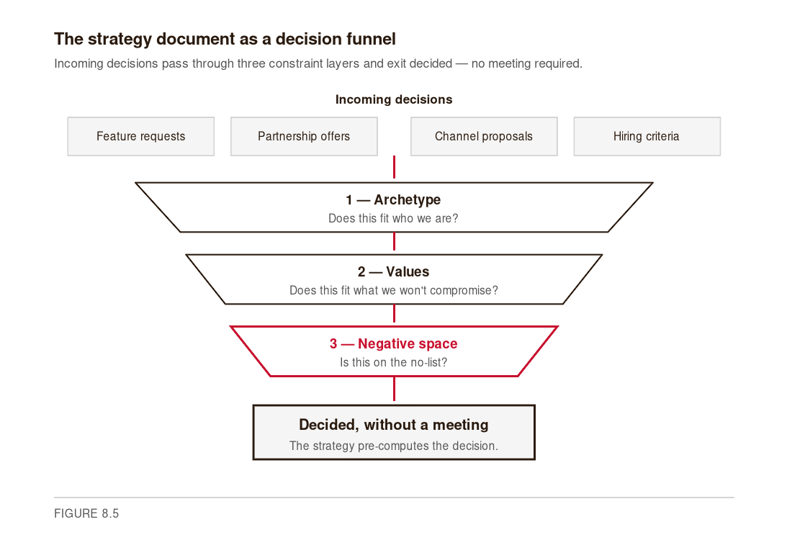
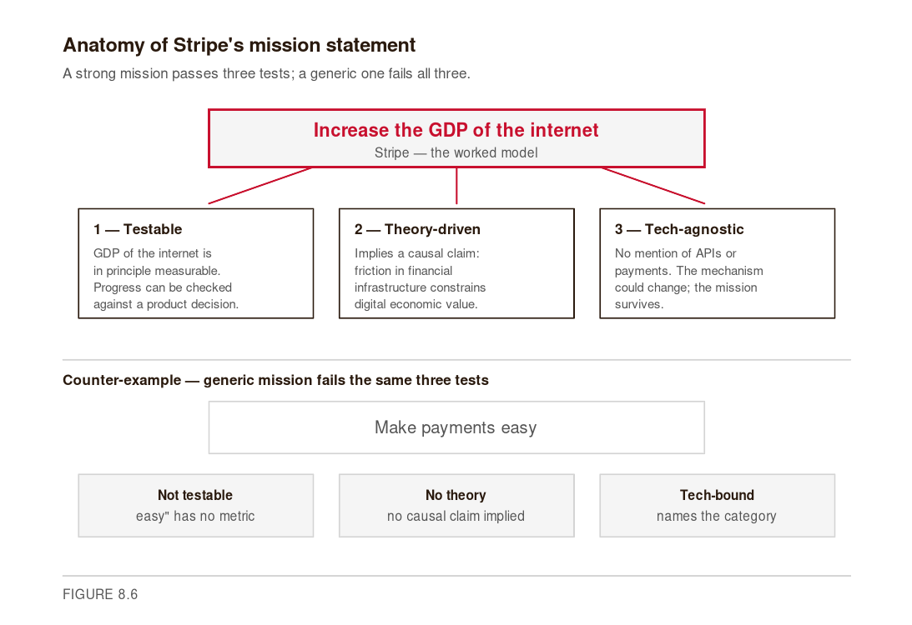
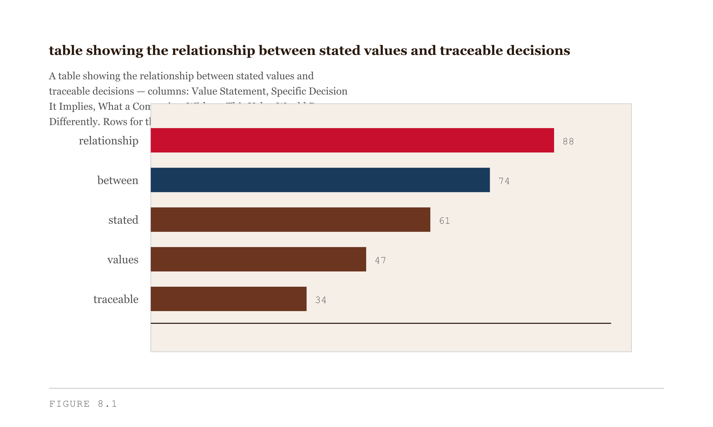
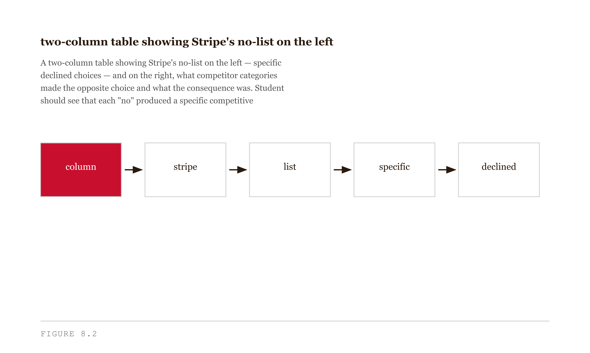
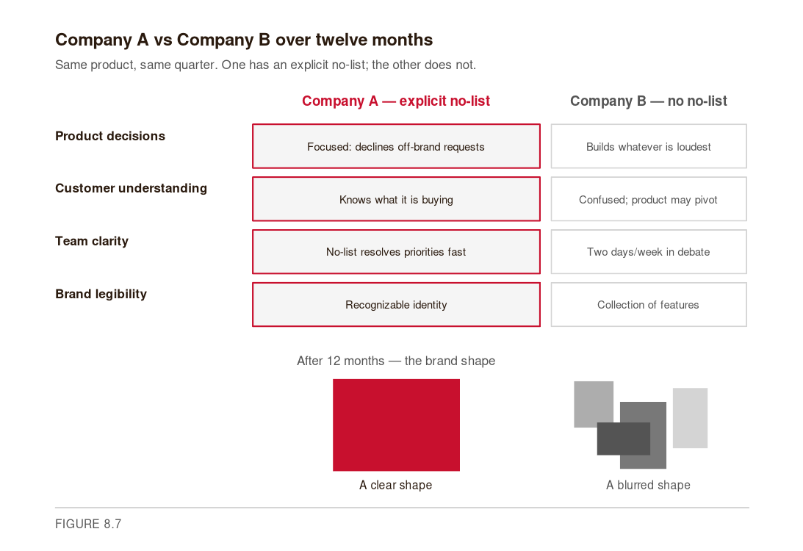
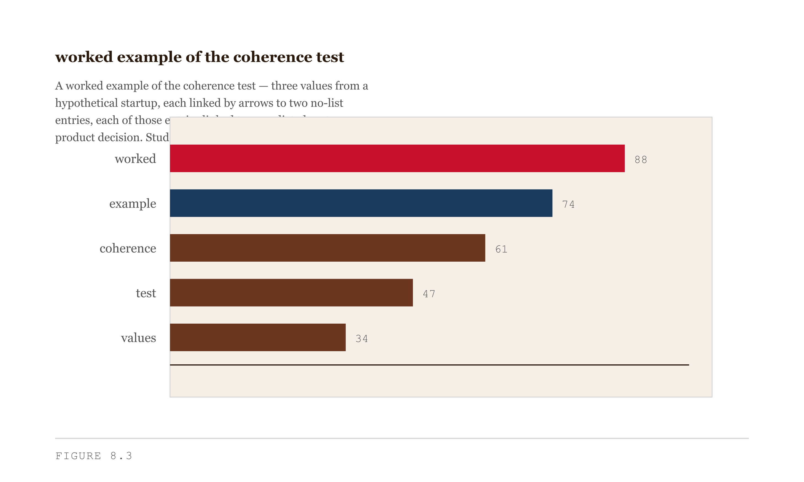
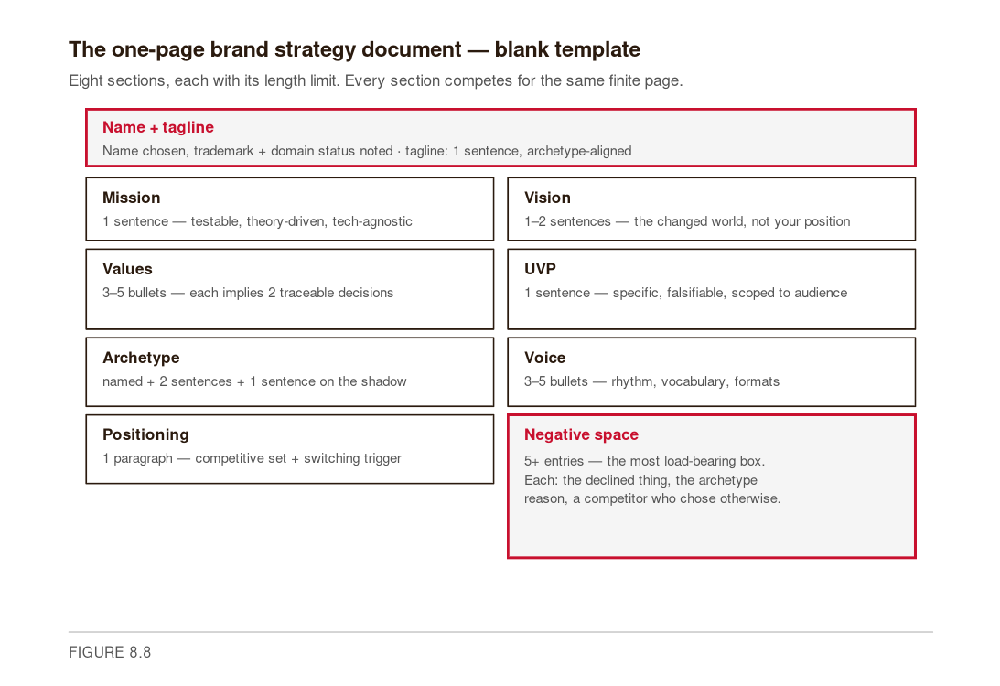
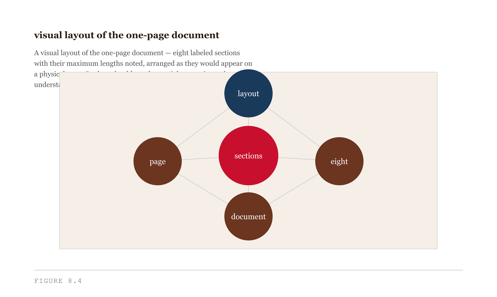
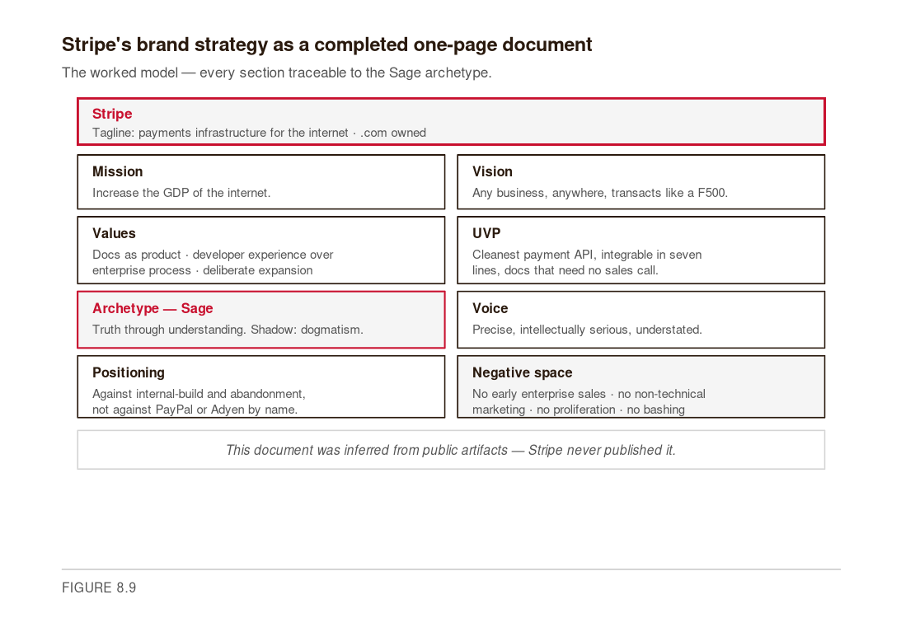

# Chapter 8 (Startup Brand Path) — Brand Strategy
*A startup brand is not what your company builds. It is what your company consistently declines to build.*

---

Here is a thought experiment. Suppose two companies ship identical products in the same quarter. Company A has an explicit no-list: they will not serve enterprise customers, will not build a mobile app in v1, will not market through influencer channels. Company B has no explicit no-list; they serve whoever asks, build whatever their loudest customer requests, and market in whatever channel seems available.

After twelve months, Company A's customers know what they are buying. Company B's customers are confused — every interaction with the product might be the last, because the product might have pivoted. Company A's team knows what to build. Company B's team spends two days per week in prioritization debates that the no-list would have resolved in five minutes.

The no-list is not a limitation. It is the mechanism that converts a set of product decisions into a recognizable brand. That is the argument this chapter makes, and it is a specific enough claim that you can test it against the cases.

The immediate objection is that brand strategy sounds like a large-company exercise — something you do after you have found product-market fit, raised a B round, and hired a CMO. The objection is wrong, and the reason it is wrong is timing. A company without explicit brand decisions makes those decisions anyway — inconsistently, by committee, under pressure, one at a time. The decisions compound. By the time the inconsistency is visible to customers, it has been baked into the product for two years. The one-page strategy document you will write at the end of this chapter does not prevent all of those errors. It gives you a constraint to check decisions against before they are made.


*Figure 8.5 — The strategy document as a decision funnel*

<!-- → [FIGURE: Vertical funnel — four incoming-decision boxes (feature requests, partnership offers, channel proposals, hiring criteria) feeding three narrowing filter stages (Archetype, Values, Negative Space), ending in output box "Decided, without a meeting"; negative space stage is the highlighted accent] -->

---

## The Eight Components

A startup brand strategy has eight components. They are not independent — each constrains the others, and the coherence across all eight is what makes the document useful rather than decorative. I will take each in turn, with the Stripe case running underneath as the worked example.

**Mission** is what the company exists to do. Not what it currently does — what it exists to do. The distinction matters because mission constrains product direction over a long horizon. A mission that is small or specific will eventually become a ceiling. A mission that is large or vague will provide no constraint at all.

Stripe's stated mission — *increase the GDP of the internet* — is a useful model for precision. Three things to note about it. First, it is phrased as an empirical claim about a measurable thing. The GDP of the internet is in principle measurable; you could evaluate whether Stripe has made progress on it. That falsifiability makes the mission a real constraint. Second, it is ambitious without being generic. "Make payments easy" would be a generic mission. "Increase the GDP of the internet" implies a specific theory: that economic activity in digital markets is currently constrained by friction in financial infrastructure, and that removing that friction unlocks economic value. The theory is arguable. Its arguability is what makes it interesting. Third, it does not name a technology. If payment APIs eventually become a solved commodity, the mission survives. Your mission should have all three properties: testable, theory-driven, technology-agnostic. One sentence.


*Figure 8.6 — Anatomy of Stripe's mission statement*

<!-- → [FIGURE: Annotation diagram — Stripe's mission in a highlighted box with three callout cards (Testable, Theory-driven, Tech-agnostic); below a divider, a generic counter-example mission ("Make payments easy") with three cards showing how it fails the same tests] -->

**Vision** is the world if you succeed — the specific changed state the mission would produce if pursued effectively for ten or twenty years. Stripe's implicit vision: every business anywhere in the world, regardless of size or location, can transact online with the same reliability and cost structure as a Fortune 500 company. You can see this vision in Stripe Atlas (incorporation tooling for global founders who lack U.S. entity infrastructure), in Stripe's expansion to emerging markets, in its pricing structure that does not reserve favorable rates for large enterprises. The vision is upstream of product decisions. When Stripe built Atlas, the product decision made sense against the vision even though Atlas has nothing to do with payment APIs. Your vision: one or two sentences describing the changed world when the mission is accomplished — not your company's market position in that world.

**Values** are the commitments the company maintains even when maintaining them is expensive. If a value has never cost you anything, it is not a value — it is a preference. Stripe's values, inferred from fifteen years of behavior: documentation as product; developer experience over enterprise sales process; slow, deliberate product expansion over breadth; intellectual rigor over marketing confidence; complement-of-building over competitor-of-alternatives. None of these is stated on a wall. They are inferred from a consistent pattern of decisions that looked costly in the short term and compounded in the long term. The test for whether your values are real: for each value, name two specific decisions the company would make differently from a competitor with different values. "We value honesty" is decoration unless you can trace it to a specific declined benchmark claim, a published error rate, a rejected partnership. Three to five values, each with at least two traceable decision implications.


*Figure 8.1 — Values mapped to traceable decisions*

<!-- → [TABLE: Values-to-decisions reference — three columns: value statement, specific product decision it implies, specific marketing decision it implies; four to five rows illustrating how abstract values become concrete behavioral commitments] -->

**Unique Value Proposition** is what your product offers that competitors do not, stated with enough specificity that a customer making a purchase decision would find it useful. A UVP that a customer could not act on is marketing copy, not strategy. Stripe's UVP at launch: the cleanest payment API available, integrable in seven lines of code, with documentation that did not require a sales call to understand. Each element is specific enough to be verified or falsified. A developer evaluating payment processors could check each claim. Notice the scope: Stripe's UVP was not "the best payment processor for all merchants" — it was the best payment integration for developers building products. The scope specificity was not a limitation; it was the point. One sentence. Specific. Falsifiable.

**Archetype** is the constraint that runs across all eight components. You committed to an archetype in Chapter 3; this chapter applies that commitment at the company level — not as a stylistic choice, but as a strategic anchor visible in every decision across mission, values, voice, and positioning. Stripe is a Sage. The Sage's core motivation is understanding through truth. The Sage's shadow is dogmatism — the overconfident system that stops updating when the evidence changes. Stripe has actively managed the shadow: Patrick Collison's public writing regularly acknowledges uncertainty, publishes reading lists that span far outside payments, and frames Stripe's work in empirical rather than triumphant terms. For each of the eight strategy components, you should be able to ask: does this decision express my archetype, or does it express my archetype's shadow? Name the archetype. Write two sentences on how it expresses itself in company decisions. Note the shadow as a known failure mode to manage.

**Voice** is how the company speaks across documentation, marketing copy, social media, investor updates, error messages, onboarding flows, customer emails. Voice is not a tone guide; it is the set of constraints on expression that make every piece of company communication recognizable as coming from the same source. Stripe's voice, inferred from the Collison brothers' public writing and the company's documentation: precise, intellectually serious, slightly understated, willing to say "we don't know yet." Technical vocabulary deployed accurately rather than decoratively. Marketing claims always paired with evidence. That voice is in the documentation. It is in the blog. It is in the error messages. It is not loudly consistent — you would not describe Stripe as "on-brand" the way a consumer packaged goods company might be. It is quietly consistent, and the consistency compounds. For your strategy: sentence rhythms that fit, vocabulary preferences, formats favored and rejected — notes, not paragraphs.

**Positioning** is where in the market the company sits, relative to what alternatives and against what competitive set. Positioning answers two questions: what is the customer doing instead of using your product, and why would they switch? Stripe's positioning is constructed against "the work of integrating any payment processor," not against PayPal or Adyen specifically. The actual competition is internal-build at the enterprise and abandonment at the small startup — the outcomes that happen when payment-integration friction is too high. Stripe's marketing is not "we're better than PayPal"; it is "you could spend three months building payment infrastructure, or you could spend three days with Stripe." This suits the Sage archetype — the Sage does not claim to defeat rivals; the Sage claims to understand the problem better than the alternatives do. Your positioning should name the actual competitive set, name the switching trigger, and avoid deprecating competitors directly. One paragraph.

**Negative space** is the no-list. The set of customers you will not serve, features you will not build, channels you will not market in, deals you will not close. This is the most strategically important section and the most consistently omitted. Most brand strategy documents list things the company *will* do. The list of things it will *not* do is more revealing, more constrained, and more durable.

Stripe's no-list, inferred from the public record: no aggressive enterprise sales process for the first several years; no broad small-business marketing assuming non-technical buyers; no rapid product proliferation; no competitor-bashing content; no celebrity-CEO theatrics; no marketing copy making claims the documentation would not support. Each entry is consistent with the Sage archetype. Each is a decision a competitor at Stripe's stage might have made differently — and several did, with the result that their brands fragmented across audiences and use cases.

At least five entries. Each entry: the specific thing the company will not do, the archetype-consistent reason for declining, and a competitor or category that made the opposite choice.


*Figure 8.2 — Stripe's no-list mapped to competitor choices*

<!-- → [TABLE: Two-column table — left: Stripe's specific declined choices (five to six entries); right: competitor category that made the opposite choice; illustrates that each "no" is a real fork in the road, not a default] -->

---

## Why the Negative Space Is the Brand

Most founders think a brand is built by what you ship. The intuition is reasonable — the brand should be the sum of the product, and the product is the sum of what gets built. The mechanism is actually the reverse.

A brand becomes legible when an audience can predict what a company will and will not do. Predictability is built by consistency. Consistency requires constraint. And the most visible constraints are the things the company consistently declines.

Return to the thought experiment from the chapter's opening. Company A and Company B shipped identical products. After twelve months, Company A has a legible brand because its no-list has been maintained consistently enough that customers can predict future behavior. Company B's customers cannot predict what the next product iteration will look like, because there is no visible constraint shaping the choices. A brand without predictability is a series of transactions, not a relationship.


*Figure 8.7 — Company A vs. Company B over twelve months*

<!-- → [FIGURE: Two-column comparison table — four rows: product decisions, customer understanding, team clarity, brand legibility; Company A (explicit no-list) in left column with rising clarity; Company B (none) in right column with increasing blur; end-state brand shapes: clean rectangle vs. cluster of mismatched shapes] -->

To see the mechanism clearly, read Stripe not as a story of what they built but as a story of what they declined.

They declined enterprise sales process for the first several years. This meant losing deals that needed account management, bespoke configurations, and relationship-based pricing. It also meant that every developer who found Stripe found it without a sales call — because the product was self-sufficient. The consequence: Stripe spread through developer communities faster than any enterprise sales team could have reached them.

They declined the broad small-business market. The early documentation assumed technical fluency. Non-developers could not easily integrate Stripe; developers could integrate it in an hour. This locked out the audience Authorize.net was serving and locked in the audience Stripe wanted. The consequence: Stripe became the default payment integration for developer-led products — startups, SaaS companies, technical side projects — without competing for the same customers as incumbents.

They declined rapid product expansion. Stripe Atlas, Stripe Issuing, and Stripe Climate each came years after the preceding product was solid. Each expansion extended the same Sage logic — here is a piece of infrastructure developers and builders need, which is unnecessarily hard to access, which Stripe can simplify. The consequence: each new product was coherent with the existing brand, not a distraction from it.

They declined competitor-bashing content. Stripe's marketing never compared itself directly to PayPal or Adyen in terms that deprecated those products. The consequence: developers who switched to Stripe did not feel they were betraying a prior affiliation; they felt they were upgrading their infrastructure.

Each "no" gave Stripe focus. Each "no" was a decision a competitor could have made differently. Several did. Those competitors are less legible for it — their brands are a collection of features rather than a recognizable identity.

Your no-list is the same kind of work. The question is not "what should we not build because we can't." It is "what should we not build because it would dilute the brand we are trying to build." Those are different questions with different answers.

### The Test for a Working Strategy

A brand strategy document is doing its job when a reader — who has not been briefed on the company — can predict, with reasonable accuracy, what kinds of customer the company would pursue and what kinds it would decline.

Apply this test to your document before submitting it. Show it to a classmate who has not heard your pitch. Ask them to predict three specific things the company would say no to. If they can predict accurately, the document is working. If they cannot, one of two things is wrong: either the values and no-list are not specific enough, or there is an inconsistency between the archetype and the decisions the document describes.

The values section and the no-list must cohere. If a value is stated and no entry on the no-list follows from it, the value is not doing work. If an entry on the no-list cannot be traced to a value, the entry is a preference, not a commitment.


*Figure 8.3 — The coherence test: values linked to no-list entries*

<!-- → [FIGURE: Coherence test diagram — three value statements on the left, each linked by arrows to two no-list entries on the right; any value with no arrow is flagged as decorative; any no-list entry with no arrow is flagged as a preference rather than a commitment] -->

---

## Naming

A startup name is a decision of a different order from most brand decisions. It compounds across every artifact the company ever produces. It is the first thing an investor reads and the last thing a customer remembers. A bad name is expensive to fix and almost never fixed — most companies with bad names carry them until acquisition or death.

The naming decision has two failure modes. The first is a name that violates the archetype — a name that primes the wrong associations before the product has a chance to establish its own. A Sage company named *Disrupt.io* is fighting its own name. An Innocent company named *Conqueror* is confusing its audience before they have seen the product. Apply the archetype filter before any other test: candidate names that prime wrong-archetype associations are eliminated before the three tests. Only archetype-aligned candidates go through the full sequence.

**Sage names** tend to be precise, slightly understated, often functional in their connotation: Stripe, Linear, Notion, Vercel, Supabase. None of these names is excited. Each implies capability and precision. **Hero names** tend to be energetic, action-forward: Salesforce, Crowdstrike, Cloudflare. **Outlaw names** tend to be transgressive or playful: Robinhood, Oatly, Cards Against Humanity. **Magician names** tend toward transformation and mystery: Palantir, Anthropic, OpenAI. **Caregiver names** tend toward warmth: Calm, Headspace, Noom.

<!-- → [TABLE: Archetype naming patterns — four columns: archetype, naming tendency, examples in the wild, connotations to avoid; twelve rows covering the full archetype set] -->

Three tests follow the archetype filter.

**The bar test.** Say the name once, in a noisy bar, to someone who has never heard it. Can they remember it and spell it correctly ten minutes later? This tests phonetic memorability and spelling clarity. Names that fail: names with unusual spelling that diverges from pronunciation, names with ambiguous stress patterns, names that require explanation before they can be repeated. Stripe passes easily. *Xobni* (an email startup, "inbox" spelled backward) failed before the company shut down.

**The lawyer test.** Is the name trademark-clearable in your product category? Use USPTO TESS for U.S. trademark search. Use a lawyer for categorization conflict checks — a name can be trademarked in one International Classification category and clear in another. An existing trademark in your category means your marketing spend is partially building someone else's brand recognition. This test requires a legal professional; do not skip it for names you are serious about.

**The domain test.** Is the .com available, or affordably acquirable? A .io or .ai domain is acceptable for a developer tool or an AI startup; it signals technical identity. But if the .com of your name exists and points to another company, your customers will mistype your URL repeatedly for the life of your company. If the .com is available, register it immediately — domain squatters watch trademark and startup filings.

<!-- → [TABLE: Name evaluation scorecard — columns: candidate name, bar test (pass/fail with notes), lawyer test (cleared/needs check), domain test (.com status and cost), archetype alignment; rows for each candidate name under evaluation] -->

Two strategies for the product name versus company name decision. **Earned meaning** (the Stripe approach): the product name is abstract or minimal; the company spends years training the association between the name and the product category. This requires patience and consistent positioning — the meaning does not arrive pre-loaded. **Borrowed meaning** (the NotionAI approach): the product name borrows from a parent brand the customer already knows. This requires a strong parent brand and only works when the product is a clear extension of it. Most early-stage startups benefit from the borrowed-meaning strategy when a parent brand exists; the earned-meaning strategy is expensive in marketing and time.

---

## The One-Page Document

The one-page constraint is not a formatting preference. It is a specification test.

A brand strategy document that is two pages has not yet been specified. It is still listing rather than deciding. Every section of a one-page document must be compressed to its essential commitment — the specific claim that constrains behavior, stripped of the explanatory prose that makes it comfortable but vague. If your mission section is three sentences, two of them are probably hedges. If your values section has seven values, four probably overlap or are untestable. The compression is the work.

**Mission.** One sentence. Specific, testable, theory-driven, technology-agnostic.

**Vision.** One to two sentences. Describes the changed world, not the company's position in it.

**Values.** Three to five commitments. Each implies at least two specific decisions the company would make differently from a competitor with different values. No value that cannot be traced to a costly choice.

**UVP.** One sentence. Specific enough to be falsified. Scoped to the actual audience.

**Archetype.** Named. Two sentences on how it expresses itself in company decisions. One sentence on the shadow as a known failure mode to manage.

**Voice.** Notes, not paragraphs. Sentence rhythm. Vocabulary preferences. Formats favored and rejected. Three to five bullets maximum.

**Positioning.** One paragraph. Names the actual competitive set. Names the switching trigger. Does not deprecate competitors by name — names the alternative outcome the customer faces.

**Negative space.** At least five entries. Each: the specific thing the company will not do, the archetype-consistent reason, a competitor or category that made the opposite choice.

Plus: the name (with trademark and domain status noted), and the tagline (one sentence, archetype-aligned).


*Figure 8.8 — The one-page brand strategy document, blank template*

<!-- → [FIGURE: Two-column document mockup — full-width name/tagline block at top; eight labeled section boxes sized proportionally to their space; negative space is the largest and the highlighted accent box; each section prints its length limit] -->

Before finalizing, run the coherence check across all sections. Does the archetype appear in every section? Does the no-list follow from the values? Can a stranger predict the no-list from the values? If any answer is no, revise until all three are yes.


*Figure 8.4 — Visual layout of the one-page document*

---

## Reverse-Engineering as a Learning Practice

You can derive a startup brand strategy from a company's public artifacts before they have published one. The method is available as both a learning practice and a competitive intelligence technique. Every company leaves artifacts: documentation, marketing site, founder writing, product choices, conference talks, investor letters, hiring pages. Read them as a strategy analyst, not as a customer.

The reverse-engineering process: collect artifacts; identify each strategy component from the artifacts (what does the company say it exists to do? what consistent behavioral pattern appears across decisions — not what they say their values are, but what the decisions imply?); write the no-list from the negative evidence (what product category has the company been asked to enter and declined? what customers have they publicly said are not their target?); assess internal consistency (does the archetype you inferred match the voice you heard? do the values you inferred explain the no-list entries you found?).

Here is the Stripe strategy document that no one published, inferred from the artifacts:

**Mission:** Increase the GDP of the internet. Source: company tagline, founder talks, annual letter framing.

**Vision:** Every business anywhere in the world can transact online with the same reliability and cost structure as a Fortune 500 company. Source: Stripe Atlas, emerging-market expansion, pricing structure.

**Values:** Documentation as product (engineers maintain docs as a first-class product; documentation is how Stripe acquires developers). Developer experience over enterprise process (no enterprise sales call required to start; self-serve onboarding; API designed for readability). Slow, deliberate product expansion (years between major product launches; each product extends the same Sage infrastructure logic).

**UVP:** The cleanest payment API available, integrable in seven lines of code, with documentation that does not require a sales call to understand. Source: every public developer comparison from 2010–2015.

**Archetype:** Sage. Evidence: voice (precise, intellectual, slightly understated), format (documentation as marketing), audience choices (developers first, businesses through developers), shadow management (Collison's public acknowledgment of uncertainty).

**Voice:** Precise, intellectually serious, slightly understated. Evidence: Collison brothers' writing, official blog posts, conference talks, error messages.

**Positioning:** Complement to building a product, not competitor with named payment processors. The actual competitive set is internal-build (enterprise) and abandonment (startup). Stripe's marketing treats "integrating anything else" as the alternative.

**Negative space:** No aggressive enterprise sales for years. No broad small-business marketing assuming non-technical buyers. No rapid product proliferation. No competitor-bashing content. No celebrity-CEO theatrics.

Internal consistency check: every section is traceable to the Sage archetype. Mission is phrased as an empirical claim. Values reflect truth and rigor. Voice is the Sage's voice. Negative space is consistently the Sage's refusal of noise, performance, and premature scale. The document holds.


*Figure 8.9 — Stripe's brand strategy as a completed one-page document*

<!-- → [FIGURE: Completed one-page document with the same layout as Figure 8.8 — all eight sections filled with Stripe's inferred strategy; Archetype (Sage) box highlighted as the accent; footer callout reads "inferred from public artifacts — Stripe never published it"] -->

---

## Chapter Summary

Here is what you can now do. You can define all eight components of a startup brand strategy and explain what each commits the company to. You can explain why the negative space is the most load-bearing part of the strategy — not a limitation but the mechanism that converts product decisions into a recognizable identity. You can trace Stripe's brand legibility to a consistent pattern of specific declines. You can reverse-engineer a startup brand strategy from public artifacts. You can write a one-page document with each section compressed to its essential commitment, specific enough that a stranger can predict your no-list from your values. You can apply the three naming tests and the archetype filter to a candidate name.

The one idea that matters most: a startup brand is more defined by what it consistently declines than by what it builds. Features can be copied. A consistent pattern of specific refusals, coherent with an archetype, compounding over years, cannot.

The common mistake: writing values that have no no-list consequences, and writing a no-list that cannot be traced to values. Both produce a strategy document that is decoration rather than constraint. The fix is to iterate between the values and the no-list until every value implies at least one no, and every no traces to a value.

The Feynman test: sit down with someone who knows nothing about brand strategy. Give them your one-page document and your competitor's one-page document (real or inferred). Ask them to predict which company is more likely to build a mobile consumer app. If they can answer correctly from your documents alone, the documents are doing their job.

**Two limits, stated honestly.** Stripe's success is over-determined. Payments was a market structurally favorable to a developer-first entrant in 2010. Reading Stripe's brand strategy as a complete causal explanation of their outcome is wrong. What is defensible is the narrower claim: the brand strategy did not hurt; it almost certainly helped; the discipline produced compounding advantages that a less-disciplined competitor would not have accumulated.

The relationship between archetype fit and founder personality is also not fully specified in the framework. Stripe's Sage brand fit the Collison brothers; their personal communication style reinforced the company's archetype at every public interaction. Whether the same brand strategy would have worked with founders who were naturally dramatic, or performative, or Hero-oriented, is unclear. The match between founder and archetype is a constraint I do not yet teach explicitly, and it matters.

**What would change my mind:** a controlled study showing that at the startup stage, brand strategy investment does not predict outcomes when holding product quality and team capability constant. The evidence I have is anecdotal and survivor-biased — the brand strategies of failed startups are rarely studied, and the strategies that failed with them are not in the sample.

**Still puzzling:** at what stage of company growth does the brand strategy document stop being a useful constraint and start being a constraint that prevents necessary adaptation? The mechanism by which a brand strategy evolves without fragmenting is real but not fully specified here. I suspect it involves re-deriving the no-list from the archetype rather than treating the original no-list entries as permanent rules, but I do not have a clean account of the transition.

---

## Connections Forward

Chapter 9 turns this strategy into a visual identity system: palette, type, mood, and wireframe applied to your startup's brand. The strategy document you write in this chapter is the input to Chapter 9. Without a specific archetype, a precise voice description, and a clear UVP, the visual identity work has nothing to express.

Chapter 10 is brand storytelling. The mission statement becomes the quest narrative. The values become the constraints on what stories you tell and what stories you decline to tell. The no-list becomes the editorial policy for your content calendar.

Before Chapter 9: confirm your name has passed all three tests. Confirm your archetype choice still fits the startup you have described — revising is expected and valid. Confirm a stranger can predict your no-list from your values.

---

## AI Wayback Machine

The ideas in this chapter didn't appear from nowhere. **Bill Bernbach** co-founded DDB in 1949 and over the next two decades built the work that defined what disruptive-startup brand could look like — *Think Small* for Volkswagen, *We Try Harder* for Avis, *You Don't Have to Be Jewish to Love Levy's*. Each campaign worked the same move: name the thing the incumbent's brand refused to acknowledge — the car is small, we are #2, the bread is Jewish — and turn the refusal into the position. Bernbach's central practice — writing brand strategy from the audience's existing skepticism rather than from the company's preferred self-image — is the chapter's working method. The Stripe inversion is an instance of it. The negative-space list is the deliberate version of it.


*Bill Bernbach, c. 1960s. AI-generated portrait based on a public domain photograph.*

**Run this:**

```
Who was Bill Bernbach, and how do his disruptive-startup campaigns
(*Think Small*, *We Try Harder*) connect to the chapter's argument
that a startup brand strategy is built from what the incumbent refuses
to say — and that the *refusal* is the position? Keep it to three
paragraphs. End with the single most surprising thing about his career
or ideas.
```

→ Search **"Bill Bernbach DDB"** on Wikipedia after you run this. See what the model got right, got wrong, or left out.

**Now make the prompt better.** Try one of these:

- Ask it to explain why startup brands win by *naming* the thing the incumbent refuses to admit, in plain language
- Ask it to compare Bernbach's *Think Small* to the Stripe inversion analyzed in this chapter
- Add a constraint: "Answer as if you're writing the positioning paragraph for a startup competing against an entrenched incumbent"

What changes? What gets better? What gets worse?

---

## Exercises

### Warm-Up

**W1. Mission Diagnosis**
For each of the following mission statements, assess whether it is specific and testable (Stripe-style) or generic and untestable. Rewrite the generic ones to be specific:

- "We make collaboration easier for remote teams."
- "We eliminate the manual work in marketing attribution so growth teams can spend their time on strategy, not spreadsheets."
- "We believe in a world where everyone can access great financial tools."
- "We increase the speed at which independent software developers can move from idea to deployed product."

*Tests Objective 1.*
*Difficulty: Low.*

**W2. No-List Inference**
Choose one well-known developer tool or B2B SaaS product — not Stripe — that you use or know well. Based on its public artifacts (marketing site, documentation, founder writing, product choices), write a five-entry no-list. For each entry: the specific declined choice, the archetype-consistent reason you infer, and the competitor or category that made the opposite choice.

*Tests Objectives 2 and 3.*
*Difficulty: Low-Medium.*

**W3. Archetype-to-Decision Trace**
For your committed archetype from Chapter 3, write three values that follow directly from the archetype's core motivation. For each value, name one specific product decision and one specific marketing decision that would follow from it. Then name one specific decision the company would decline because of it.

*Tests Objectives 1 and 6.*
*Difficulty: Low-Medium.*

---

### Application

**A1. Reverse-Engineer a Startup Brand Strategy**
Choose one AI-product startup that you would like your company to resemble in some dimension. Using only public artifacts (documentation, marketing site, founder writing, conference talks, investor letters if public, hiring pages), write a complete eight-section brand strategy document for that company, inferred from the artifacts. Include an internal consistency check: does the archetype you inferred hold across all eight sections?

*Tests Objective 3.*
*Difficulty: Medium.*

**A2. Draft the One-Page Strategy**
Write a one-page brand strategy document for your AI tool startup. Eight sections plus name and tagline. The document must fit on one page. Run the coherence check before submitting: does the archetype appear in every section? Does the no-list follow from the values? Can a stranger predict the no-list from the values?

*Tests Objective 4.*
*Difficulty: Medium-High.*

**A3. Name Testing**
For the name you are considering for your startup (or three candidate names if you have not yet committed), apply the three tests (bar test, lawyer test, domain test) and the archetype filter. Document the results for each test and each candidate. Identify which candidate, if any, passes all four screens. If none passes, explain what would need to change.

*Tests Objective 5.*
*Difficulty: Medium.*

**A4. Archetype Revision Assessment**
Compare your archetype commitment from Chapter 3 with the startup you have now described in A2. Do they match? The build sequence through Chapters 4–7 has shown you what kind of product you actually shipped and what kind of users it attracted. Write a one-page assessment: does the original archetype still fit, and if not, what would the revised archetype be and why? Revision is not failure — it is updating on evidence.

*Tests Objective 6.*
*Difficulty: Medium.*

---

### Synthesis

**S1. Peer Strategy Review**
Exchange your one-page strategy document (from A2) with a classmate who has not heard your pitch. Ask them to predict three specific things your company would say no to. Document their predictions. Assess: which predictions were correct? Which were wrong? What in the document led them astray? Revise the sections that produced wrong predictions and explain what you changed and why.

*Tests Objectives 2 and 4.*
*Difficulty: High.*

**S2. Negative Space Expansion**
Your initial no-list has five entries. Expand it to ten by identifying five additional things your company will decline — at least two in product scope, at least two in audience or channel, at least one in revenue model. For each new entry: trace it to a value in your strategy document. If you cannot trace an entry to a value, either add a value that supports it or cut the entry. The expanded no-list must still be internally consistent with the archetype.

*Tests Objectives 1, 2, and 4.*
*Difficulty: High.*

**S3. Two-Startup Comparison**
Select two startups in adjacent or overlapping markets — one with a coherent, archetype-consistent brand strategy and one with a fragmented or drifting one. For each: infer the brand strategy from public artifacts. Then write a 400-word comparative analysis identifying what the coherent brand is doing that the fragmented one is not, with specific evidence from each company's artifacts. Predict what the fragmented brand's most likely failure mode will be if it does not correct course.

*Tests Objectives 2 and 3.*
*Difficulty: High.*

---

### Challenge

**C1. The Founder-Archetype Constraint**
The chapter's "Still Puzzling" section raises the question of the relationship between founder personality and brand archetype. Identify one case — historical or current — where a founder's personal archetype was visibly different from the company's brand archetype. Analyze the tension: did the company's brand hold despite the mismatch, or did the founder's personal archetype eventually pull the company's brand toward it? What does this case suggest about the teachability of archetype discipline at the startup level?

*Tests Objectives 1, 4, and 6, and addresses the chapter's stated open question.*
*Difficulty: Very High.*

**C2. The Survivor Bias Problem**
The chapter acknowledges that its evidence base is anecdotal and survivor-biased — failed startup brand strategies are not well-studied. Design a research study that would produce the missing evidence: a methodology for sampling failed startups, identifying their brand strategy artifacts, and comparing them systematically with surviving startups. What would the study need to control for? What would a result that falsified the chapter's central claim look like?

*Tests all objectives against the chapter's own evidentiary claims.*
*Difficulty: Very High.*

---

## LLM Exercise — Path-Fork Note

**Project:** This chapter is the Startup Brand variant of the path fork. The book ships with one default running-project track — *Self-as-Project* — which follows the Personal Brand path. If you are reading this Startup variant, you have committed to building a startup brand around the AI tool you shipped in Part II rather than to building yourself as the running project.

**For Startup Brand readers, adapt the Chapter 8 exercise as follows:**

Use the same eight-section structure (mission, vision, values, UVP, archetype, voice, positioning, negative space) plus tagline and domain — but write the document for **your startup**, not yourself. The output is *Startup Brand Strategy v1 — [Company Name]*, not *Personal Brand Strategy v1 — [Your Name]*.

The substantive differences: Mission and vision describe the *company's* aim and the world the *company* changes. Values are the commitments the *company* maintains across product decisions. UVP is what your *product* offers that competitors don't. Archetype applies to the *company* — Stripe is a Sage as a company; Patrick Collison's personal archetype is adjacent but distinct. Naming is load-bearing for a startup in a way it isn't for a person; run all three tests. Negative space for a startup is the customers you decline to serve, the features you refuse to build, the compromises you won't make to close a deal.

The full prompt structure mirrors the Personal Brand exercise; substitute startup-level subjects for personal-level subjects throughout. Output the document to your Claude Project as `Startup Brand Strategy v1 — [Company Name]`.

For instructors and readers who want a fully separate Startup Brand running track, see `exercises/2026-05-02-running-project-planning.md` for the alternative project tracks — the Synthetic Startup Pitch Book is the closest match to a startup-brand running project.

**Preview of next chapter:** Chapter 9 turns the strategy into a visual identity system — palette, type, mood, wireframe — applied to your startup's brand.

---

*Tags: brand-strategy · startup-brand · stripe · sage-archetype · developer-first · negative-space · UVP · mission-vision-values · naming · INFO-7375*
