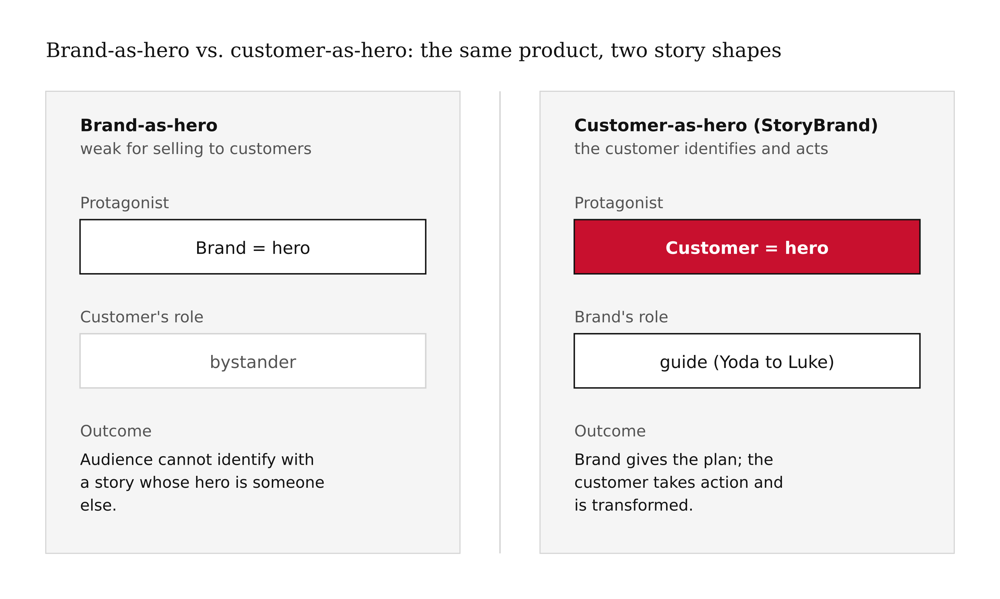
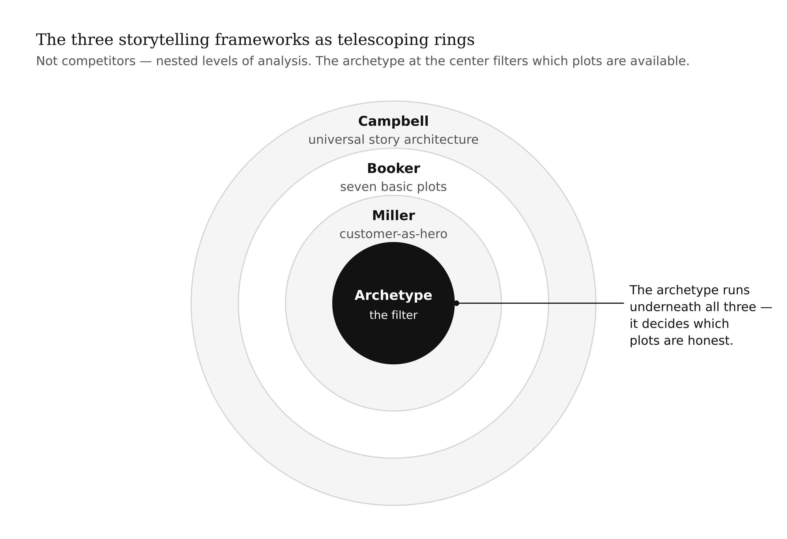
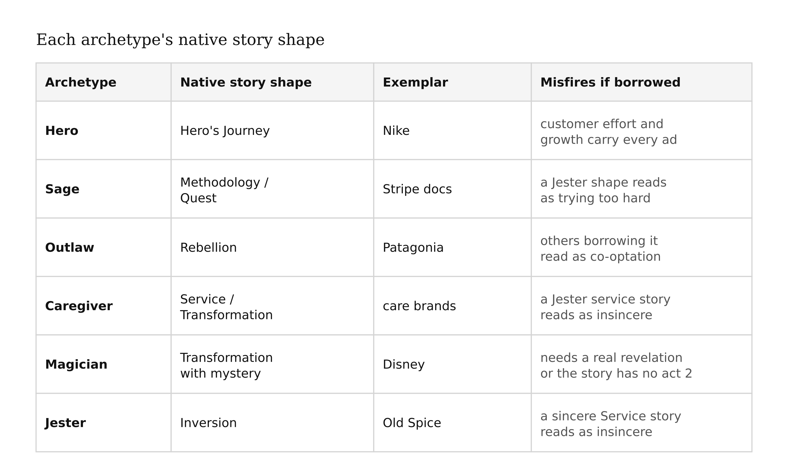
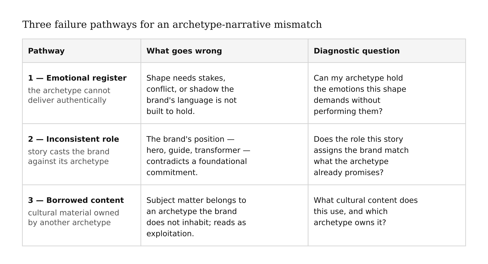
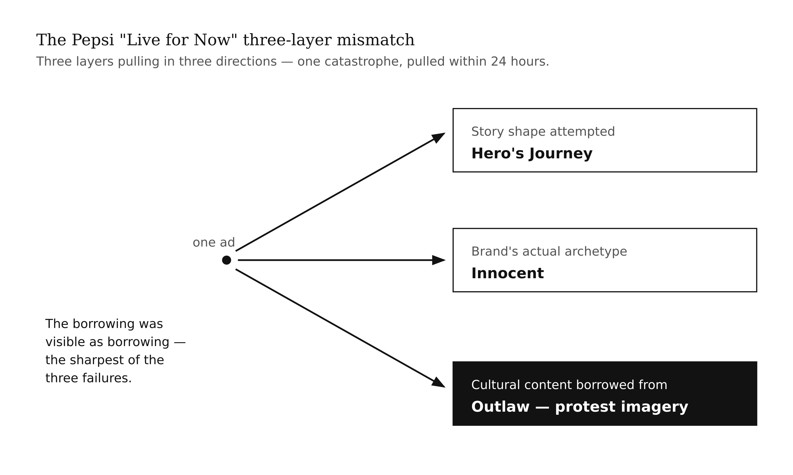
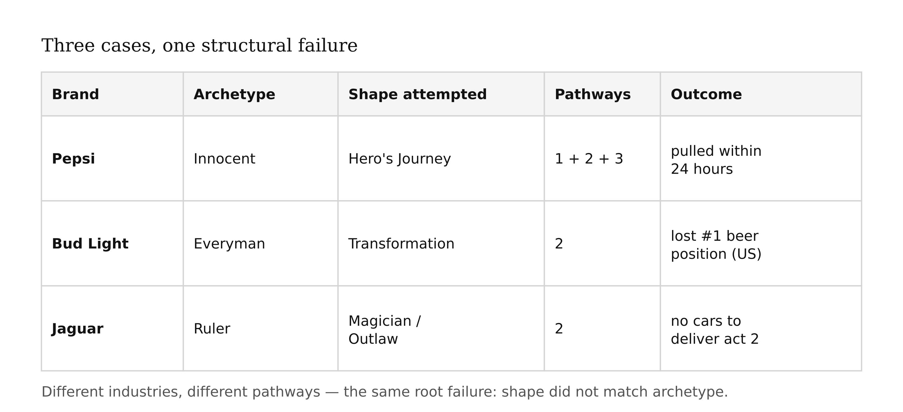
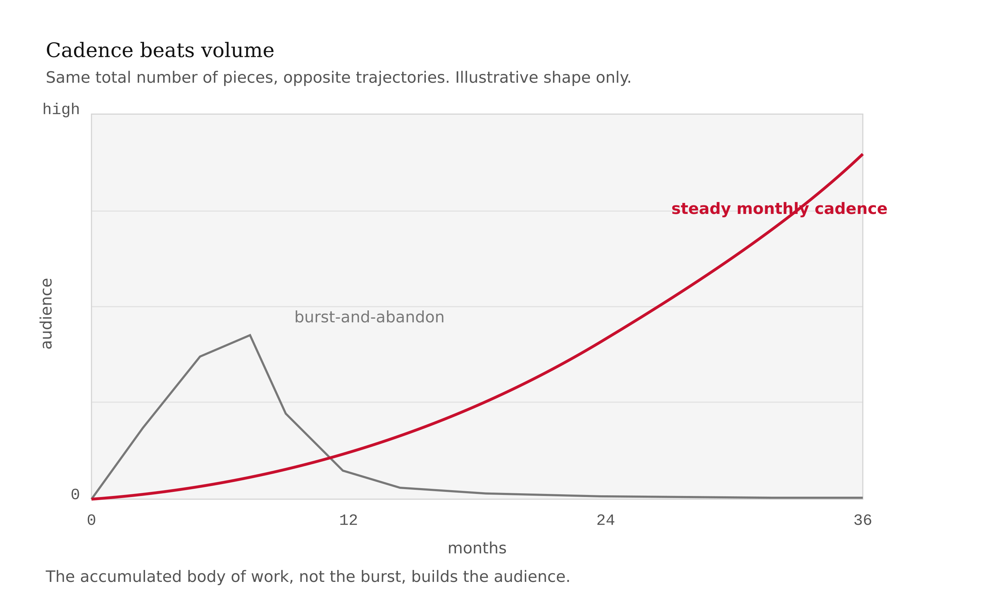
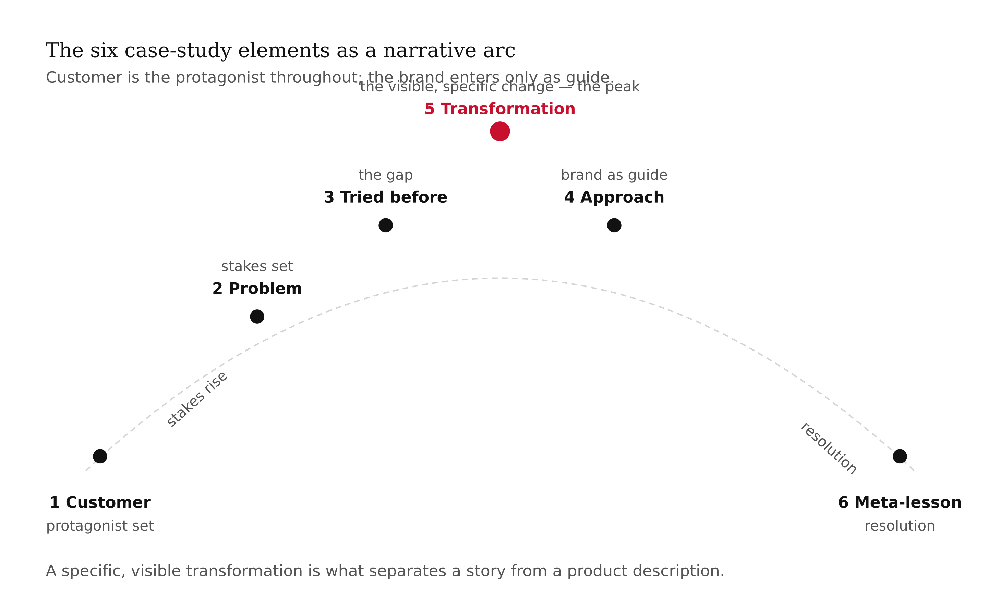
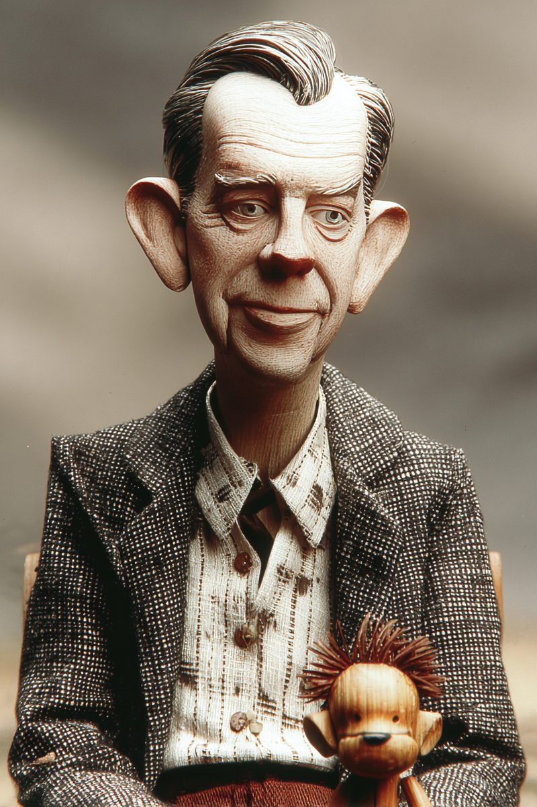

# Chapter 10 — Brand Voice & Storytelling
*A brand without a story is a logo on a business card. A brand telling the wrong story burns faster than no story at all.*

> **TL;DR:** This chapter is about brand storytelling — and the danger that the wrong story does more damage than no story. It covers three story frameworks, how your archetype limits which stories are honest to tell, what mismatches look like, and how to build the specific narrative pieces a brand needs.
>
> | Section | Preview |
> |---|---|
> | Three Frameworks, One Constraint | Three story structures worth knowing, and the single rule they all share. |
> | What the Archetype Commits You To | How your chosen archetype limits which stories are honest for your brand to tell. |
> | What Mismatches Look Like | How a story that contradicts the brand reads, and why it backfires. |
> | What Well-Told Brand Stories Look Like | The traits that separate a story that lands from one that falls flat. |
> | Five Story Types and Where They Live | Five kinds of brand story and the channels each one belongs in. |
> | Building the Three Deliverables | Producing the origin story, the case study, and the thought-leadership piece. |

---

Here is a thing that keeps appearing in student portfolios. The case study section reads: "I built a pipeline in n8n that processes competitor RSS feeds using the OpenAI API and outputs a daily summary to Google Sheets."

Every word of that is true. None of it is a story.

Compare it to this: "A marketing team was spending three hours every Monday morning manually pulling competitor reports. Six weeks after the pipeline shipped, that time dropped to twenty minutes. The marketing director used the recaptured hours to launch a new campaign strategy the team had been tabling for months."

The first is a résumé entry. The second is evidence of impact. The structural difference between them is the subject of this chapter — not as a matter of style, but as a matter of architecture. The second version has a customer, a problem, a transformation, and stakes. The first version has none of those things. The first is a description of what you did. The second is a story.

This chapter is about how to produce the second version reliably. It is not about being a better writer. It is about understanding the architectural constraints that separate a story from a description — and the one constraint that runs underneath all of them: archetype alignment.

Story shapes have archetypal commitments built into them. Choose a shape that does not fit your archetype, and the audience will read the result as false even when every individual element is well-executed. The mechanism is subtle enough that brands with large agencies miss it, and obvious enough that audiences feel the dissonance immediately.

---

## Three Frameworks, One Constraint

The literature on story structure is enormous. For brand work, three frameworks are worth knowing. They are not competitors — they are layered, each doing different work.

**Joseph Campbell's Hero's Journey.** Published in *The Hero with a Thousand Faces* in 1949, Campbell's monomyth was distilled from cross-cultural mythology — Greek, Hindu, Arthurian, Indigenous American, African. The claim was structural: beneath the surface differences of world mythology, the same story keeps appearing. A hero in an ordinary world receives a call to adventure. The hero hesitates, then crosses a threshold into a special world. Tests follow — allies found, enemies encountered, an ordeal survived. A transformation occurs. The hero returns to the ordinary world carrying a boon: a gift, a power, a truth that benefits the community they came from. Campbell's full framework has seventeen stages. For brand-story purposes, the simplified three-act shape — Departure, Initiation, Return — is sufficient. The shape provides the architecture; the brand fills in the specifics.

**Christopher Booker's Seven Basic Plots.** Published in 2004, Booker's taxonomy identified seven fundamental plot shapes underlying Western narrative: Overcoming the Monster, Rags to Riches, the Quest, Voyage and Return, Comedy, Tragedy, and Rebirth. For brand storytelling, the Quest is most frequently invoked — the protagonist pursues an important goal, encounters obstacles and helpers along the way, and either achieves the objective or fails meaningfully. The Quest differs from the Hero's Journey in emphasis: the Journey centers the personal transformation of the hero; the Quest centers the importance of the objective itself. A brand on a Quest story is making a claim about *why the destination matters*, not just who is traveling toward it.

**Donald Miller's Customer-as-Hero (StoryBrand).** Miller's 2017 book *Building a StoryBrand* adapted the Campbell framework for brand marketing. The central insight is positional: in a customer story, the customer is always the hero. The brand is never the hero. The brand is the guide — Yoda to the customer's Luke Skywalker, Gandalf to the customer's Frodo. The brand has a plan; the customer faces a problem; the brand's guidance helps the customer take action; the customer is transformed.

This sounds obvious. It is not. Most technical founders default to stories where the brand is the hero. The founders fought through hard problems, built something remarkable, overcame the obstacles of the early market. These stories are true and sometimes compelling for raising capital. They are weak for selling to customers, because the customer cannot identify with a story whose hero is someone else.


*Figure 10.1 — Brand-as-hero vs. customer-as-hero: the same product, two story shapes*

<!-- → [FIGURE: Two-panel comparison — left panel shows brand-as-hero story structure with brand as protagonist; right panel shows customer-as-hero with customer as protagonist and brand in guide role; same tool, opposite orientations] -->

The three frameworks are not alternatives. They are telescoping levels of analysis. Campbell describes what stories look like at the structural level — the deep architecture that recurs across cultures. Booker categorizes the plots — the distinct shapes available and what each one does to an audience. Miller adapts the architecture for a specific application — brand storytelling, where the audience is a prospective customer and the purpose is to help them identify with the story.

When you sit down to write a case study, you are working at Miller's level. But the case study's structural validity depends on Campbell's architecture being present beneath it — there is a call, a threshold crossing, an ordeal, a return with a boon. And the choice of *which* Miller-style story to tell is a Booker-level choice, constrained by your archetype.

The archetype is the constraint that runs across all three levels. It is not a fourth framework. It is the filter on what story shapes are available to your brand.


*Figure 10.7 — The three storytelling frameworks as telescoping rings*

<!-- → [FIGURE: Concentric ring diagram — outermost ring: Campbell (universal story architecture); middle ring: Booker (seven basic plots); inner ring: Miller (customer-as-hero application); center filled circle: Archetype (the filter on available plots)] -->

---

## What the Archetype Commits You To

In Chapter 3, I established that an archetype is a consistency-enforcement device — a constraint that makes downstream decisions decidable. Storytelling is a downstream decision, and the archetype's constraint here is specific: each archetype has story shapes native to it, and story shapes that read as impostures when attempted.

A **Hero archetype** can tell a Hero's Journey directly and without strain. The customer's effort and growth are the subject of every story. Nike's thirty years of advertising is a masterclass — every ad is a Hero's Journey at the customer level, with Nike as the gear and the belief system that enables the journey.

A **Sage archetype** tells Methodology stories and Quest stories. The Sage audience is curious; they want to understand how things work. Stripe's developer documentation and conference talks are Sage storytelling — the mechanism is the story. The Sage does not dramatize triumph; the Sage demonstrates understanding.

An **Outlaw archetype** tells Rebellion stories. The energy comes from naming something the establishment does and insisting there is another way. Patagonia's "Don't Buy This Jacket" campaign, Oatly's deliberately strange packaging copy — all Outlaw storytelling, deriving energy from the transgression of a norm.

A **Caregiver archetype** tells Service and Transformation stories. The subject is the person in need and the attentive relationship that meets them. The emphasis is not on the carer's competence but on the quality of attention brought to bear.

A **Magician archetype** tells Transformation stories with a mystery at the center. Something seems impossible; through the brand's particular vision or capability, it becomes possible. Disney's entire narrative output is Magician storytelling — worlds that should not exist, made real and habitable.

A **Jester archetype** tells Inversion stories — stories that flip the expected frame and produce delight through the reversal. Old Spice's "The Man Your Man Could Smell Like," Wendy's Twitter voice — Jester storytelling, deriving power from the unexpected angle.

The constraint is not that your archetype can only tell one kind of story. It is that story shapes requiring a different archetype's commitments will misfire. An Innocent telling a Rebellion story reads as co-optation. A Sage telling a Jester story reads as trying too hard. A Jester telling a sincere Service story reads as insincere. The audience does not articulate these mismatches in framework terms — they just feel the falseness.



<!-- → [TABLE: Archetype-to-story-shape reference — twelve rows, one per archetype; columns: archetype, native story shapes, why the shape fits, story shapes to avoid, failure mode when avoided shape is attempted] -->

---

## What Mismatches Look Like

Before the cases, name the failure mechanism precisely. An archetype-narrative mismatch fails through one of three pathways.

**Pathway 1: The story shape requires emotional registers the archetype cannot deliver authentically.** A Hero's Journey requires genuine stakes — the hero must risk something real. An Innocent brand telling a Hero's Journey must introduce conflict, shadow, and the possibility of failure. But the Innocent's deepest commitment is to purity and simplicity. The conflict reads as performed, because the Innocent's visual and verbal language is not built to hold it.

**Pathway 2: The story positions the brand in a role inconsistent with its archetype.** Miller's customer-as-hero framing makes this visible: the brand's position in the story — hero, guide, mentor — carries archetypal weight. An Everyman brand that positions itself as a transformative force is claiming to transcend the ordinary. The Everyman's promise is *you belong here, as you are* — not transcendence. The positioning claim contradicts the brand's foundational commitment.

**Pathway 3: The story's cultural content is accessible only to archetypes the brand does not inhabit.** Some subject matter belongs, in cultural terms, to specific archetypes. Social movements belong to the Outlaw. Grief and care belong to the Caregiver. Mastery and achievement belong to the Hero. An Innocent brand entering social-movement content is borrowing content it has no claim to. The borrowing reads as exploitation regardless of intent.



<!-- → [TABLE: Three failure pathways — columns: pathway number, name, what goes wrong, diagnostic question to ask before publishing, example brand that activated it] -->

All three pathways were active in the Pepsi case.

### Pepsi *Live for Now*, April 2017

Pepsi's archetype is Innocent with Jester elements. The Innocent promises purity, simplicity, goodness — the world is good, the product is good, the moment of refreshment is uncomplicated joy. Neither Innocent nor Jester has any relationship to social conflict, political tension, or the weight of a civil rights movement.

The *Live for Now* ad attempted a Hero's Journey at the customer level — Kendall Jenner as ordinary person receiving a call (she sees the protest), crossing a threshold (she removes her wig and joins), performing a heroic act (she hands the officer a Pepsi), returning to a transformed community (the crowd celebrates). The brand was cast as the magical object that resolves the conflict.

The first failure: casting the brand as a magical resolution device is a Magician move, not an Innocent move. The Innocent does not resolve social tension; the Innocent offers a moment of uncomplicated refreshment within a world where other forces handle tension.

The second failure: the story's cultural content — protest, police confrontation, the imagery of Black Lives Matter — belongs to the Outlaw archetype. The Outlaw earns the right to tell stories about confronting authority through a history of rebellion and genuine skin in the game. Pepsi has no such history. The borrowing was visible as borrowing.

The third failure: the Hero's Journey requires genuine stakes. The hero must risk something. Jenner risks nothing visible — she is a celebrity passing through someone else's conflict, resolving it with a consumer product.

Pepsi pulled the ad within 24 hours. The company's apology stated it had been trying to project a global message of unity, peace, and understanding. The apology confirmed the mechanism: the *intent* was Innocent (unity, peace) but the *story shape* was Hero, and the *cultural content* belonged to the Outlaw. Three mismatches, one catastrophe.


*Figure 10.3 — The Pepsi ad's three-layer mismatch*

<!-- → [FIGURE: Three-layer mismatch diagram for the Pepsi case — three rows labeled "Story Shape Attempted" (Hero's Journey), "Brand's Actual Archetype" (Innocent), "Cultural Content Borrowed From" (Outlaw); arrows showing the three-way divergence] -->

### Bud Light and Dylan Mulvaney, April 2023

Bud Light's archetype is Everyman. The Everyman promise is belonging — *you fit here, as you are*. Its entire brand history is built on accessibility and mainstream identification.

The April 2023 partnership with trans influencer Dylan Mulvaney was brief — a single sponsored can marking Mulvaney's one-year anniversary of publicly identifying as a woman. The storytelling intent appeared to be a Transformation story: the brand marking a personal transformation, signaling openness to expanding who "belongs" in the Bud Light community.

The architecture was wrong. Everyman brands signal *belonging to the mainstream*. When a mainstream brand signals alignment with a group that a substantial portion of its existing audience perceives as non-mainstream, it does not expand the definition of "us" — it disrupts the existing "us" without providing new stable footing. A Transformation story requires a foundation of demonstrated vision and earned trust in the brand's capacity to transform. Bud Light had built no such foundation. The Everyman archetype had not been repositioned. The story shape required a Magician; the brand was an Everyman. Bud Light lost its position as the best-selling beer in the United States in the months following.

The lesson is not about the cultural politics. The lesson is architectural.

### Jaguar's "Copy Nothing" Rebrand, November 2024

Jaguar's archetype historically was Ruler — luxury, prestige, controlled power. Ruler brand storytelling centers authority, excellence, and the confirmation of status.

The November 2024 rebrand introduced flamboyant typography, abstract imagery drawn from surrealism and pop art, and a launch video featuring no cars. The campaign tagline was "Copy Nothing." The narrative frame attempted was Magician/Outlaw — radical transformation, refusal of convention, identity disruption as brand statement.

The mismatch operated on Pathway 2. Ruler brands derive their authority from their relationship to existing excellence — the standard others aspire to. Outlaw brands derive their energy from explicitly rejecting that standard. A Ruler attempting an Outlaw story is not rejecting convention; it is abandoning the specific convention — excellence, prestige, earned authority — that constituted its value.

The additional complication: the new vehicles the rebrand was intended to introduce had not yet shipped. The Magician's transformation story requires that the impossible thing actually becomes possible — the mystery must be followed by a revelation. Without the cars, the story had no second act.

[*Note: This account is drawn from public coverage through mid-2025. Primary source documentation for specific audience metrics and internal brand decision-making should be verified against trade press and company statements before use in formal analysis.*]



<!-- → [TABLE: Cross-case mismatch comparison — five rows for Pepsi, Bud Light, Jaguar, and two blank rows for student cases; columns: brand, actual archetype, story shape attempted, failure pathway(s) activated, audience response, time to correction] -->

### The Pattern

Three cases. Three industries. Three different mismatch pathways. The same structural failure at the foundation of each: the story shape did not match the brand's archetype, and the audience perceived the dissonance before they could articulate why.

The diagnostic checklist that follows from this pattern: before publishing any brand story, answer three questions. First, what story shape is this — name it explicitly: Hero's Journey, Quest, Transformation, Rebellion, Service, Methodology, Inversion. Second, what is your brand's archetype, and what story shapes are native to it? Third, what cultural content does this story use, and which archetype owns that content?

If the answers to questions one and two do not align, revise the story. If the answer to question three points to an archetype your brand does not inhabit, revise the story. The alignment check takes ten minutes. The misalignment recovery takes months.

---

## What Well-Told Brand Stories Look Like

A well-told brand story has three properties that can be checked before it is published.

**Property 1: The story shape matches the archetype.** The shape is not decorative — it carries the brand's promises. A story shape mismatched to the archetype is not a style problem; it is a credibility problem.

**Property 2: The customer is the hero; the brand is the guide.** The customer wakes up with a problem. The brand does not solve the problem — the customer solves the problem. The brand provides clarity about the problem, a plan for addressing it, and the tools to execute the plan. The customer takes action. The customer is transformed. Yoda does not go to the Death Star. Luke does.

**Property 3: The stakes are real and specific.** "Our tool saves time" is not a stake. "Marketing teams at mid-size B2B companies were spending eight hours per week on competitive monitoring; after three months with the tool, that time dropped to forty-five minutes and the head of marketing used the recaptured hours to launch a new campaign strategy" is a stake. The specificity is not decorative — it is what makes the transformation visible and believable. Abstract stakes signal that the writer does not actually know what changed for the customer.

<!-- → [FIGURE: Two-panel before/after comparison — left panel shows brand-as-hero case study draft with abstract stakes; right panel shows customer-as-hero revision with specific user, specific problem, specific transformation; same project, opposite orientations] -->

Consider what this looks like in a technical context most students treat as documentation rather than storytelling. The Madison Intelligence Agent README opens with throughput numbers: 870 articles processed per day, 90% deduplication rate, sub-three-minute latency from ingestion to output. The opening does not say "Madison is a powerful marketing intelligence system." It shows the mechanism and its quantified outputs. This is Sage storytelling: the mechanism *is* the story. The reader who cares about this kind of intelligence is a reader who wants to understand how it works. The documentation satisfies that want before it makes any claim.

The architecture section walks through the five-layer agent structure — Intelligence, Content, Research, Experience, Performance — with enough specificity that a technical reader could understand what each agent does and why the decomposition was made that way. Methodology as story. The narrative question is not "will the hero succeed?" The narrative question is "how does this system actually work, and is the design defensible?" This is what Sage brand storytelling looks like in technical materials.

Before publishing any customer story, apply the structural test. Read your draft and answer three questions. Who is the protagonist in the first paragraph — if the answer is "me" or "my tool," revise the opening so the customer's problem is the subject. What does the customer risk or struggle with — if the answer is "nothing," there is no story, only a product description. What specifically changed — not "efficiency improved," but what specifically changed, for whom, by how much, visible to what observer. If you cannot answer this with specifics, you are not yet done reporting the story.

---

## Five Story Types and Where They Live

Five story shapes show up most reliably in AI-tool brand storytelling. Each has a primary archetype range and a natural home channel.

**Origin story.** How the tool came to be. Usually told in first person. The shape depends on archetype: a Hero archetype tells an origin story as a Hero's Journey. A Sage archetype tells it as a Methodology story — here is the problem I was trying to solve, here is how I came to understand it more precisely, here is what the investigation produced. A Magician archetype tells it as a Transformation story — here is what I believed was impossible, here is the moment I understood it was not.

**Customer story (case study).** The customer as hero. The brand as guide. The transformation is specific and real. This is the workhorse of portfolio storytelling — every project you have done can be rendered as a case study, and the accumulated case studies are the primary evidence of your capability and impact.

**Quest story.** The brand on a long-running journey toward a vision. Most effective for Sage and Hero archetypes building publicly and accumulating an audience over time. Quest stories require a believable destination and a consistent series of milestones — the Quest must be making progress, or the audience stops believing the destination is real.

**Thought-leadership piece.** A published argument about something your field gets wrong, does not understand, or has not yet articulated. The thesis should be specific enough that a hostile reader can push back on it. "AI is changing everything" is not a thesis — it is an observation. "Most marketing teams using AI for content generation are measuring the wrong output and will not detect the quality degradation until it is expensive to reverse" is a thesis.

**Transformation story.** Before-and-after, with the specific mechanics of the transformation visible. Most natural to Magician archetypes and most useful when the brand has a specific, demonstrable before/after case.

<!-- → [TABLE: Five story types reference — columns: story type, primary archetype range, structural requirements, example done well, common failure mode for this type] -->

### Channel Fit

The choice of channel is a downstream decision from archetype and story shape. Not every story shape works in every channel.

**LinkedIn articles** reward credibility signals — evidence, specificity, demonstrated expertise. Sage and Hero archetypes thrive here. Case studies and thought-leadership pieces are the strongest formats.

**Blog posts on your tool's site** are indexed by search engines and discoverable over time. A post titled "How to monitor competitor pricing automatically with n8n" will be found by people who need to do that thing. A post titled "Introducing Our New Competitive Intelligence Feature" will be found by no one except people who already know you exist.

**GitHub README and documentation** are underused as brand storytelling. For Sage archetypes, the README is often the first thing a potential collaborator or customer sees. A README that opens with mechanism and quantified outputs is Sage storytelling at its best.

<!-- → [TABLE: Story shapes × channels matrix — rows: origin story, case study, quest story, thought-leadership, transformation story; columns: LinkedIn articles, blog/SEO, newsletter/Substack, GitHub README, portfolio site; cells: fit rating and brief rationale] -->

### Cadence Over Volume

A common error: attempting to publish at a volume that cannot be sustained, burning out at week six, and abandoning the content strategy entirely.

The evidence from content marketing research is consistent: cadence beats volume. Two well-told case studies per year are worth more than ten mediocre LinkedIn posts per month, because the accumulated body of work is what builds an audience's model of who you are and what you know. Pick a cadence you can maintain at 70% capacity — not your best week, your normal week. For most students: one published piece per month is sustainable; weekly is aspirational and usually collapses.

For each planned piece, write one sentence answering: *what story shape is this, and does that shape fit my archetype?* If you cannot answer that question, the piece is not ready to be planned — it is still being figured out.



<!-- → [CHART: Two line charts — left panel: steady rising audience curve over 36 months (consistent monthly cadence); right panel: sawtoothed flat audience curve (burst-and-abandon); same total number of pieces, opposite trajectories] -->

---

## Building the Three Deliverables

Three deliverables, in order of build sequence.

**Deliverable 1: Origin story (300–500 words).** How your tool came to be — or more accurately, how you came to be the person who built it. Archetype-aligned. First person if your archetype supports it. One scene rendered specifically — not listed, shown. The elements that belong: a specific moment of recognition, the problem that would not leave, a threshold crossing, what you discovered in the work that you did not expect, what you now bring back. The elements that do not belong: a list of technologies you know, an account of all the jobs you have held, a statement of values without a story that made them specific. The test: read it aloud to someone who does not know you. Do they picture a specific moment? Do they understand why you built what you built? Do they believe you?

**Deliverable 2: Customer story template and one case study (800–1,800 words).** A case study in the customer-as-hero frame has six structural elements. They do not have to appear in this order in the finished piece, but all six must be present.

The *customer*: who is the protagonist? Name them or describe them precisely enough that a reader can identify with the role. The customer's specificity is what makes identification possible.

The *problem*: what could the customer not do, or what was taking too long, or what was wrong they could not fix? The problem must be specific and the stakes must be real.

*What they tried before*: why did the existing approaches fail? This is the most skipped element and the most important — without it, the reader does not understand why your approach was necessary rather than obvious.

The *approach*: what you did — framed as service to the customer, not as demonstration of your skill. The guide's actions are described in terms of what they enabled for the hero.

The *transformation*: what specifically changed? Numbers where available. Timelines where relevant. Qualitative changes described with enough specificity to be visualized.

The *meta-lesson*: what does this case study teach beyond "our tool works"? What does this case teach about the problem domain, the approach, the kind of transformation that is possible?


*Figure 10.6 — The six case study elements as a narrative arc*

<!-- → [FIGURE: Six-element narrative arc — problem establishes stakes, "what they tried" creates the gap, approach enters as guide, transformation is the arc's peak, meta-lesson closes; arranged as a rising-and-resolving structure with the customer as protagonist throughout] -->

**Deliverable 3: One published thought-leadership piece (800–1,500 words).** Published, not drafted. The distinction matters — publishing is a commitment that drafting is not. The topic fits your archetype and your tool's domain. The argument is specific enough to be falsifiable.

---

## What Would Change My Mind

Strong controlled evidence that brand storytelling investment does not predict customer acquisition or retention for AI-tool startups, when controlling for product quality and sales effectiveness. The case for brand storytelling rests largely on qualitative evidence and the few well-documented case reversals covered in this chapter. Large-N empirical studies on storytelling ROI at the startup stage would either strengthen or challenge these claims substantially.

## Still Puzzling

The exact mechanism by which some brands successfully evolve their archetype through storytelling — Apple from Outlaw to Magician — while others are read as opportunistic. The hypothesis is that successful archetype evolution requires a sustained series of stories that build toward the new archetype before the transition is named explicitly. But the evidence is mostly post-hoc analysis of successes. I do not yet have a clean account of what distinguishes deliberate evolution from opportunistic drift.

---

## AI Wayback Machine

**Joseph Campbell** synthesized the comparative mythology of dozens of cultures into the structural argument of *The Hero with a Thousand Faces* (1949): that human beings, across history and geography, tell the same shape of story because the shape corresponds to the experience of becoming someone capable of returning to the world with something the world needed. The chapter borrows the structure as a brand-storytelling tool — call to adventure, refusal, threshold, ordeal, return with the elixir — but Campbell's deeper claim is the one the chapter rests on: the structure works because it is true to a pattern people recognize in themselves, not because it is a clever rhetorical trick.


*Joseph Campbell, c. 1950s. AI-generated portrait based on a public domain photograph.*


*Puppet Art by [Nik Bear Brown](https://www.nikbearbrown.com/).*

**Run this:**

```
Who was Joseph Campbell, and how does his Hero's Journey structure connect
to the chapter's argument that a brand story works when it lets the
*audience* recognize themselves as the hero — not when it positions the
founder or the company as the hero? Keep it to three paragraphs. End with
the single most surprising thing about his career or ideas.
```

→ Search **"Joseph Campbell mythologist"** on Wikipedia after you run this. See what the model got right, got wrong, or left out.

**Now make the prompt better.** Try one of these:

- Ask it to explain why audiences recognize the Hero's Journey structure even when they cannot name it, in plain language
- Ask it to compare Campbell's monomyth stages to the brand-story arc this chapter teaches
- Add a constraint: "Answer as if you're writing the launch-post narrative for an AI tool, with the user as the hero and the tool as the elixir"

What changes? What gets better? What gets worse?

---

## Exercises

### Warm-Up

**W1.** For each of the following brand narratives, name the story shape being used (Hero's Journey, Quest, Transformation, Rebellion, Service/Methodology, Inversion) and identify the archetype it is most native to: (a) a software company's blog post explaining, in technical detail, why they built their rate-limiting system the way they did; (b) a sportswear ad showing an amateur runner training alone before dawn, failing repeatedly, finally completing a race she thought was beyond her; (c) a banking brand's campaign positioning itself as the institution fighting against hidden fees that the rest of the industry charges; (d) a cleaning-products brand's ad in which household objects come to life and sing about the joy of a clean home.
*(Tests story shape identification and archetype-shape native pairing — difficulty: low)*

**W2.** Read the following case study excerpt and identify who occupies the hero position. Then rewrite the opening paragraph to shift the hero position to the customer. *"We built a pipeline that processes competitor pricing data from fourteen sources and surfaces the three most important signals every morning. After six weeks of development and two rounds of user testing, we shipped the tool to our first customer. The feedback was positive."*
*(Tests customer-as-hero structural discipline — difficulty: low)*

**W3.** For your committed archetype, list: the story shapes most native to your archetype; one story shape you should avoid and why; one cultural content domain your archetype can credibly access and one it cannot.
*(Tests archetype-to-story-shape mapping — difficulty: low)*

---

### Application

**A1.** Find a real brand campaign from the last three years — not one covered in this chapter — that you believe contains a narrative-archetype mismatch. Apply the diagnostic checklist: name the brand's archetype, name the story shape the campaign attempted, identify which of the three failure pathways was activated, and describe the audience response as documented in press coverage or social media. Use sources.
*(Tests mismatch diagnosis on novel cases — difficulty: medium)*

**A2.** Write your tool's origin story (300–500 words). Archetype-aligned. One specific scene rendered clearly enough that a reader can picture it. Not a résumé in prose. Apply the three-question test before submitting: does the reader picture a specific moment? Do they understand why you built what you built? Do they believe you?
*(Tests origin story construction — difficulty: medium)*

**A3.** Take a case study you have already written — from this course, a prior course, a job application, anywhere — and audit it against the six-element template. Which elements are present? Which are missing? Which elements, if present, have the brand in the hero position rather than the customer? Write a one-page analysis of what needs to change, and revise the case study accordingly.
*(Tests structural case study audit — difficulty: medium)*

**A4.** Write one thought-leadership piece (800–1,500 words) on a topic relevant to your archetype and tool domain. The piece must have a specific, falsifiable thesis — a claim a hostile reader could push back on, that you have the evidence to defend. It must not be a "lessons learned" post, a paper summary, or an announcement. Publish it. Provide the URL.
*(Tests thought-leadership construction and publication — difficulty: medium-high)*

---

### Synthesis

**S1.** Write a complete case study (800–1,800 words) for the AI tool you built in Chapters 4–7, using the six-element template and the customer-as-hero framing. The case study must: name or precisely describe the customer; specify the problem with real stakes; describe what failed before; frame your approach as service to the customer, not demonstration of your skill; include at least one specific, quantified or precisely described transformation; close with a meta-lesson that is more than "our tool works." Apply the three-property check before submitting.
*(Tests full customer-as-hero case study construction — difficulty: high)*

**S2.** Select two brands from different archetype positions — one you admire for its storytelling and one you believe is making storytelling errors currently. For each: identify the archetype, identify the story shapes being used, assess whether the shapes fit the archetype, and — for the brand with errors — name the specific mismatch pathway and predict the consequence if the error is not corrected. Ground your analysis in specific campaigns, not general impressions.
*(Tests cross-archetype storytelling analysis — difficulty: high)*

**S3.** Build a content calendar for the next two quarters (six months). Include six to ten planned pieces, each with a title or working title, a story shape, a channel, a target publication date, and a one-sentence archetype check. Then write a one-paragraph rationale explaining how the accumulated body of work over six months will build the brand you are trying to build — not as individual pieces, but as a sequence that compounds.
*(Tests content strategy construction with archetype discipline — difficulty: high)*

---

### Challenge

**C1.** The chapter's "Still Puzzling" section raises the question of how brands successfully evolve their archetype through storytelling. Using Apple's transition from Outlaw ("Think Different," 1997–2007) to Magician (iPhone era, 2007–present) as your primary case, develop an account of the storytelling mechanism that made the transition credible rather than opportunistic. Your account should identify specific campaigns or moments that built toward the new archetype, explain why the transition avoided the three failure pathways, and describe what a failed version of the same transition would have looked like. Be specific about the sequence — what had to happen before the Magician story could land. (400–500 words.)
*(Open-ended — tests whether the student can account for the chapter's stated open question — difficulty: challenge)*

---

## LLM Exercise — Self-as-Project

**Project:** Self-as-Project
**What you're building this chapter:** Three stories — your **origin story**, one **case study** (in customer-as-hero format), and one **published thought-leadership piece**.
**Tool:** Claude Project for drafting; LinkedIn / Substack / your blog for publishing.

**The Prompt:**

```
Write three pieces of brand storytelling for me. All three must be
archetype-aligned per my Personal Brand Strategy v1.

PIECE 1 — ORIGIN STORY (300–500 words).
How I became the engineer/designer/practitioner I am. Use the Hero's
Journey simplified arc: ordinary world (where I started), call (the
moment something pulled me toward this work), threshold crossing (the
first real commitment), tests and allies (the work that shaped me),
the boon I bring back (what I now offer).

The story must be true. No invented turning points. If I don't have a
clear "call" moment, write the version that's closest to true and flag
the synthetic compression.

The story must NOT be a resume in prose. A resume lists. A story shows.
The reader should feel one specific scene clearly enough to picture it.

PIECE 2 — CASE STUDY (800–1,200 words).
Pick ONE project from my history (class project, internship, AI tool
from this course, open-source contribution — anything I've shipped).
Write it as a customer-as-hero case study.

Format:
- Customer (the team / user / class / community I served — they are the
  protagonist)
- Problem they had (specific, recognizable, with stakes)
- What they tried before that didn't work
- Approach I brought (the work I did — framed as serving the customer,
  not showcasing me)
- Transformation (what changed — specific outcomes, numbers if I have them)
- What I learned (the meta-lesson the project produced)

I am the GUIDE in this story, not the hero. Yoda, not Luke. Most
engineers get this backwards. Hold the line.

PIECE 3 — THOUGHT-LEADERSHIP PIECE (800–1,500 words).
Write one substantive piece of public-facing writing. Topic must be
archetype-aligned and connected to the kind of work I want to be
hired for.

The piece is not allowed to be:
- A "lessons learned from my AI tool project" post (every student
  writes this)
- A summary of a paper I read (no original work)
- An "I'm excited to announce" post (announcement, not thinking)

The piece should advance one specific idea I have about my field that
not everyone holds. It should be defensible — a hostile reader could
push back, but I have the evidence.

Output three Markdown documents:
1. "Origin Story — [my name]"
2. "Case Study — [project name] — [my name]"
3. "[Piece title] — [my name]"

For each, suggest the publication channel (LinkedIn article / Substack
/ personal blog / Medium) and the optimal day-of-week and time-of-day
to publish it for my archetype's typical audience.
```

**What this produces:** Three pieces of finished writing. One published before Chapter 11. The other two slot directly into your portfolio's About and Case Studies sections.

**How to adapt:** Iterate on each piece separately. Run Piece 3 multiple times with different topics until one feels right.

**Preview of next chapter:** Chapter 11 deploys your portfolio site using v0 or Framer, with these stories as content.

---

## AI+1 — Self-as-Project on Madison

**Project:** Self-as-Project — *your brand, end to end*
**This chapter adds:** an on-voice brand narrative and a small, channel-ready copy set.
**Madison recipes:** [`madison-copy-content-generation`](../madison/recipes/madison-copy-content-generation.md), [`content-agent`](../madison/recipes/content-agent.md)

> A brand telling the wrong story burns faster than no story (this chapter's thesis). You set the story and own the voice; Madison drafts variants; you approve.

### Exercise 1 — When to Use AI
- *Generate headline / subject-line / bio variants in your voice.* **Why it works:** drafting volume you select from.
- *Adapt one core narrative to three channels.* **Why it works:** reformatting.
- *Spot where copy drifts off-archetype.* **Why it works:** pattern-spotting you confirm.

**Tell:** you can tell, line by line, whether it sounds like you.

### Exercise 2 — When NOT to Use AI
- *Choosing the core story.* **Why it fails:** narrative strategy is the human act.
- *Approving the final voice.* **Why it fails:** authenticity — the reader detects generic copy.
- *Inserting a claim or anecdote into the story.* **Why it fails:** fabricated specifics destroy trust.

**Tell:** you've crossed the line when you ship copy you wouldn't say out loud.
**Series connection:** trains story-as-load-bearing.

### Exercise 3 — Recipe Exercise
**Build:** one core narrative + a channel copy set. **Run:** [`madison-copy-content-generation`](../madison/recipes/madison-copy-content-generation.md) / [`content-agent`](../madison/recipes/content-agent.md) over your positioning + archetype. **Tool:** Claude Project (holding your voice).

```
Using the Madison copy-content-generation + content-agent recipe approach, and my
positioning + archetype + 3 writing samples (below), draft: (1) one 120-word brand
narrative in MY voice; (2) channel variants — one LinkedIn post, one site hero, one
email subject + preheader. Use only facts I provide; mark any invented specific
[FABRICATED — remove]. Match the cadence of my samples, not generic brand-speak.

Positioning + archetype + samples:
[PASTE]
```
**Adapt:** if a variant needs a claim you can't back, cut the claim, not the voice.

### Exercise 4 — CLI Exercise
**Build:** `your-brand/story.md` + `your-brand/copy-set.md`. **Tool:** [`wrap-your-tool`](../madison/wrap-your-tool/) or Claude Code.

```
Write your-brand/story.md (the 120-word narrative) and your-brand/copy-set.md (the
channel variants in a table: channel | copy | claim-check). Tag any unverifiable
claim [FABRICATED]. Do not invent metrics, awards, or quotes. Stop after writing.
```
**Inspect:** zero fabricated specifics; voice matches your samples.
**If it goes wrong:** the model adds a plausible but false detail (a number, a client) — strip every unverifiable specific.

### Exercise 5 — AI Validation Exercise
**Validate:** the story + copy. Pass / Fail / Cannot-determine + evidence:
- **Correctness:** is every factual specific true and yours?
- **Completeness:** core narrative + all three channel variants?
- **Scope:** story/copy only — not a full campaign?
- **Brand-specific:** does it sound like your archetype and your samples?
- **Failure-mode (fabrication):** list every [FABRICATED] tag; confirm each is removed or sourced.

*Tags: brand-storytelling · heros-journey · campbell · storybrand · pepsi-jenner · bud-light · jaguar · narrative-archetype-match · INFO-7375*
