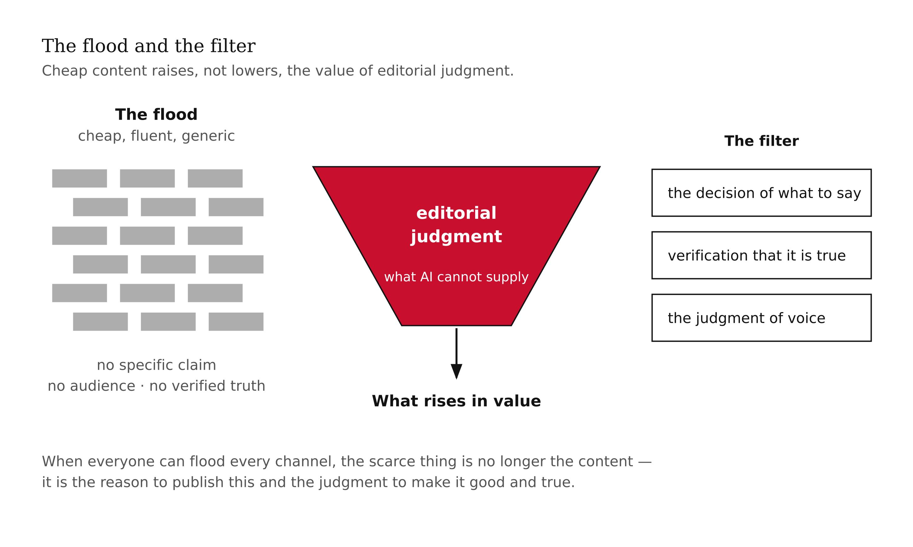
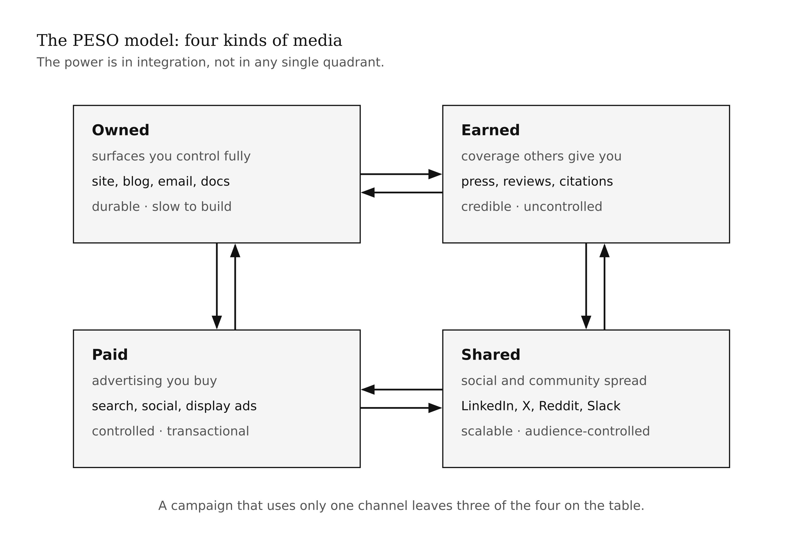
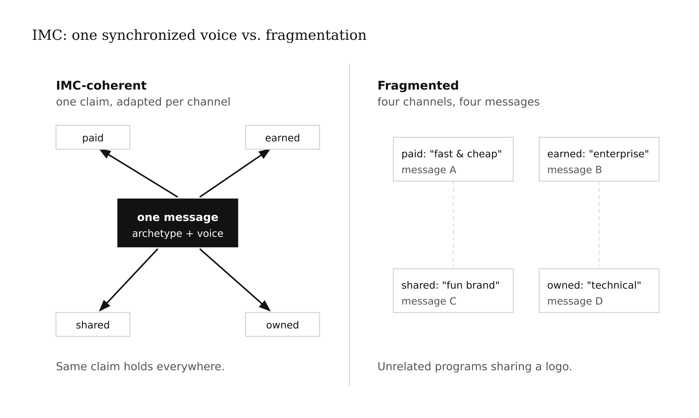
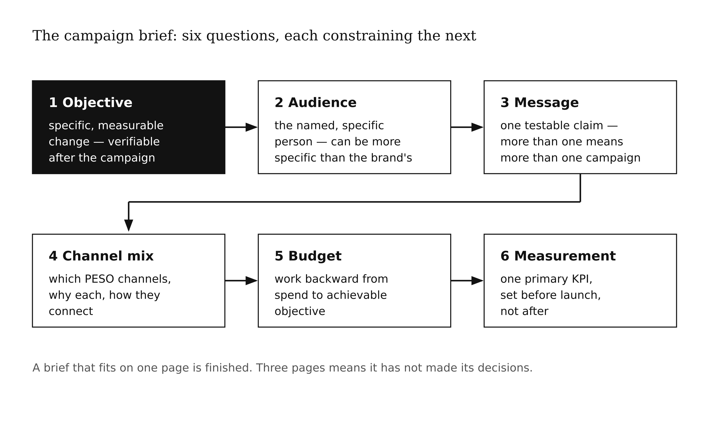
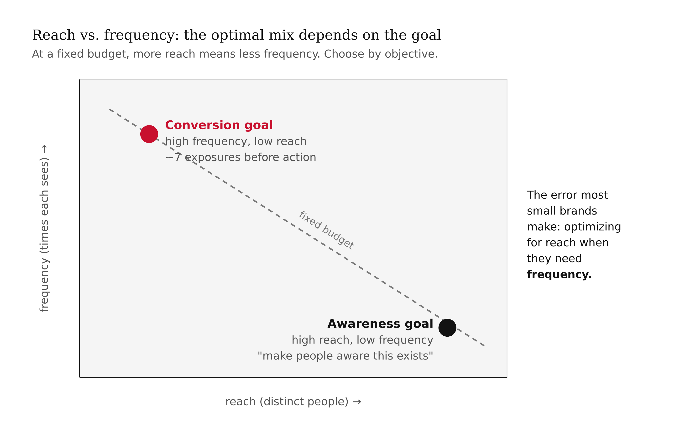
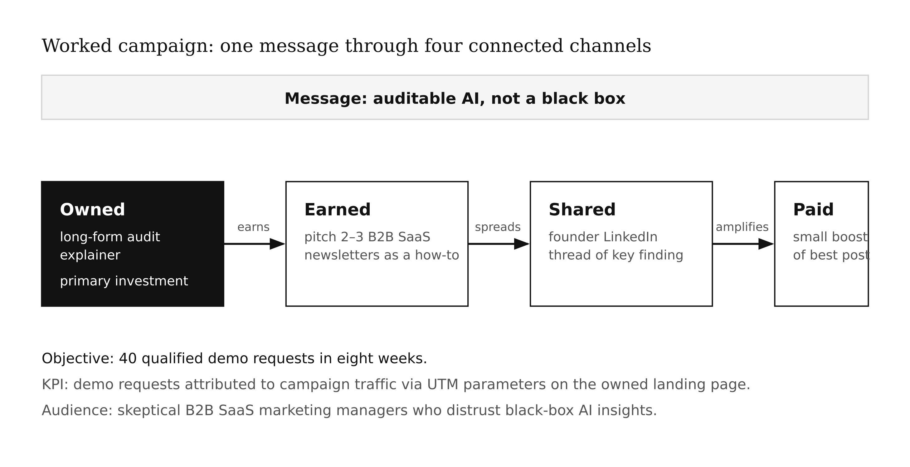
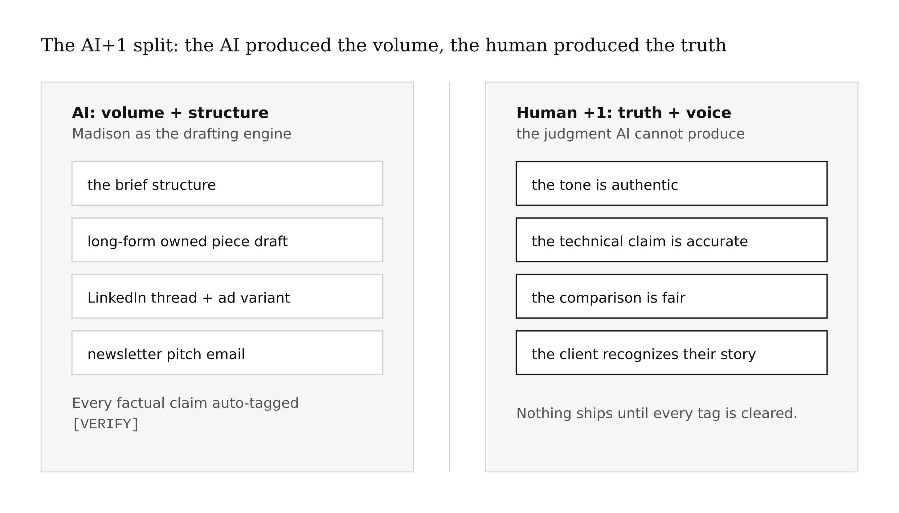

# Chapter 12 — Content, Media & Campaigns
*AI made content free to produce. That is exactly why most of it is worthless.*

> **TL;DR:** Content needs a planning layer above the copy — what to say, where, why, and how it's paid for. This chapter teaches the PESO media model and integrated marketing communications, the campaign brief, and reach/frequency basics, then has you build a campaign plan and a channel-ready content set with Madison drafting and you owning the message and every claim.
>
> | Section | Preview |
> |---|---|
> | The Flood and the Filter | Why cheap AI content raises, not lowers, the value of editorial judgment. |
> | PESO: Four Kinds of Media | The paid, earned, shared, and owned channels, and why they work as a system. |
> | One Voice: IMC | The discipline of saying one consistent thing across every channel. |
> | The Campaign Brief | The short document that turns strategy into a coordinated campaign. |
> | Reach, Frequency, Mix | The media-planning basics that decide whether a message lands. |
> | Worked Example: Plan a Campaign | Building a campaign plan and content set, with claims checked. |

---

There is a thought experiment I keep returning to when I think about content strategy in 2026. Suppose you could produce a thousand competent blog posts for the same cost as one. Not a thousand great posts — a thousand competent ones: readable, formatted correctly, on-trend in vocabulary, free of obvious errors. Would you be richer for it?

The naive answer is yes. More content means more surface area, more search presence, more touchpoints with potential customers. The correct answer is that you would almost certainly be worse off, and understanding why is the foundation of this chapter.

The cost of producing a competent paragraph, image, or video has genuinely collapsed toward zero. Large language models write fluid marketing copy. Image generators produce serviceable visuals. The barrier that used to protect high-quality publishers — they could afford to produce content, and most people couldn't — is gone. So when everyone can flood every channel with fluent, on-trend, generic copy, the scarce thing is no longer the content. It is the *reason to publish this* and the *judgment to make it good and true*.

What rises in value when content gets cheap is exactly what AI cannot supply: the decision about what is worth saying, the verification that it is true, the judgment that it sounds like you and not like a brand-speak approximation of you. This chapter is about the planning layer above the copy — the discipline that makes the thousand-post thought experiment a trap and the ten-post strategy a compounding asset.



Before this chapter lands, you need the brand strategy from Chapter 6 and the archetype commitment that runs through it. Content without a clear archetype and voice is the exact thing the flood is made of. The planning discipline here assumes you have already answered the strategic questions. What follows is the operational layer that translates strategy into coordinated publication.

---

Start with a mental model of where content actually lives.

Before the internet, media channels were mostly separate categories with separate economics: you bought advertising, you pitched journalists for coverage, you produced and distributed owned material like catalogs and newsletters. Each channel had distinct gatekeepers, distinct costs, and distinct audiences. The internet did not eliminate these distinctions — it scrambled the economics of each and made the relationships between them far more important than any channel in isolation.

Gini Dietrich's PESO model names four kinds of media that every brand navigates, and the acronym is worth memorizing because each letter corresponds to a genuinely different economics and a different relationship with the brand.

**Paid media** is advertising you buy. Search ads, social media ads, display advertising, sponsored content, influencer partnerships with disclosed compensation. You control the message precisely because you are paying for placement. The audience sees it because you paid, not because they sought it out. The relationship between brand and audience is transactional, which is why paid media is effective for awareness and offers but rarely builds the deep trust that changes long-term behavior.

**Earned media** is coverage others give you without payment. Press mentions, reviews, word-of-mouth, academic citations, backlinks from other sites because they found your content worth referencing. You control the content that earns this coverage — the product quality, the press pitch, the published research — but you do not control what others say or where they say it. Earned media is the most credible channel because a third party has independently judged your work worth amplifying. It is also the hardest to manufacture: you cannot buy a genuine review, and trying to fake one destroys the credibility the channel's value rests on.

**Shared media** is social and community channels — the platforms where content spreads through individual acts of forwarding, commenting, and saving. LinkedIn posts, Twitter/X threads, Reddit discussions, community Slack channels. Shared media occupies a strange middle position: the brand can publish content, but the audience controls whether it spreads. Algorithmic amplification means shared media can scale faster and cheaper than any other channel, but the same dynamics that can amplify a good piece can amplify a bad one, and recovery from a shared-media failure is difficult.

**Owned media** is the surface you control completely — your website, your blog, your email list, your podcast, your documentation. Nobody can deplatform you from your own domain. Nobody can change the algorithm on your email list. Owned media builds slowly because you cannot buy distribution — you earn it by producing content people seek out and subscribe to — but what you build is durable in a way that rented channels (paid) and borrowed audiences (shared) are not.



<!-- → [DIAGRAM: PESO model — four quadrants or four linked circles: Paid (bottom-left, transactional, controlled message), Earned (top-right, credible, uncontrolled), Shared (bottom-right, scalable, audience-controlled), Owned (top-left, durable, fully controlled); arrows between all four showing how each feeds the others; caption: "The power is in integration, not in any single quadrant."] -->

The power of the model is not in the categories themselves — any media buyer knows the distinction between paid and editorial. The power is in what the model reveals about integration. A piece of owned content — a well-researched blog post with original data — can earn press coverage, which spreads on shared channels, which makes paid amplification of the best-performing version worth the cost. Or: a paid campaign drives traffic to owned content, some of which earns links and reviews, building organic search authority that reduces the paid cost over time. Each channel feeds the others. A campaign that uses only one PESO channel leaves three of the four on the table.

The failure mode is treating each channel as independent. The brand with a different message on its paid ads than on its press page than in its email list is not running a campaign — it is running four unrelated publishing programs that happen to share a logo.

---

The discipline for preventing that failure has a name: Integrated Marketing Communications, or IMC. Don Schultz, who developed the framework at Northwestern, observed that the fragmented channel landscape of the 1980s was producing brands that said different things in different contexts — not because of deliberate positioning, but because each department owned its channel and optimized independently. The ad team had its message. The PR team had its story. The direct-mail team had its offer. The customer rarely experienced them as a coherent whole.

IMC is the organizational insistence that every channel is one synchronized voice. The specific message adapts to the channel — a tweet is not a press release, and neither is a display ad — but the underlying claim, the archetype, and the brand voice are identical across all of them. The campaign is the unit that enforces this.



Think about what a well-run IMC campaign looks like in practice. Stripe launched Stripe Atlas in 2016 as a tool for international founders to incorporate U.S. companies. The launch did not consist of separate announcements across separate channels. The owned content was a detailed explainer aimed at the developer-and-builder audience Stripe had cultivated for six years. The earned coverage came from publications covering startup infrastructure, not general business press. The shared amplification happened in developer communities and founder forums because the product genuinely solved a problem those communities discussed. There was no Stripe Atlas television campaign, no broad display advertising, no celebrity partnership. The channels were chosen because they were where the specific audience was, and the message was consistent across all of them: here is something that was unnecessarily hard, and we have made it simple.

That coherence did not happen by accident. It happened because someone decided what the campaign was *for* before anyone wrote a word.

<!-- → [TABLE: IMC failure modes — columns: failure mode, what it looks like, why it happens, the cost. Rows: different message per channel, channel-optimized voice drift, unclaimed earned media not connected to paid, owned content not amplifying earned.] -->

---

The document that enforces IMC is the campaign brief, and it is shorter than most people expect.

A campaign brief answers six questions in sequence. Each question constrains the next.

**Objective.** What specific, measurable change do you want the campaign to produce? Not "more awareness" — awareness is a precondition, not an objective. *Increase signups from developer-audience visitors by 20% over six weeks* is an objective. *Generate 50 press mentions in publications covering AI developer tools by Q3* is an objective. The objective must be stated as something you can verify after the campaign ends. If you cannot write the objective this way, you do not yet have a campaign — you have a publishing impulse.

**Audience.** From Chapter 6: the named, specific person the campaign is trying to reach. The audience definition at the campaign level can be more specific than the overall brand audience. The Stripe Atlas launch was aimed at international founders specifically, not at the general developer audience Stripe had built. Specificity allows every subsequent channel and copy decision to be optimized for a real person rather than an abstraction.

**Message.** The one thing the audience should believe or do differently after encountering this campaign. One claim. Not a list of features. Not a tagline. A testable claim: *Stripe Atlas lets you incorporate a U.S. company from anywhere in the world in about an hour, for $500*. If you find yourself with more than one message, you have more than one campaign.

**Channel mix.** Which PESO channels the campaign uses, why each was chosen for this audience and objective, and how they connect. The channel mix is derived from the audience and objective, not from which channels the team already knows how to use. If the audience is on LinkedIn and not on Instagram, the mix includes LinkedIn regardless of whether anyone on the team enjoys LinkedIn.

**Budget.** What the campaign will spend on paid, on content production, and on distribution. Budget constraints often determine channel mix in practice. The interesting discipline is working backward from the budget to the achievable objective rather than from the objective to an aspirational budget.

**Measurement.** One primary KPI per objective, plus the tracking mechanism. If the objective is developer signups, the KPI is developer signup conversion rate on the campaign landing page, tracked with UTM parameters across channels. If the objective is press mentions, the KPI is press mention count in target publications, tracked with a media monitoring tool. The measurement structure should be set before the campaign launches, not after, because measurement set after the fact will unconsciously favor the metrics that show favorable results.



<!-- → [TABLE: Campaign brief anatomy — columns: section, the question it answers, example from a Sage-archetype developer tool, common failure mode. One row per section.] -->

A brief that fits on one page is finished. A brief that runs to three pages has not yet made its decisions. The brief is not the campaign plan; it is the constraint document that makes the campaign plan coherent.

---

Suppose the brief is written. Now you need to decide how the budget and content effort are distributed across channels to actually move the objective. Two media-planning concepts decide whether a message lands, and neither requires a media-buying background to apply.

**Reach** is the number of distinct people who see the message at least once. A campaign with high reach spreads one impression across many people. This is effective for announcing something new — a product launch, a category that did not exist before. Reach is the right optimization when the goal is "make people aware this exists."

**Frequency** is the number of times each person sees the message. A campaign with high frequency concentrates impressions on fewer people. Marketing research consistently shows that a single impression rarely changes behavior — the old rule of thumb was seven exposures before action, though the actual number is context-dependent. Frequency is the right optimization when the goal is "make people act on something they have probably already heard of."

The error most small brands make is optimizing for reach when they need frequency. A campaign that achieves one impression with 10,000 people will almost never produce as much behavior change as a campaign that achieves five impressions with 2,000 people — even at the same total cost — when the goal is conversions rather than awareness. The media mix should be set with this trade-off explicit.

For a developer tool with an existing audience and a conversion objective — getting known users to sign up for a new feature — the right mix is high frequency in owned (email series, in-product messaging) and shared channels (community posts, developer forums) where the existing audience already lives, with minimal paid spend. For a launch into a new audience segment, the right mix flips: broader paid reach to introduce the product, owned content to capture the interested, earned media to add credibility to both.



<!-- → [CHART: Reach vs. frequency trade-off — two curves on the same axes: "awareness goal" showing high reach/low frequency as optimal; "conversion goal" showing high frequency/low reach as optimal; both curves crossing at a mid-point; annotated with the spend implication of each.] -->

---

Now I want to show what this looks like assembled, because the planning concepts become concrete only when they are applied to a specific problem.

Suppose the brand is the AI analytics tool from earlier chapters. The archetype is Sage. The audience is marketing managers at small B2B SaaS companies who run attribution analyses manually and are skeptical of AI-generated insights they cannot audit.

The campaign objective: generate 40 qualified demo requests from this audience in eight weeks.

The audience is on LinkedIn and reads a handful of newsletters covering B2B SaaS operations. They are not on TikTok. They distrust vendor-produced case studies and reward technical depth. They respond to evidence they can check.

Working through the brief: the message is one specific claim — the tool shows exactly how each attribution model reaches its conclusion, so the analyst can audit the logic rather than trust a black box. One claim. Auditable AI, not just AI.

Channel mix, derived from audience and objective: owned content is the primary investment — a long-form piece showing the attribution audit feature in detail, with real (or clearly synthetic) data, so the skeptical analyst can evaluate the claim before the demo. Earned media is the secondary bet — pitch two or three B2B SaaS operations newsletters on the piece, framing it as a how-to rather than a product announcement. Shared amplification happens through LinkedIn, where the founder posts a thread version of the key finding. Paid is a small budget used to boost the LinkedIn posts to the target audience after organic reach has been measured.

The measurement: demo requests attributed to campaign traffic via UTM parameters on the owned content landing page.



Now Madison enters — not as the decision-maker but as the drafting engine. The campaign construction recipe produces the brief structure. The copy generation recipe drafts four content pieces: the long-form owned piece, a LinkedIn thread, a newsletter pitch email to two editorial contacts, and a short paid ad variant. Every specific factual claim in the draft is tagged [VERIFY] — tool performance statistics, customer outcome claims, comparison to specific competitors. The founder checks every tag against actual product data before a word goes out.

The output Madison cannot produce: the judgment that the tone is authentic, that the technical explanation is accurate, that the comparison claim is fair, that the case study client would recognize themselves in their own story. That is the +1. The AI produced the volume and the structure; the human produced the truth and the voice.



<!-- → [TABLE: Worked campaign plan — columns: PESO channel, specific tactic, message adaptation, reach vs. frequency goal, how it connects to the next channel, KPI. One row per channel in the example.] -->

---

The relationship between content strategy and the rest of the book is worth making explicit, because this chapter can feel like a tactical add-on to what has been primarily a strategic sequence.

Every brand decision made in Chapters 6 and 9 shows up in content execution. The archetype determines which channels the brand belongs in — a Sage brand publishing daily TikToks is running against its own grain. The voice specification determines whether the LinkedIn thread reads like you or like a generic brand account. The negative-space list determines which content topics the brand will not produce regardless of what is trending. The visual identity system determines whether the owned content, the social posts, and the paid ads look like they come from the same source.

Content without the upstream strategy is the flood. Content with the upstream strategy — produced at a fraction of the old cost using AI drafting, owned by a human who verifies and shapes — is the filter.

The claim I want to be careful about is this: AI-assisted content creation at scale is not a strategy. It is an execution capability. The brands that will use it well are the ones that already know what they are for, who they are for, and what they will not say. The brands that will use it badly are the ones treating volume as a substitute for judgment.

---

## What Would Change My Mind

Evidence that high-frequency, high-volume AI-produced content does not erode audience trust faster than lower-volume, higher-judgment content — controlling for content quality as judged by the audience, not the publisher. The mechanism I describe (AI raises the value of editorial judgment) is plausible from first principles but the empirical evidence is sparse and fast-moving. If audience trust metrics for brands using AI-volume strategies are indistinguishable from brands using editorial-judgment strategies, the chapter's premise needs revision.

## Still Puzzling

The correct ratio of AI-drafted to human-written content for a Sage-archetype brand is genuinely unknown. The Sage's core trust mechanism is demonstrated expertise — and audiences may or may not detect the difference between demonstrated expertise that was AI-drafted and then verified versus expertise demonstrated in the writing itself. I suspect the distinction matters more in long-form owned content than in short-form shared content, but I do not have clean evidence for this.

---

## Exercises

### Warm-Up

**W1.** Name the four PESO channel types. For each, write one sentence explaining what makes it distinct from the others — not just the channel name, but the economic relationship between the brand and the audience. Then name one specific brand behavior that only makes sense in each channel.
*Tests: PESO channel comprehension beyond the acronym.*
*Difficulty: Low.*

**W2.** The chapter defines a campaign objective as "specific and measurable." For each of the following, identify whether it is a valid campaign objective or a publishing impulse, and rewrite the publishing impulses as valid objectives: (a) "We want to increase our LinkedIn presence." (b) "We want to generate 30 demo requests from marketing operations professionals over six weeks via a long-form attribution guide." (c) "We want to be seen as thought leaders in AI analytics." (d) "We want our email list to grow by 500 subscribers from developer-audience referrals by the end of Q3."
*Tests: objective-writing discipline — the difference between measurable and aspirational.*
*Difficulty: Low.*

**W3.** A brand with a monthly budget of $2,000 for a campaign is choosing between two approaches: (A) spread 2,000 impressions across 2,000 distinct people in their target audience; (B) deliver 10 impressions to 200 people in their target audience. The goal is to convert free-trial users into paid subscribers. Which approach is more likely to succeed, and why? What information would change your answer?
*Tests: reach vs. frequency reasoning applied to a specific objective.*
*Difficulty: Low-medium.*

### Application

**A1.** Write a one-page campaign brief for your AI tool. All six sections: objective, audience, message, channel mix, budget (you may use a hypothetical figure), and measurement. Test the brief by evaluating one hypothetical channel decision against it — propose adding a channel that is NOT currently in your mix and argue whether the brief supports or rejects the addition.
*Tests: campaign brief construction and brief-as-evaluation-instrument.*
*Difficulty: Medium.*

**A2.** Choose one PESO channel from your campaign brief and draft one piece of content for it. The content must: (a) express the archetype and voice from your Chapter 6 strategy; (b) make only claims you can verify or have verified; (c) include at least one specific, auditable detail (a number, a product feature, a process step) rather than a generic benefit claim. Tag any claim you have not yet verified [VERIFY]. After drafting, count the [VERIFY] tags and describe what you would need to check each one.
*Tests: content production with verification discipline — the AI+1 split in practice.*
*Difficulty: Medium.*

**A3.** Find a brand whose content program you observe regularly — any brand whose emails you receive, whose social posts you see, or whose content appears in your RSS or newsletter feeds. Audit its PESO channel integration: does the brand use all four channels? Is the message consistent across channels (IMC)? Where does it fragment? Pick the most significant fragmentation you can find and explain what strategic decision or organizational failure is likely producing it.
*Tests: PESO integration diagnosis on a real case.*
*Difficulty: Medium.*

**A4.** The chapter argues that AI-produced content at volume is not a strategy — it is an execution capability. Find a brand (or describe a hypothetical) where high-volume AI content appears to be treated as a strategy. What is the brand getting wrong? What would the correct strategy layer look like above the content, and what specific decisions would that strategy layer force the brand to make differently?
*Tests: the flood-and-filter argument applied to a novel case.*
*Difficulty: Medium.*

### Synthesis

**S1.** The Stripe Atlas launch is described as an IMC-coherent campaign even though it does not look like a conventional campaign. It has no paid television, no celebrity endorsement, no large media buy. Reconstruct its PESO channel map from what the chapter describes: which channels were used, what content appeared in each, how the channels connected, and what the brief's likely objective and message were. Then evaluate: was this a deliberate IMC strategy or a pattern that emerged from Stripe's archetype and existing audience? What evidence supports each interpretation?
*Tests: PESO model application and IMC diagnosis on a real case; also stress-tests whether the student can distinguish strategic intent from emergent coherence.*
*Difficulty: Medium-high.*

**S2.** You are advising a Sage-archetype developer tool brand that has just hired a content agency that proposes publishing 30 short-form blog posts per month generated by AI, arguing this will increase search engine traffic. Using the flood-and-filter argument, the IMC discipline, and the reach/frequency distinction, construct the strongest case against this proposal. Then construct the strongest case for a modified version of the proposal that would retain the search traffic benefit without the trust risk. Which version would you recommend, and why?
*Tests: applying multiple chapter concepts in synthesis to evaluate a real strategic decision.*
*Difficulty: High.*

**S3.** Build a complete PESO channel map and campaign brief for a brand that is not your AI tool — choose a brand in a different category from your own project. The brief must include a specific, measurable objective; a named, specific audience; one message; a justified channel mix; and one KPI per channel. Then audit the brief for IMC coherence: does the same message hold across all four channels, adapted appropriately for each? Where are the adaptation points that risk fragmenting into different messages, and how would you prevent that fragmentation?
*Tests: campaign brief construction + IMC coherence audit on a novel case.*
*Difficulty: High.*

### Challenge

**C1.** The "What Would Change My Mind" section claims that empirical evidence on AI-volume content strategies' effect on brand trust is sparse. Design a study that could establish whether high-volume AI-produced content erodes audience trust faster than lower-volume editorial-judgment content, controlling for content quality as judged by the audience. Specify: the independent variable (AI volume vs. editorial judgment, with a definition of each), the dependent variable (trust — and how you would measure it), the control for quality, the population, the study duration, and the minimum effect size you would need to draw a conclusion. Evaluate the study's practical feasibility and the ethical considerations of deceiving study participants about which content is AI-generated.
*Tests: study design and engagement with the chapter's own evidentiary limits.*
*Difficulty: Very high.*

**C2.** Ad disclosure regulations — the FTC in the United States, the ASA in the UK, and equivalent bodies in most markets — require that sponsored content, influencer posts, and paid placements be disclosed to audiences. Research the current disclosure requirements in one jurisdiction for: (a) a paid social media post promoting an AI tool; (b) a sponsored newsletter mention of the same tool; (c) an AI-generated review or testimonial placed on a review platform. For each: what disclosure is required, in what form, in what placement? Where do you find ambiguity in the current rules? What happens if you get it wrong?
*Tests: connects the campaign planning framework to legal compliance — specifically the intersection of AI content generation and paid media disclosure.*
*Difficulty: Very high.*

---

## LLM Exercise — Self-as-Project

**Project:** Self-as-Project
**What you're building this chapter:** A **Campaign Plan v1** — a one-page campaign brief plus a small channel-ready content set for your AI tool's brand.
**Tool:** Claude Project.

**The Prompt:**

```
Build a Campaign Plan v1 for my AI tool, using the PESO + IMC framework
from Chapter 12. Two deliverables:

DELIVERABLE 1 — CAMPAIGN BRIEF (one page)
Six sections:
- Objective: one specific, measurable change the campaign will produce.
  Not "increase awareness." State what changes, by how much, by when.
- Audience: from my Chapter 6 brand strategy. Named, specific.
- Message: one claim. Not a list. The thing the audience should believe
  or do differently after encountering this campaign.
- Channel mix: which PESO channels, why each was chosen for this
  audience and objective, and how they connect.
- Budget: [I will supply a figure, or use a hypothetical of $2,000].
- Measurement: one primary KPI. How it will be tracked. Set before
  launch.

DELIVERABLE 2 — CONTENT SET (one piece per PESO channel)
Four pieces, one per channel, all expressing one consistent message
(IMC):
- Paid: one ad copy variant (headline + 2-sentence body).
- Earned: one press pitch paragraph (not a press release — a paragraph
  I would put in the body of an email to an editorial contact).
- Shared: one LinkedIn post or thread in my voice.
- Owned: one opening section (first 200 words) of a long-form piece
  that serves as the campaign's primary content asset.

RULES:
- Use only facts I supply. Do not invent statistics, outcomes, or
  client quotes.
- Tag every specific factual claim with [VERIFY] so I can check it
  before publication.
- Match my voice samples, not generic brand-speak.
- For each PESO piece, write one sentence explaining how it connects
  to the adjacent channel (how owned feeds earned, how earned amplifies
  shared, how shared informs paid).

Output a Markdown document called "Campaign Plan v1 — [Tool Name]"
with both deliverables plus a [VERIFY] checklist at the end listing
every tag and what I need to confirm to clear it.

My brand strategy (from Chapter 6):
[PASTE]

My voice samples (2–3 short pieces I've written in this voice):
[PASTE]

Facts I can supply for the content:
[PASTE]
```

**What this produces:** A deployable campaign brief plus a channel-ready content set. The [VERIFY] checklist is the quality gate — nothing ships until every tag is cleared by you.

**How to adapt:** If you are not yet ready to run a paid campaign, swap Paid for a different Owned piece (a different format — video script, email, podcast intro) and note the channel substitution in the brief.

---

## AI Wayback Machine

The ideas in this chapter didn't appear from nowhere. **David Ogilvy** founded Ogilvy & Mather in 1948 and spent the next four decades making the argument that advertising only works when it is grounded in research, says one specific thing clearly, and respects the audience's intelligence. His campaigns for Rolls-Royce (*At 60 miles an hour the loudest noise in this new Rolls-Royce comes from the electric clock*), Hathaway shirts, and Schweppes were effective because they made a single, specific, verifiable claim and then got out of the way. Ogilvy's dictum — "tell the truth, but make the truth fascinating" — is this chapter's argument translated from 1950s Madison Avenue to 2026 AI-assisted content strategy. The flood of cheap generic content is the precise opposite of what Ogilvy described as effective: it makes no specific claim, respects no specific audience, and tells no particular truth.


*David Ogilvy, c. 1960s. AI-generated portrait based on a public domain photograph.*

**Run this:**

```
Who was David Ogilvy, and how does his argument that effective advertising
makes one specific, verifiable claim — rather than a list of features or
generic benefits — connect to the chapter's argument that AI-generated
content at volume is not a strategy because it cannot supply the judgment
of what is worth saying? Keep it to three paragraphs. End with the single
most surprising thing about his career or ideas.
```

→ Search **"David Ogilvy"** on Wikipedia after you run this. See what the model got right, got wrong, or left out.

**Now make the prompt better.** Try one of these:

- Ask it to explain the difference between an advertising claim and a brand promise, in plain language
- Ask it to compare Ogilvy's "one claim clearly stated" discipline to the IMC principle in this chapter
- Add a constraint: "Answer as if you're writing the editorial policy for a Sage-archetype AI tool's content calendar"

What changes? What gets better? What gets worse?

---

## AI+1 — Self-as-Project on Madison

**Project:** Self-as-Project — *your brand, end to end*
**This chapter adds:** a campaign plan + a channel-ready content set.
**Madison recipes:** [`madison-campaign-construction`](../madison/recipes/madison-campaign-construction.md), [`madison-copy-content-generation`](../madison/recipes/madison-copy-content-generation.md), [`content-agent`](../madison/recipes/content-agent.md)

> Madison plans and drafts at volume; you choose the message, approve the voice, and clear every claim. Selection and verification are the +1.

### Exercise 1 — When to Use AI
- *Draft the PESO channel plan from the brief.* **Why it works:** structure-drafting.
- *Generate copy variants per channel.* **Why it works:** option generation at volume.
- *Spot off-archetype or unsupported copy.* **Why it works:** pattern-spotting.

**Tell:** you can tell, line by line, whether it's true and on-voice.

### Exercise 2 — When NOT to Use AI
- *Choosing the campaign objective and message.* **Why it fails:** strategy, not output.
- *Approving the brand voice.* **Why it fails:** authenticity; readers detect generic copy.
- *Letting a claim or statistic into copy without verification.* **Why it fails:** fabrication risk destroys trust and may breach ad disclosure rules.

**Tell:** you've crossed the line when you ship copy you can't stand behind or source.
**Series connection:** supervising fluent output for truth and fit.

### Exercise 3 — Recipe Exercise
**Build:** a campaign plan + content set. **Run:** [`madison-campaign-construction`](../madison/recipes/madison-campaign-construction.md) → [`madison-copy-content-generation`](../madison/recipes/madison-copy-content-generation.md) / [`content-agent`](../madison/recipes/content-agent.md). **Tool:** Claude Project.

```
Using the Madison campaign-construction + copy-content-generation recipe approach,
from my positioning + audience below: (1) a campaign brief (objective | audience |
message | PESO mix | one KPI); (2) one piece per channel (paid/earned/shared/owned)
in MY voice. Use only facts I supply; tag any invented specific [FABRICATED —
remove]. Match my voice samples, not generic brand-speak.

Positioning + audience + voice samples:
[PASTE]
```
**Adapt:** swap the channel mix to fit where your audience actually is.

### Exercise 4 — CLI Exercise
**Build:** `your-brand/campaign.md` + `your-brand/content-set.md`. **Tool:** [`wrap-your-tool`](../madison/wrap-your-tool/) or Claude Code.

```
Write your-brand/campaign.md (the brief) and your-brand/content-set.md (channel |
copy | claim-check). Tag unverifiable claims [FABRICATED]. Invent no metrics,
awards, or quotes. Stop after writing the files.
```
**Inspect:** the brief has one measurable KPI; zero fabricated specifics.
**If it goes wrong:** the model adds a plausible false stat — strip every unverifiable claim.

### Exercise 5 — AI Validation Exercise
**Validate:** the campaign + content. Pass / Fail / Cannot-determine + evidence:
- **Correctness:** every factual specific true and sourced?
- **Completeness:** brief + one piece per PESO channel?
- **Scope:** campaign + content — not a full media buy?
- **Brand-specific:** one consistent message and voice across channels (IMC)?
- **Failure-mode:** list every [FABRICATED] tag; confirm each removed or sourced; check ad disclosure where paid or influencer.

**AI Use Disclosure:** two sentences — what the recipes produced; one thing they could not determine (truth/voice fit) that needed your judgment.

*Tags: content-strategy · PESO-model · IMC · campaign-brief · reach-frequency · media-mix · AI-content · editorial-judgment · Madison · INFO-7375*
