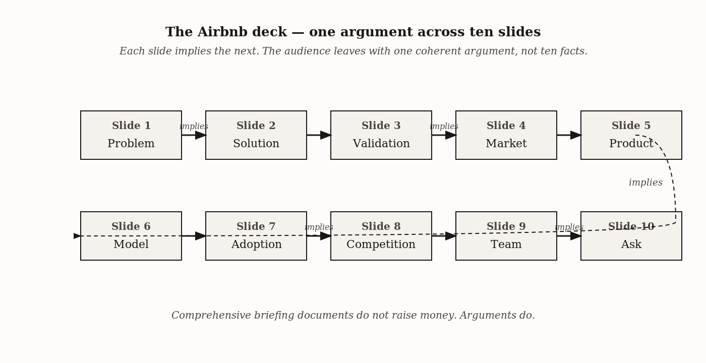
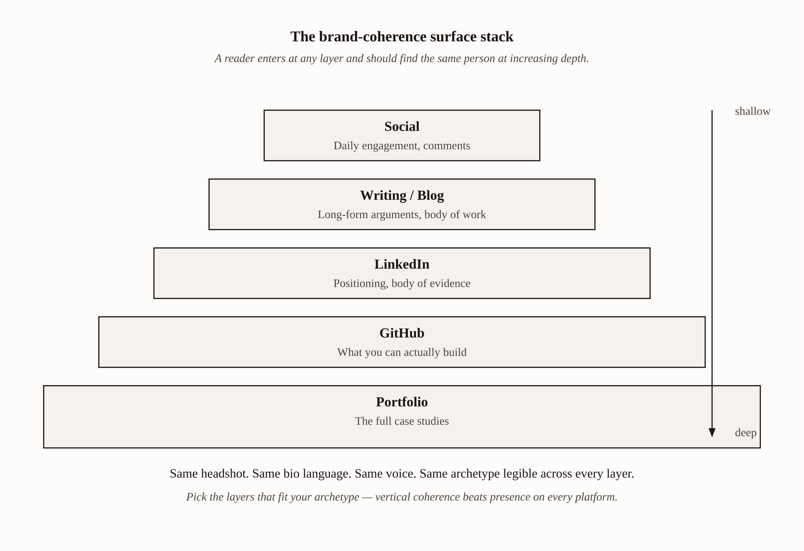
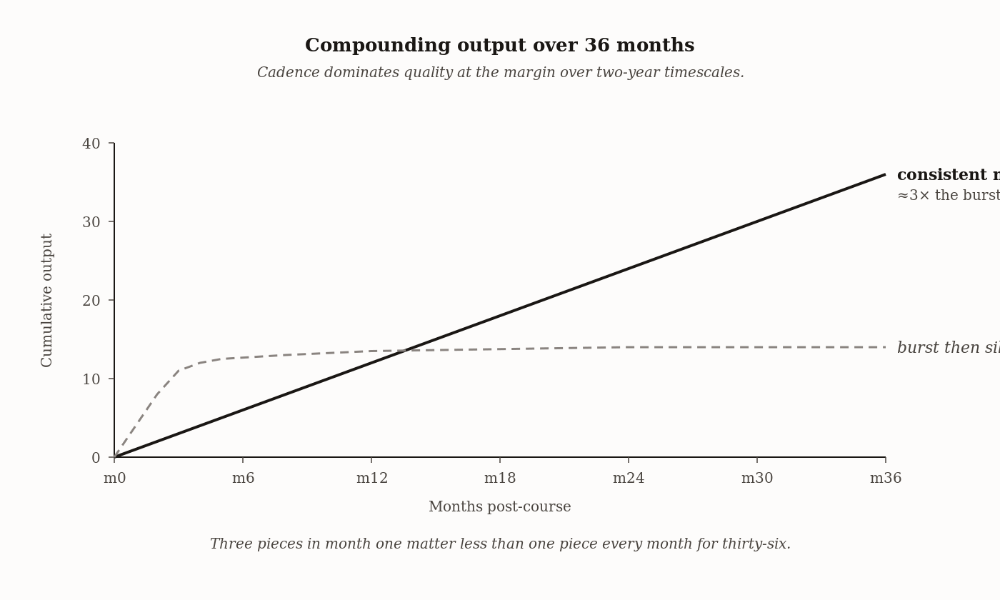
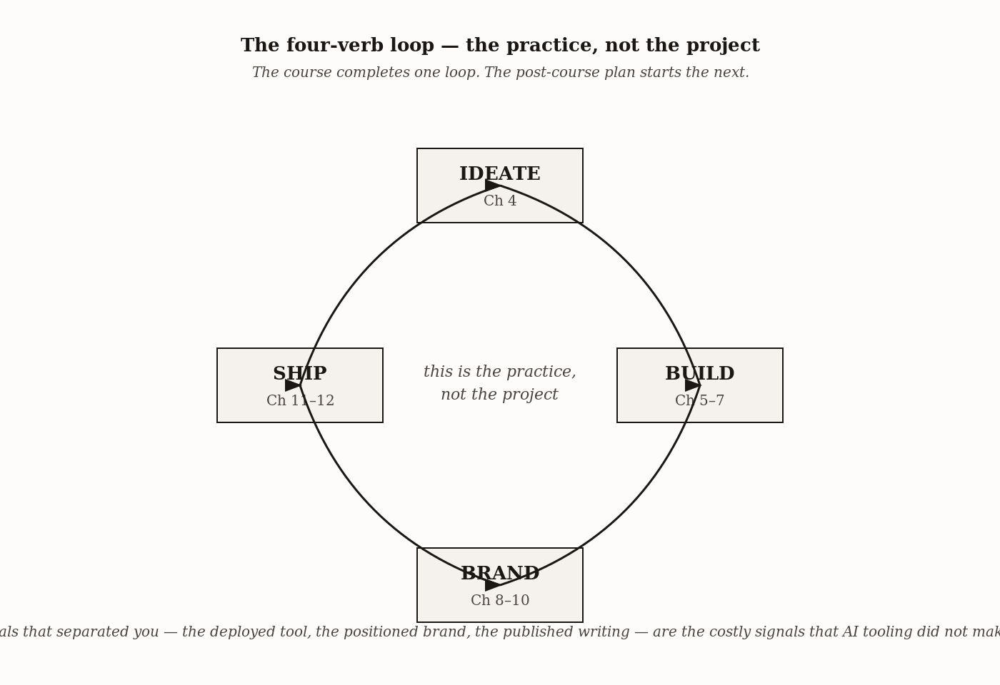

# Chapter 12 — Professional Presence and Launch
*The final deliverable is not your portfolio. It is you.*

---

In early 2009, three founders walked into Y Combinator with a ten-slide deck and a working prototype. Their company was called AirBed and Breakfast. The idea: let people rent air mattresses on the floors of strangers' apartments. Their previous fundraising had involved selling branded cereal at political conventions to keep the lights on.

None of this was a strong opening.

The deck was [ten slides](https://www.failory.com/pitch-deck/airbnb). Plain typography, simple bar charts, no design flourishes. But every slide carried specific work, and every slide reinforced the same argument: *the world wants this, here is the proof, we are the team to build it, here is what we need.* Paul Graham listened. Y Combinator invested $20,000. Sequoia followed. The deck raised $600,000 total. That ten-slide deck is now one of the most studied artifacts in startup pitch literature — not because of how it looked, but because of what it did.

This chapter is about building that kind of coherence into everything you ship. Before you walk into the final presentation, you will have produced every artifact in this book: a deployed AI tool, a brand strategy, a visual identity, a portfolio, published writing. This chapter's job is to check whether all of it is saying the same thing — and to produce the final surfaces where the argument lands: a resume in two formats, a ten-slide pitch, a social presence that holds together, and a plan for what compounds after the course ends. If you have not yet deployed the portfolio from Chapter 11 or finished the brand strategy document from Chapter 8, do those first. A presentation that references a tool that does not work, or a brand that has not yet been specified, will fail the coherence test at the most visible moment.

---

## The Coherence Principle

The Airbnb deck worked because of three properties that had nothing to do with its visual quality.

**Every slide answered the same question.** Most pitches make ten different arguments: here is my technical architecture, here is my brand rationale, here is my career story, here is what I want from you. Each slide is a separate plea. The Airbnb deck made one argument across ten slides. Problem implied solution. Solution implied market. Market implied business model. Business model implied team. Each slide leaned on the previous one. The audience left with one thing in their heads because there was only one thing to hold.

**Specific numbers did load-bearing work.** The deck included real numbers from the San Francisco and Denver beta runs — small in absolute terms, but real. The difference between "strong early user interest" and "87 bookings in the first six weeks" is the difference between a claim and evidence. Specificity signals that founders have done the work. Vagueness signals that they have not.

**The team slide carried weight.** Three founders, named, with relevant work history. In a seed-stage company with no revenue to speak of, the team slide *is* the pitch — everything else is context for the question: do we believe these people can build this? A generic team slide loses. A specific one wins.

<!-- → [TABLE: Three coherence properties — columns: property, what it looks like when present, what it looks like when absent, where it applies beyond the deck (LinkedIn, resume, portfolio, follow-up)] -->

These three properties are not pitch-deck properties. They are presentation properties. They apply to your LinkedIn headline, your resume bullets, your portfolio case studies, and the email you send the morning after an interview. The Airbnb deck is the worked case for a principle that runs across every surface in your professional presence.


*Figure 12.2 — The Airbnb argument chain*

Read the deck slide by slide, because you will build your own version.

**Slide 1 — Problem.** Specific framing: hotel prices and the absence of local connection when traveling. The framing already implies the solution — you do not state a problem unless you have solved it.

**Slide 2 — Solution.** A web platform matching hosts with travelers. Stated cleanly, no buzzwords. The solution slide is shorter than the problem slide; the problem does most of the work.

**Slide 3 — Market validation.** Beta data from San Francisco and Denver. Small numbers, but real. Real beats aspirational every time.

**Slide 4 — Market size.** Top-down sizing: total traveler spend, achievable share, implied revenue. Calibrated, not wild.

**Slide 5 — Product.** Screenshots of the working prototype. Not a wireframe — a thing that existed and could be used.

**Slide 6 — Business model.** Ten percent commission per booking. One sentence. Defensible.

**Slide 7 — Adoption strategy.** Specific channels, specific tactics.

**Slide 8 — Competition.** Couchsurfing, hostels, Craigslist. Honest acknowledgment of alternatives. Acknowledging competition signals confidence; pretending it does not exist signals insecurity.

**Slide 9 — Team.** Three founders, named, with relevant history. Short. Specific.

**Slide 10 — Financials and status.** What has been spent, what is needed, what the runway buys.

Notice what the deck does not have: a slide about technical architecture, a slide about the company's values, a TAM-SAM-SOM breakdown, a feature roadmap. It is a ten-slide argument, not a comprehensive briefing document. Comprehensive briefing documents do not raise money. Arguments do. When you build your final presentation, follow the same discipline.

---

## The Resume — Two Versions, One Identity

The resume is the artifact that travels without you. It moves through ATS systems, HR inboxes, and hiring-manager email forwards. It must survive the automated filter and then earn attention from the human reader. These are two different requirements and they call for two different formats.

### Version 1: ATS-Optimized

Applicant Tracking Systems parse resumes before any human reads them. They extract text, score it against keyword criteria, and decide whether you advance. They are notoriously bad at parsing unusual layouts — two-column formats, tables, graphics, unusual fonts, text embedded in images. Many ATS systems strip formatting entirely and read the raw text.

The ATS-optimized version follows one rule: make it as easy as possible for software to read. Single column. No tables. No text boxes. Standard section headers — *Experience*, *Education*, *Skills*, *Projects* — use these exact words; ATS systems are trained to recognize them. Standard fonts: Times New Roman, Arial, Calibri, Georgia. Save as both PDF and .docx and submit both when the system allows. Nothing critical in headers or footers; some parsers skip them entirely.

Keywords matter. Read the job description for the role you are targeting. The words used in the description — programming languages, tools, methodologies, role titles — should appear in your resume. You are not gaming the system; you are using the vocabulary the field uses to describe the work.

The most important discipline, and the one most students violate: **show outcomes, not responsibilities**.

*"Worked with the team on data engineering tasks"* is a responsibility statement. *"Built a data pipeline ingesting 870 articles per day with a 90% deduplication rate, reducing manual curation time by four hours per week"* is an outcome statement. The outcome statement is specific. It contains a number, a quality metric, and a business impact. A reviewer can picture what was built, at what scale, and what it was worth. The responsibility statement contains none of that.

For every bullet in your experience section: does this show what I built and what happened because I built it? If not, rewrite it until it does. If you do not have specific numbers, use `[verify with X]` as a placeholder rather than inventing a figure. A missing number is honest; a wrong number is disqualifying.

<!-- → [TABLE: Responsibility vs. outcome bullets — five side-by-side pairs, each showing the before and after transformation — the pattern becomes learnable after three examples] -->

<!-- → [TABLE: ATS-optimized format requirements — columns: requirement, why it matters — six requirements, each with a specific failure mode when the requirement is violated] -->

### Version 2: Designer Format

Once the ATS filter is cleared — or when you are sending directly to a human — the designer format is the one that signals who you are. Use your brand's visual system from Chapter 9: your color palette, your type pair, your layout register. A reviewer who has already seen your portfolio should recognize the resume as belonging to the same person. A reviewer who has not should encounter, in the first five seconds, a document that signals craft and intentionality.

PDF only. Legible at 100% zoom on a standard laptop screen. No more than two pages, ideally one. The same content as the ATS version — same job titles, same companies, same dates, same bullets. The difference is format, not content.

The designer version is your archetype made visible in a document. A Sage's resume is precise and information-dense with restrained typographic hierarchy. A Creator's uses layout and white space as design elements. A Rebel's might break one rule deliberately and visibly. A Caregiver's is warm and organized. The archetype should be readable in the format choices before the reader has read a word.

Both versions must match your portfolio, your LinkedIn, your pitch deck. The same project descriptions. The same role narratives. The same accomplishments. The same tone. A reviewer who reads all three artifacts in sequence should encounter one person, not three slightly different people. If the resume sounds like a different person than the portfolio, either the brand strategy is not yet specific enough or the resume has not yet been revised to align with it. Fix the alignment before you submit.

---

## Social Media as Brand-Coherence Surface

The right framing: social media is a brand-coherence surface. Its job is to confirm that you are the same person across artifacts and to give your work somewhere to circulate. Most graduates either over-invest — chasing follower counts, posting without a thesis — or under-invest, treating LinkedIn as a checkbox. Both are mistakes.

**LinkedIn.** The headline is the most-read text in your entire professional presence. It appears in search results, connection requests, and message previews. It should be a positioning sentence, not a job title. *"AI Engineer at Acme Corp"* tells a reader where you work. *"AI engineer building tools that help knowledge workers reclaim their attention"* tells them what you are for.

The about section is 2,000 characters of brand real estate. Most people use it to list their job history, which is also in the experience section and therefore redundant. Use it to answer: why does the work you do matter, and who is it for? Write in your archetype's voice. Reference your tool, your methodology, your thesis about your field. End with a specific call to action.

The featured section should pin three things: your portfolio URL, your AI tool URL, and your most significant published piece.

Post cadence: once a month minimum if you are publishing from Chapter 10's content calendar; weekly if you can sustain it. Comments that add a specific thought, a data point, or a counterargument build your presence. "Great post!" comments are noise.

**GitHub.** Keep your profile readme substantive. Pin your four most relevant repositories — the ones that demonstrate what you can build, at what quality. The Madison AI tool should be one of them. A viewer who sees seventeen unfinished repositories with no documentation reads a different archetype than a viewer who sees four complete repositories, each with a well-written README that explains what the project does, why it exists, and what design decisions were made.

**Other platforms.** Twitter/X is optional and archetype-dependent. Sage and Hero archetypes can use it productively for technical commentary and project announcements. Caregiver and Innocent archetypes often find the platform culturally hostile; the opportunity cost of investing in it is high for these archetypes. A blog or Substack is recommended for Sage archetypes especially — the compounding effect of a monthly long-form piece over two years is substantial, not because of follower count but because the archive becomes a body of work that is discoverable and citable.

The unifying rule: every surface should reinforce the same brand. Same headshot. Same bio language. Same voice. A reader who encounters you on LinkedIn, then your portfolio, then your GitHub, then your writing, should find the same person at increasing depth — not four versions of you in different tones trying to appeal to different audiences.

<!-- → [TABLE: Archetype-to-platform fit — columns: archetype, recommended primary platform, secondary, avoid, cadence note — makes the choice strategic rather than default] -->


*Figure 12.6 — The brand-coherence surface stack*

---

## The Final Presentation

The course's final presentation is the assembled artifact. Format: Guy Kawasaki's 10/20/30 rule. Ten slides. Twenty minutes. Thirty-point font minimum.

The 30-point rule is the most underestimated of the three. Kawasaki's argument: a presenter who uses smaller font has too much content per slide and is reading the slides rather than presenting them. Forcing 30-point font forces editing. Editing is what good presentations need. If you cannot fit the content at 30-point font, the content is too dense for slides — move it to your speaking script. Each slide: one big idea, one big number, or one big visual. Nothing else.

Here is the ten-slide structure, adapted from Kawasaki and from the Airbnb pattern:

**Slide 1 — Title and positioning sentence.** Your name, your tool's name, one sentence that positions both. Not "I built a tool called X." *"[Name]: I build AI tools that help [audience] [outcome]. [Tool name] is the first one."*

**Slide 2 — Problem.** Who hurts, how often, how much. Open in a specific moment — one person, one morning, one pain. *"Marketing managers spend an average of 4.2 hours per week manually curating competitive intelligence that is out of date before they use it"* lands harder than *"knowledge workers spend too much time on manual tasks."*

**Slide 3 — Solution.** What you built, in user-facing terms. Not the technical architecture — what does the user do, what do they get, what changes? One screenshot or demo GIF.

**Slide 4 — How it works.** Architecture overview at a level the audience can follow. Trigger, pipeline, AI layer, output. One labeled diagram.

**Slide 5 — Demo or evidence.** The deployed URL is real. Show it. If live demos are risky, show screenshots of actual use. Show real data the tool has processed. If you have user feedback from even two users, include one specific quote.

**Slide 6 — Brand position.** Archetype, audience, voice. Why the tool looks and reads the way it does. This is the slide that distinguishes your presentation from every other technical build in the room. Most students skip it or fold it into the solution slide. Put it here, explicitly: *"This tool is positioned for [specific audience], built on a [archetype] brand. Here is what that means for how it looks, how it speaks, and what it refuses to do."*

**Slide 7 — Validation.** Any users. Any usage metrics. Any feedback. Specific numbers. If the numbers are small, show them anyway — a 56% task-time reduction in a five-person beta is more credible than a vague claim of strong interest.

**Slide 8 — Roadmap.** What is next for the tool — not a feature list, but an argument for why the next version is worth building. One or two items, each connected back to the problem slide.

**Slide 9 — You as the team.** Your archetype. Your methodology. The four-verb framework applied to your work history. The portfolio URL on the slide. This is the most important slide in the deck for a hiring or partnership audience. Done well, it does most of the persuasion work.

**Slide 10 — The ask.** What you want the audience to do. Specific. *"I am looking for a machine-learning engineering role at a startup that is building user-facing AI products. If that describes you or someone you know, I would like fifteen minutes."* Vague asks produce vague responses; specific asks produce yes or no answers, both of which are useful.

<!-- → [TABLE: Ten-slide specification — columns: slide number, name, one-line content spec, speaking time, the single most important element] -->

### Opening and closing

Open in scene, not in introduction. The first sixty seconds are when the audience decides whether to pay attention. *"Hi, I am [name] and today I will be presenting..."* wastes those sixty seconds.

*"It is 7:45 on a Tuesday morning. A marketing manager at a mid-sized B2B company opens her laptop. The first thing she does is check what happened in her competitor landscape overnight — and it takes her forty-five minutes of tab-switching across six dashboards. My tool does that in ninety seconds. Here is how."*

That version earns attention. The difference between an opening that loses the room and one that earns it is almost always whether the presenter opened in scene or opened in introduction.

<!-- → [TABLE: Generic vs. scene opening comparisons — three side-by-side pairs — the pattern becomes replicable after seeing it twice] -->

Close with the ask, delivered directly. After ten slides and twenty minutes, the room knows what you built and who you are. Tell them specifically what you want them to do with that knowledge. Do not trail off. The ask is the last impression.

Twenty minutes. Practice the full run-through at least twice, ideally three times. Record the second practice and watch it. You will find at least one place where you are reading from the slide rather than presenting. Fix it before the third run.

---

## Building for After

The course ends. The work continues. The compound interest of the next two years will dwarf the return of the course itself — but only if you install the habits now, while the momentum is live.

**Refresh the portfolio quarterly.** Add one new case study per quarter. Update the bio. Replace the oldest or weakest project. A portfolio that does not change after the course ends says "this person stopped building." The portfolio is a living asset; treat it that way.

**Publish on a sustainable cadence.** Whatever cadence you committed to in Chapter 10's content calendar, keep it. The compound effect of one well-argued piece per month over three years is a body of work that is discoverable, citable, and searchable. The piece you publish in month thirty-six will be found by someone who finds it in month forty. Cadence beats quality at the margin; consistent output produces more compounding than brilliant output published once and then nothing.

**Build relationships, not a network.** A network is a list of people you have met. Relationships are the five to ten people whose work you respect, whose archetype is compatible with yours, and with whom you engage substantively over years. The opportunities that matter most — the job that was never posted, the partnership that changed a career trajectory — come from relationships, not from cold applications through ATS systems.

Pick five people whose work you have read in this course. Engage with one piece of their work this week in a way that shows you read it closely. Not "great piece!" — one specific thought, one question, one additional data point. Do this once a month with each of them for a year. This is the work that compounds.

Write the post-course plan before the final presentation, not after. Three new portfolio additions you will build in the next quarter, three published pieces you will write, and five relationship engagements you will make. Calendar them as appointments. The Creative Engineer version of you in 2027 will be the cumulative product of a thousand small consistencies.


*Figure 12.10 — Cadence dominates quality at the margin*

<!-- → [TABLE: Post-course plan template — columns: commitment type (portfolio addition 1–3, published piece 1–3, relationship engagement 1–5), specific commitment, deadline, done/not done — blank for the student to fill] -->

---

## The Assembled Creative Engineer

The four verbs from Chapter 1 — Ideate, Build, Brand, Ship — have now run their full course.

Ideate happened in Chapter 4: Career PRD, problem specification, audience identification. Build happened in Chapters 5, 6, and 7: pipeline, AI layer, interface. Brand happened in Chapters 8, 9, and 10: strategy, visual identity, content and storytelling. Ship happened in Chapter 11 and in this chapter: portfolio deployed, tool live, presentation delivered, launch post published, resume submitted.

The final presentation is not a school deliverable. It is the first Ship of the rest of your career. The Spence signaling argument from Chapter 1 closes here: the signals that separated you from other candidates — not the GitHub repository, but the deployed tool, the positioned brand, the published writing, the coherent presentation — are the costly signals that AI tooling did not make cheap. You have spent a course producing them. They compound forward.

<!-- → [TABLE: Four-verb loop summary — columns: verb, chapters, primary artifact produced, signal it creates] -->


*Figure 12.11 — The four-verb loop*

---

## A Note on the Framework's Limits

I should be honest about what this chapter cannot tell you.

The case I am making — that integrated, archetype-coherent presentations produce better hiring and fundraising outcomes than incoherent presentations of equivalent technical merit — is grounded in pattern observation across many cohorts and in documented public cases. A controlled study comparing coherent versus incoherent presentations while holding technical quality constant would either strengthen or refute it. That study does not exist. The gap is real.

**What would change my mind:** Evidence from that study, if it showed no significant effect of coherence on outcome when technical quality is held constant.

**Still puzzling:** The relationship between presentation craft and authentic presence. Some students deliver technically polished pitches that read as performative — the mechanics are right but the speaker is not there. Others give visibly imperfect pitches that land powerfully because the person is unmistakably present. Craft matters; it is not the whole story. What makes a pitch land beyond technical execution is something I cannot yet specify cleanly enough to teach. I suspect it has to do with the difference between *performing* coherence and *having* it. The audience, somehow, can tell.

---

## Summary

Here is what you can do now that you could not before this chapter.

You can explain why coherence is a stronger predictor of presentation outcomes than polish, using the Airbnb deck as the worked case. You can produce a two-version resume — ATS-optimized and designer — with outcome-oriented bullets and no fabricated numbers. You can build a ten-slide, twenty-minute, thirty-point-font pitch that opens in scene, runs specific numbers, and closes with a direct ask. You can deliver that pitch live, with timing practiced and speaker notes internalized. You can align every social-media surface with the brand strategy, so a reader who finds you anywhere encounters the same person at increasing depth. And you can plan the next quarter of compounding work in specific, calendared commitments.

**The one idea that matters most:** Every element of your professional presence should reinforce the same argument. The argument is: here is the specific work I do, here is who it is for, here is why it matters, here is what I want next. The Airbnb deck made that argument with ten slides in 2009 and raised $600,000. You are making the same argument with a portfolio, a presentation, a resume, and a social presence. The mechanism is the same; the surfaces are different.

**The common mistake:** Treating the final presentation as a deliverable to complete rather than a moment to land. The deliverable is yours in either case. The moment — the sixty seconds when the audience decides whether to pay attention, the final ask that produces a yes or a no — only happens once. Practice until the mechanics are invisible, so you can be present for the moment.

**The Feynman test:** Can you explain to someone who has never given a pitch why the Airbnb deck raised money despite being visually plain? If you can explain it using the coherence principle — not just "it had good numbers" but why specific numbers do the work that vague claims cannot — you understand this chapter.

---

## Connections Forward

There is no Chapter 13. But there is a year from now, and a practice to sustain.

The question this chapter raises but cannot answer for you: what happens when the first version of the work does not land? When the presentation is good but the market is not receiving it? When the job you want is not open, when the investor you targeted is not investing in your space, when the audience you built the tool for turns out to need something different?

The Creative Engineer's answer: iterate. The four-verb loop from Chapter 1 is not a one-time pass through a course. It is the loop you run again. New ideation, new build, new brand iteration, new ship.

The bet this book makes closes here: for as long as building stays cheap and positioning stays hard, the Creative Engineer has a durable advantage. The signals you have produced — deployed tool, positioned brand, published writing, coherent presentation — are the costly ones. They compound. Trust the compounding.

Now go ship.

---

## Exercises

### Warm-Up

**W1. Coherence Properties in the Airbnb Deck**
Identify the three coherence properties from the first section (argument coherence, specific numbers, team weight) in the Airbnb deck. For each property, name the specific slide where it is most visible and explain in one sentence what the slide does that a vague version of the same slide would not.

*Tests Objective 1. Difficulty: Low.*

**W2. Responsibility to Outcome**
Take one bullet from your current resume that is written as a responsibility statement. Rewrite it as an outcome statement. If you do not have a specific number, add a `[verify with X]` placeholder and identify exactly where you would go to find the number.

*Tests Objective 2. Difficulty: Low.*

**W3. Archetype-to-Platform Alignment**
For your archetype from Chapter 3, identify the social-media platform that fits best and the one that fits worst. In two sentences, explain why the fit ranking follows from the archetype's core motivation.

*Tests Objective 5. Difficulty: Low.*

---

### Application

**A1. ATS Resume Build**
Build the ATS-optimized version of your resume. Run it through a parser tool (Jobscan or Resume Worded). Document the parse rate and identify the three fields the ATS had the most difficulty reading. Revise until no critical fields are being dropped.

*Tests Objective 2. Difficulty: Medium.*

**A2. Ten-Slide Deck Production**
Build your ten-slide final presentation using the structure from the presentation section. For each slide, write the speaker note (what you would say while the slide is on screen, in 1.5–2 minutes of spoken content). Time the full walk-through. If it exceeds twenty minutes, identify which slide is running long and edit until you are at or under twenty.

*Tests Objective 3. Difficulty: Medium.*

**A3. Pre-Presentation Coherence Test**
Deliver the presentation once to a classmate before the formal final. After the delivery, ask them three questions: what is the one thing this presentation is arguing; what specifically is being built; and what do you want me to do. If they cannot answer all three specifically, identify which slides are failing the coherence test and revise.

*Tests Objective 4. Difficulty: Medium.*

**A4. Launch Post**
Write your launch post for LinkedIn (or Substack if your archetype calls for it). Open in a specific scene — not "I'm excited to announce." Include the portfolio URL and the AI tool URL. End with a specific ask. Post it during or immediately after the final presentation week.

*Tests Objective 5. Difficulty: Medium.*

---

### Synthesis

**S1. Counter-Argument on Coherence**
The chapter argues that coherence beats polish — that a plain deck with a coherent argument outperforms a beautiful deck with ten different arguments. Design the strongest counter-argument: are there contexts where polish matters more than coherence? Name the specific context, the specific evaluator, and the specific reason polish would dominate. Then evaluate: does your counter-argument undermine the chapter's central claim, or does it identify a boundary condition where the claim does not apply? (300 words.)

*Tests Objective 1. Difficulty: Medium–High.*

**S2. Brand Strategy × Presentation Coherence Check**
Take your brand strategy from Chapter 8 and your final presentation. Run the internal consistency check: does every slide express the same archetype and voice as the brand strategy document? Identify any slide that contradicts the strategy document — a different tone, a different claim about the audience, a different positioning sentence — and revise it to align. Document what you changed and why. (400 words.)

*Tests Objectives 1 and 4. Difficulty: High.*

**S3. Post-Course Plan with Reasoning**
Write your post-course plan: three portfolio additions, three published pieces, five relationship engagements, all with specific deadlines. For each commitment, explain in one sentence why it is this item specifically — why this case study and not another, why this person and not a different one. The reasoning is the exercise; the reasoning prevents the plan from being aspirational rather than actual. (300–400 words.)

*Tests Objective 6. Difficulty: High.*

---

### Challenge

**C1. Craft vs. Presence**
The "Still puzzling" section names a limit of the coherence framework: some technically polished pitches read as performative, while some visibly imperfect pitches land powerfully because the speaker is unmistakably present. What distinguishes a pitch that is polished and present from one that is polished and performative? Design a rubric with at least four dimensions that a pitch coach could use to evaluate this distinction. Each dimension should produce a clear better/worse judgment when applied to a specific pitch moment. (400 words.)

*Tests the limits of the coherence framework. Difficulty: Very High.*

**C2. The Durability Bet**
The Spence signaling argument predicts that the signals you have produced — deployed tool, positioned brand, published writing, coherent presentation — are separating signals because they are still costly to produce. Suppose AI tooling advances over the next three years to the point where all of these artifacts can be produced in an afternoon with a good prompt. Which of the four verbs (Ideate, Build, Brand, Ship) would remain costly, and which would cheapen? What would the new separating signals be? (400–500 words.)

*Tests the book's central bet about the durability of the costly signals the course teaches. Difficulty: Very High.*

---

## LLM Exercise — Self-as-Project

**Project:** Self-as-Project
**What you're building this chapter:** The complete launch package — two-version resume, finalized LinkedIn, ten-slide pitch deck of yourself, and a launch announcement post.
**Tool:** Claude Project (the same project from Chapter 1); Google Docs or Word for the resume PDF; Pitch, Beautiful.ai, or Google Slides for the deck; Cowork for assembling final files.

**The Prompt:**

```
Build my complete launch package. This is the final integration. Every
artifact must be consistent with my Personal Brand Strategy v1 (Ch 8),
my Visual System (Ch 9), and my deployed portfolio (Ch 11).

Here is my brand strategy summary:
[PASTE: archetype, voice notes, tagline, and UVP from your Chapter 8
strategy document]

Here is my tool:
[PASTE: one paragraph describing the AI tool — what it does, who it
serves, what problem it solves, the deployed URL]

Here is my portfolio URL:
[PASTE]

Now build five deliverables:

DELIVERABLE 1 — RESUME, ATS-OPTIMIZED VERSION.
Single column. Standard section headers (Experience, Education, Skills,
Projects). No graphics, no two-column layouts. Plain text, saved as
.docx and .pdf. Keyword-rich for the kind of role described in my
Career PRD (Ch 4).
For each role, write 3–5 outcome-oriented bullets. Format:
  [action verb] [what was built] [at what scale] [with what result]
Example: "Built data pipeline ingesting 870 articles per day with
90% deduplication rate, reducing manual curation time by 4 hrs/week."
If I do not have specific numbers for a bullet, insert [verify with X]
rather than inventing a figure.

DELIVERABLE 2 — RESUME, DESIGNER VERSION.
Same content as Deliverable 1, visually distinctive. Uses my palette
and type pair from Ch 9. Uses my tagline. PDF only. Should signal craft
within 5 seconds of opening.

DELIVERABLE 3 — LINKEDIN FINALIZATION.
Paste-ready text for:
  - Headline (under 220 characters, positioning sentence not job title)
  - About section (under 2,000 characters, archetype-aligned, ends
    with a specific call to action)
  - Featured section: three pinned items (portfolio URL, AI tool URL,
    best published piece URL)
  - Current role description rewrite (outcome-oriented bullets)
  - One prior role description rewrite

DELIVERABLE 4 — 10/20/30 PITCH DECK OF MYSELF.
Ten slides. 20 minutes spoken. 30-point font minimum.
For each slide, give me:
  - The headline (large type, 8 words maximum)
  - Body content (3 bullets maximum OR one image/chart description)
  - Speaker note (what I say while the slide is on screen,
    1.5–2 minutes of spoken content)

Slide structure:
  1. Title — name, role-claim, one-sentence positioning
  2. Problem — who hurts, how often, how much. Open in scene.
  3. Solution — my tool, in user-facing terms
  4. How it works — architecture overview, Madison-pattern reference
  5. Demo / evidence — deployed URL, screenshot, one real outcome
  6. Brand position — archetype, audience, voice, what I refuse to do
  7. Track record — three most relevant accomplishments
  8. Roadmap — what is next for the tool
  9. Me as the team — archetype, methodology, portfolio URL
  10. Ask — specific, direct, one sentence

DELIVERABLE 5 — LAUNCH POST.
LinkedIn post (or Substack if my archetype is Sage-publication-leaning).
Opens in a specific scene, not "I'm excited to announce."
200–400 words.
Includes portfolio URL and AI tool URL.
Ends with a specific ask.
Archetype-aligned in voice throughout.

After all five deliverables, write a one-paragraph "How to use this
package over the next 30 days" — what to do with each artifact,
in what order.

Output five Markdown files, one per deliverable, ready to paste or
convert.
```

**What this produces:** Five finished artifacts — the launch package. Combined, they are the last mile between the work you have built and the people who should know about it.

**How to adapt:** If you are applying to fewer than ten roles in the next thirty days, skip Deliverable 1 and lean on Deliverable 2 alone. ATS optimization matters at scale; at single-digit application counts, the designer version is sufficient. If you are on the Startup Brand path, replace Deliverables 3 and 4 with a startup-focused LinkedIn company page setup and an investor-facing version of the pitch deck.

**Preview of next chapter:** There is no next chapter. The next exercise is real. Send the launch post. Go to interviews. Iterate.

---

## AI Wayback Machine

The ideas in this chapter didn't appear from nowhere. **Margaret Bourke-White** built a professional presence by deliberately crossing institutional boundaries that her field treated as fixed: first foreign photographer admitted into the Soviet Union (1930), first woman war correspondent attached to the U.S. Army Air Forces, first female photographer at *Life* magazine and the photographer of its first cover (1936), among the first journalists to document the liberation of Buchenwald. None of these crossings were accidents. Each was the result of a clear decision about which assignment to take, which to refuse, and how to make the case for the next one. The chapter's argument — that professional presence is the assembled artifact, not the byproduct of doing good work — is Bourke-White's working method, made explicit.


*Margaret Bourke-White, c. 1930s. AI-generated portrait based on a public domain photograph.*

**Run this:**

```
Who was Margaret Bourke-White, and how does her deliberate boundary-crossing — choosing the assignments that built a professional presence rather than waiting to be assigned them — connect to the chapter's argument that the resume, the deck, the social-coherence stack are an *assembled artifact* you build with intention, not a byproduct of doing good work? Keep it to three paragraphs. End with the single most surprising thing about her career or ideas.
```

→ Search **"Margaret Bourke-White"** on Wikipedia after you run this. See what the model got right, got wrong, or left out.

**Now make the prompt better.** Try one of these:

- Ask it to explain why presence has to be designed rather than earned passively, in plain language
- Ask it to compare Bourke-White's deliberate assignment choices to a Creative Engineer's portfolio-and-launch sequencing
- Add a constraint: "Answer as if you're writing the post-course plan that turns the next twelve months into a designed presence"

What changes? What gets better? What gets worse?

---

*Tags: professional-presence · pitch-deck · airbnb · kawasaki-10-20-30 · resume · ATS · launch · final-presentation · coherence · four-verb-framework · INFO-7375*
