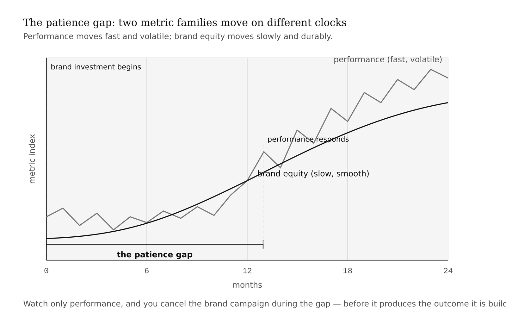

# Chapter 13 — Measuring Brand Equity & Impact
*A number that moved is not a verdict. It is a question.*

> **TL;DR:** If a brand is an asset, you have to track it — and most teams track the wrong things or over-trust a single metric. This chapter teaches brand tracking, NPS and its limits, the difference between brand and performance metrics, and the hard problem of attribution, then has you build a measurement plan with honest baselines (and refuse the fabricated ones).
>
> | Section | Preview |
> |---|---|
> | What to Measure, and Why | The split between brand metrics and performance metrics, and what each answers. |
> | Brand Tracking | The longitudinal panel — awareness, consideration, preference — that watches equity over time. |
> | NPS and Its Limits | The popular loyalty metric, what it's good for, and where it misleads. |
> | The Attribution Problem | Why a metric moving rarely proves the brand work caused it. |
> | Vanity vs. Value | Telling the metrics that flatter from the metrics that matter. |
> | Worked Example: A Measurement Plan | Building a metric plan with sourced, blank-until-measured baselines. |

---

In the spring of 2017, Pepsi's brand tracking scores dropped sharply in the weeks after the Kendall Jenner ad was pulled. Awareness went up — everyone knew about the ad. Favorability went down. Consideration among key demographics fell. The tracking study showed four things moving in four directions simultaneously, and the instinct of every journalist who covered the story was to find one number, declare it the verdict, and move on.

The number most commonly cited was the NPS drop. It was real. It was also not the whole picture, not the cause of anything on its own, and not sufficient to understand what had actually happened to the brand.

This is the measurement problem in miniature. A brand is a multidimensional asset — it carries associations, awareness levels, preference rankings, price premium capacity, and loyalty signals all at once. Any single number extracted from that multidimensional space answers one question while leaving the others open. The discipline of brand measurement is knowing which questions each number actually answers, knowing which questions it cannot answer, and above all resisting the inference that a number moving means your work caused it.

That last resistance is the hardest. It is also the most important. This chapter is about building it.

---

## What to Measure, and Why

Brand measurement divides into two families that answer fundamentally different questions.

**Brand metrics** measure the asset itself: awareness (does the audience know you exist?), consideration (would they try you?), preference (would they choose you over alternatives?), association strength (what do they think when your name appears?), sentiment (is the thinking positive or negative?), and price premium (will they pay more for you than for a generic equivalent?). Brand metrics move slowly. A well-run campaign rarely produces measurable brand equity movement in less than six months. This slowness is a feature, not a bug — equity is a durable asset precisely because it is hard to move quickly in either direction.

**Performance metrics** measure the business outcomes that the brand is supposed to eventually generate: conversion rate, customer acquisition cost (CAC), return on ad spend (ROAS), retention, revenue per customer, lifetime value. Performance metrics move fast. They respond to a campaign within days or weeks. They are the numbers that show up on weekly dashboards and get read in Monday morning meetings.

Both families matter. The error that kills measurement programs is treating them as interchangeable.

A deep-discount campaign almost always lifts performance metrics in the short run. Conversions go up. CAC goes down because the easier-to-convert price-sensitive customers enter the funnel. Revenue for the period looks healthy. Meanwhile, the discount is training existing customers to wait for sales, reducing price premium, and associating the brand with cost rather than value. The brand metrics, tracked on their slower cycle, show the erosion. If you are only watching performance metrics, you will declare the campaign a success until the price premium has disappeared and you cannot explain why margin is collapsing.

The reverse also happens. A brand-building campaign — a documentary series, a long-form content strategy, a thought-leadership body of work — may produce no measurable performance movement for a year. The performance metrics look flat. The brand metrics, if anyone is tracking them, show awareness climbing and consideration improving among exactly the right segments. If you are only watching performance metrics, you will cancel the campaign before it produces the business outcomes it is building toward.

<!-- → [CHART: Two-axis time series — x-axis is time (0 to 24 months); one line shows performance metric (fast-moving, volatile); one line shows brand metric (slow-moving, smoothly rising); the gap between when brand investment begins and when performance responds is labeled "the patience gap"] -->



Measure both. Know which you are reading at any given moment.

---

## Brand Tracking

A brand tracking study is a repeated survey — the same questions, asked of the same representative population, at regular intervals — designed to show how equity is accumulating or leaking over time. The value is not any single survey result; it is the trend line. A single data point tells you where you are. A trend line tells you where you are going.

The standard metrics a tracking study watches are three pairs.

**Aided and unaided awareness** measure whether your audience knows you exist. *Unaided awareness* is the more demanding measure: "What brands in this category can you name?" Your brand appearing unprompted indicates strong salience — the brand is mentally available when the category is cued. *Aided awareness* is softer: "Have you heard of [your brand]?" Almost everyone will say yes to a sufficiently prominent brand, which is why aided awareness has a ceiling problem and unaided awareness is the more meaningful metric for competitive position.

**Consideration and preference** measure the purchase funnel. *Consideration* is "would you try this brand?" — a lower bar, measuring openness. *Preference* is "given a choice, would you choose this brand over the alternatives?" — a higher bar, measuring actual competitive standing. A brand with high consideration and low preference has an awareness problem it has already solved; the gap reveals that something in the evaluation process is failing.

**Association strength and sentiment** measure what the brand means. Which attributes do audiences associate with the brand, and how strongly? Is the sentiment around those associations positive or negative? This layer of tracking connects directly to the CBBE pyramid from Chapter 2: awareness is the base, associations are the second layer, attitude and sentiment are the third, and preference and loyalty are the top. Tracking association strength lets you see whether the brand is climbing the pyramid or whether equity is concentrated at the base without converting to preference.

The standard tracking cadence for a mature brand is quarterly. For a brand in active repositioning — like the Jaguar case from Chapter 10 — monthly tracking during the transition period is defensible. For an early-stage personal or startup brand, bi-annual may be the right cadence: more frequent than that and you are measuring noise rather than signal, because equity moves too slowly to show real change in less than six months.

<!-- → [TABLE: Brand tracking metrics reference — columns: metric, what it measures, survey question that captures it, interpretation caution, cadence; five rows: unaided awareness, aided awareness, consideration, preference, association strength/sentiment] -->


Kevin Lane Keller's brand audit framework connects tracking data back to the strategic questions: is the brand building the right associations? Is it differentiated from competitors? Is it consistent over time? The brand tracking study is the operational implementation of the audit cycle — not a one-time diagnosis, but a continuous monitoring system.

---

## NPS and Its Limits

Net Promoter Score was introduced by Fred Reichheld in a 2003 *Harvard Business Review* article titled "The One Number You Need to Grow." The survey instrument is a single question: "How likely are you to recommend [brand] to a friend or colleague?" on a 0–10 scale. Respondents scoring 9–10 are "promoters"; 7–8 are "passives"; 0–6 are "detractors." NPS is promoters minus detractors, expressed as a number between −100 and +100.

The appeal is simplicity. A single question, a single number, easy to track, easy to report up. Reichheld's original article argued that NPS was a leading indicator of revenue growth — that companies with higher NPS grew faster. The claim was compelling enough that NPS became the most widely used loyalty metric in corporate marketing within a decade of publication.

Then the replications started coming in.

The finding that NPS predicts growth has been substantially contested in the peer-reviewed literature. Keiningham et al.'s 2007 paper in the *Journal of Marketing* attempted to replicate Reichheld's findings using a broader dataset and found no evidence that NPS outperforms other satisfaction and loyalty metrics as a growth predictor. Subsequent meta-analyses have found that the NPS-growth correlation is industry-specific, geographically unstable, and sensitive to the comparison set. The metric is not wrong — it measures something real — but it does not measure the one thing it was claimed to measure uniquely.

The documented limits are worth naming specifically because NPS is so widely used that treating its limitations as known risks becomes a professional competency.

**The single-item problem.** NPS captures willingness to recommend. It does not capture why. A customer with a score of 8 who would not recommend the product because it is "not for their network" is structurally different from a customer with a score of 8 who is enthusiastic but has not had an occasion to recommend. Both appear identically in the NPS calculation. The follow-up question — "why did you give that score?" — is where the actionable signal lives, and it is frequently not asked or not analyzed.

**The cultural calibration problem.** Scoring norms vary significantly by country. Japanese consumers tend to score lower across all satisfaction scales; American consumers tend to score higher. A company comparing NPS across geographies without cultural calibration is comparing numbers that do not mean the same thing. An NPS of 30 in Japan and 30 in the United States are not equivalent signals.

**The information compression problem.** Converting a 0–10 scale to a three-category system — promoter, passive, detractor — discards information. A customer who scores 6 is treated identically to one who scores 0. The gap between 8 (passive) and 9 (promoter) is treated as a category boundary; the gap between 9 and 10 is treated as equivalent. The compression is convenient for reporting and mathematically arbitrary.

**The correlation problem.** A rising NPS tells you that more of your surveyed customers are willing to recommend you. It does not tell you whether they are actually recommending you, whether those recommendations are generating new customers, or whether the rise in score is related to anything you did. NPS is a lagging measure of sentiment, not a leading measure of growth. Using it as a growth forecast requires assumptions that the original research claimed to demonstrate and the replication literature has substantially undermined.

The practical guidance: track NPS as one lagging signal among several. Compare it to itself over time, not to benchmarks from other industries. Analyze the follow-up qualitative responses. Do not use it as the primary verdict on brand health. Do not report it to leadership as a growth forecast without the surrounding context.

<!-- → [INFOGRAPHIC: NPS calculation diagram — the 0–10 scale with promoter/passive/detractor zones marked, the subtraction formula, and callout boxes flagging: single-item problem, cultural calibration problem, compression problem, correlation problem] -->


---

## The Attribution Problem

Here is the question that brand measurement ultimately cannot fully answer: when a metric moves, did your work cause it?

This is not a measurement failure. It is a structural feature of the environment in which brands operate. A brand runs a campaign in October. In November, sales rise. Did the campaign cause the sales? Seasonality is up in October–November. A competitor had a product recall in the same period. The economy posted unexpectedly strong employment numbers. The brand's largest distributor ran a promotion. Any of these could explain the November sales rise. The campaign is one candidate cause among many.

The field of marketing attribution tries to answer the causal question by tracking which touchpoints a customer encountered before converting and assigning credit across them. The two dominant approaches are **multi-touch attribution models** and **marketing-mix modeling (MMM)**.

Multi-touch attribution — last-click, first-click, linear, time-decay, data-driven — distributes credit for a conversion across the touchpoints in the customer's recorded journey. Last-click attribution gives full credit to the touchpoint immediately before conversion. First-click gives full credit to the first touchpoint. Linear distributes it equally. Time-decay weights recent touchpoints more heavily. Data-driven models use machine learning to estimate each touchpoint's incremental contribution.

All of these models share a structural problem: they can only attribute credit to touchpoints that were tracked. Brand advertising seen on a billboard, a recommendation from a friend, a positive review read three months before purchase — none of these typically appear in the attribution model. Multi-touch attribution operates on the observable portion of the customer journey and attributes 100% of the credit within that portion. The unobserved portions — which often include the most significant brand-building activities — are invisible.

Marketing-mix modeling takes a different approach: rather than tracking individual journeys, it uses aggregate time-series data (weekly or monthly sales, alongside media spend, pricing, promotions, economic indicators, competitor activity) to estimate the contribution of each marketing input to sales outcomes. MMM can handle the unobserved brand touchpoints that multi-touch attribution misses, because it works at the aggregate level. The tradeoff is granularity — MMM tells you that brand advertising contributed approximately 18% of sales over the period; it cannot tell you which specific campaigns or audiences were responsible.

Neither approach gives you clean causal identification. Both give you estimates with meaningful uncertainty.

The cleanest design for measuring brand campaign effect is a **brand-lift study**: divide your audience into an exposed group and a matched control group, show the campaign to the exposed group but not the control group, and compare brand metrics between the two groups at the end of the measurement period. The difference between exposed and control is your best estimate of campaign effect. This is the design logic of a randomized controlled trial applied to brand measurement. It is not always feasible — digital platforms increasingly allow it; traditional media rarely do — but when it is feasible, it produces the most defensible causal claim available.

The honest position to hold when reading brand metrics: a number that moved is evidence that something changed. It is not, by itself, evidence that your work caused the change. The causal inference requires additional work — a plausible mechanism, an absence of competing explanations, ideally a comparison condition. AI dashboards are very good at reporting that numbers moved. They report the correlation fluently and leave the causal leap entirely to you. The leap is where the judgment lives.

<!-- → [DIAGRAM: Attribution problem visualization — a customer journey timeline with observable touchpoints (ads, website visits, email opens) marked in one color and unobservable touchpoints (word-of-mouth, billboard, in-store display) marked in another; shows the gap that multi-touch attribution cannot see] -->


---

## Vanity vs. Value

Paul Farris, in *Marketing Metrics*, offers a useful test for any proposed metric: if this number changed tomorrow, would you do anything differently?

If the answer is no, the metric is vanity.

A **vanity metric** flatters the team without informing a decision. Raw impressions is the canonical example: a post that reaches 100,000 people who scroll past it produces 100,000 impressions and zero brand impact. The impressions look impressive in a slide deck and change nothing about what you should do next. Follower counts have the same property — they are growth metrics that can be optimized through tactics (follow-for-follow, broad hashtag targeting, giveaway campaigns) that have no connection to reaching the audience that matters for brand equity. Raw pageviews, raw video plays, app downloads without activation rates — all vanity metrics in most contexts.

A **value metric** connects to a decision or a dollar. Qualified conversion rate — not raw conversion, but conversion among the segment you are actually trying to reach — tells you whether your positioning is landing with the right audience. Retention rate tells you whether customers who bought once found enough value to come back. Price premium measures whether your brand is generating the economic outcome that brand equity is supposed to produce. Referral rate tells you whether your customers are functioning as the organic distribution channel that an Everyman or Caregiver brand needs. Inbound opportunity quality — are the leads arriving from brand-driven channels better or worse than those from paid channels? — tells you whether brand investment is producing more efficient customer acquisition over time.

The vanity/value distinction is not fixed by metric type. Impressions can be a value metric if the decision they inform is about reach among a specific target — "are we achieving effective reach against our defined target audience?" In that context, impressions against the defined audience segment is a meaningful number. Impressions in a deck being used to justify the budget spent is vanity. The context and the decision being informed matter as much as the metric itself.

<!-- → [TABLE: Vanity vs. value metric examples — columns: metric name, typically vanity because, can be value when, decision it would inform if value; eight to ten rows covering impressions, follower count, pageviews, NPS, conversion rate, retention, price premium, referral rate] -->


The practical discipline for a measurement plan: for each metric on the list, write one sentence answering the Farris test. "If this number rose by 20% next quarter, I would [specific action]." If you cannot complete the sentence with a specific action, remove the metric from the plan. You will have fewer metrics. The ones remaining will be worth tracking.

---

## Worked Example: A Measurement Plan

Suppose I am tracking the brand built around the technical education work introduced in Chapter 4 — helping working engineers navigate the transition to engineering management. The target segment is staff engineers being pushed toward management roles. The archetype is Sage. The value proposition is decision support under uncertainty.

What are the five to seven metrics worth tracking?

The first cut at the list produces twelve candidates. Some are immediately vanity by the Farris test: raw Twitter/LinkedIn followers (I could buy these; they don't tell me the audience is the right audience), total newsletter subscribers (same problem — a sub count inflated by a broad lead magnet says nothing about the target segment), raw video views, total impressions. These come off the list.

What remains after the Farris filter:

**Unaided awareness among target segment** — do staff engineers considering the management transition think of this work when the category is cued? Measured by a short quarterly survey to the target panel. Source: survey tool (Typeform, SurveyMonkey). Cadence: quarterly. Decision it informs: whether top-of-funnel brand building is working or whether I need more distribution in the channels the target segment actually uses.

**Newsletter-to-course conversion rate** — of readers who have been on the newsletter for 90+ days, what fraction have purchased the course? Source: email platform + payment processor. Cadence: monthly. Decision it informs: whether the content is successfully moving consideration to preference, or whether something in the funnel is failing.

**Inbound consultation request quality** — among inbound consulting inquiries, what fraction are from companies in the target segment (tech companies at the relevant scale, with staff engineers making management transition decisions)? Source: intake form + CRM. Cadence: monthly. Decision it informs: whether brand positioning is attracting the right clients or whether I am getting inquiries from outside the target that will not convert.

**Net revenue per customer** — average revenue across all customer relationships in a given period, tracked over time. Source: payment processor. Cadence: quarterly. Decision it informs: whether price premium is holding, whether the audience is buying more over time, and whether adding products is increasing or cannibalizing value per customer.

**Referral rate** — fraction of new customers who report hearing about the work from another person. Source: intake survey question. Cadence: monthly. Decision it informs: whether the Sage archetype's word-of-mouth mechanism is operating — Sage brands grow most efficiently through peer recommendation among expert communities.

**Association strength on target attributes** — when surveyed customers describe the brand in their own words, are they using terms consistent with the intended positioning (clarity, trustworthy analysis, honest about limits, useful for real decisions)? Source: post-purchase survey + qualitative coding. Cadence: semi-annually. Decision it informs: whether the brand's associations are building in the right direction or drifting.

The plan has six metrics. Each has a source. Each has a cadence. Each has a decision it informs. The baselines are blank — every one of these will read "not yet measured" until the first data point is collected. The temptation to fill in a plausible number — "awareness is probably around 15%, let's use that as the baseline" — is exactly the fabrication risk the chapter warns against. A fabricated baseline corrupts every subsequent comparison. The honest baseline is blank.

<!-- → [TABLE: Sample measurement plan — columns: metric | brand/performance | source | cadence | baseline (BLANK) | target (BLANK) | decision it informs; six rows from the worked example] -->


When AI tools help build this plan, they are useful at exactly one stage: drafting the structure. An AI assistant can generate a proposed metric list from a brand description, flag which metrics are vanity under the Farris test, and format the plan table. What it cannot do is supply the baselines. It will try — if asked "what's a typical unaided awareness baseline for a new educational brand?" it will produce a number, probably with a range and a source citation, and the number will be plausible enough that it is tempting to use. Do not use it. The baseline is the number you measure, not the number a model estimated from training data about other brands. The comparison you will be making in eighteen months is against your actual starting point, not a hypothetical one.

---

## What Would Change My Mind

The chapter treats the NPS replication crisis as settled: NPS does not uniquely predict growth across industries and geographies. This is the current state of the peer-reviewed literature. What would revise that position is a well-designed meta-analysis using standardized methodology across a representative sample of industries and countries, controlling for competitive structure and market maturity, that demonstrates consistent NPS-growth correlation beyond what other satisfaction metrics predict. That study has not been done to my knowledge, but it is the design that could rehabilitate the strong version of Reichheld's original claim.

## Still Puzzling

The attribution problem is genuinely unsolved. MMM and multi-touch attribution both produce estimates with meaningful uncertainty; neither gives clean causal identification outside of controlled experimental designs. What I do not know is whether the current trajectory of privacy regulation — the deprecation of third-party cookies, the restriction of cross-app tracking, the dissolution of the identity graph that multi-touch attribution depends on — makes the attribution problem better or worse over the next decade. The optimistic view is that privacy-first measurement forces a return to MMM and brand-lift studies, both of which are methodologically cleaner. The pessimistic view is that it produces a measurement gap that gets filled by AI models generating confident-sounding estimates with no empirical foundation. I cannot yet tell which way this goes.

---

## AI Wayback Machine

The ideas in this chapter didn't appear from nowhere. **W. Edwards Deming** was an American statistician and management thinker who, beginning in postwar Japan, taught manufacturers that quality comes from understanding and reducing variation in a process — and that the way to learn is the iterative Plan-Do-Study-Act cycle, tracking the right measurements over time rather than reacting to single readings. Two of his lessons are the backbone of this chapter. First, his distinction between common-cause variation (the normal noise of a stable process) and special-cause variation (a real signal that something changed) is precisely why "a number that moved is not a verdict, it is a question": most metric movement is noise, and the discipline is refusing to treat every wobble as caused by your work. Second, Deming warned against managing on figures you cannot trust — he was scathing about vanity numbers chosen because they flatter rather than because they inform a decision, which is exactly the Farris test this chapter applies. The attribution problem — did your campaign cause the November sales rise, or was it seasonality, a competitor's recall, the economy? — is Deming's common-versus-special-cause question wearing a marketer's clothes.


*W. Edwards Deming — who taught that a moving number is usually noise, and the discipline is knowing when it is a real signal.*

**Run this:**

```
Who was W. Edwards Deming, and what did he mean by the difference between
common-cause and special-cause variation in a process? How does that
distinction connect to this chapter's argument that "a number that moved is
not a verdict, it is a question" and to the attribution problem — that a
metric rising rarely proves your brand work caused it? Keep it to three
paragraphs and end with the single most surprising thing about his career or
ideas.
```

→ Search **"W. Edwards Deming"** on Wikipedia after you run this. See what the model got right, got wrong, or left out.

**Now make the prompt better.** Try one of these:

- Ask it to explain common-cause versus special-cause variation in plain language, using a brand tracking score that ticks up one quarter
- Connect it to a specific example from this chapter: apply Deming's question to the claim that a September campaign caused a 22% October sales rise
- Add a constraint tied to the chapter's central tension: "Answer as if you are warning a brand team against reporting an NPS bump to leadership as proof the campaign worked"

What changes? What gets better? What gets worse?

---

## Exercises

### Warm-Up

**W1.** Name one metric from each family — brand metrics and performance metrics — and explain what question each answers. Then describe a scenario in which a campaign could make one family look good while making the other family look bad.
*(Tests brand vs. performance metric distinction — difficulty: low)*

**W2.** Apply the Farris test to three metrics from the following list: total Twitter followers, unaided brand awareness, newsletter open rate, customer acquisition cost, raw impressions, referral rate. For each, either complete the sentence "If this number rose 20% next quarter, I would [specific action]" — or explain why you cannot and therefore classify it as vanity.
*(Tests the vanity vs. value distinction — difficulty: low)*

**W3.** Name two of the four documented limits of NPS covered in this chapter. For each, describe a specific business situation in which that limit would cause a brand team to make a wrong decision if they trusted NPS as their primary metric.
*(Tests NPS limitations — difficulty: low)*

---

### Application

**A1.** Build a measurement plan for your own brand from this course. List five to seven metrics, each with: the metric name, brand or performance label, the source you would use to collect it, the cadence, and the decision it informs. Leave baselines blank. Apply the Farris test to each metric before including it. If you cannot pass the Farris test for a metric, remove it.
*(Forces personal measurement plan construction with vanity filter applied — difficulty: medium)*

**A2.** A startup you advise ran a social media campaign in September. In October, their sales rose 22%. The founder wants to attribute the sales rise to the campaign. What questions would you ask before accepting or rejecting that attribution? Name at least four alternative explanations for the October sales rise that would need to be ruled out. Then describe what measurement design would have given you the cleanest causal estimate of the campaign's effect before the campaign ran.
*(Tests attribution problem reasoning — difficulty: medium)*

**A3.** A brand tracking study shows that unaided awareness rose from 8% to 14% over the past year, consideration held flat at 31%, and preference fell from 19% to 15%. What does this pattern tell you? What does it not tell you? What would you investigate next, and what would you expect to find?
*(Forces brand tracking interpretation from incomplete data — difficulty: medium)*

---

### Synthesis

**S1.** A colleague proposes that for a personal brand at the student stage, formal brand tracking is unnecessary overhead — "just watch your LinkedIn analytics and your DMs." Construct the strongest version of this argument. Then construct the strongest counterargument, drawing on the chapter's framework. Which position do you find more persuasive, and under what conditions might each be correct? (300 words.)
*(Tests whether the student understands what brand tracking is actually measuring vs. what platform analytics measure — difficulty: high)*

**S2.** The chapter argues that the attribution problem is structural — not a measurement failure, but a feature of the environment. If that is true, what is the right posture for a brand team when presenting results to leadership? Write a 300-word guidance memo advising a junior brand manager on how to present campaign performance results honestly, including what claims they can make with confidence, what claims require qualification, and what claims they should refuse to make regardless of stakeholder pressure.
*(Tests attribution reasoning applied to a professional communication context — difficulty: high)*

---

### Challenge

**C1.** The chapter's "Still Puzzling" section raises the question of whether privacy regulation makes the attribution problem better or worse over the next decade. Research the current state of privacy-first measurement — cookieless tracking, data clean rooms, incrementality testing — and write a 500-word assessment of the trajectory. Does the privacy-first environment push measurement toward more defensible causal methods (MMM, brand-lift studies) or toward more opaque AI-estimated attribution? What would you need to see over the next three years to resolve this question?
*(Open-ended — tests genuine engagement with the chapter's stated open question using current literature — difficulty: challenge)*

---

## AI+1 — Self-as-Project on Madison

**Project:** Self-as-Project — *your brand, end to end*
**This chapter adds:** a brand measurement plan (metric | baseline | target | source).
**Madison recipes:** [`madison-performance-reporting`](../madison/recipes/madison-performance-reporting.md), [`madison-category-sentiment-dashboard`](../madison/recipes/madison-category-sentiment-dashboard.md)

> Madison assembles the dashboard and structure; *you* interpret results and refuse fabricated baselines. Interpretation — and the refusal of invented numbers — is the +1.

### Exercise 1 — When to Use AI
- *Draft the metric plan structure (metric | source | cadence).* **Why it works:** structure-drafting.
- *Assemble a sentiment/category dashboard from public signal.* **Why it works:** retrieval + reformatting.
- *Flag vanity metrics in a proposed set.* **Why it works:** pattern-spotting.

**Tell:** you can tie each metric to a decision it would change.

### Exercise 2 — When NOT to Use AI
- *Interpreting whether a metric move means the brand worked.* **Why it fails:** the attribution/causal problem — the chapter's core lesson.
- *Supplying a baseline you haven't measured.* **Why it fails:** fabrication; an invented baseline corrupts every later comparison.
- *Choosing which metrics matter.* **Why it fails:** a strategic judgment about what the brand is for.

**Tell:** you've crossed the line when a dashboard movement becomes your conclusion without a causal check.
**Series connection:** Tier 5 (causal) — refusing to let a correlation masquerade as a caused effect.

### Exercise 3 — Recipe Exercise
**Build:** a measurement plan + sentiment dashboard. **Run:** [`madison-performance-reporting`](../madison/recipes/madison-performance-reporting.md) + [`madison-category-sentiment-dashboard`](../madison/recipes/madison-category-sentiment-dashboard.md). **Tool:** Claude / Claude Code.

```
Using the Madison performance-reporting + category-sentiment-dashboard recipe
approach, propose a brand measurement plan for [MY BRAND]: 5–7 metrics (brand vs.
performance labeled), each with metric | source | cadence | why-it-matters.
Leave BASELINE and TARGET blank for me. Invent no numbers. Flag any vanity metrics
you were tempted to include and why you excluded them.
```
**Adapt:** personal brand → metrics like inbound opportunities, profile reach, referral mentions.

### Exercise 4 — CLI Exercise
**Build:** `your-brand/measurement-plan.md`. **Tool:** [`wrap-your-tool`](../madison/wrap-your-tool/) or Claude Code.

```
Write your-brand/measurement-plan.md: table metric | brand/performance | source |
cadence | baseline (BLANK) | target (BLANK) | decision-it-informs. Invent no
baselines or targets. Stop after writing the file.
```
**Inspect:** every metric names a source and a decision; baselines blank. **If it goes wrong:** the model fills baselines with plausible numbers — blank them.

### Exercise 5 — AI Validation Exercise
**Validate:** the measurement plan. Pass / Fail / Cannot-determine + evidence:
- **Correctness:** is each metric labeled brand vs. performance correctly?
- **Completeness:** source + cadence + decision for each?
- **Scope:** plan only — no fabricated data?
- **Brand-specific:** does each metric tie to a decision (not vanity)?
- **Failure-mode:** any invented baseline/target? Any correlation framed as proof of impact?
**AI Use Disclosure:** two sentences — what the recipes produced; one thing they could not determine (whether the work caused the movement) that needed your judgment.

---

## Key Terms

brand metrics vs. performance metrics · brand tracking study · aided/unaided awareness · consideration · preference · Net Promoter Score (and its limits) · multi-touch attribution · marketing-mix modeling · brand-lift study · vanity vs. value metric · Farris test

## Bridge

You can measure the brand. Chapter 14 is how you keep it coherent over time and decide when to change it — management, governance, and rebranding.

*Tags: brand-measurement · brand-equity · NPS · attribution · marketing-mix-modeling · brand-tracking · vanity-metrics · Farris-test · Keller · Aaker · Reichheld · INFO-7375*
