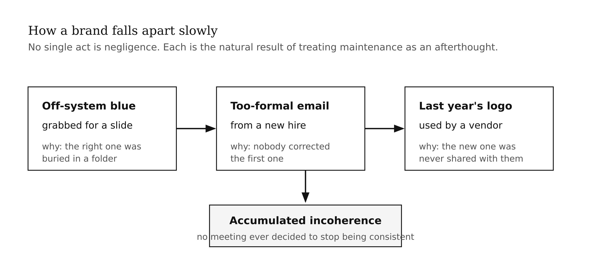
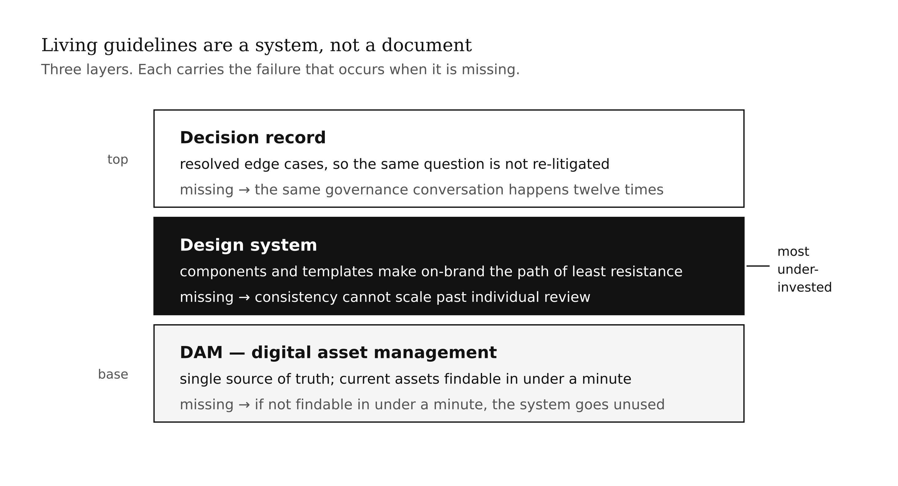
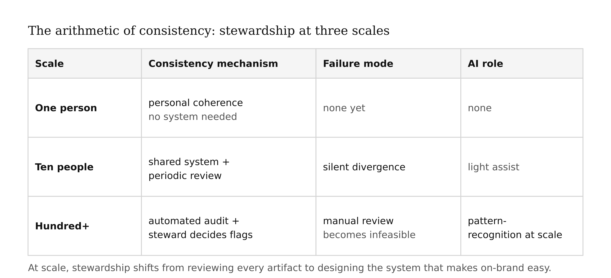
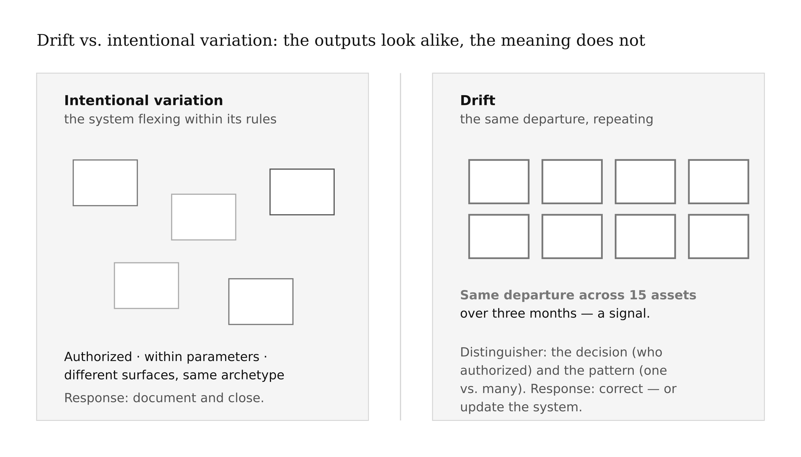
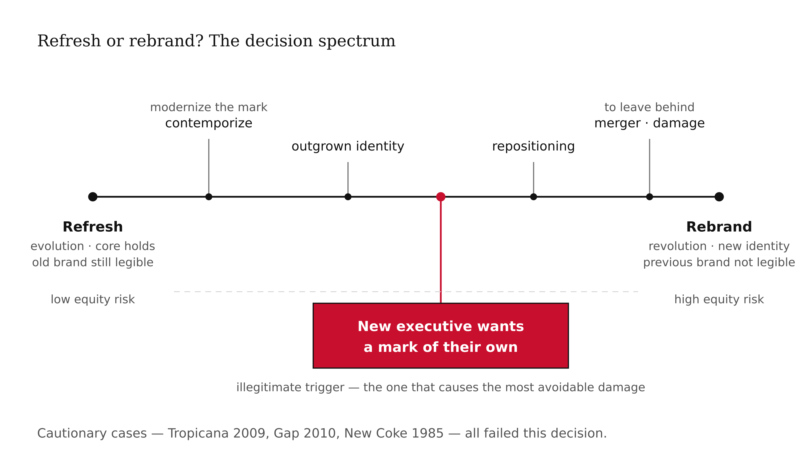
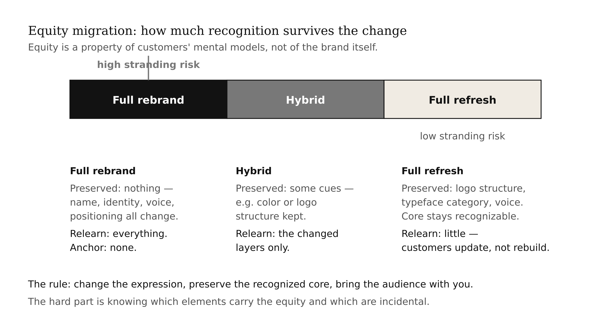
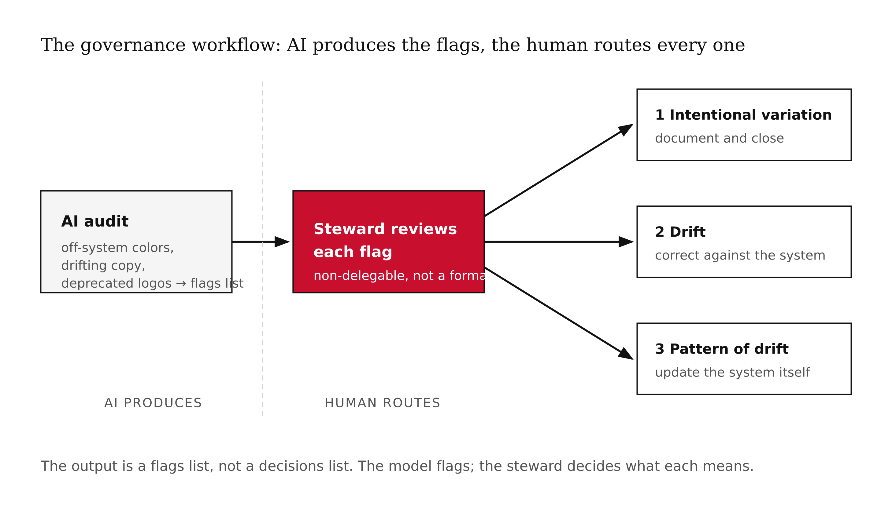

# Chapter 14 — Brand Management, Governance & Rebranding
*A brand book on a shelf is not governance. Governance is what happens at 4 p.m. on a Friday when someone needs a slide.*

> **TL;DR:** Creating a brand is one job; keeping it coherent over time and at scale — and knowing when to change it — is another, and it's the daily work of real brand teams. This chapter teaches guidelines as a living system, brand stewardship, the rebrand-vs-refresh decision and its risks, and has you build governance for your brand and an AI-assisted consistency audit.
>
> | Section | Preview |
> |---|---|
> | Guidelines That Live | Why a static brand book fails and what an enforceable system looks like. |
> | Stewardship and Scale | Holding consistency when many hands touch the brand. |
> | Drift vs. Intentional Variation | Telling a system flexing from a brand coming apart. |
> | Refresh or Rebrand? | The decision spectrum from a light update to a full identity change. |
> | The Migration Risk | How rebrands strand equity, and how to carry it across. |
> | Worked Example: Govern Your Brand | Building living guidelines and running a consistency audit with AI. |

---

Here is how a brand falls apart slowly. Nobody makes the decision to destroy it. There is no meeting where someone says, "let's stop being consistent." What happens instead is a teammate grabs a slightly-off blue for a slide because the correct one is buried in a folder nobody can find. A new hire writes in a voice that's a half-step too formal because nobody corrected the first email they sent. A vendor uses last year's logo because the new one was never shared with the right people. None of these are acts of negligence. They are the natural result of a system that treats brand creation as the hard work and brand maintenance as an afterthought.

The earlier chapters were about creation. This chapter is about the other half — the daily, operational discipline of keeping a brand coherent as it scales, and the harder judgment of when to deliberately change it. One of those problems is essentially a logistics problem with a judgment layer on top. The other is one of the riskiest decisions a brand team can make.



## Guidelines That Live

The standard artifact of brand governance is the brand book: a PDF, often beautifully designed, encoding the colors, the typefaces, the logo usage rules, the voice principles. It is produced with care and then mostly not used. The reasons are predictable. The book is not available at the moment of decision. It is not searchable in the way someone needs when they are building a slide at 4 PM and need to know whether this shade of teal is in-system. It does not show examples of wrong usage alongside right usage. It does not contain the actual assets, only representations of them.

**Living guidelines** are not a document. They are a system — a set of tools and practices that are available, in the form people need them, at the moment they are making decisions. Alina Wheeler's *Designing Brand Identity* frames this as stewardship: the guidelines are one part of the system, but they are effective only when paired with the practices and roles that keep them in force.

The operational components of a living guidelines system have three layers. The first is the **Digital Asset Management (DAM)** system: a single source of truth for brand assets, organized so that a designer, a marketer, or a vendor can find the current logo, the current color codes, the current voice examples in under a minute. If the assets are not findable in under a minute, the system will not be used. The second layer is the **design system**: component libraries, templates, and documented patterns that make it easier to stay on-brand than to go off-brand. The path of least resistance should be the on-system path. The third layer is the **decision record**: documented examples of edge cases that have been resolved, so that when the same question comes up again, there is an answer rather than another discussion.

The common failure mode is investing heavily in the first layer (the DAM) and treating the other two as optional refinements. The design system is what makes consistency scale past the point where any individual can review every artifact. The decision record is what prevents the same governance conversation from happening twelve times.



<!-- → [DIAGRAM: Three-layer living guidelines system — DAM (assets, findable in under a minute), design system (components, templates, on-system is easiest path), decision record (resolved edge cases) — with annotation showing what fails when each layer is missing] -->

## Stewardship and Scale

Here is the arithmetic of brand consistency. When one person is making all the brand decisions, consistency is a matter of their own coherence. When ten people are making brand decisions, consistency requires a shared system. When a hundred people are making brand decisions — across teams, vendors, agencies, and time zones — consistency requires automated checks, because no one person can review everything.

Brand stewardship is the function that manages this arithmetic. At its simplest, stewardship means someone owns the brand: a person or a role whose job it is to ensure that the system holds together, that new decisions are made in reference to the system rather than in isolation, and that the system itself is updated when the world changes enough to require it.

At scale, stewardship shifts from review to system design. The steward's job is not to approve every slide — that is not scalable — but to design the system so that the people making slides have what they need to stay on-brand without requiring approval. This is the same logic as good software architecture: design for the common case to be easy and the wrong case to require effort.

Artificial intelligence earns a genuine role here. At the scale where manual consistency review is no longer feasible, a model can audit assets for off-system colors, flag copy that drifts from the documented voice, identify uses of deprecated logos. These are pattern-recognition tasks across large volumes of material — exactly where models are useful. The output is a flags list, not a decisions list. The steward reads the flags and decides what they mean.



<!-- → [TABLE: Stewardship at three scales — one person (consistency through personal coherence), ten people (shared system + periodic review), hundred+ people (automated audit + steward decides flags); columns: scale, consistency mechanism, failure mode, AI role] -->

## Drift vs. Intentional Variation

A healthy brand system flexes. The way a brand expresses itself in a billboard is not identical to the way it expresses itself in a help documentation page, which is not identical to the way it expresses itself in a push notification. These are not failures of consistency. They are the system adapting to different surfaces and contexts within its rules — different length, different formality, different visual density, the same archetype and voice and promise.

Drift is what happens when variation breaks the system rather than expressing it. An off-system color in a one-off campaign might be the art director making a deliberate seasonal choice within understood parameters. Or it might be the first crack in a system that is about to start losing coherence. The outputs look similar. The meaning is entirely different.

The discipline is to flag all variation — everything that departs from the documented system — and then decide, case by case, which is intentional and which is drift. This requires two things the AI audit cannot provide. The first is the decision: only someone with system ownership can determine whether a departure was authorized. The second is the pattern: a single departure might be intentional; the same departure appearing across fifteen assets over three months is a signal that something has shifted.

This is the judgment layer that sits on top of the automated audit. The audit produces a complete list of departures. The steward reads that list looking for one-off decisions (which may be fine) and patterns (which require a response). The response to a pattern is not necessarily to enforce the original system — sometimes the drift reveals that the system needs to update. A brand whose visual language has been drifting younger for two years because designers keep making that choice independently might be telling you something about what the system should formally become.



<!-- → [TABLE: Drift vs. intentional variation — columns: signal, what it looks like in the audit flags, how to distinguish, what response is appropriate; rows covering single instance, repeated pattern, and pattern-as-system-signal] -->

## Refresh or Rebrand?

Change is legitimate. Brands need to evolve. The question is not whether to change but what kind of change, how much change, and whether the change is driven by the right reasons.

The spectrum runs from **refresh** to **rebrand**. A refresh is evolution: update the color palette to feel more contemporary, modernize the logo mark without abandoning its recognition cues, sharpen the voice. The core identity holds. What changes is the expression. The brand you had before is still legible in the brand you have after. A rebrand is revolution: new name, new visual identity, new positioning, sometimes a deliberate attempt to leave the old brand behind entirely. The previous brand is not legible in the new one — and often that is the point.

Legitimate triggers for change exist at every point on the spectrum. A merger or acquisition often requires a rebrand to resolve two competing identities into one. A genuine repositioning — the company has changed what it does, who it serves, or what it stands for — may require an identity that reflects the new reality rather than the old one. Outgrowing the original identity is real: a brand designed for a startup of fifteen people may not serve a company of fifteen hundred. Damage that must be left behind is real: a brand associated with a specific failure or scandal may need distance.

The illegitimate trigger that causes the most damage is the new executive who wants a mark of their own. This is a common and expensive pattern. A leader arrives, feels that the existing brand does not reflect their vision, and commissions a rebrand. The brand work that follows is technically competent and may even be attractive. What it rarely is, is necessary — and the cost is the equity that was abandoned in the transition. Customers had built a recognition model around the old brand. The new brand requires them to rebuild that model from scratch, and some fraction of them will not bother.

The cautionary cases are the same ones from the archetype chapter: Tropicana in 2009, Gap in 2010, New Coke in 1985. Read through the lens of governance, each of these is a failure of the refresh/rebrand decision. Tropicana's new packaging was a refresh that erased the recognition cues without replacing them. Gap's logo change was a refresh that moved the brand to a different part of the archetype spectrum. New Coke was a rebrand of the product itself, driven by competitive anxiety rather than genuine repositioning need. In all three cases, the decision to change was made without adequate accounting for what the existing brand had already built in customers' minds.



<!-- → [TABLE: Refresh vs. rebrand decision matrix — rows: trigger type (merger, repositioning, outgrown identity, damage control, new executive preference); columns: appropriate response on the spectrum, equity risk level, key question to ask before proceeding, historical example if applicable] -->

## The Migration Risk

The central risk in any brand change — and the one most often underestimated — is **stranding equity**. Equity is not a property of the brand itself. It is a property of customers' mental models. It lives in the recognition patterns they have built through repeated exposure to consistent touchpoints. When a brand changes, those patterns no longer match. Some customers will update their models. Others will not find the new brand legible and will stop looking.

The degree of stranding depends on how much of the old recognition pattern survives in the new brand. A refresh that modernizes the color palette while preserving the logo structure, the typeface category, and the voice gives customers enough continuity to update their model without rebuilding it. A rebrand that changes everything simultaneously — name, visual identity, voice, positioning — gives customers nothing to anchor to and asks them to start from scratch.

Migration management is the set of practices that carry equity across rather than abandoning it. The core practices: a transition period in which old and new marks appear together, using the endorsed model ("formerly X" or "X, now Y"), long enough for customers to update their mental models before the old mark disappears. Clear communication to existing customers about what is changing and what is staying the same. Deliberate preservation of the recognition cues that carry the most equity — often these are smaller and less obvious than the logo itself: the specific shade of a color, the rhythm of the copy, the way the brand addresses its customer.

The rule is simple to state and difficult to apply: change the expression, preserve the recognized core, and bring the audience with you. The difficulty is knowing, specifically, which elements of the existing brand are carrying the equity and which are incidental. That judgment requires more than intuition — it requires the equity audit work of the earlier chapters, applied as a pre-change diagnostic.



<!-- → [DIAGRAM: Equity migration spectrum — left: full rebrand (all recognition cues abandoned, high stranding risk); right: full refresh (core cues preserved, low stranding risk); middle: common hybrid approaches; annotation on each showing what is preserved and what the customer is asked to relearn] -->

## Worked Example: Govern Your Brand

For a running-project brand, this chapter adds three things: a living guidelines system, a consistency audit, and a documented refresh-or-rebrand decision.

The living guidelines work starts with a diagnostic question: at the moment a teammate needs to make an on-brand decision, can they find what they need in under a minute? If not, the guidelines are not living — they are documentation. The fix is structural before it is content: get the assets into a searchable, accessible system first, then ensure the rules are expressed as examples (right and wrong) rather than principles (which require interpretation at the moment of decision, which is exactly when people do not have time to interpret).

The consistency audit is the systematic application of the guidelines to the brand's existing assets. The goal is not to find and punish deviation. It is to get a clear picture of where the brand is coherent and where it has drifted, so that decisions about what to fix can be made deliberately rather than through accumulated small corrections. AI does this work at scale — running the audit across dozens of assets, flagging departures — but the steward reads every flag and makes the call: intentional variation or drift, and if drift, worth correcting or evidence that the system needs to update.

The refresh-or-rebrand memo is a forcing function: if the audit reveals deep incoherence — not localized drift but a brand that has been moving in a direction for long enough that it no longer resembles what was designed — the memo makes that visible and requires a decision. Not a decision by the brand team alone, but a decision that involves the people who own the business's strategic direction. Governance is the function that surfaces these decisions. It does not make them unilaterally.



<!-- → [DIAGRAM: Governance workflow — AI audit produces flags list → steward reviews each flag → three branches: (1) intentional variation, document and close; (2) drift, correct against system; (3) pattern of drift, update the system — with annotation showing the AI+1 boundary: AI produces the flags, human routes every flag] -->

---

## LLM Exercises

### Exercise 1 — When to Use AI
*Run these tasks with an LLM and evaluate what it can and cannot do:*

Paste a set of brand assets — three to five pieces of copy, a set of hex color values from recent materials, a sample of visual descriptions — and ask the model to audit them for consistency with a documented brand system you provide. Evaluate the output: where did it accurately flag real departures from the system, and where did it flag things that are actually intentional variations you would have approved?

**The tell:** you can verify every flag against the documented system. Any flag you cannot verify against a specific rule is a false positive — the model is pattern-matching to its own aesthetic preferences, not auditing against your system.

### Exercise 2 — When NOT to Use AI
*Identify the judgment the AI cannot make:*

Take the flags list from Exercise 1. Ask the model to classify each flag as "drift" or "intentional variation." Evaluate the output. What information would the model need — that it does not have — to make that call accurately?

**The tell:** you've crossed the line when the model's classification of a departure as "drift" overrides a deliberate design decision without anyone reviewing the flag. The model flags; you decide. That division is not a formality.

*Series connection:* Tier 4 (metacognitive) — supervising the audit system, deciding what the flags mean, and recognizing when a pattern of flags is telling you something the system needs to formally incorporate.

### Exercise 3 — Recipe Exercise
**Build:** a consistency audit and guidelines draft.

```
Review my assets and identity system below. Output a contradictions table:
asset | issue | DRIFT or INTENTIONAL [my call to confirm] | evidence.

Then draft a living-guidelines outline with three sections: core rules with
right/wrong examples, a DAM structure recommendation, and five edge cases
I should add to the decision record.

Flag and document. Do not fix or redesign anything. Cite the specific asset
for each flag.

Identity system + assets:
[PASTE]
```

**Adapt:** if the audit reveals deep incoherence rather than localized drift, add a refresh-vs-rebrand prompt after the audit output.

### Exercise 4 — CLI Exercise
**Build:** `your-brand/guidelines.md` and `your-brand/consistency-audit.md`

```
Write your-brand/guidelines.md with: core brand rules expressed as right/wrong
examples (not principles), a recommended DAM folder structure, and a decision-
record section seeded with three edge cases.

Write your-brand/consistency-audit.md as a table: asset | departure | drift or
intentional [owner to confirm] | evidence. Flag every departure from the system.
Do not redesign any asset. Stop after writing both files.
```

**Inspect:** every flag in the audit cites a specific asset and a specific rule it departs from; the guidelines show wrong examples as clearly as right ones. **If it goes wrong:** the model calls intentional variation "drift" without your input — re-tag every flag yourself before treating the audit as final.

### Exercise 5 — AI Validation Exercise
**Validate** the consistency audit. Rate each criterion Pass / Fail / Cannot-determine with evidence:

- **Correctness:** does each flag in the audit reference a specific documented rule, not a general preference?
- **Completeness:** all submitted assets covered; guidelines include both right and wrong examples?
- **Scope:** flagging and documentation only — no unrequested redesign of assets?
- **Brand-specific:** if a rebrand is proposed anywhere in the output, is the equity-migration risk explicitly addressed?
- **Failure-mode check:** any flag classified as "drift" that is actually intentional variation? Any such flag that went unreviewed into a decision? Either is a governance failure.

**AI Use Disclosure:** two sentences — what the model produced and how you used it; one judgment it could not make (drift vs. intentional / whether the pattern signals a system update) that required the steward's call.

---

## Key Terms

brand governance · living guidelines · brand stewardship · DAM (digital asset management) · design system · decision record · drift vs. intentional variation · refresh vs. rebrand · equity migration · equity stranding

## Bridge

You can keep the brand coherent and decide when to change it. The next chapter turns to the commitments a brand makes to the world — ethics, purpose, and sustainability — where brand claims now carry legal weight and the distance between what a brand says and what it does is measured in regulatory exposure.
