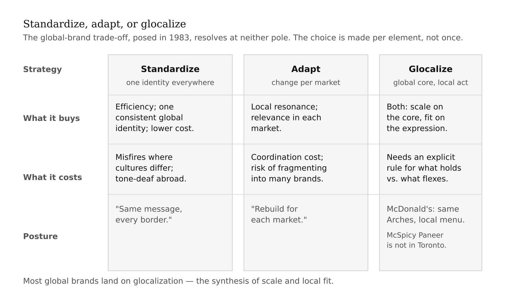
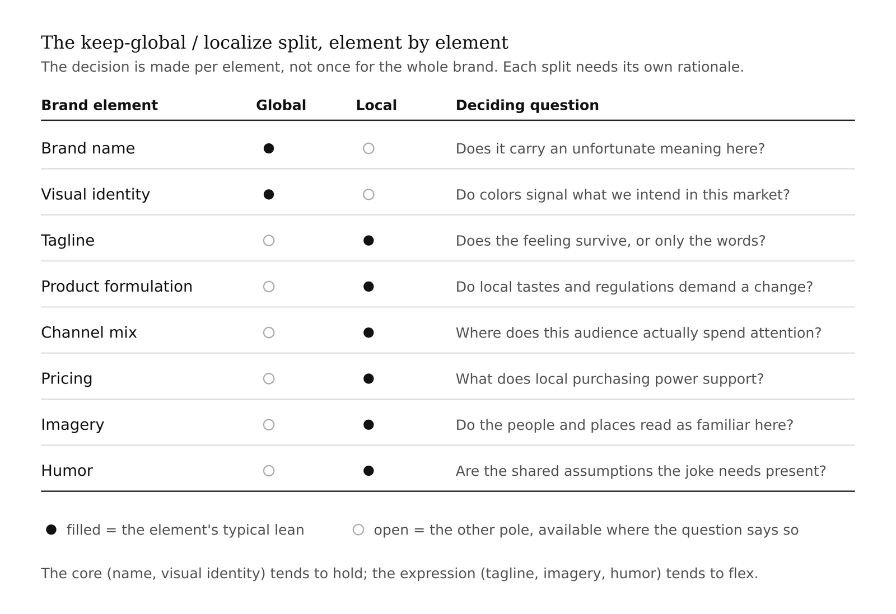
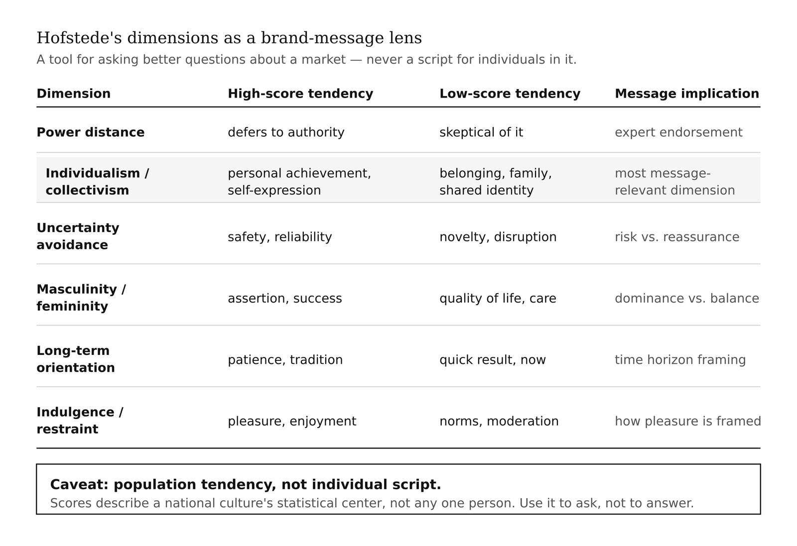
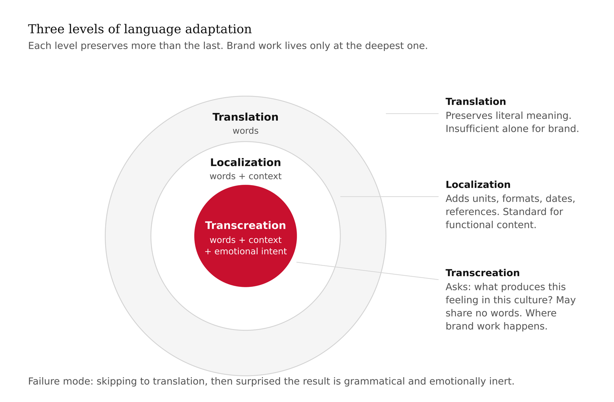
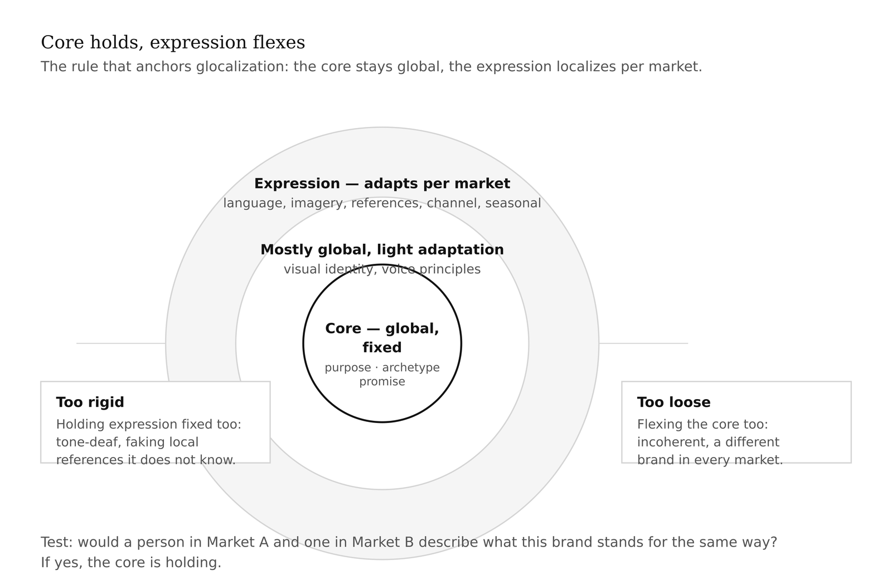
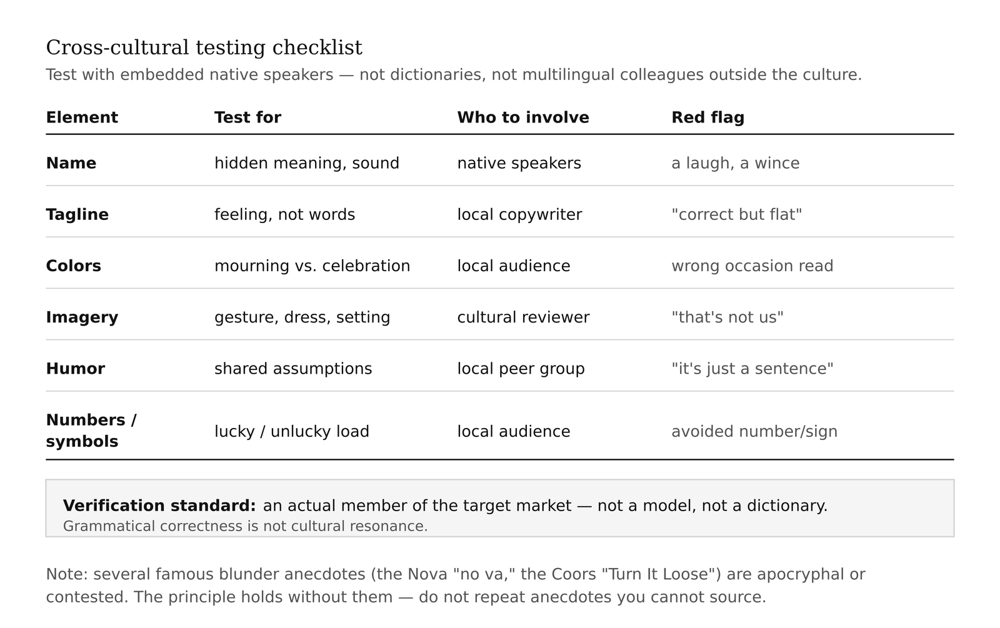
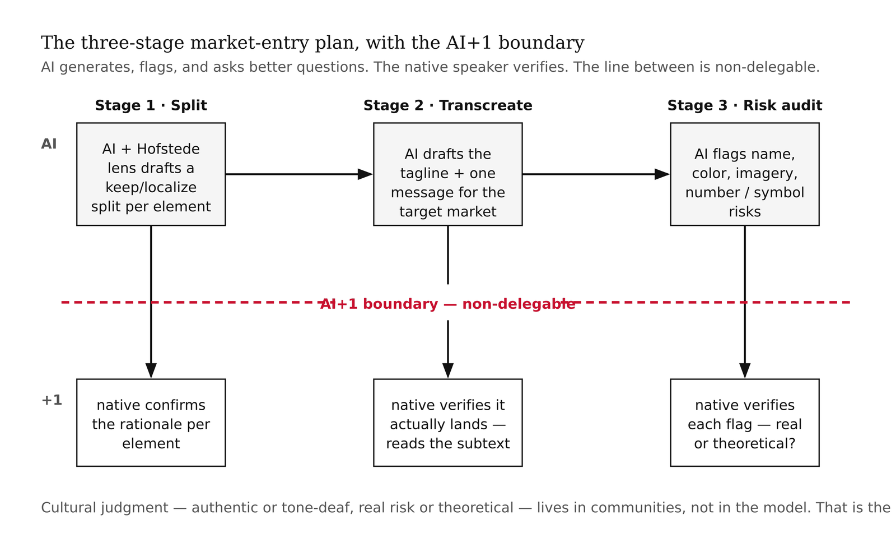

# Chapter 17 — Global & Cross-Cultural Branding
*The same message, translated literally, can mean the opposite across a border. Localization is re-creation, not translation.*

> **TL;DR:** Brands cross cultures, and the standardize-vs-adapt choice — plus the difference between translation and transcreation — decides whether a brand resonates or insults abroad. This chapter teaches glocalization, Hofstede's cultural dimensions as a lens, and localization done right, then has you build a market-entry adaptation plan for your brand with AI drafting and you supplying the cultural judgment.
>
> | Section | Preview |
> |---|---|
> | Standardize or Adapt? | The core global-brand trade-off between scale and local resonance. |
> | The Cultural Lens | Hofstede's dimensions as a starting tool for why brands read differently abroad. |
> | Translation vs. Transcreation | Why literal translation fails and what re-creating intent looks like. |
> | What Stays Global | The core that holds across markets versus the expression that localizes. |
> | The Blunder File | Cross-cultural naming and messaging failures — and which famous ones are myths. |
> | Worked Example: A Market-Entry Plan | Building an adaptation plan for one new market with AI. |

---

Consider what a brand is doing when it crosses a border. It is not moving a product from one geography to another. It is moving a set of associations, a voice, a promise — mental constructs that were built in the context of one culture's values, aesthetics, and reference points — into a context where those values, aesthetics, and reference points may be entirely different. The associations do not automatically transfer. The voice may not translate. The promise may land as something different from what was intended, or not land at all.

The earlier chapters of this book were implicitly single-market. This chapter adds the dimension that changes almost everything about brand execution: what happens when the market you are entering has different ways of seeing.

## Standardize or Adapt?

The question was formally posed in 1983, when Theodore Levitt published "The Globalization of Markets" in the Harvard Business Review. His argument: technology and communication were homogenizing world tastes, creating global consumer segments that wanted the same things regardless of where they lived. The strategic implication was standardization — one global brand, the same identity and message everywhere, maximum scale and consistency, lower cost.

The counterargument was immediate and empirical. Markets differ. What a French consumer finds aspirational, a Brazilian consumer may find cold. The visual language that signals quality in Germany may signal cheapness in Japan. A tagline built on individual achievement resonates in the United States and misfires in cultures organized around collective identity. Adaptation — changing the brand's expression to fit each market — was not cultural accommodation; it was the price of relevance.

The resolution most global brands have arrived at is neither pole. It is **glocalization**: a global strategy with local execution. The brand's core — its purpose, its archetype, its fundamental promise — holds everywhere. The expression — language, imagery, specific claims, channel mix, the cultural references that make a message land — adapts to each market. McDonald's is a glocalization case: one global identity, local menu items in nearly every market, marketing that references local culture and celebrities. The Golden Arches are the same in Tokyo and Toronto. The McSpicy Paneer is not.

The trade-off is real and does not dissolve. Standardization buys efficiency and a consistent global identity that accrues recognition across markets. Adaptation buys local resonance at higher coordination cost. The decision is not made once for the whole brand; it is made per element, and the elements that hold global and the elements that flex local require a clear rationale for each.



<!-- → [TABLE: Standardize vs. adapt decision by brand element — rows: brand name, visual identity, tagline, product formulation, channel mix, pricing, imagery, humor; columns: typically holds global, typically localizes, deciding question — makes the per-element logic concrete] -->



## The Cultural Lens

Geert Hofstede's cultural dimensions are the most widely cited framework for explaining why the same brand message reads differently across cultures. The framework emerged from Hofstede's analysis of IBM employee survey data collected across more than fifty countries in the late 1960s and early 1970s, later expanded. It describes national cultures along several dimensions. `[verify: confirm the current dimension set and whether Hofstede's database has been updated or superseded by more recent cross-cultural research.]`

**Power distance** measures the degree to which less powerful members of a society accept and expect unequal distribution of power. High-power-distance cultures tend to respond to brand authority and expert endorsement differently than low-power-distance cultures, where skepticism of authority is more normative.

**Individualism vs. collectivism** is probably the dimension with the most direct implications for brand messaging. Campaigns built on personal achievement, self-expression, and individual distinction — a common frame in US advertising — tend to resonate in high-individualism markets. In high-collectivism markets, messaging built around belonging, family, community, and shared identity tends to do more work.

**Uncertainty avoidance** measures tolerance for ambiguity and the unknown. High-uncertainty-avoidance cultures tend to respond to brand messages that emphasize safety, reliability, and expertise. Low-uncertainty-avoidance cultures may respond to novelty and disruption framing that would read as recklessness in a high-avoidance context.

**Masculinity vs. femininity** in Hofstede's usage describes the degree to which a culture values assertiveness, achievement, and material success (masculine pole) versus quality of life, relationships, and cooperation (feminine pole). A brand message organized around competitive dominance plays differently in a high-masculinity culture than in a high-femininity one.

**Long-term vs. short-term orientation** and **indulgence vs. restraint** complete the framework, with implications for how brands frame time horizons and pleasure in their messaging.

The crucial caveat applies before anything else: Hofstede's dimensions are population-level tendencies, not scripts for individuals. They describe the statistical center of a national culture, not every member of it. A Dutch person is not automatically low-power-distance because the Netherlands scores low on that dimension. Using the framework to stereotype individuals produces exactly the kind of cultural error it is supposed to help avoid. The right use is to ask better questions — "in this market, is a message built on individual achievement more or less likely to resonate than one built on collective identity, and why?" — not to answer those questions before doing the empirical work.

Marieke de Mooij's research on cross-cultural advertising applies Hofstede's framework to brand communication specifically and provides the most systematic evidence for how deeply consumer response varies across cultures. Her work is worth consulting before making significant adaptation decisions.

<!-- → [TABLE: Hofstede dimensions applied to brand decisions — columns: dimension, high-score tendency, low-score tendency, brand-message implication, example of a message that works differently by score — with the caveat row at the bottom: "population tendency, not individual script"] -->



## Translation vs. Transcreation

There are three escalating levels of effort in adapting brand language for a new market.

**Translation** is the conversion of words from one language to another, attempting to preserve meaning. It is the minimum and, by itself, usually insufficient for brand work. The problem is not that translation is bad at preserving literal meaning — it often does that reasonably well. The problem is that brand language is not primarily about literal meaning. It is about emotional effect, cultural resonance, rhythm, and connotation. These do not survive word-for-word conversion.

**Localization** goes a layer deeper: words plus context. Formats, units of measurement, date conventions, currency, cultural references, imagery, and regulatory requirements all get adapted. A localized version of a piece of content reads naturally in the target market — no metric-to-imperial confusion, no references to American holidays, no imagery that is out of place. Localization is the standard for functional content. It is not enough for brand content.

**Transcreation** is where brand work actually happens. The question transcreation asks is not "what do these words mean in this language?" but "what would produce this feeling in this culture?" The answer may share no words with the original. The Honda tagline "The Power of Dreams" was adapted for different markets in ways that shifted the specific imagery and cultural framing while preserving the aspirational emotional effect. A transcreated tagline may be shorter or longer than the original, use entirely different metaphors, reference different cultural touchstones — and still be, in the relevant sense, faithful to the original because it produces the same experience in its target audience.

The failure mode is skipping transcreation in favor of translation and then being surprised when the result is grammatically correct and emotionally inert — or, worse, funny or offensive in ways nobody anticipated. The specific reason transcreation fails at the literal translation level is that brand language accumulates connotations in one cultural context that do not transfer. Humor is the most reliable victim: a joke depends on a specific set of shared assumptions about what is surprising, what is transgressive, and what is true. Those assumptions are cultural. A joke that works in São Paulo is not a joke in Seoul; it is just a sentence.

<!-- → [DIAGRAM: Three levels of language adaptation as a nested diagram — Translation (outer ring: words), Localization (middle ring: words + context), Transcreation (inner ring: words + context + emotional intent) — with annotation showing what each level preserves and what it adds] -->



## What Stays Global

Glocalization requires an explicit rule for what is fixed and what flexes. Without that rule, every market decision becomes a negotiation, and the brand slowly becomes a different thing in every country — which is not localization, it is fragmentation.

The rule that most holds up: the **core** stays global, the **expression** localizes.

The core is the brand's purpose, archetype, and fundamental promise. Why the brand exists, who it is, what it offers the world. These are not market-specific. A brand that is an Innocent in one market and a Sage in another does not have a global brand — it has two brands with the same name. The core is the thing that makes the brand recognizable as itself regardless of where it operates.

The expression is everything through which the core is communicated: language, imagery, specific claims, tone-of-voice calibration, channel selection, seasonal references, the cultural examples used to make the core tangible. These adapt. They have to. A brand that expresses its Innocent archetype through imagery of wide-open American landscapes is making a culturally specific expression choice that may not travel. The archetype is universal. The specific expression of it is not.

Getting this boundary wrong in either direction fails distinctly. Too rigid — holding the expression as well as the core — and the brand sounds tone-deaf: a foreigner trying to make local references without actually knowing the culture. Too loose — flexing the core as well as the expression — and the brand becomes incoherent: a different brand in every market, unable to accumulate the global equity that scale is supposed to provide.

The working test: if someone in Market A and someone in Market B described what this brand is and what it stands for, would their descriptions match? If yes, the core is holding. If the descriptions are significantly different, either the localization has gone too far or the core was never clearly enough defined to anchor the adaptation.

<!-- → [DIAGRAM: Core vs. expression in a global brand — concentric circles: innermost (purpose/archetype/fundamental promise — global, fixed), middle (visual identity, voice principles — mostly global with adaptation), outer (language, imagery, references, channel, seasonal — adapts per market) — with annotation showing the "too rigid" and "too loose" failure modes] -->



## The Blunder File

Cross-cultural branding has a famous catalog of failures: names that mean something unfortunate in another language, campaigns that violated a deeply held local norm, color choices that signaled mourning rather than celebration, slogans that became punchlines. These cases get repeated in marketing courses and business books because they are memorable and because the lesson — test your brand elements with native speakers before committing — is genuinely important.

The verification warning matters as much as the examples: many of the most-repeated cross-cultural blunder stories are apocryphal, exaggerated, or simply wrong. `[verify any specific naming-blunder example before citing it; several of the most popular ones are myths, including several that have made it into marketing textbooks.]` The GM Nova/no-va story (the car supposedly would not sell in Latin America because "no va" means "doesn't go") is contested — the car actually sold reasonably well in those markets, and "nova" is not naturally parsed as "no va" in Spanish. The Coors "Turn It Loose" / "suffer from diarrhea" translation story has been repeated for decades with varying levels of specificity and uncertain sourcing.

The principle these stories are meant to illustrate is real: literal translation produces unexpected results, names carry connotations that do not appear in dictionaries, and what is neutral in one cultural context is loaded in another. That principle does not require apocryphal anecdotes to be compelling. The actual documented history of cross-cultural brand adaptation contains enough genuine failures — and genuine successes — to make the case without manufacturing examples.

The practical lesson is the same whether a given anecdote is true or not: test brand elements — name, tagline, imagery, color associations — with native speakers who are actual members of the target market, not with dictionaries or with multilingual colleagues who are not embedded in that culture. The gap between "grammatically correct" and "culturally resonant" is wide enough that it routinely surprises native speakers of the source language.

<!-- → [TABLE: Cross-cultural testing checklist — rows: brand element to test (name, tagline, colors, imagery, humor, numerical/symbolic associations); columns: what to test for, who to involve, what a red flag looks like, verification standard] -->



## Worked Example: A Market-Entry Plan

For a running-project brand, this chapter adds an adaptation plan for entering one new market: what holds globally, what localizes, and where the cultural risks are.

The plan has three stages. The first is the split: go through the brand element by element and make the explicit keep-global / localize decision for each, with a rationale. This is where the Hofstede lens earns its use — not as a script, but as a way of asking the right questions about the target market before committing to adaptation decisions.

The second stage is transcreation: take the brand's tagline and one key message and transcreate them for the target market. This means working with the intent and emotional effect, not the words, and verifying the result with someone who actually lives in that market. The verification step is not optional and is not something AI can do. A model can produce a transcreation that is grammatically fluent and culturally plausible. Whether it actually lands with the resonance intended requires a native who can read the subtext.

The third stage is the risk audit: name, colors, imagery, numerical associations, humor. Everything that carries cultural meaning beyond its literal content. Flag anything that requires verification. Then verify it — not with the model, with people.

The AI+1 line in this chapter is the clearest since the trademark chapter: AI generates and drafts at volume, flags patterns, and asks better questions. Cultural judgment — whether an adaptation is authentic or tone-deaf, whether a flagged risk is real or theoretical, whether the transcreated version actually feels like the brand in the target market — lives in communities, not in models. That judgment is the +1.

<!-- → [DIAGRAM: Three-stage market-entry plan workflow — Stage 1: keep-global/localize split (AI + Hofstede lens → rationale per element); Stage 2: transcreation (AI drafts → native speaker verifies); Stage 3: risk audit (AI flags name/color/imagery risks → native verifies each flag) — AI+1 boundary marked between AI draft and native verification at each stage] -->



---

## LLM Exercises

### Exercise 1 — When to Use AI
*Run these tasks with an LLM and evaluate what it can and cannot do:*

Take a brand you know and a target market you want to understand. Ask the model to split the brand's key elements into keep-global and localize, using Hofstede's dimensions as a starting lens for the target market. Then ask it to draft a transcreation of the brand's tagline for that market. Evaluate: where did the output give you genuinely useful starting material, and where did it produce confident-sounding cultural claims you would need to verify?

**The tell:** every cultural claim in the output — especially any assertion about what resonates in the target market — is preliminary until verified with someone embedded in that culture. If the model's output is being used as the final word on cultural resonance, you have crossed the line.

### Exercise 2 — When NOT to Use AI
*Identify the judgment the AI cannot make:*

Take the transcreated tagline from Exercise 1 and ask the model how confident it is that the transcreation would land authentically with native speakers of the target market. Evaluate its answer. What would "confident" actually require here — and can the model have it?

**The tell:** you've crossed the line when AI's cultural confidence substitutes for local knowledge. The model can produce fluent, culturally-informed text. It cannot feel whether it lands.

*Series connection:* Tier 6 (collective) — cultural understanding that lives in communities, not in the model's training data.

### Exercise 3 — Recipe Exercise
**Build:** a market-entry adaptation plan.

```
Using my brand and target market below, do three things:
(1) Split brand elements into KEEP GLOBAL vs. LOCALIZE — give a rationale for
each, using Hofstede's dimensions as a starting lens (not a stereotype).
(2) Transcreate (not translate) the tagline and one key message for the target
market. Re-create the intent and emotional effect; accept that the words may
be entirely different.
(3) Audit for cultural risk: name, colors, imagery, numerical or symbolic
associations, humor. Flag anything that needs native-speaker verification.

Tag every cultural claim [VERIFY WITH NATIVE SPEAKER]. Assert no cross-cultural
"fact" without that tag. Do not repeat blunder anecdotes you cannot source.

Brand + target market:
[PASTE]
```

**Adapt:** personal brand — adapting your professional voice and presence for a different professional or national culture.

### Exercise 4 — CLI Exercise
**Build:** `your-brand/market-entry.md`

```
Write your-brand/market-entry.md as a table:
brand element | keep global / localize | adaptation or rationale | cultural-risk
note [VERIFY WITH NATIVE SPEAKER].

Include the transcreated tagline and one message as a separate section.
Tag every cultural assertion [VERIFY]. Do not state any cross-cultural claim
as fact. Do not reproduce blunder anecdotes. Stop after writing the file.
```

**Inspect:** the keep-global/localize split has a rationale for each element; every cultural claim is tagged for native verification; the transcreation is genuinely re-created, not translated. **If it goes wrong:** the model states confident cultural facts without verification tags, or reproduces an apocryphal blunder anecdote — tag every unverified claim and check.

### Exercise 5 — AI Validation Exercise
**Validate** the market-entry plan. Rate each criterion Pass / Fail / Cannot-determine with evidence:

- **Correctness:** is the keep-global/localize split defensible per element, with rationale?
- **Completeness:** all elements split; tagline and one message transcreated; risk audit present?
- **Scope:** one market, genuine transcreation rather than literal translation?
- **Brand-specific:** does the global core (archetype/purpose/promise) remain intact while expression adapts?
- **Failure-mode check:** any cultural claim or blunder anecdote stated as fact without `[VERIFY WITH NATIVE SPEAKER]`? Any literal-translation artifact in the transcreated copy? Either is a hard flag.

**AI Use Disclosure:** two sentences — what the model produced and how you used it; one thing it could not determine (cultural authenticity of the transcreation) that required native or local judgment.

---

## AI Wayback Machine

The ideas in this chapter didn't appear from nowhere. **Margaret Mead** was the American anthropologist who did more than anyone of her generation to put a single idea into wide circulation: that the things one culture treats as universal and natural — how people come of age, what counts as normal, what a gesture or a color or a story means — are often local conventions, not human constants. Her best-known book, *Coming of Age in Samoa* (1928), argued that adolescence looked nothing like the American version once you crossed into a different set of cultural assumptions. That is precisely the move this chapter asks of a brand: to stop assuming that a tagline built on individual achievement, or an image of a wide-open landscape, carries the same meaning across a border. Mead's fieldwork method — go and observe inside the culture rather than reasoning about it from outside — is the same discipline the chapter calls the verification step: the transcreation and the risk audit must be checked by people embedded in the target market, not by a dictionary, a multilingual colleague, or a confident model.


*Margaret Mead — the anthropologist who showed that "natural" is usually just "local," the premise beneath transcreation and the native-speaker check.*

**Run this:**

```
Who was Margaret Mead, and what was the central argument of her cross-cultural
anthropology — that much of what one culture treats as natural and universal is
actually local convention? Connect this to why a brand cannot "translate" its
way into a new market: meaning, humor, and emotional resonance are cultural, not
linguistic. Keep it to three paragraphs. End with the single most surprising
thing about her work or career.
```

→ Search **"Margaret Mead"** on Wikipedia after you run this. See what the model got right, got wrong, or left out.

**Now make the prompt better.** Try one of these:

- Ask it to explain, in plain language, why something "natural" in one culture can be a convention you have to verify in another
- Ask it to connect Mead's fieldwork method to the chapter's claim that a transcreation must be checked by someone embedded in the target market, not by the model
- Add a constraint: "Answer as if you are warning a glocalization team about treating Hofstede's dimensions as a script for individuals rather than a population tendency"

What changes? What gets better? What gets worse?

---

## Key Terms

standardization vs. adaptation · glocalization · Hofstede cultural dimensions · power distance · individualism vs. collectivism · translation vs. localization vs. transcreation · core vs. expression · cross-cultural verification

## Bridge

The brand now travels. The remaining chapters turn from the brand itself to the brander — building the portfolio that makes all of this work visible, compounding, and attributable to you.
