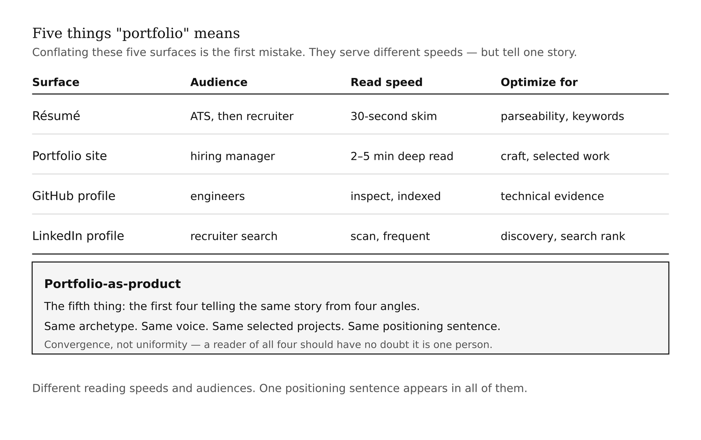
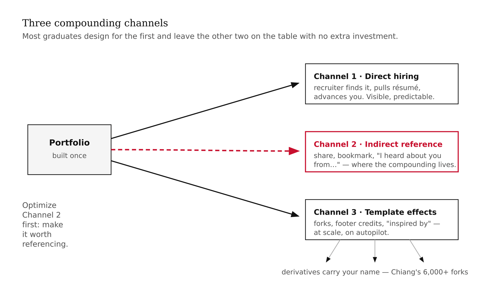
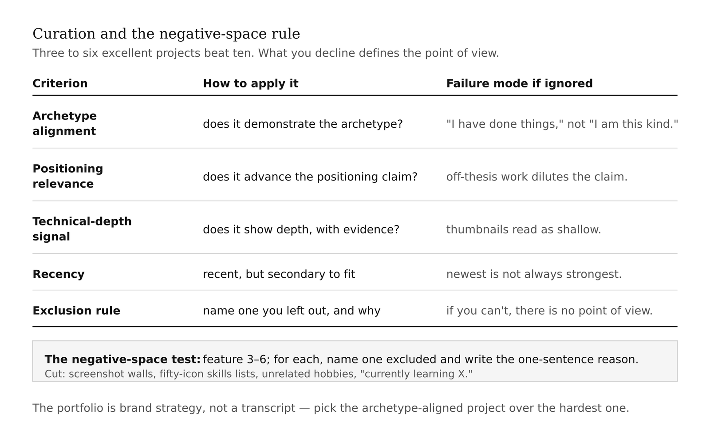
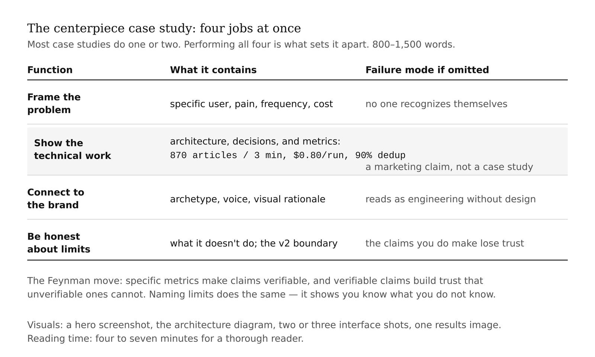
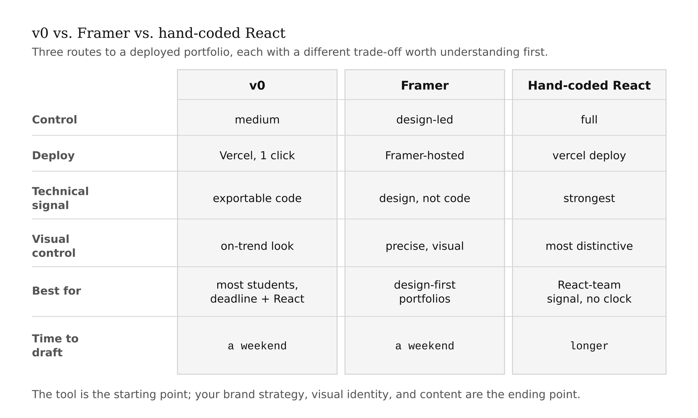
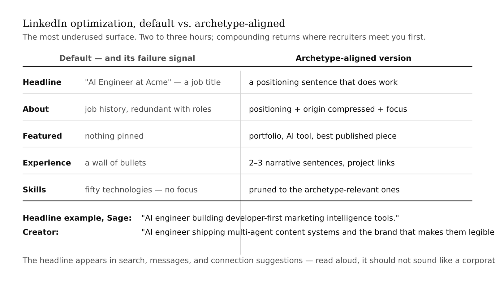

# Chapter 18 — Portfolio as Product
*The artifact you build once and the returns that compound for a decade.*

> **TL;DR:** This chapter treats your portfolio as a product that compounds — built once, generating credibility for years (as Brittany Chiang's did). It explains the three channels through which a portfolio pays off, how to curate ruthlessly, how to write a case study that does four jobs at once, and how to deploy and align it with your résumé and LinkedIn.
>
> | Section | Preview |
> |---|---|
> | Five things "portfolio" means | The five surfaces — résumé, site, GitHub, LinkedIn, portfolio-as-product — and how they should tell one story. |
> | A portfolio is a compounding asset | The three channels — direct hiring, indirect reference, and template effects — through which a portfolio pays off over time. |
> | Curation and negative space | Why three to six excellent projects beat ten, and how to decide what to leave out. |
> | The centerpiece case study | How to write a case study that frames the problem, shows the work, connects to the brand, and admits its limits. |
> | Tools to build it | v0, Framer, and hand-coded React compared. |
> | Deploy and align | Shipping the site accessibly and making it match résumé and LinkedIn so they read as one person. |

---

In 2017, Brittany Chiang published a redesign of her personal portfolio website. The site was clean, minimal, dark-themed — a slate-blue background, mint-green accents, monospace typography. The code was open. Over the following years, as she moved through Upstatement, Apple, Spotify, and senior engineering roles at Klaviyo, something quiet happened to that portfolio: the GitHub repo for its fourth iteration accumulated over 9,000 stars and 6,000 forks. Generations of developers used her design as the foundation of their first portfolio. Her name traveled into commit histories and footer credits of sites she had never seen, built by people she had never met.

The portfolio was not the only factor in her career. The engineering work is excellent, the network is strong, the timing was good. But the portfolio did something the engineering work and the network could not do on their own: it compounded. The asset was built once and continued generating returns — brand impressions, name recognition, implicit credibility — for years after the work was done.

That is the mechanism this chapter is about, and it is the reason most graduate portfolios fail not from inadequacy but from under-ambition. An adequate portfolio gets through a hiring funnel. A designed portfolio compounds. The gap between them is roughly twenty hours of deliberate work. The return differential is a decade.

You need several prior chapters in hand before this one is useful. Your archetype — the portfolio expresses it, does not invent a new one. Your deployed AI tool at a public URL, which is the centerpiece this chapter wraps. Your brand strategy, visual identity, and narrative content from the chapters that preceded this one. If any of these are missing, the portfolio will show the gap. Complete the prerequisite work even in rough form. A rough brand strategy and a rough case study produce a coherent portfolio. No brand strategy and no case study produce a placeholder site that will not compound.

---

The word "portfolio" is doing five different jobs in conversations about career development, and conflating them is the first mistake most graduates make.

A **résumé** is a text document optimized for ATS systems and the thirty-second human skim. A **portfolio website** is a designed presentation of selected work optimized for the two-to-five-minute deep read. A **GitHub profile** is a technical-evidence surface, indexed and inspectable by engineers. A **LinkedIn profile** is the professional-network surface optimized for recruiter discovery via search. And then there is the fifth thing — the portfolio-as-product this chapter is trying to produce — in which the first four surfaces tell the same story from four angles: same archetype, same voice, same selected projects, same positioning sentence.

Convergence does not mean uniformity. A résumé and a portfolio website serve different reading speeds, different audiences, different moments in the hiring funnel. The résumé is skim-optimized; the portfolio is deep-read-optimized. But the same positioning sentence should appear in both. The same projects should be featured. The same archetype should be legible. A recruiter who reads both should have no doubt they are looking at documents about the same person.

<!-- → [TABLE: Five portfolio artifacts — columns: artifact, primary audience, reading speed, optimization goal, what alignment looks like across artifacts. One row per artifact.] -->



---

Before we talk about any technical tooling, I want to install the deep principle that changes what you build.

Three channels. Most graduates design for the first and ignore the second and third. The second and third are where the compounding lives.

**Direct hiring.** A recruiter finds your portfolio through a search, an application, or a referral. They look at it, pull up your résumé, move you to the next stage. This is the channel every graduate thinks about. It is visible, predictable, and optimizable in obvious ways. The portfolio needs to be recruiter-legible to perform here. Most portfolios stop here.

**Indirect reference.** Someone — a developer, a hiring manager, a professor, someone you have never met — encounters your portfolio through a share, a link in a "best portfolios" article, a retweet, a forward. They do not have an open role right now. They bookmark it, or they remember your name. Weeks or months later, when a role opens, they mention you. The chain is invisible to you. You have no idea it happened until someone says "I heard about you from..."

This channel is impossible to optimize for directly and impossible to ignore. The portfolio that performs here is the one *worth referencing* — distinctive, coherent, executing with craft. The portfolio that does not perform here is the one that is adequate: recruiter-ready, by-the-numbers, indistinguishable from ten thousand others. Chiang's portfolio compounded through this channel for years before she was at Spotify.

**Template effects.** Your portfolio design or case study structure becomes a starting point for other developers. They clone the repo, fork the design, borrow the structure. Each derivative carries your name in its commit history, in the footer credit, in the "inspired by" acknowledgment. This channel operates at scale and on autopilot. Chiang's 6,000-plus forks are the most visible example, but the pattern runs at smaller scales too — a clean case study structure gets borrowed, a README format gets copied, a layout decision shows up in a dozen other sites.

The design implication is this: building a portfolio that only performs in Channel 1 is under-optimizing. Not because the direct-hiring return is insufficient — it may be sufficient for the immediate goal. Because you are leaving Channels 2 and 3 on the table with no additional investment. A portfolio designed for all three is built with the same discipline you brought to the AI tool: scope, craft, archetype alignment, explicit content decisions, negative space as intentional as positive space.

<!-- → [FIGURE: Three compounding channels — central portfolio box on the left, three directed connectors fanning out to labeled cards. Channel 1 short and visible. Channel 2 long, dashed, highlighted as the high-compounding arrow. Channel 3 branching and autonomous, operating without the portfolio owner's involvement.] -->



---

A portfolio's power comes as much from what is absent as from what is present. The negative-space rule from Chapter 6 applies directly here: what you decline to include defines the product's point of view as clearly as what you include.

Most graduates make the same curation mistake: they include too many projects. They have ten projects, they put ten projects on the portfolio, and they reduce each to a thumbnail and a sentence because there is not room for more. The recruiter sees ten small things instead of three large things. The portfolio reads as "I have done things" rather than "I am this kind of engineer."

Three to six projects is the right number. Three is better than six if the three are excellent and the six would include mediocre work. The selection criteria are not "best by technical difficulty" or "most recent." They are: which three to six projects, combined, make the strongest possible case for the archetype and the positioning claim?

A Sage archetype whose positioning is "AI engineer building developer-first marketing intelligence tools" should select projects that demonstrate intelligence-building, not projects that demonstrate general-purpose web development. If the strongest project on the archetype axis is not the most technically complex project you have ever done, put the archetype-aligned project on the portfolio anyway. The portfolio is brand strategy, not a transcript.

The negative-space rule in practice: for every project on the portfolio, name one project that is not on it and write one sentence explaining the exclusion. If you cannot write that sentence — if you included everything and excluded nothing — the portfolio does not have a point of view.

What does not belong: a screenshot wall of every project. A skills section listing fifty technologies as icons. Personal hobbies unrelated to the archetype. Long lists of job titles and dates — that is the résumé's job. Testimonials from people the audience has never heard of. A "currently learning X" list that implies the thing is not yet learned. Each of these reduces signal-to-noise in a context where the visitor has two to five minutes. Every item that is not archetype-reinforcing is a tax on their attention.

<!-- → [TABLE: Project curation decision matrix — columns: selection criterion, what it means, how to apply it, common failure mode when ignored. Rows: archetype alignment, positioning relevance, technical depth signal, recency, exclusion rule.] -->



---

The tool you built in the prior chapters is the centerpiece project. It has the most supporting material — a PRD, a built pipeline, an architecture decision, a deployed interface. It is also the project that most directly expresses the archetype and the brand strategy, because it was designed to do so from the beginning.

The case study for this tool needs to perform four functions simultaneously. Most engineering case studies perform one or two. Performing all four is what sets the case study apart.

**Frame the problem.** A specific user, a specific pain, a specific frequency, a specific cost. *Marketing managers at small B2B SaaS companies spend two to three hours every Monday manually aggregating competitor news. The output is stale, inconsistent, and consumes time they do not have.* Specific. Recognizable. The reader should be able to find ten people who fit this description before they finish the sentence.

**Show the technical work.** The architecture — the agent pattern, the pipeline, the model choices, the data flow. The key decisions with one-sentence justifications for each. An architecture diagram. Screenshots of the deployed interface. And — the piece most student case studies skip — specific metrics. Throughput, latency, accuracy on a test set, cost per run.

The metrics are worth dwelling on because the absence of them is the most common case study failure mode. A case study that says "the tool processes articles quickly and accurately" is not a case study; it is a marketing claim. A case study that says "the tool processes 870 articles in under three minutes at a cost of approximately $0.80 per run, with 90% deduplication efficiency" is a case study. The numbers make the claim verifiable. Verifiable claims build trust in a way unverifiable claims cannot — which is the Feynman principle translated from physics education to career development.

**Connect to the brand.** A note on archetype, voice, and visual choices. Why the interface is designed the way it is. What the alignment audit revealed and what was changed. This is the section most engineering case studies omit entirely. Including it signals that you think about engineering as design — that you understand the relationship between technical decisions and the experience those decisions produce.

**Be honest about limits.** Name what the tool does not do. What the MVP boundary excluded and why. What a v2 would add. What the Build-Measure-Learn loop has revealed so far. Honesty about limits is a Feynman move: it builds trust in the claims you do make by demonstrating that you know what you do not know.

Length: 800 to 1,500 words. With visuals: a hero screenshot at the top, the architecture diagram in the technical section, two or three interface screenshots, one results image. Reading time: four to seven minutes for a thorough reader. This is the artifact a hiring manager who has passed the filter and wants depth will read before deciding whether to move you forward.

<!-- → [TABLE: Case study anatomy — columns: function, what it contains, what it signals to the reader, common failure mode when omitted, approximate word count. Four rows.] -->



---

Three tools get you to a deployed portfolio at a fraction of the time hand-coded React would take, and each makes different tradeoffs worth understanding before you choose.

[v0](https://v0.app/) (from Vercel) generates React components from natural-language prompts. Output is shadcn/ui plus Tailwind. You describe the component you want, v0 generates working React, you refine through follow-up prompts, you deploy to Vercel in one click. The workflow for a portfolio: take the wireframe from Chapter 9, translate each section into a v0 prompt, generate and refine each component, assemble into pages, deploy. Time to a deployed draft: a weekend.

The output is real React code you can continue iterating in. The tradeoff: v0 output has a recognizable aesthetic. A portfolio built entirely from v0 prompts will look competent and on-trend, but it will look like other v0 portfolios. Distinction — the thing that enables Channel 2 and Channel 3 compounding — comes from the brand strategy, the visual identity, and the content you bring on top of the tool. The tool is a starting point. Your prior strategy work is the ending point.

[Framer](https://framer.com/) is a design tool that became a code-generating tool. You design visually; the system produces a deployable site. Strong at the design-and-publish loop for users more comfortable in design tools than code editors. Less implementation control than v0; more control over precise visual expression. The tradeoff: less implementation flexibility, and Framer sites are hosted on Framer's infrastructure. For a portfolio that needs to demonstrate React capability to a technical audience, v0's exportable React code is a stronger signal. For a portfolio where visual design is the primary demonstration, Framer's visual-first workflow may be faster.

Hand-coded React — using Chiang's open-source v4 as a reference or starting from scratch — gives full control, the most distinctive output, and the strongest technical signal to a React-oriented engineering team. The tradeoff is time. A hand-coded portfolio takes longer. For a course with a deadline, v0 is the right trade for most students.

For visual assets, the current generation of image models can generate portfolio-quality visuals in minutes. The constraint that matters is consistency: choose one model and stay with it across all generated assets. Midjourney's painterly aesthetic and Flux's photorealistic style do not mix coherently on the same page. Your archetype picks the aesthetic; one model expresses it consistently.

<!-- → [TABLE: v0 vs Framer vs hand-coded React — one column per tool, rows covering: control level, deployment path, technical signal sent, visual control, best fit use case, time to deployed draft.] -->



---

Deployment for a v0 portfolio is one click. For Framer, deploy from within Framer to a Framer-hosted URL. For hand-coded React, `vercel deploy` from the project directory, or connect a GitHub repo to Vercel's dashboard. Three decisions to make before the URL goes live.

**The domain.** A random Vercel subdomain is functional. A named domain — `yourname.dev` or `yourname.com` — signals that the portfolio is a maintained professional artifact. Under $20 per year. The signal is worth it.

**Accessibility.** WCAG AA compliance is not optional for a portfolio designed to be shared widely. Color contrast ratios above 4.5:1 for normal text, 3:1 for large text — test with the WebAIM Contrast Checker. Alt text on every image. Keyboard navigation that reaches every interactive element. A portfolio that fails accessibility cannot be read by some fraction of your audience, and it signals that you do not think carefully about users.

**Performance.** Lighthouse score above 90 on the deployed version. The main failure mode is image size: full-resolution screenshots and AI-generated hero images are often several megabytes. Compress images before embedding. No auto-playing video. No blocking third-party scripts.

Then run the coherence audit before sharing the URL. Send your portfolio URL, your LinkedIn URL, and your résumé to one person who has not seen them. Ask one question: does this feel like the same person from three angles? If the answer is no, identify the surface that has drifted and revise it.

Specifically: does the positioning sentence on the portfolio above-the-fold match the LinkedIn headline? Is the archetype legible in all three? Are the same three to five projects featured across the portfolio project section, the LinkedIn featured section, and the résumé's project entries? Is the voice consistent — read the portfolio about section and the LinkedIn about section aloud back to back and ask whether they sound like the same person?

The coherence audit is not about making the three surfaces identical. It is about making them feel like three angles on one person rather than three separate presentations of three different candidates.

---

LinkedIn is the surface most graduates underuse. The minimum changes for archetypal alignment take two to three hours and have compounding returns, because LinkedIn is where recruiters encounter you most often and earliest.

The headline should be rewritten from the default to a positioning sentence that matches the above-the-fold line on your portfolio website. "AI engineer building developer-first marketing intelligence tools" for a Sage. "AI engineer shipping multi-agent content systems and the brand strategy that makes them legible" for a Creator. The headline appears in search results, in messages, in connection suggestions. It should do work.

The about section: two to four short paragraphs, same voice as the portfolio's about section, slightly more personal. First paragraph is the positioning sentence expanded. Second is the origin story compressed — from the longer narrative version, take the best two or three sentences. Third is the current focus. Read it aloud. If it sounds like a corporate bio, rewrite it.

The featured section: pin three things. Your portfolio URL. Your AI tool's deployed URL. Your best published piece. These three artifacts represent the full arc of the semester — the brand surface, the technical surface, and the narrative surface. LinkedIn will surface them prominently.

Experience descriptions: each role gets two to three sentences on what you built and why it mattered, with project links where possible. Narrative, not a bullet wall. Skills: prune to the ones directly relevant to the archetype-positioned brand. A Sage AI engineer keeps the AI and data skills; archives the general web development skills learned seven years ago. A wall of fifty technologies signals lack of focus.

The cumulative effect: a recruiter who looks at your LinkedIn, clicks through to your portfolio, and reads your résumé encounters the same archetype from three angles.

<!-- → [TABLE: LinkedIn optimization — columns: element, default state and its failure signal, archetype-aligned version. Rows: headline, about section, featured section, experience descriptions, skills.] -->



---

The portfolio closes a loop that opened in Chapter 1.

Chapter 1 gave you an archetype — a theory of the kind of value you create and the mode in which you create it. The chapters that followed gave you a deployed tool, a brand strategy, a visual identity, and a narrative voice. The portfolio is where all of those artifacts converge into a single product that can be encountered by the people you want to work with.

The convergence is not automatic. It requires the explicit work this chapter describes: selecting projects with the negative-space rule, writing a case study that performs all four functions, running the coherence audit across surfaces. Without that work, the artifacts remain separate — a strategy document, a visual brief, a few case studies — and the compounding does not happen.

A portfolio is not a résumé with images. It is the physical form of a brand strategy — the artifact where the theory of who you are and what you do becomes visible, navigable, and shareable. Build it once and build it well. The returns are non-linear.

---

## What Would Change My Mind

Strong evidence that hiring outcomes for AI engineers are uncorrelated with portfolio quality when controlling for technical skill, network, and timing. Chiang's career trajectory is consistent with the portfolio-compounding hypothesis but is not proof — she had excellent technical skills, good timing, and a strong network that may have been more causal than the portfolio. A study comparing hiring outcomes for engineers with high-craft portfolios versus adequate portfolios, controlling for technical skill, would either strengthen or weaken this chapter substantially. I expect a real effect; I cannot prove it with the rigor I would want.

## Still Puzzling

The trade-off between distinctive portfolio design and clonable design. Chiang's site became influential partly because it was distinctive and simple enough to clone. Some highly distinctive sites are too idiosyncratic to template — they compound in Channel 2 but not Channel 3. Some clonable sites are too generic to be memorable — they compound in Channel 3 but not Channel 2. My best current heuristic: optimize for Channel 2 first (make it worth referencing), and let Channel 3 follow if the design is also clean enough to clone. I do not have a principled rule for finding that middle path deliberately.

---

## Exercises

### Warm-Up

**W1.** The chapter describes three compounding channels: direct hiring, indirect reference, and template effects. For each channel, write one concrete action you could take — while building the portfolio — that would increase its performance in that specific channel. The actions should be different for each channel; optimizing for one does not automatically optimize for the others.
*Tests: the three compounding channels and their distinct optimization logic.*
*Difficulty: Low.*

**W2.** Apply the negative-space rule to the following two hypothetical project lists. For each list, identify which two or three projects you would feature, which you would remove, and — for each removal — one sentence explaining what the portfolio's point of view would be undermined by including it. (a) A Sage AI engineer: a sentiment analysis pipeline for competitor news, a to-do list app in React, a survey analysis tool using clustering, a personal finance tracker, a RAG-based document Q&A system. (b) A Creator AI engineer: a multi-agent content generation pipeline, a brand-voice classifier, a CRUD web app for a client, a prompt engineering library published on GitHub, a student-project data visualization from three years ago.
*Tests: curation with the negative-space rule.*
*Difficulty: Low-medium.*

**W3.** Write a five-item coherence audit checklist, with a specific yes/no question for each item answerable by someone who has never met the candidate. Then apply your checklist to a portfolio you can find online — not Chiang's, which is already discussed — and report the results.
*Tests: auditing coherence across surfaces.*
*Difficulty: Low-medium.*

### Application

**A1.** Write the AI tool case study using the four-function structure: frame the problem, show the technical work, connect to brand, be honest about limits. Use your actual tool from the prior build chapters. Length: 800–1,500 words. Include placeholders where you would embed a hero screenshot, architecture diagram, interface screenshots, and results image. Tag every metric or performance claim with the data source — or with [NEED DATA] if you do not yet have the measurement.
*Tests: writing the AI tool case study with verifiable claims.*
*Difficulty: Medium.*

**A2.** v0 and Framer make different tradeoffs. For each of the following portfolio types, choose between v0 and Framer and write a one-paragraph justification addressing: the primary job of the portfolio for this visitor, the technical signal the choice sends, and the visual control requirements given the brand strategy. (a) A Sage AI engineer with a minimal, data-forward visual identity. (b) A Creator AI engineer with expressive typography and bold color. (c) A Caregiver AI engineer with warm, accessible tones.
*Tests: selecting the deployment tool for a specific archetype and audience.*
*Difficulty: Medium.*

**A3.** Run the coherence audit on Brittany Chiang's portfolio (v4 at [github.com/bchiang7/v4](https://github.com/bchiang7/v4) and the deployed site). Use your five-item checklist from W3. Report which checks pass, which fail if any, and what the overall coherence verdict is. Then identify one specific change that would strengthen the archetype signal without altering the design.
*Tests: conducting the coherence audit on a real case.*
*Difficulty: Medium.*

**A4.** Apply the LinkedIn optimization pass from this chapter to a profile — either your own or a hypothetical one for a specific archetype and positioning. Write: the new headline, the new about section (two to four paragraphs), a list of three items for the featured section, one rewritten experience description, and a pruned skills list of no more than twelve items. Annotate each choice with a one-sentence justification tied to the archetype.
*Tests: LinkedIn as a brand surface — applying the archetype constraint to a specific element.*
*Difficulty: Medium.*

### Synthesis

**S1.** The chapter argues that adequacy is the portfolio's main failure mode — that an adequate portfolio gets through the filter but does not compound. Find a counterargument: identify a career context in which building an adequate portfolio is the *correct* strategic choice. What are the conditions under which portfolio compounding does not matter — where Channel 1 is sufficient and Channels 2 and 3 are irrelevant? Conclude with a statement of when the chapter's advice applies and when it does not.
*Tests: stress-testing the central compounding claim.*
*Difficulty: Medium-high.*

**S2.** The "Still Puzzling" section identifies the tension between distinctive design and clonable design. Analyze three portfolios — one that optimizes for Channel 2 (memorability), one that optimizes for Channel 3 (templateability), and one that attempts both. For each: what specific design choices produce the channel optimization? What is sacrificed? Does the attempt to optimize for both in the third portfolio succeed or fail, and why? Conclude with your own rule of thumb for navigating the tradeoff.
*Tests: the compounding channels, curation, and tooling in synthesis.*
*Difficulty: High.*

**S3.** The chapter frames the portfolio as the convergence point of all prior work. Write a one-page diagnosis of a hypothetical student whose portfolio fails despite each component being individually strong: the archetype is clear, the tool is deployed, the brand strategy is documented, the visual identity is distinctive, the narrative is written. What specific failure at the integration stage could produce a weak portfolio from strong components? What is the structural fix?
*Tests: integration failure — why convergence requires explicit work, not just good components.*
*Difficulty: High.*

### Challenge

**C1.** The "What Would Change My Mind" section identifies the limits of the correlational evidence for portfolio compounding. Design a study that could establish whether portfolio quality causally affects hiring outcomes for AI engineers. Specify: the population, how you would operationalize "portfolio quality" in a measurable and non-circular way, the dependent variable, the control variables (especially technical skill, network, and timing), the randomization strategy, and the minimum effect size you would need to change the chapter's recommendation. Evaluate whether the study is ethical, practically feasible, and what the most likely confound would be.
*Tests: study design for the chapter's own empirical claim.*
*Difficulty: Very high.*

**C2.** The negative-space rule says that what you exclude defines the portfolio's point of view. Apply this rule to the entire job-search stack — portfolio, LinkedIn, résumé, GitHub, email signature — and design a coherent exclusion strategy for a specific archetype. Name at least ten specific things you would exclude across the five surfaces, justify each exclusion in terms of the archetype, and predict what brand signal each exclusion sends to the recruiter who notices the absence. Then identify the one exclusion that is hardest to defend — the thing you want to include but the archetype logic says to leave out — and make the argument for the archetype's position.
*Tests: extending the negative-space rule beyond the portfolio to the full brand surface stack.*
*Difficulty: Very high.*

---

## LLM Exercise — Self-as-Project

**Project:** Self-as-Project
**What you're building this chapter:** A **deployed portfolio at a public URL**, archetype-aligned, with the AI tool you built in prior chapters integrated as a centerpiece case study.
**Tool:** Claude Code or v0.app — recommend v0 for most learners; Claude Code if you want to own the codebase.

**The Prompt:**

```
Generate a personal portfolio site for me using React + Tailwind + shadcn/ui.
The site should match the Personal Visual System v1 I produced in Chapter 9
(palette, typography, layout grid, archetype) and use the content I produced
in Chapter 10 (origin story, case study, thought-leadership piece).

Pages required:

1. HOME. Above the fold: my name, my one-sentence positioning (from Brand
   Strategy Ch 6), a clear primary CTA. Below: a "Selected Work" section
   with 3 project cards (use placeholders if not yet filled in). A "Writing"
   section with at least one published piece.

2. ABOUT. My origin story (from Chapter 10). Photo placeholder. Optional
   values list (from Brand Strategy). Contact-me CTA.

3. WORK / CASE STUDIES. List of all case studies as cards. One detail page
   per case study (use my Chapter 10 case study as the template).

4. WRITING. Index of published pieces. Each piece links to its published
   location — do not republish in full on the portfolio.

5. CONTACT. Email, LinkedIn, GitHub, optionally Twitter/X. No contact form
   unless I specifically want one.

Visual constraints:
- PALETTE: [paste your Chapter 9 palette hex codes]
- TYPOGRAPHY: [paste your Chapter 9 type pair, with sizes]
- ARCHETYPE: [paste your archetype name]
- TONE: [paste 3 tone words from your Chapter 9 brief]

Behavior constraints:
- Mobile-responsive at 375px, 768px, 1280px.
- WCAG AA contrast across all text.
- All images have alt text.
- Keyboard-navigable end to end.
- Lighthouse performance score 90+ on deployed version (no auto-playing
  media, images compressed).

Generate React components for all five pages plus shared header/footer.
Use shadcn/ui components where appropriate. Use Tailwind utility classes.
No CSS-in-JS.

After generating: deploy to Vercel (v0 makes this one click), or output
the file structure for Claude Code deployment. Give me the public URL
when live.

Then audit your own output: name three things you would change before
sending recruiters there. Self-criticism, not affirmation.
```

**What this produces:** A live, deployed portfolio at a public URL. Every piece of work from prior chapters converges here.

**How to adapt:** If you already own a `.dev` or `.com` domain, point it at the Vercel deployment. If not, register one this week — your name, or an archetype-aligned word. The whole semester's work compounds at this URL; own the domain.

---

## AI Wayback Machine

The ideas in this chapter didn't appear from nowhere. **Massimo Vignelli** was the Italian-born modernist designer whose work — the 1972 New York City subway map, the American Airlines identity that lasted forty years, corporate systems for Knoll and Bloomingdale's — was governed by a single severe principle he called "the discipline of few." A handful of typefaces, a small fixed palette, a strict grid, and nothing else: he argued that constraint was what made a body of work read as one thing rather than a pile of unrelated jobs. That is this chapter's curation argument exactly. Three to six projects beat ten not because more is worse in the abstract, but because the discipline of subtraction — the negative-space rule, naming what you leave out and why — is what turns a directory of work into a portfolio with a point of view. Vignelli's portfolio compounded for decades because every piece was legibly the same designer; a Creative Engineer's compounds for the same reason.


*Massimo Vignelli — the modernist of "the discipline of few," whose subtraction-as-method is the chapter's negative-space rule.*

**Run this:**

```
Who was Massimo Vignelli, and what did he mean by "the discipline of few"?
Explain how a deliberately constrained body of work — few typefaces, a fixed
palette, a strict grid — reads as one coherent thing rather than a directory
of unrelated jobs. Connect this to the chapter's claim that a portfolio of
three to six projects, ruthlessly curated, compounds more than a wall of ten.
Keep it to three paragraphs. End with the single most surprising thing about
his career or ideas.
```

→ Search **"Massimo Vignelli"** on Wikipedia after you run this. See what the model got right, got wrong, or left out.

**Now make the prompt better.** Try one of these:

- Ask it to explain "the discipline of few" in plain language, with one example outside graphic design
- Ask it to connect Vignelli's NYC subway map controversy to the negative-space rule — what he chose to leave off, and what it cost
- Add a constraint: "Answer as if you're writing the curation rationale for a Creative Engineer choosing three projects out of ten for a portfolio"

What changes? What gets better? What gets worse?

---

## AI+1 — Self-as-Project on Madison

**Project:** Self-as-Project — *your brand, end to end*
**This chapter adds:** your portfolio assembled as a product, with a way to measure it.
**Madison recipes:** [`madison-brand-portfolio-dashboard`](../madison/recipes/madison-brand-portfolio-dashboard.md), [`madison-campaign-construction`](../madison/recipes/madison-campaign-construction.md)

> The portfolio is the artifact you build once whose returns compound (this chapter's thesis). You curate; Madison assembles and instruments; you decide what earns a place.

### Exercise 1 — When to Use AI
- *Inventory your work into portfolio candidates with one-line outcomes.* **Why it works:** reformatting.
- *Draft the dashboard structure (what to track per piece).* **Why it works:** drafting structure.
- *Spot gaps the portfolio doesn't yet prove.* **Why it works:** pattern-spotting you confirm.

**Tell:** you can verify every listed outcome against reality.

### Exercise 2 — When NOT to Use AI
- *Choosing which pieces make the cut.* **Why it fails:** curation is the brand judgment.
- *Stating impact for a project.* **Why it fails:** inflated outcomes are detectable and damaging.
- *Deciding the portfolio's narrative order.* **Why it fails:** a storytelling call.

**Tell:** you've crossed the line when the dashboard rewards quantity over the pieces that prove your positioning.
**Series connection:** trains portfolio-as-product.

### Exercise 3 — Recipe Exercise
**Build:** a portfolio assembly + a measurement dashboard. **Run:** [`madison-brand-portfolio-dashboard`](../madison/recipes/madison-brand-portfolio-dashboard.md) and [`madison-campaign-construction`](../madison/recipes/madison-campaign-construction.md) over your work inventory. **Tool:** Claude / Claude Code.

```
Using the Madison brand-portfolio-dashboard + campaign-construction recipe
approach, from my work inventory (below): (1) recommend the 5–7 pieces that best
prove my positioning, each with the proof it carries; (2) propose a dashboard
(piece | metric | source | cadence). Use only outcomes I supply; tag anything I'd
need to verify [CONFIRM]. Do not invent traffic or engagement numbers.

Inventory + positioning:
[PASTE]
```
**Adapt:** if a beloved piece doesn't prove the positioning, it goes in an archive, not the portfolio.

### Exercise 4 — CLI Exercise
**Build:** `your-brand/portfolio.md` + `your-brand/portfolio-dashboard.md`. **Tool:** [`wrap-your-tool`](../madison/wrap-your-tool/) or Claude Code.

```
Write your-brand/portfolio.md (selected pieces: title | role | proven outcome |
link) and your-brand/portfolio-dashboard.md (piece | metric | source | cadence).
Tag unverified outcomes [CONFIRM]; invent no numbers. Stop after writing files.
```
**Inspect:** each piece links to real work; outcomes are confirmable; dashboard metrics have a named source.
**If it goes wrong:** the model asserts impact metrics — replace with [CONFIRM] until you have the source.

### Exercise 5 — AI Validation Exercise
**Validate:** the portfolio + dashboard. Pass / Fail / Cannot-determine + evidence:
- **Correctness:** does each piece's outcome hold up to its source?
- **Completeness:** selection + per-piece proof + dashboard?
- **Scope:** portfolio as product — not a résumé dump?
- **Brand-specific:** does every selected piece advance the positioning?
- **Failure-mode (inflated impact):** which outcomes are [CONFIRM]; how will you verify each?

*Tags: portfolio · v0-vercel · framer-ai · brittany-chiang · linkedin-optimization · case-study · compounding · negative-space · coherence-audit · INFO-7375*
