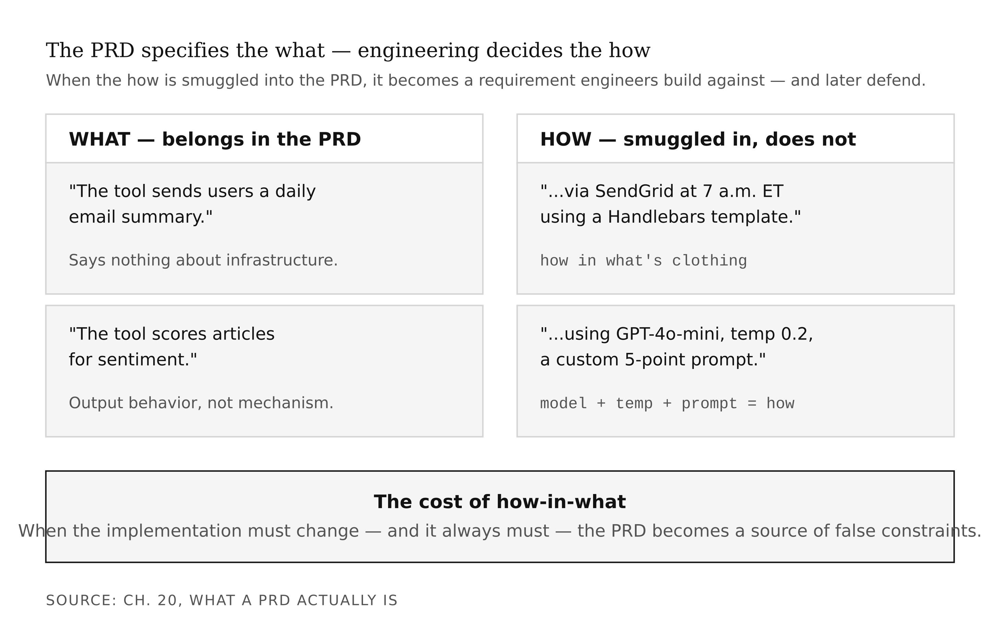
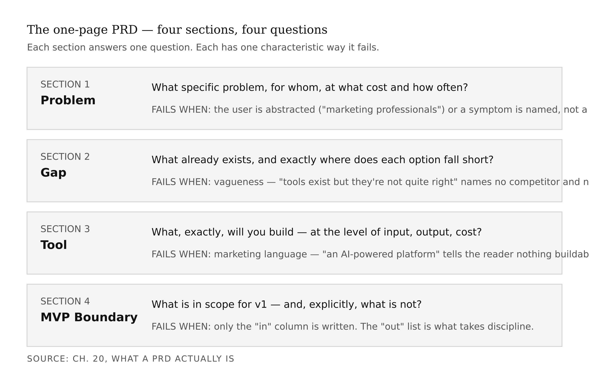
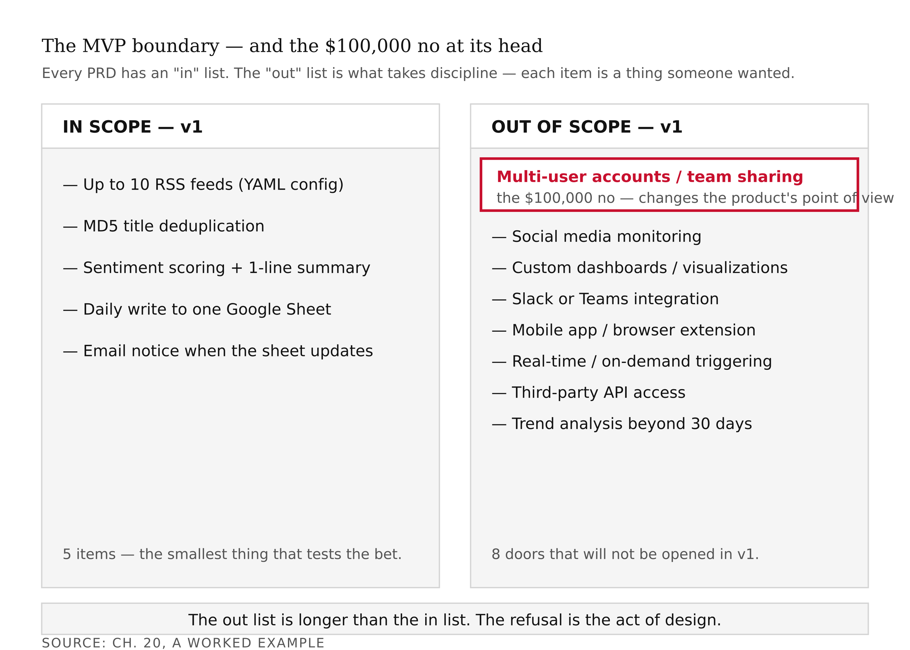
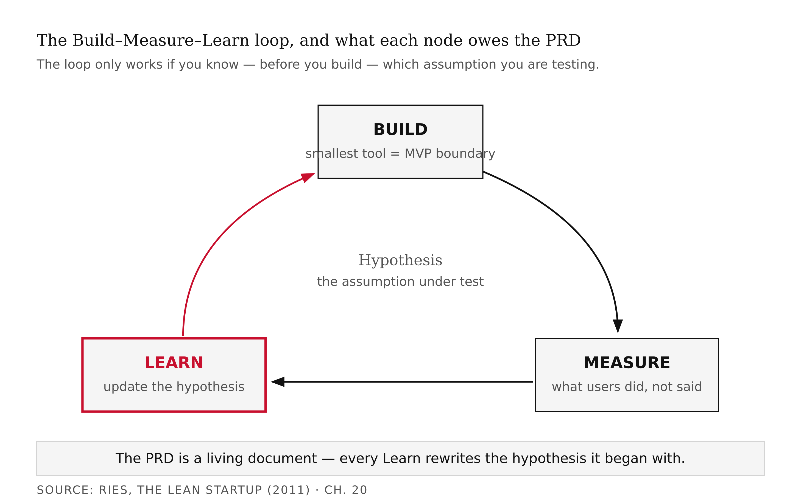
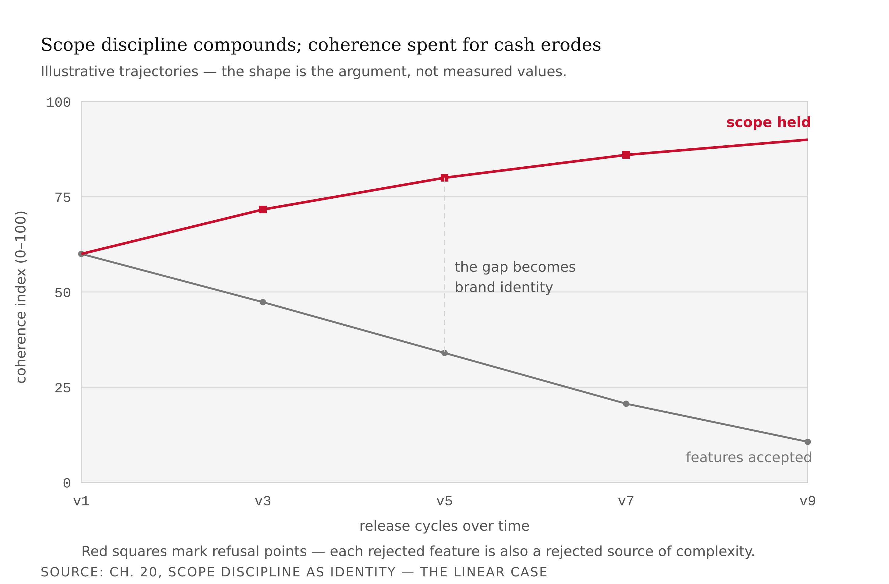
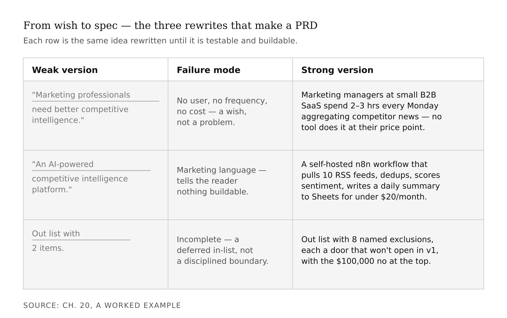

# Appendix S1 — Product Requirements and Scope
*The $100,000 no, and why the things you refuse to build define the product more than the things you build.*

> **TL;DR:** This appendix is about scope — deciding what to build and, more importantly, what to refuse to build. It defines the product requirements document, explains what "minimum viable product" really means, and shows through the Linear case and a worked example why the things you decline (the "$100,000 no") define a product more than the things you ship.
>
> | Section | Preview |
> |---|---|
> | What a PRD Actually Is | What a product requirements document is for, and why it is a decision record rather than a wish list. |
> | What "Minimum Viable Product" Actually Means | The real meaning of MVP — the smallest thing that tests the core bet — versus the common misreading. |
> | Scope Discipline as Identity: The Linear Case | How the software company Linear made refusing features the core of its identity. |
> | Reading Madison as a PRD | What the Madison framework looks like viewed as a set of scope decisions. |
> | A Worked Example | A full PRD built step by step, including an explicit list of what it will not do. |
> | What the PRD Is Actually Doing | Why the document's deeper job is forcing commitments before pressure arrives. |

---

Here is a thing that happens constantly in software teams. You start building without deciding in advance what you are building. Every question that arises during development gets answered in the moment by whoever is most opinionated in the room. Should the tool support multi-user accounts? The engineer who is annoyed by the lack of them says yes and builds it. Should the output be a Google Sheet or a Notion database? The PM who uses Notion says Notion. Should the system support custom RSS feeds or only a curated list? The person who gave the last demo adds custom feeds because the prospect asked for them.

By the time v1 ships — if it ships — the product is a collection of in-the-moment decisions made under different assumptions by people solving different problems. It is coherent the way a committee memo is coherent.

The document that prevents this is called a PRD — a Product Requirements Document. The word "requirements" sounds administrative, which is why it gets underestimated. A PRD is not a form you fill out before you are allowed to write code. It is the mechanism by which you force yourself to make decisions *before* writing code. The decisions are hard. The PRD is what makes you make them.

## What a PRD Actually Is

Marty Cagan, whose book *Inspired* is the most widely-read treatment of product management in the technology industry, gives the PRD's core rule in a single sentence: the PRD specifies the *what*, not the *how*. The product team decides what the product needs to do. The engineering team decides how to implement it.

The what versus how distinction is cleaner in theory than in practice. A few examples.

"The tool sends users a daily email summary" — this is *what*. It says nothing about the email infrastructure, the scheduling mechanism, the HTML renderer, or the unsubscribe flow. Those are for engineering. "The tool sends users a daily email summary via SendGrid at 7 a.m. Eastern using a Handlebars template" — this is *how* in *what*'s clothing. It has made technology decisions the PRD had no business making.

"The tool scores articles for sentiment" — this is *what*. "The tool scores articles for sentiment using GPT-4o-mini with a temperature of 0.2 and a custom system prompt that rates each article on a five-point scale" — again, *how* smuggled in. The PRD should not specify the model, the temperature, or the prompt structure.

The distinction matters because when the *how* ends up in the PRD, it gets treated as a requirement. Engineers build against it. When the implementation needs to change — and it always needs to change — the PRD becomes a source of false constraints. You end up defending a technology choice that was never actually a product requirement.



The one-page PRD has four sections. Each answers one question.



<!-- → [TABLE: PRD section anatomy — four rows: Problem, Gap, Tool, MVP Boundary; columns: section, question it answers, common failure mode, weak example, strong example] -->

**Section 1: Problem.** What specific problem are you solving, for whom, and how often does it cost them something?

The first failure mode is abstracting the user. "Marketing professionals" is not a user. "Marketing managers at Series-B SaaS companies with no dedicated analytics team" is a user. The more precisely you can describe the person, the more precisely you can test whether your tool solves their problem.

The second failure mode is describing a symptom instead of a cause. "Users want better competitive intelligence" is a symptom. The cause is: "Marketing managers at small B2B companies spend three hours a week manually compiling competitor news from RSS feeds and email newsletters, and the compiled output is stale by the time they act on it." The cause has a user, a task, a time cost, and a consequence. The symptom has none of those.

What good looks like: *Marketing managers at small B2B SaaS companies — five to fifty employees, no dedicated analyst — spend two to four hours every Monday morning manually aggregating competitor news from RSS feeds, Google Alerts, and vendor newsletters. They do this to brief their team before the week's campaigns. The output is a Slack message or a shared Google Doc. The process is repetitive, the output is inconsistent, and the intelligence is approximately twelve to twenty-four hours stale by the time the team reads it.*

Notice what that problem statement gives you: a specific user, a specific task, a specific frequency, a specific output, and a specific failure mode. Every one of those specifics is testable. You can find ten marketing managers who fit that description and ask them whether the problem statement is accurate.

**Section 2: Gap.** What already exists to solve this problem, and where does it fall short?

The failure mode is vagueness. "There are tools out there, but they're not quite right" is not a gap analysis. A gap analysis names actual products and explains exactly what each one gets wrong for your specific user.

What good looks like: *Google Alerts is free and monitors keyword mentions, but it produces a raw feed with no deduplication, no sentiment scoring, and no prioritization — users end up with fifty alerts per day for a single keyword, most of them noise. Feedly Pro aggregates RSS feeds cleanly and costs $8/month, but it has no analysis layer — the user still has to read every article and extract the insight manually. Brand24 monitors social mentions and news with sentiment analysis starting at $99/month, but it is priced and scoped for enterprise, the interface is complex, and it does not integrate with the Google Sheets workflows that small-team marketers already use. Crayon tracks competitor website changes and marketing activity but costs $1,500/month minimum, outside the budget of the user we are targeting.*

That gap analysis has four named competitors, a specific failure mode for each, and a clear implication: the market has either cheap-and-dumb or expensive-and-complex. The user needs affordable-and-smart.

**Section 3: Tool.** What, exactly, will you build?

The failure mode is marketing language. "An AI-powered platform for marketing intelligence" is not a tool description — it is a press release sentence. It tells the reader nothing about what the product does, how it does it at the output level, or who it is for. Every AI marketing tool could be described that way.

The test: read your tool description to someone who has not heard your pitch. Ask them what the tool does. If they cannot tell you, the description is not specific enough.

What good looks like: *A self-hosted n8n workflow that pulls from up to ten RSS feeds per user, deduplicates articles by title similarity, scores each article for sentiment and competitive relevance using the OpenAI API, and writes a daily summary to a Google Sheet the user already owns. Total API cost under $20/month for a standard-volume user.*

That description tells you the delivery mechanism, the input, the processing, the output, and the cost envelope. A competent engineer can read it and know what to build. Notice that it does not say anything about how the deduplication works, which model version scores the sentiment, or what the Google Sheet looks like. Those are *how* decisions. They belong to the engineer.

**Section 4: MVP Boundary.** What is in scope for v1, and — explicitly — what is not?

The failure mode is only writing the "in" column. Every PRD has an "in" list; that is the natural output of a feature brainstorm. The "out" list is what takes discipline, because every item on the out list is a thing someone on the team wanted. Writing it down means having the argument before shipping, not during.

What good looks like:

*In scope for v1:*
- Up to 10 RSS feeds per user, configured in a YAML file
- MD5-based title deduplication
- GPT-4o-mini sentiment scoring (positive / neutral / negative + 1-sentence summary)
- Daily output to a single designated Google Sheet
- Email notification when the sheet has been updated

*Out of scope for v1:*
- Multi-user accounts or team sharing
- Social media monitoring (Twitter, LinkedIn, Reddit)
- Custom dashboards or data visualizations
- Slack or Teams integration
- Mobile app or browser extension
- On-demand / real-time triggering (daily batch only)
- API access for third-party integrations
- Historical trend analysis beyond 30 days

That out list has eight items. Each one is a thing a reasonable user would want and a reasonable engineer would want to build. Each one is a door that will not be opened in v1. The discipline that produced the list is exactly the $100,000 no.



## What "Minimum Viable Product" Actually Means

The word *minimum* in *minimum viable product* is where most students go wrong. Minimum sounds like it means "the least possible." It does not mean that. It means "the smallest thing that produces validated learning."

Eric Ries introduced the term in *The Lean Startup* (2011) and defined it precisely: a version of a new product that allows a team to collect the maximum amount of validated learning about customers with the least effort. Three words in that definition are doing serious work: *version*, *validated*, and *learning*.

**Version** means the MVP is a real product, not a mock. You can run a mock past users and get their reactions. What you cannot get is validated behavior — whether users actually do the thing the product enables when they have real stakes, their real data, and their real workflow. A Figma prototype of a sentiment analysis dashboard will get you feedback on colors and layout. It will not tell you whether a marketing manager will actually read the daily Google Sheet update, or whether they will look at it twice and stop because the format does not fit their morning routine. The version has to be real to produce valid data.

**Validated** means the learning came from what users *did*, not what they *said*. Users reliably tell you they will do things they will not do. "Would you use a tool that summarizes your competitor news every morning?" gets a yes from nearly everyone. "Did you open the Google Sheet three times last week?" gets an honest answer from the usage data.

**Learning** means the purpose of the MVP is to test an assumption. The Build-Measure-Learn loop only works if you know, before you build, which assumption you are testing. If you do not know what you are testing, you cannot interpret the results. A marketing manager who opens the sheet every day is confirming that the intelligence is valuable. A marketing manager who stops opening the sheet after two weeks is telling you one of three things: the intelligence is not actionable, the format is wrong, or the cadence is wrong. You need to know which one, and the PRD's problem statement is what lets you formulate the hypothesis.

The loop looks like this:

```
1. HYPOTHESIS: Marketing managers at small B2B companies will use
   a daily competitor-news summary if it is pre-filtered to < 10
   items and scored for sentiment.

2. BUILD: The smallest tool that tests this hypothesis.
   (RSS ingestion + deduplication + sentiment scoring + Sheet.)

3. MEASURE: Do they open the Sheet? How many times per week?
   Do they share it with their team? Do they pay for month two?

4. LEARN: If open rate is high and churn is low, the hypothesis
   held. If open rate drops after week one, the problem was not
   the filtering — it was the format or the cadence. Update the
   hypothesis and rebuild.
```

<!-- → [DIAGRAM: Build-Measure-Learn loop — three-node circular diagram (Build → Measure → Learn → Build); annotate each node with its PRD connection; outer arc labeled "PRD updated — a living document"] -->



The MVP boundary is what keeps the loop tight. A PRD that puts too much in v1 takes six months to ship. You learn nothing for six months. The competitor who shipped a worse product four months ago has already run three learn cycles and is now on v4. You are still on v1.

The discipline is uncomfortable because it means shipping something that is clearly incomplete. You know the product needs multi-user accounts. You know it should have a Slack integration. You know the dashboard should be better than a Google Sheet. But until you have validated that someone will pay for the core thing — the daily scored news summary — none of the additions matter. Ship the core thing. Validate. Then add the layer.

Not all assumptions are equally testable in an MVP, and the PRD should be designed around assumptions that can produce validated results within the MVP window. A testable hypothesis has a measurable behavioral outcome in a realistic timeframe. "Marketing managers will open a daily Google Sheet of scored competitor news at least three times per week after the first two weeks of use" is testable — you can measure it, it has a timeframe, and the outcome is behaviorally meaningful. "Our tool will become the category-defining competitor intelligence platform for SMBs" is not testable in v1. It is a vision, not a hypothesis. Visions belong in your pitch deck, not your PRD.

The test for whether a hypothesis belongs in the PRD: what would falsify it, and can I observe the falsification within the MVP window? If yes, the hypothesis is precise enough to build against. If no, decompose it.

## Scope Discipline as Identity: The Linear Case

Linear is a project management tool built for engineering teams. It competes with Jira, Asana, and — by its own account — the cognitive overhead of bad project management software. The company launched in 2019, grew primarily through word-of-mouth among engineers, and reached a reported $35 million ARR by 2023 with a famously lean team and a product that, by design, does fewer things than its competitors.

The story that anchors this appendix is real: Linear's team has repeatedly declined enterprise customization requests — including multi-workflow configurations worth significant annual contracts — because those customizations conflicted with Linear's product philosophy. The philosophy is published as the Linear Method, a document describing how Linear thinks about software and why their choices are the choices they are.

The Linear Method includes several commitments that look like scope restrictions until you understand their compound effects.

*Opinionated software.* Linear does not try to be configurable for every team's workflow. It has a specific model of how engineering teams should manage work — issues flow through defined states, cycles replace sprints, priorities are explicit — and the product reflects that model. Teams that want to use Linear *their* way find the product resistant. Teams that adopt Linear's model find the product exceptional.

*Simple and fast.* Linear's interface loads faster than competing tools because the company has refused to add the layers of configurability that slow down Jira and Asana. Every rejected customization request is also a rejected source of UI complexity, a rejected source of backend branching logic, a rejected source of on-call incidents. The no to the customer is simultaneously a yes to speed.

*Continuous improvement.* Linear ships small improvements constantly rather than big features occasionally. This cadence is only possible because the scope is narrow. A team maintaining a product with forty configuration surfaces cannot ship as frequently as a team maintaining a product with ten.

The brand consequence of these commitments is specific: Linear has become the product that engineers recommend to other engineers when they want to escape Jira. The recommendation happens not because Linear has more features — it has fewer — but because Linear's constraints produce a coherent experience. The discipline that said no to the enterprise customization is the same discipline that produced the product engineers love.

This is the phenomenon worth seeing as a product designer: *scope discipline compounds*. Each time you refuse a feature that would compromise the core, you are not just keeping the product smaller. You are preserving the coherence of the experience that made the product worth using. Over time, the coherence becomes the product's identity. The identity becomes the brand. The brand attracts more users who value that specific coherence, which deepens it further.

<!-- → [CHART: Two line series over time — "scope discipline held" line rising, "feature requests accepted" line falling; y-axis is coherence index 0–100; annotate the disciplined line's refusal points; label where the two lines diverge as the product's brand identity differentiating] -->



The inverse is also true. Each time you accept a feature that compromises the core — usually because a specific customer asked for it and was willing to pay — you are spending coherence for cash. The transaction feels rational in the moment. Over time, the accumulated incoherence drives away the users who came for the discipline. You do not notice until your original user base has quietly moved on.

### The $100,000 No

Before you write your PRD, you need to identify your equivalent of the Linear enterprise customization refusal. The $100,000 no is the feature you would decline even if declining cost you something real.

The $100,000 no is not "I will not build things that are out of scope." Every product has out-of-scope things by default; that is not a discipline. The $100,000 no is the feature that a real user will ask for, with a real argument for why it belongs in the product, and that you will decline anyway because including it would compromise the core.

For a sentiment analysis pipeline targeting small marketing teams, the $100,000 no might be: multi-user account support. An enterprise prospect will ask for it. They will have a budget. The implementation is not technically difficult. And you will refuse it in v1 because multi-user account support changes the product from a personal intelligence tool to a team intelligence platform, and those are different products. The day you build multi-user support, you have stopped building the personal tool and started building the team platform. Every subsequent decision — permissions, audit trails, team-level dashboards, admin interfaces — is a team-platform decision, not a personal-tool decision. The product's point of view has changed.

The $100,000 no is disciplined precisely because it acknowledges the cost. You are not refusing because the feature is technically impossible or economically worthless. You are refusing because building it would damage the product's coherence in ways that would cost more than the feature is worth. That requires having a point of view strong enough to hold under pressure.

Write your $100,000 no before you write the rest of your PRD. Put it in the "out of scope" column, first. Then write the rest of the document around it.

## Reading Madison as a PRD

Each Madison layer has a README that functions as a condensed PRD. It states a purpose, names the features, describes the technology stack, and — implicitly — defines the scope by what it includes and what it omits. Reading the READMEs as PRDs teaches you the shape your document should take.

Open the Intelligence Agent README. It states the purpose in one line, lists the features in plain language without implementation detail, names the success criteria in measurable terms ("processes 870+ articles daily, sub-3-minute latency, 90% deduplication"), and stops. It does not explain the MD5 hashing algorithm. It does not describe the database schema. Those are *how* decisions. The README, functioning as PRD, leaves them alone.

Read the README again with two questions in your head: *What would happen if I added social media monitoring to this agent?* and *Why hasn't Madison's team added it?* The first question is easy — social media monitoring would require different APIs, different rate limiting, different content normalization, and a different deduplication approach for short-form content. The second question is the PRD discipline: Madison's Intelligence Agent is scoped for RSS-based news, and widening the scope would add complexity without serving the core use case better. The scoping decision is not a technical limitation. It is a point of view about what the agent is for.

<!-- → [TABLE: Madison layers mapped to PRD sections — columns: layer, target user in Madison's design, gap Madison leaves for non-technical users, suggested v1 scope for a student building on this layer, natural $100,000 no] -->

The archetype picks the layer; the layer shapes the PRD. If your archetype is Sage, the Intelligence layer is probably your closest reference. If Creator, look at the Content layer's README. If Caregiver, the Experience Agent documentation. Each Madison layer has a target user, a gap it leaves for non-technical users, and a natural $100,000 no that defines what it is *not* trying to do.

## A Worked Example

Suppose your archetype is Sage and your selected layer is Intelligence. You have done the reading. Now you sit down to write the PRD. Here is what that process looks like, with the decisions made explicit.

Draft problem statement, attempt 1: *Marketing professionals need better competitive intelligence.* That is a wish. It has no user, no frequency, no cost. Discard it.

Draft problem statement, attempt 2: *Small marketing teams lack good competitive intelligence tools.* Still too abstract. "Small marketing teams" is not a person. "Lack" describes an absence, not a pain. Discard it.

Draft problem statement, attempt 3: *Marketing managers at small B2B SaaS companies spend two to three hours every Monday aggregating competitor news manually, because their team needs a weekly brief and there is no tool that does the aggregation, filtering, and scoring in one step at a price point they can justify.* Now we have something: a specific user, a specific task, a specific frequency, a specific output, a specific failure. This is a problem statement. It is testable.

Gap analysis: Google Alerts is free and noisy. Feedly is affordable and unanalyzed. Brand24 is analyzed and expensive. The gap is affordable plus analyzed. Your tool lives in that gap.

Tool description, attempt 1: *An AI-powered competitive intelligence platform.* This is a marketing slogan. Discard it.

Tool description, attempt 2: *A self-hosted n8n workflow that pulls competitor RSS feeds, deduplicates articles, scores sentiment with GPT-4o-mini, and writes a daily summary to Google Sheets for under $20/month in API costs.* This is a tool description. A competent engineer knows what to build. A marketing manager knows whether this solves their problem.

MVP boundary: In scope — 10 RSS feeds, deduplication, sentiment scoring, daily Google Sheet output, email notification. Out of scope — social media, multi-user accounts, dashboards, Slack integration, real-time triggering, historical trend analysis. The $100,000 no: multi-user accounts, because adding them changes the product from personal tool to team platform and forces a different design philosophy for every subsequent decision.

| Weak version | Failure mode | Strong version |
|---|---|---|
| "Marketing professionals need better competitive intelligence." | No user, no frequency, no cost — a wish, not a problem | "Marketing managers at small B2B SaaS spend 2–3 hours every Monday aggregating competitor news manually because no tool does aggregation, filtering, and scoring in one step at their price point." |
| "An AI-powered competitive intelligence platform." | Marketing language — tells the reader nothing buildable | "A self-hosted n8n workflow pulling up to 10 RSS feeds, deduplicating articles, scoring sentiment via GPT-4o-mini, and writing a daily summary to Google Sheets for under $20/month." |
| Out list with 2 items | Incomplete — a deferred in-list, not a disciplined boundary | Out list with 8 named exclusions, each a door that will not be opened in v1, with the $100,000 no at the top |

<!-- → [TABLE: Weak-vs-strong PRD comparison — three rows matching the worked example's three rewrite iterations; columns: section, weak version, failure mode, strong version — the progression from wish to spec made scannable] -->



That is the PRD. One page. Four sections. A defensible out list. A named $100,000 no. An engineer can build from it. A user can evaluate it. A product manager can test it against the Build-Measure-Learn loop.

## What the PRD Is Actually Doing

Let me connect the threads, because the PRD touches everything that comes before and after this point in the book.

The problem statement is an extension of the archetype work. Your archetype describes the kind of value you create and the mode in which you create it. The problem statement describes who receives that value and under what circumstances. A Sage archetype builds tools that provide insight — the problem statement identifies who lacks insight, how they currently seek it, and what that seeking costs them. A Creator archetype builds tools that produce things — the problem statement identifies who needs production help, what they currently produce manually, and why manual production fails them. The archetype tells you what kind of tool to build. The problem statement tells you for whom.

The tool description translates the architecture into user-facing language: not "an n8n ReAct pipeline with GPT-4o-mini sentiment scoring" but "a daily summary of competitor news, scored and filtered, in the Google Sheet you already use." The architecture stays in the *how*. The tool description stays in the *what*.

The MVP boundary is the mechanism that makes the Build-Measure-Learn loop fast. If the out list is too short, the build takes too long. If it is too long — if you have removed things genuinely necessary for the core experience — you will not get valid results from the measure step because users will be blocked from the behavior you are trying to measure.

The $100,000 no is the mechanism that prevents scope creep through the rest of the course. Every chapter after this one will surface features you could add. The PRD's out list, with the $100,000 no at its head, is the document you return to when someone suggests adding a feature. Not "is this a good feature?" — that question always gets a yes. The question is: does this feature belong in v1, given the hypothesis we are testing?

> A PRD is a contract with future-you: a record of the decisions you made when you were thinking clearly, preserved for the moment when you are thinking under pressure. The pressure will come. The contract is what keeps you from agreeing to things you will regret.

<!-- → [DIAGRAM: PRD as connective tissue — four boxes in a horizontal row: Archetype (feeds problem statement), Architecture (feeds tool description), MVP Boundary (feeds Build-Measure-Learn loop), $100,000 No (gates scope creep in subsequent chapters) — arrows showing each connection, with annotation showing what breaks if each connection is missing] -->


<!-- → [FIGURE: One-page PRD template — four section cards (Problem, Gap, Tool, MVP Boundary), each with guiding question, crossed-out weak version, and strong version; sidebar card for $100,000 no aligned to the MVP Boundary section] -->

**What would change my mind:** a controlled study of student-built AI tools comparing cohorts who wrote a PRD before building against cohorts who did not, measuring time-to-ship and user retention at thirty days. The argument here is theoretical and industrial; the experimental evidence in student contexts is thin. If students without PRDs ship faster *and* retain users longer, the constraint is net-negative for this context, and this appendix should be removed. I do not believe that will be the finding, but I have not run the study.

**Still puzzling:** the exact moment when scope discipline tips from useful constraint to creative restriction. Linear's discipline works because it is grounded in a coherent point of view on how engineering teams should work. A student without a coherent point of view practicing the same discipline can end up refusing features for no good reason — a sterile discipline rather than a productive one. I teach the $100,000 no as a tool. What I have not yet figured out is how to teach the underlying point of view that makes the no meaningful rather than merely rigid.

---

## LLM Exercises

### Exercise 1 — When to Use AI
*Run these tasks with an LLM and evaluate what it can and cannot do:*

Draft the PRD scaffold — problem, gap, tool description, MVP boundary — from a brief you supply. Then ask the model to pressure-test the draft by surfacing specific questions an engineer would ask that the PRD does not answer. Evaluate: where did the pressure-test reveal real gaps in the PRD, and where did it surface false concerns based on the model's pattern-matching to other PRDs rather than your actual product?

**The tell:** you can independently judge whether each engineer question the model raised is real. Any question you cannot resolve by looking at your PRD is a genuine gap. Any question the PRD already answers is the model hallucinating an absence.

### Exercise 2 — When NOT to Use AI
*Identify the judgment the AI cannot make:*

Ask the model to write the success metrics for your PRD — the measurable criteria that will tell you whether v1 worked. Evaluate the output. What would it take to actually measure each metric? Does your team track those numbers? Would your organization care about them?

**The tell:** you've crossed the line when the model's metrics become your metrics without that check. The model produces metrics that sound right; you need metrics your team will actually measure and your product actually generates. That alignment requires knowing your team and your measurement infrastructure — which the model does not.

*Series connection:* Scope as refusal — what you won't build defines the product more than what you will.

### Exercise 3 — Recipe Exercise
**Build:** a one-page PRD with an explicit refusal list.

```
Draft a one-page PRD for my brand/tool from the archetype and audience below.
Include: problem (specific user, specific task, specific cost), gap analysis
(name actual competitors and their specific failures), tool description (one
sentence a non-technical user can parse and an engineer can build from), and
MVP boundary — in-scope (max 5 items) and out-of-scope (the "$100,000 no",
min 3 items, each with the archetype reason it is refused).

A short in-scope with a sharp out-of-scope is the goal. Do not pad in-scope
to look ambitious. Do not write marketing language anywhere in the PRD.

Archetype + audience:
[PASTE]
```

**Adapt:** career track — treat yourself as the product, the job market as the launch target, and the next six months as the MVP window. The $100,000 no is the role you would decline even at a compelling compensation level because it would damage your brand.

### Exercise 4 — CLI Exercise
**Build:** `your-brand/prd.md`

```
Write your-brand/prd.md with four sections: Problem, Gap, Tool, MVP Boundary.
MVP Boundary must have two columns: in-scope (five items maximum) and out-of-scope
(three items minimum, each with a one-line archetype reason for the refusal).
The $100,000 no goes first in the out-of-scope column.

Do not invent users, competitors, or metrics beyond what I provide.
Do not use marketing language. Stop after writing the file.
```

**Inspect:** the out-of-scope list is at least as long as in-scope; each refusal cites the archetype; the tool description passes the "read it to someone who hasn't heard your pitch" test. **If it goes wrong:** the model inflates in-scope to look ambitious — cut anything the archetype doesn't demand.

### Exercise 5 — AI Validation Exercise
**Validate** the PRD. Rate each criterion Pass / Fail / Cannot-determine with evidence:

- **Correctness:** does each out-of-scope item have a real archetype reason, not just "out of time" or "out of scope for v1"?
- **Completeness:** problem, gap, tool description, and both MVP boundary columns all present?
- **Scope:** one page, no roadmap sprawl — is there anything in the PRD that could only be validated in v2 or later?
- **Brand-specific:** would building any in-scope item activate the archetype's shadow? Flag it if so.
- **Failure-mode check:** any in-scope item justified only by "AI makes it easy" or "users asked for it"? Remove it — those are feature brainstorm reasons, not PRD reasons.

**AI Use Disclosure:** two sentences — what the model produced and how you used it; one judgment it could not make (the $100,000 no, the success metric, the MVP scope decision) that required your call.

---

## Key Terms

PRD (product requirements document) · what vs. how · problem statement · gap analysis · MVP (minimum viable product) · Build-Measure-Learn loop · validated learning · MVP boundary · scope discipline · $100,000 no · scope creep

## Bridge

The PRD is the contract. The next step is building what it describes — the minimum pipeline that tests the core hypothesis, no more and no less than what the MVP boundary permits.
