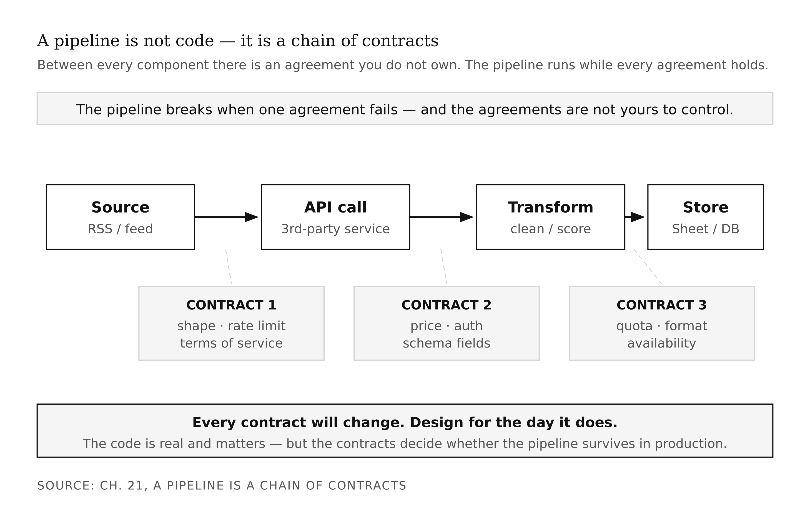
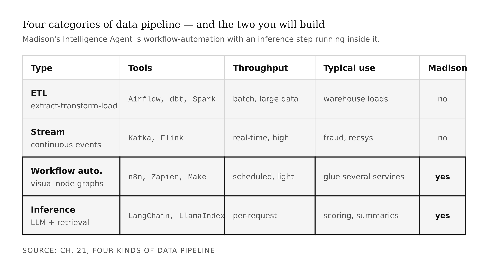
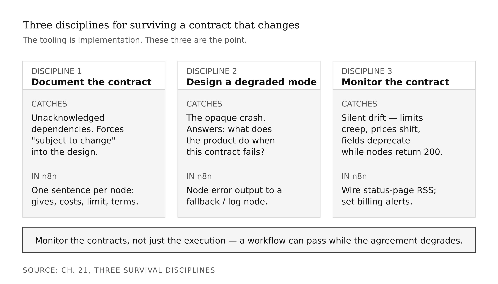
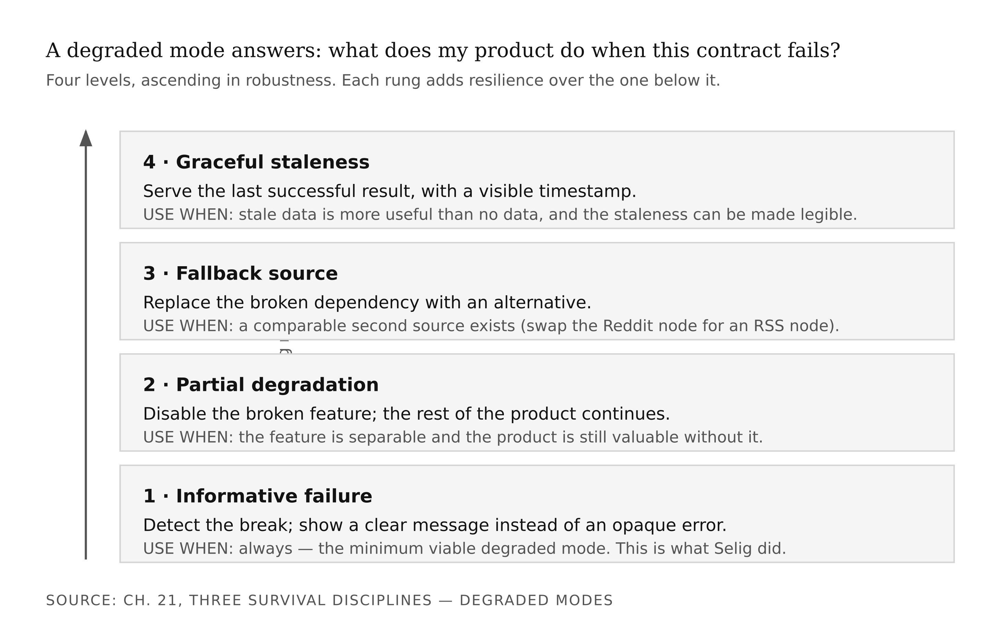
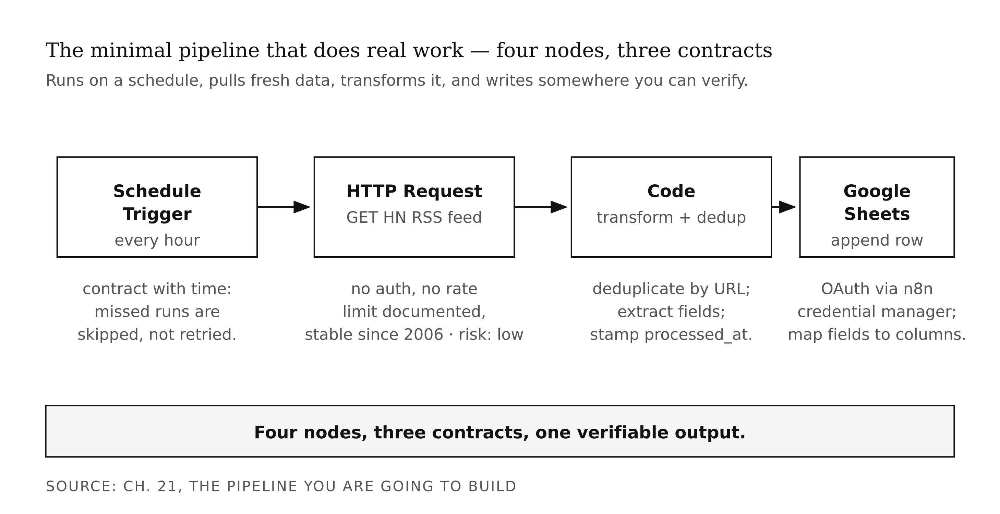

# Appendix S2 — Pipelines & Workflow (on Madison)
*Every external dependency is a contract. Every contract will change.*

> **TL;DR:** This appendix reframes data pipelines as chains of agreements you do not control — every API, feed, and service can change its terms and break you. Using the Apollo/Reddit shutdown and the n8n automation tool, it teaches you to document every dependency, build fallback ("degraded") modes, and watch for contract changes before they take your product down.
>
> | Section | Preview |
> |---|---|
> | Apollo and the contract that killed it | How a well-built, popular Reddit app died overnight from a pricing change, not a code flaw. |
> | A pipeline is a chain of contracts | Why the agreements between services, not the code, decide whether a pipeline survives. |
> | Four kinds of data pipeline | The four pipeline types (ETL, streaming, workflow-automation, inference) and which one you will build. |
> | Apollo as a brand story | Why, when an upstream service breaks, users blame your product — the damage flows to the smallest party. |
> | Three survival disciplines | Document every dependency, design a fallback for each, and monitor for contract changes. |
> | Building it in n8n | A four-node workflow that pulls, transforms, and stores real data on a schedule. |
> | Reading Madison + breaking it on purpose | How Madison's intelligence workflow is built, and why you should trigger failures yourself before users do. |

---

On May 31, 2023, Christian Selig published a number.

Reddit had announced new API pricing in April: $0.24 per 1,000 calls. Selig had done the math. In the previous month, Apollo — his third-party Reddit client, beloved by several hundred thousand paying users — had made roughly seven billion API requests. Multiplying out: Apollo would owe Reddit approximately $20 million per year.

Apollo was a one-developer shop with revenue measured in the hundreds of thousands. Twenty million was not a price adjustment. It was a kill order, delivered with three months' notice. On June 30, Apollo shut down. Reddit Is Fun and ReddPlanet followed. A third-party ecosystem that had existed for over a decade was gone.

Apollo was not a bad pipeline. By most measures it was excellent — performant, well-designed, praised by everyone who used it. What killed it was not the code. It was the contract.

That distinction is what this appendix is about.

---

Most people approaching pipeline design think about pipelines as code. A script that pulls data, processes it, writes it somewhere. And that framing is not wrong — the code is real, and it matters. But it misses the thing that actually determines whether a pipeline survives in production. A pipeline is not primarily a piece of code. A pipeline is a *chain of contracts*, each owned by someone else, each subject to change without your consent.

Between every component in your pipeline — every API call, every database write, every transformation step — there is an agreement about how data flows, in what shape, at what cost, subject to what rate limits, governed by what terms of service. The pipeline runs as long as every agreement holds. The pipeline breaks when one agreement fails. And the agreements are not yours to control.

This is the frame to hold for everything in this appendix. The four pipeline types, the n8n walkthrough, the error-handling mechanics — all of it is in service of a single practical skill: designing for the day a contract changes, rather than pretending it will not.



Before this appendix makes full sense, you need basic comfort with web APIs — you should have made at least one API call in code and encountered a rate limit or authentication error. If you have not, spend an hour with the [Open-Meteo weather API](https://open-meteo.com/) before continuing. It requires no authentication and returns clean JSON. The concepts here will make more sense after you have felt an API break under you.

---

Before examining what went wrong with Apollo, it is worth having the vocabulary to describe it precisely. There are four categories of data pipeline, and they are different enough that the tooling, the failure modes, and the design discipline differ by type.

**ETL pipelines** — Extract, Transform, Load — are the classical data-engineering pattern. Pull data from sources, clean and reshape it, write it to a warehouse. SQL-heavy, batch-oriented, designed for large datasets that need to be reliable over years. The tools are Airflow, dbt, Fivetran, Spark. Mature, well-understood, usually run by dedicated data-engineering teams.

**Stream-processing pipelines** are for continuous flows of events processed in near-real-time: a payment fraud-detection system processing ten thousand transactions per second, a social platform ingesting user behavior to update a recommendation model. Kafka, Flink, Spark Streaming. High throughput, low latency, high operational complexity. Not where you are starting.

**Workflow-automation pipelines** — n8n, Zapier, Make — are visual node graphs that connect APIs, transform data, schedule tasks, and glue services together. Lighter than ETL, more general than stream processing. The right tool for small teams building products that depend on several external services. This is what you will build.

**Inference pipelines** are the newest member of the family: an LLM call, followed by embedding, followed by vector store retrieval, followed by a response. Often assembled in Python with LangChain or LlamaIndex, sometimes embedded directly inside a workflow-automation tool. In Madison's architecture, the inference pipeline runs *inside* the workflow-automation pipeline — it is a step, not a separate system.

The Madison Intelligence Agent is a workflow-automation pipeline with an inference step. Its README describes the workflow as forty-plus nodes in n8n connecting RSS feeds, the Google News API, Reddit, GPT-4o-mini, and Google Sheets. RSS ingestion → deduplication → LLM scoring → Sheet write. Types 3 and 4 working together. The pipeline you will build in this appendix is the same shape: smaller, but architecturally identical.

<!-- → [TABLE: Four pipeline categories — columns: type, tools, throughput/frequency, typical use case, used in Madison? Rows: ETL, Stream, Workflow automation, Inference.] -->



---

Now back to Apollo — because the taxonomy is only useful if you can read a failure through it.

The Apollo case is commonly read as a technical story: "Apollo depended too heavily on a single external API." That reading is true. But read it first as a brand story, because that is where the lesson is sharpest.

When Reddit broke Apollo, public sympathy went entirely to Selig. He had been transparent about the math — he published his calculations, walked through the numbers, explained exactly what had changed and why it made the product economically unviable. His transparency made the breakage legible. His personal reputation as a developer was, if anything, strengthened by the episode.

But Apollo *the product* still died. Users who had paid for premium features lost their tool in thirty days. The brand damage to the *product* was total, even as the brand benefit to the *person* was real.

There is also an asymmetry worth sitting with. Reddit — the upstream actor that caused the failure — received diffuse reputational damage spread across a large company with hundreds of millions of users. Apollo, Reddit Is Fun, and ReddPlanet — the downstream tools — received concentrated, immediate, product-killing damage. Damage flows downhill in a contract chain. The largest, most diversified party absorbs a spread; the smallest, most dependent party absorbs everything.

Most builders do not have Selig's transparency or Selig's existing audience. When your pipeline breaks because an upstream service changes its terms, your users do not see "upstream contract failure." They see "this tool stopped working." The brand damage flows to the name on the front page. Which is yours.

<!-- → [TABLE: Apollo damage asymmetry — columns: actor, type of damage, duration. Rows: Reddit (upstream), Apollo (downstream), Christian Selig (personally).] -->


The same pattern ran at Twitter in February 2023, when the platform deprecated its free API tier and introduced new pricing starting at $100 per month for severely limited access — with an enterprise tier at $42,000 per month for the research access that academics had previously used at no cost. Hundreds of third-party tools broke overnight. At Heroku in November 2022, the free dyno tier ended, and thousands of student projects and side tools went offline. Three different industries, three different upstream actors, the same pattern: platform makes a unilateral change, downstream products break, downstream users blame the tool rather than the platform, brand damage flows to the smallest actors in the chain.

Your pipeline will depend on at least one external service. That service's contract will change at some point. The question this appendix asks you to answer before you build is: *when it changes, what does your product do?*

---

Three disciplines answer that question. They are the point. The tooling is implementation.

**Document every external dependency before you build on it.** Not in a separate wiki nobody will read — in the workflow itself, as a node description or a README section. One sentence per dependency: what this service gives you, what it costs, what the rate limit is, what the terms of service allow. This practice does three things. It forces you to confront the dependency consciously before you are dependent on it. It makes the contract visible to anyone who later works on the pipeline, including future-you. And it gives you a checklist to scan when something breaks. The moment you write "Reddit API — 100 requests per minute per OAuth client, no cost currently, terms allow third-party clients, subject to change" you have acknowledged the "subject to change" as part of the design.

**Every critical external dependency needs a degraded mode.** A degraded mode is the answer to: "What does my product do when this contract fails?" Four levels, in increasing order of robustness. *Informative failure*: the product detects the break and shows the user a clear message about what is unavailable and why rather than an opaque error — this is what Selig did, and it is the minimum viable degraded mode. *Partial degradation*: the feature depending on the broken contract is disabled while the rest of the product continues. *Fallback source*: the broken dependency is replaced by an alternative. *Graceful staleness*: the product continues to serve the last successful result, with a visible timestamp. Stale data is usually better than no data, as long as the staleness is legible.

**Monitor the contracts, not just the workflow execution.** A workflow can run successfully — every node returns 200, every connection passes data — while the underlying contract is silently degrading. Rate limits creep down. Pricing tiers shift. Schema fields are deprecated without announcement. Terms of service are updated. You want alerts on contract-level events, not just on execution failures. Wire the API's status-page RSS feed into your monitoring channel. Set billing alerts on the upstream service. Most APIs have status pages with incident histories — five minutes of setup that tells you about a contract change before it crashes your pipeline.

<!-- → [TABLE: Three pipeline disciplines — columns: discipline, what it catches, how to implement in n8n. Rows: document the contract, design a degraded mode, monitor the contract.] -->



<!-- → [TABLE: Degraded mode taxonomy — columns: mode name, what it does, minimum implementation, when to use it. Rows: informative failure, partial degradation, fallback source, graceful staleness.] -->



---

n8n is an open-source workflow automation platform — fair-code licensed, self-hostable, with 400-plus pre-built integrations and the ability to run JavaScript or Python at any node. The Community Edition is free for self-hosted use via Docker; the Cloud version starts at €20 per month for managed hosting. For the build in this appendix, either works. Self-hosted gives more control and costs nothing; cloud gives less setup friction.

Three core concepts.

**Nodes** are operations. A node can be a webhook trigger, an HTTP request, a database write, a function that transforms data, an LLM completion call, a conditional branch, a loop, a delay — anything that takes input and produces output. Every step in your workflow is a node.

**Connections** are edges between nodes. Data flows along connections from an output port to an input port. The shape of the data changes as it passes through nodes — raw JSON from an API call becomes a cleaned object at a transformation node, becomes a row at a Sheet-write node.

**Workflows** are named graphs of nodes and connections, with a trigger — schedule, webhook, manual execution — that starts the chain. Workflows can be exported as JSON, version-controlled, and shared.

The most important property n8n gives you is that each node is *independently replaceable*. In a single Python script that makes ten API calls and writes to a database, the dependencies are interwoven. Swapping one API for another may require touching half the file. Testing one step requires running the whole script. When a contract changes, the failure point is not obviously localized. In an n8n workflow, every dependency is a node with a clearly defined input and output. When OpenAI raises its prices, you swap the OpenAI node for a Claude node. When Reddit's API breaks your ingestion step, you swap the Reddit node for an RSS-feed node — without touching the transformation or output nodes. The visual graph forces the contracts to be explicit, which means you can reason about them before they fail and isolate them when they do.

<!-- → [FIGURE: Side-by-side — Python script with interwoven dependency calls on the left, n8n workflow with each contract as a separately labeled, replaceable node on the right. Caption: same pipeline, two representations; one makes the contracts visible.] -->


Setting up n8n takes two commands if you have Docker:

```bash
docker volume create n8n_data

docker run -it --rm \
  --name n8n \
  -p 5678:5678 \
  -v n8n_data:/home/node/.n8n \
  docker.n8n.io/n8nio/n8n
```

Navigate to `http://localhost:5678`. Create an account on first launch. Your workflows persist in the `n8n_data` volume. If you prefer managed hosting, create an account at [n8n.io](https://n8n.io) — the interface is identical.

---

Here is the pipeline you are going to build:

```
[Schedule Trigger] → [HTTP Request: RSS Feed] → [Code: Transform + Deduplicate] → [Google Sheets: Write Row]
```

This is the minimal pipeline that does real work: it runs on a schedule, pulls fresh data from an external source, transforms it into a structured form, and writes it somewhere you can verify.

**Node 1 — Schedule Trigger.** Add a Schedule Trigger node. Set it to run every hour. Document it: "Runs hourly; if n8n is down, the run is skipped and not retried unless you add a catch-up mechanism." That is the contract with time.

**Node 2 — HTTP Request.** Add an HTTP Request node. Set it to GET the [Hacker News RSS feed](https://news.ycombinator.com/rss) (`https://news.ycombinator.com/rss`). No authentication required, stable Atom format since 2006, low rate-limit risk. Document it in the node description: "Hacker News RSS — no auth required, no rate limit documented, stable format since 2006, risk: low."

**Node 3 — Code (Transform).** Add a Code node running JavaScript. This function extracts the fields you care about, deduplicates by URL, and returns a clean array:

```javascript
const items = $input.all();
const seen = new Set();
const cleaned = [];

for (const item of items) {
  const url = item.json.link;
  if (!seen.has(url)) {
    seen.add(url);
    cleaned.push({
      title: item.json.title,
      url: item.json.link,
      published: item.json.pubDate,
      processed_at: new Date().toISOString()
    });
  }
}

return cleaned.map(c => ({ json: c }));
```

**Node 4 — Google Sheets.** Add a Google Sheets node. Connect your Google account using n8n's credential manager. Point the node at a sheet you have created. Set the operation to Append Row. Map the fields from Node 3 to columns in the sheet.

Run the workflow manually. Open the sheet. Verify that rows appeared. If they did, you have a working pipeline. Four nodes, three contracts, one verifiable output.



---

Now open `pantry/madison/Intelligence-Agent/n8n_workflow.json` — either in a text editor or imported into your n8n instance — and trace the data flow. You are not looking for the node count. You are looking for the design decisions.

The workflow starts with a schedule trigger set to run every six hours. Not real-time: six hours, because hitting API caps mid-day produces throttled, degraded output for the rest of the window, and the business value of marketing intelligence does not require fifteen-minute freshness. That is a contract-aware scheduling decision.

Ingestion runs in parallel branches — one for RSS feeds, one for the Google News API, one for Reddit. Each branch is a separate HTTP Request node. Each external dependency is isolated. If the Reddit node fails, the RSS branches continue. That is the degraded mode designed into the architecture before anyone wrote an error handler.

A Code node hashes item URLs and filters items already seen in a previous run, using a Google Sheet as a lightweight seen-URL store. If the same story runs in three sources, it is scored once, not three times. That is a token-cost optimization that is also an accuracy decision.

An OpenAI node sends each new item's title and description to GPT-4o-mini with a prompt that returns a relevance score and a summary. This is the inference step — a contract like any other. It has a rate limit, a price, and terms of service. Document it; design a fallback.

Two output nodes: one that appends scored items to the main content sheet, one that writes a run-log entry with a timestamp and item count. The run log answers the question your monitoring system needs to be able to ask: did the pipeline run today? Not "is the pipeline currently running" — that is a different question — but "did it execute successfully at 7 a.m.?"

<!-- → [FIGURE: Madison Intelligence Agent workflow architecture — schedule trigger, parallel ingestion branches, deduplication node, LLM scoring node, dual output nodes. Caption: each design choice labeled with the failure mode it addresses.] -->


<!-- → [TABLE: Madison design choices — columns: design choice, failure mode it addresses, what happens without it. Rows: parallel branches, seen-URL store, run log, six-hour schedule.] -->

---

You have a working pipeline. Now harden it.

n8n has two mechanisms for error handling: node-level error outputs and error workflows. Every node can be configured to have an error output in addition to its normal output. Connect the error output of your HTTP Request node to a Code node that logs the error and returns a fallback value:

```javascript
return [{
  json: {
    error: true,
    message: "RSS fetch failed — returning empty item list",
    fallback: [],
    timestamp: new Date().toISOString()
  }
}];
```

For pipeline-level error handling, go to Workflow Settings and set an Error Workflow — a separate workflow that runs whenever the main workflow fails. A minimal error workflow sends a notification (email, Slack, webhook) with the workflow name, the node that failed, and the error message. This is your contract-monitoring hook.

Before submitting this appendix's exercises, do this: break one of your contracts deliberately, and observe what happens. Disconnect your API key. Point the HTTP Request node at a URL that returns 404. Comment out the deduplication logic so items are written twice. In each case, watch what the workflow does. Most pipeline bugs surface not when the happy path runs but when an unexpected input arrives. The only way to know your error handling works is to trigger the errors intentionally before users do it accidentally.

---

One judgment call this appendix cannot make for you: which external services to depend on at all.

The Apollo case suggests a heuristic: prefer contracts that have been stable for a long time, that are maintained by multiple parties rather than a single platform, and that do not depend on the platform's business model remaining aligned with your use. RSS and Atom feeds satisfy all three. They have been stable since the early 2000s. They are implemented by thousands of services independently. No single platform can unilaterally change the specification in a way that breaks your pipeline. They are limited — RSS gives you titles, links, descriptions, timestamps, and little else — but they are stable.

Twitter's API, Reddit's API, and Heroku's free tier failed all three criteria. Each was controlled by a single platform. Each was cheap or free because the platform had not yet monetized the capability. Each was changed unilaterally when the business model shifted.

The strategic trade-off is real: richer contracts are usually less stable, and more stable contracts are usually less rich. There is no formula that resolves this for every product. There is only the discipline of making the choice consciously, documenting it, and building degraded modes for the contracts you know are fragile.

---

Your pipeline is not infrastructure separate from your product. It *is* your product, from the perspective of reliability. The data your tool surfaces — how fresh it is, how accurate, how consistently available — is part of the product experience. A pipeline that runs silently and reliably is invisible to the user, which is exactly what you want. A pipeline that fails is immediately visible, and the user sees *your product fail*, not the upstream contract that broke.

The economics underneath this are the economics Joan Robinson formalized in the 1930s under the name *monopsony*: a market where one buyer faces many sellers with no realistic alternatives, giving the buyer the power to change the terms unilaterally. Reddit was not charging Apollo what the market would bear in a competitive API market. Reddit was charging Apollo what it chose to charge, because Apollo had no realistic alternative source for Reddit data. Selig had built a business inside someone else's monopsony, which is not a pipeline-design mistake so much as a structural constraint that no amount of clever error handling can fully address.

The three disciplines from the middle of this appendix — document the contracts, build degraded modes, monitor the contracts — are not responses to that structural constraint. They are responses to the smaller, more tractable failure modes: the API that changes its rate limit, the schema that adds a field, the free tier that becomes paid. Those failures are preventable with discipline. The monopsony failure is preventable only by choosing, where possible, contracts with genuine alternatives.

The Creative Engineer — the one who Ideates, Builds, Brands, and Ships — builds the pipeline that is still running six months after launch, because they designed for the contracts they do not control.

<!-- → [TABLE: Pipeline properties and their brand consequences — columns: pipeline property, brand consequence. Rows: silent reliable execution, undocumented dependency breaks, informative failure mode, no degraded mode, run log plus monitoring.] -->

---

## What Would Change My Mind

Strong evidence that students learn pipeline-design skills better through code-first frameworks than through visual workflow tools like n8n. The pedagogical claim is that visual workflows make the contracts structurally visible in a way that script-based pipelines require deliberate discipline to achieve. That claim is plausible but not settled by evidence I have seen. If you find a study showing the reverse, bring it.

## Still Puzzling

The trade-off between contract-stability and feature-richness when choosing external services has no clean rule of thumb. RSS is stable but limited. Twitter's academic API, when it existed, was rich but fragile. "Prefer stability" is right as a default and wrong in specific cases — a product that genuinely requires rich social data has no stable-contract alternative. I do not yet have a principled framework for when to accept the fragile-but-rich contract. The heuristic I use in practice: if the contract is controlled by a single platform, budget for its failure from day one. That is not the same as a rule.

---

## Exercises

### Warm-Up

**W1.** In two sentences, explain the difference between a *pipeline as code* and a *pipeline as a chain of contracts*. Why does the distinction matter for reliability?
*Tests: the core definition and its practical implication.*
*Difficulty: Low.*

**W2.** Name the four categories of data pipeline. For each, write one sentence describing the appropriate use case and one sentence describing a use case where it would be the wrong choice.
*Tests: pipeline taxonomy with genuine discrimination between types.*
*Difficulty: Low.*

**W3.** Read the Apollo/Reddit case. In three sentences: what was the contract, who owned it, and why did the downstream product fail even though the downstream product itself was well-built?
*Tests: contract-failure comprehension applied to the specific case.*
*Difficulty: Low.*

### Application

**A1.** Build the four-node n8n pipeline described in this appendix (Schedule → RSS fetch → Transform → Sheets write). Run it successfully. Then document the three external contracts it depends on using the format introduced here: what the service provides, what it costs, what its rate limit is, and what your degraded mode is. Submit the workflow JSON and the contracts document.
*Tests: pipeline build plus contract documentation.*
*Difficulty: Medium.*

**A2.** Add error handling to the HTTP Request node in your pipeline: wire its error output to a fallback node that logs the error and returns an empty item list rather than crashing the workflow. Trigger the error deliberately by pointing the node at a bad URL. Document what happened and verify the workflow continued gracefully.
*Tests: degraded mode implementation and intentional failure testing.*
*Difficulty: Medium.*

**A3.** Apply the contract-stability heuristic to a product you use regularly. Identify two external contracts that product depends on — one that scores well on stability (controlled by multiple parties, long history, not dependent on a single platform's business model) and one that scores poorly. Justify each assessment in 200 words.
*Tests: stability heuristic applied outside the appendix's provided examples.*
*Difficulty: Medium.*

**A4.** The Twitter API rupture in February 2023 affected academic researchers differently from commercial tool developers. Academic researchers had used the Twitter academic API, free of charge, for peer-reviewed research. Commercial developers had built tools on a free low-volume tier. Write a 200-word analysis: was the brand damage to these two groups symmetric? Which group had better degraded modes available to them, and why?
*Tests: the damage asymmetry argument applied to a second case with its own distinct asymmetry.*
*Difficulty: Medium.*

### Synthesis

**S1.** A classmate argues: "The Apollo case is a business failure, not a pipeline-design failure. No pipeline design could have saved Apollo if Reddit was going to charge $20 million per year. The lesson is: don't depend on platforms that can charge you whatever they want, not: build better pipelines." Evaluate this argument. Is it correct? Partially correct? What does it get right and what does it miss?
*Tests: distinguishing the brand argument from the technical argument and holding both simultaneously.*
*Difficulty: Medium-high.*

**S2.** You are advising a student building a social-media sentiment dashboard for a specific platform. The platform currently offers a free API tier. Apply all three disciplines from this appendix — contract documentation, degraded mode design, contract monitoring — to their pipeline. What would you tell them to document, what degraded modes would you design, and what monitoring would you wire up?
*Tests: all three disciplines integrated into a novel design problem.*
*Difficulty: High.*

**S3.** The brand argument in this appendix and the brand argument in earlier chapters both treat reliability as a strategic asset. Write a 300-word synthesis: how does a well-designed pipeline support or undermine the Brand and Ship verbs from the four-verb Creative Engineer framework? Use at least one specific example from the Apollo case or from your own build.
*Tests: cross-chapter integration — connects pipeline discipline to the Creative Engineer brand argument.*
*Difficulty: High.*

### Challenge

**C1.** The appendix argues that RSS is a more stable contract than platform APIs because it is maintained by multiple parties and not dependent on a single business model. Design a counter-argument: are there conditions under which a platform API would be a *more* stable contract than RSS? What would those conditions look like? Name a hypothetical or real API, describe the conditions, and explain why the stability calculus would differ.
*Tests: stress-testing the stability heuristic — pushes toward conditions where the default rule breaks.*
*Difficulty: Very high.*

**C2.** The degraded-mode taxonomy has four levels: informative failure, partial degradation, fallback source, and graceful staleness. Design a fifth degraded mode that does not fit neatly into any of these four. Describe a pipeline and a contract-failure scenario where your fifth mode would be the best response, and explain why the existing four levels would be insufficient.
*Tests: understanding the design principle deeply enough to extend it beyond the given taxonomy.*
*Difficulty: Very high.*

---

## LLM Exercise — Self-as-Project

**Project:** Self-as-Project
**What you're building this appendix:** A **Career Pipeline** spec — the workflow that takes you from "discovers an opportunity" to "signs an offer," with documented contracts and degraded modes at each stage.
**Tool:** Claude Project for the design pass; Cowork for building the actual tracking spreadsheet.

**The Prompt:**

```
Design my job-search pipeline using the Appendix S2 framework: every external
dependency is a contract; every contract can break; every break needs a
degraded mode.

The pipeline has eight stages. For each stage, document:
  - What enters
  - What exits
  - What external contract it depends on
  - What failure mode would break it
  - What my degraded mode is

Stages to map:

1. DISCOVERY. How opportunities reach me: job boards, LinkedIn alerts,
   referrals, recruiter cold-outreach, my own published work.

2. QUALIFICATION. The PRD-filter pass: does this role fit my Career PRD's
   IN list? Yes/no decision, documented.

3. APPLICATION. Resume tailoring, cover note, portfolio link, network
   warm-up — the actual work of applying.

4. NETWORK ACTIVATION. Reaching out to anyone I know at the company
   before or during the application.

5. INTERVIEW PREPARATION. Research, talking points, technical practice.

6. INTERVIEW EXECUTION. The conversation itself and follow-up notes.

7. NEGOTIATION. Offer, counter, accept or decline.

8. ONBOARDING / TRANSITION. First thirty days at the new role, or
   post-decline cleanup if I turned it down.

For each stage:
  - Input?
  - Output?
  - External contract it depends on? (Example: "LinkedIn's recruiter
    messaging works"; "the company's ATS parses my PDF correctly";
    "my reference at Company X is reachable and willing.")
  - Most likely failure mode?
  - Degraded mode?

Then recommend three tools or systems that would automate or augment this
pipeline. Options: Notion database, Airtable tracker, Cowork-managed
spreadsheet, n8n workflow, custom Claude Project. For each tool, name the
specific stage(s) it would help and what the setup cost is.

Output a Markdown document called "Career Pipeline — [my name]" with the
eight stages mapped and the tool recommendations.
```

**What this produces:** A documented pipeline you can build a tracking system around. Many students stall at Stage 5 (interview preparation) without realizing it — the pipeline view exposes where the bottleneck actually lives. The contracts document from this exercise also forces you to see your job search as a system with failure modes, not just a list of applications sent.

**How to adapt:** If you are not currently job-searching, replace the eight stages with the equivalent for your goal. PhD application: discovery → qualification → personal-statement drafting → recommender activation → submission → interview → decision. Research grant: opportunity identification → fit assessment → proposal drafting → reviewer activation → submission → revision → notification. The framework transfers; the stage labels change.

---

## AI Wayback Machine

The ideas in this appendix didn't appear from nowhere. **Joan Robinson** developed the formal economics of imperfect competition in the 1930s — the math of markets where one party has dominant power because the other parties have nowhere else to go. *Monopsony*, the term she coined, is exactly the structure of the Apollo–Reddit relationship: one buyer (the platform), many sellers (the third-party developers), no realistic alternative. Robinson's argument is that under monopsony the dominant party can change the contract terms unilaterally, capturing surplus that would be split under genuine competition. Apollo experienced that capture in real time, in 2023, with three months' notice. The appendix's design disciplines — document the contract, build degraded modes, monitor for drift — are how a pipeline survives life inside someone else's monopsony.


*Joan Robinson, c. 1940s. AI-generated portrait based on a public domain photograph.*


*Puppet Art by [Nik Bear Brown](https://www.nikbearbrown.com/).*

**Run this:**

```
Who was Joan Robinson, and how does her concept of *monopsony* connect to the
platform-vs-third-party-developer dynamic the Apollo case illustrates — where
the upstream party can change the contract unilaterally because the downstream
party has no realistic alternative? Keep it to three paragraphs. End with the
single most surprising thing about her career or ideas.
```

→ Search **"Joan Robinson economist"** on Wikipedia after you run this. See what the model got right, got wrong, or left out.

**Now make the prompt better.** Try one of these:

- Ask it to explain *monopsony* in plain language, as if you've never taken an economics course
- Ask it to compare Robinson's analysis of dominant-buyer markets to the platform-API ruptures (Reddit, Twitter, Heroku) named in this appendix
- Add a constraint: "Answer as if you're writing the risk section of a PRD for a tool that depends on a single platform API"

What changes? What gets better? What gets worse?

---

## AI+1 — Self-as-Project on Madison

**Project:** Self-as-Project — *your brand, end to end*
**This appendix adds:** a live signal pipeline that watches your brand and its category.
**Madison recipes:** [`madison-brand-news-reputation-monitor`](../madison/recipes/madison-brand-news-reputation-monitor.md), [`madison-category-sentiment-dashboard`](../madison/recipes/madison-category-sentiment-dashboard.md)

> Every external source is a contract that will change (this appendix's thesis). You design the pipeline; Madison runs the monitors; you verify the signal before you act on it.

### Exercise 1 — When to Use AI
- *Draft the source inventory (feeds, APIs, queries) for your brand + category.* **Why it works:** reformatting a known list.
- *Generate the normalization schema for mixed sources.* **Why it works:** drafting structure.
- *Flag which sources are fragile contracts likely to break.* **Why it works:** pattern-spotting you confirm.

**Tell:** you can independently check each source resolves and returns what you expect.

### Exercise 2 — When NOT to Use AI
- *Deciding which signals are worth acting on.* **Why it fails:** relevance is a brand judgment, not a volume metric.
- *Trusting an unverified sentiment score.* **Why it fails:** calibration gap; sentiment models miss sarcasm, context, your category's jargon.
- *Treating a monitor's spike as a fact.* **Why it fails:** a spike is a prompt to investigate, not evidence.

**Tell:** you've crossed the line when a dashboard number becomes your reason without inspection.
**Series connection:** trains contract-thinking — every dependency will change.

### Exercise 3 — Recipe Exercise
**Build:** a brand + category signal pipeline. **Run:** [`madison-brand-news-reputation-monitor`](../madison/recipes/madison-brand-news-reputation-monitor.md) and [`madison-category-sentiment-dashboard`](../madison/recipes/madison-category-sentiment-dashboard.md) in `sample` mode. **Tool:** Claude / Claude Code.

```
Using the Madison brand-news-reputation-monitor + category-sentiment-dashboard
recipe approach, draft a signal pipeline spec for MY brand and category (below).
List: sources (with the contract risk of each), the normalized record shape, and
the 3 signals worth a human alert. Run in sample mode on 5 example items I provide
— do NOT make live calls. Label every sentiment read [MODEL-ESTIMATE].

Brand + category:
[PASTE]
```
**Adapt:** swap sources per category; keep the contract-risk column — it's the point.

### Exercise 4 — CLI Exercise
**Build:** `your-brand/signal-pipeline.md` + a sample run. **Tool:** [`wrap-your-tool`](../madison/wrap-your-tool/) or Claude Code.

```
Write your-brand/signal-pipeline.md: source inventory (source | type | contract
risk), normalized record shape, and 3 human-alert signals. Then process the 5
sample items in your-brand/sample-signals.json and append a results table. Mark
sentiment [MODEL-ESTIMATE]. Make no network calls. Stop after writing files.
```
**Inspect:** each source has a named contract risk; sentiment is labeled as estimate, not fact.
**If it goes wrong:** the model presents estimated sentiment as measured — relabel and downgrade.

### Exercise 5 — AI Validation Exercise
**Validate:** the pipeline spec. Pass / Fail / Cannot-determine + evidence:
- **Correctness:** does each source have a realistic contract-risk note?
- **Completeness:** sources + record shape + alert signals + sample run?
- **Scope:** sample mode only — no live calls without an approval gate?
- **Brand-specific:** do the alert signals map to things your archetype would actually care about?
- **Failure-mode:** is any sentiment score presented as fact rather than [MODEL-ESTIMATE]?

*Tags: data-pipeline · n8n · workflow-automation · reddit-api · apollo · pipeline-fragility · external-contracts · degraded-mode · brand-reliability · ETL · inference-pipeline · madison-intelligence-agent · INFO-7375*
