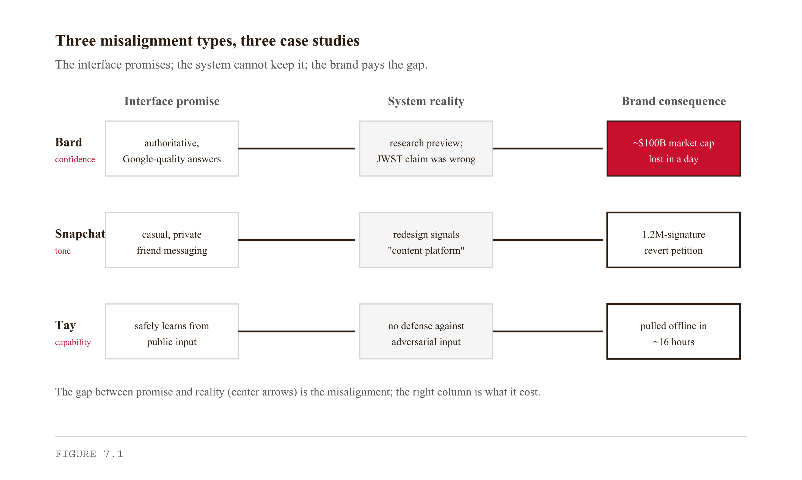

# Appendix S4 — Interface Design and Deployment
*The interface is not a finishing layer. It is a contract. Every session, the user checks whether you kept it.*

> **TL;DR:** This chapter treats the interface as a promise the user re-checks every time they open your tool — not a coat of paint added at the end. It defines what "interface" really covers, shows three ways an interface can betray the brand, compares two fast build frameworks, and walks you through building and deploying a working one.
>
> | Section | Preview |
> |---|---|
> | What "Interface" Actually Means | The several different things the word "interface" refers to, and why each carries brand weight. |
> | Three Faces of Misalignment | Three ways an interface can quietly contradict the brand it represents. |
> | Three Case Studies | Real products read for how their interface kept or broke the user's trust. |
> | Streamlit and Gradio — Choosing the Right Framework | A practical comparison of two fast ways to build an AI tool's interface. |
> | Building the Interface | Constructing the working interface for your tool, including its empty and error states. |
> | Deployment | Getting the tool online so other people can actually use it. |
> | What the Interface Is Doing in the Larger Arc | How the interface fits the book's path from idea to shipped brand. |


---

On February 6, 2023, Google announced Bard at a press event and released a promotional video. In it, Bard answered a question about the James Webb Space Telescope with three confident bullet points. The third claimed that JWST had taken the first images of a planet outside our solar system. The first exoplanet images were taken by the European Southern Observatory's Very Large Telescope in 2004, nearly two decades before JWST launched.

Journalists noticed within hours. Reuters ran the story on February 8. By close of trading that day, Alphabet had lost approximately $100 billion in market capitalization.

The error was not the cause. Research-preview AI systems make errors; this was disclosed. The cause was the interface: a polished, Google-branded promotional video presenting Bard's output as confident, authoritative, Google-quality information. The interface made a promise. The system broke it in a domain where anyone with internet access could check. The market priced the gap.

Your tool will not lose $100 billion if the interface overpromises. But it will lose users, and the mechanism is identical. This chapter is about building an interface that makes only the promises the underlying system can keep.

---

## What "Interface" Actually Means

The word *interface* is doing at least four different jobs in conversations about AI tools. Each job is real. None of them can substitute for the others. Engineers who think "interface" means "UI" consistently underinvest in the layers that damage brand.

**Layer 1: The visual surface.** Buttons, forms, layouts, colors, typography, spacing. This is the layer most engineering students think of when they hear "interface design." It matters. It is also the layer most easily fixed after the fact — a button color is trivial to change; a structural misalignment between the interface and the system is not.

**Layer 2: The interaction model.** How the user thinks about working with the tool. Is this a chat interface? A search interface? A form with outputs? A dashboard? The interaction model sets the user's mental model of the system's capabilities before they see a single result. A chat interface implies conversational competence. A search interface implies index breadth. A form implies structured, reliable output. Whatever model you choose, the user will hold the system to it.

**Layer 3: The deployment surface.** What the user encounters before the UI loads. The URL itself — a random alphanumeric string on a free tier says something different than a named domain. Account creation or not — a login wall before the tool demonstrates anything has a conversion cost. Latency — a five-second wait on first load is a brand signal that the system is slow or overloaded. The "is this real?" question that every new user asks is answered primarily by Layer 3, before they have seen Layer 1 at all.

**Layer 4: The brand surface.** The small things that compound. Error messages — what does the interface say when something goes wrong? Empty states — what does the user see before they have done anything? Confidence — when the system is uncertain, does the interface say so? Tone — is the copy in the help documentation consistent with the copy in the tool itself? Layer 4 is where the Bard failure lived. The UI was excellent. The interaction model was clear. The deployment was polished. The brand surface — confident bullet points, no source attribution, no hedging, no uncertainty signal — is what broke.

All four layers have to be coherent with each other and with the underlying system.

<!-- → [TABLE: Four interface layers — columns: layer number, layer name, what it includes, most common engineering mistake, failure mode when misaligned with system; helps readers map the abstract taxonomy to concrete examples before the misalignment discussion] -->

---

## Three Faces of Misalignment

Before building the interface, you need to understand the failure modes precisely enough to design against them. There are three structural forms of interface-brand misalignment. Each has a different cause and a different fix.

**Confidence misalignment** is when the interface presents output as more certain than the system actually is. Bard's bullet points had no source citations, no hedging language, no "this may be incorrect" qualifier. The user saw confident assertions from an authoritative source. The interface conveyed a certainty the system did not have.

This is the most common failure mode for AI interfaces built by engineers. The reason is structural: when you are building the tool, the system's outputs look reasonable to you. You have been running it for weeks. You have seen the cases where it works. You build the interface to show the output clearly and confidently, because that is what looks good in the demo. You ship. The first user who hits a low-confidence case sees a confident-looking wrong answer.

The fix is not to make the system more accurate. The fix is to make the interface honest about the system's accuracy. Confidence scores, "verify with source" footers, "this answer may not be complete" banners on edge cases — any of these costs almost nothing to implement and repairs the misalignment at the UI layer without requiring a system overhaul.

**Capability misalignment** is when the interface implies the tool can do things it cannot reliably do. A chat interface implies general conversational competence. If your tool is a scoped Q&A system that can answer questions about three specific topics, the chat interface is lying to the user about the system's scope. A "summarize this document" button implies the system handles any document. If your tool handles PDFs but not Excel files, the button is lying.

The mechanism: the user encounters the implied capability in their first or second session. They try to use the feature the interface implied. The system fails or produces poor output. The user concludes the tool is broken and does not return. The interface was not lying maliciously; it was lying carelessly. A narrower capability claim is almost always more trustworthy than a broader one, even if the broader claim would be more impressive in a demo. "Summarize PDFs up to 20 pages" is less exciting than "summarize any document" and far more trustworthy when the user uploads a 50-page PDF and gets a degraded result.

**Tone misalignment** is when the interface speaks in a voice the underlying system cannot maintain. A friendly, casual, first-person chatbot interface paired with a system that returns clipped, templated responses. A sober enterprise interface paired with a system that sometimes produces chatty, informal outputs. A "we're here to help" onboarding flow followed by a system that returns technical error messages without explanation.

Tone misalignment is the subtlest of the three because it operates below the level of explicit claims. No one put "this system is warm and conversational" in the interface copy. But the interaction model, the visual surface, the copy in the empty states — all of it signals a tone that the system has to maintain in its outputs. When it does not, the user feels something is off without being able to articulate exactly what.

The fix is tone-matching: read the system's actual outputs, then design the interface copy to match the register of those outputs.

<!-- → [TABLE: Three misalignment types — columns: type, definition, how engineers produce it, what users experience, specific fix; placed here to consolidate the taxonomy before the case studies apply it] -->

---

## Three Case Studies

These three cases are in the chapter because they represent the three misalignment types at scale, and because each reveals how fast the brand consequence arrives.

**Google Bard, February 2023 — Confidence Misalignment.** The Bard story is at the top of this chapter, but the design lesson is worth making explicit: the interface's confidence level has to be calibrated to the system's actual reliability. A research preview should look like a research preview, not like a finished Google product. Google's response over the following days acknowledged the demo had not passed internal testing standards. The brand damage was not repaired by the correction. The initial impression, formed in the six seconds of a promotional video, was what spread.

**Snapchat Redesign, February 2018 — Tone Misalignment.** Snapchat launched a major interface redesign that reorganized core navigation: Stories from friends and professional content publishers were moved to separate sections, and the "Discover" feed was promoted to a more prominent position. The intent was to better distinguish personal communication from content consumption.

Users responded immediately and negatively. A petition demanding a revert gathered 1.2 million signatures within the first week. Kylie Jenner, then among Snapchat's most-followed users, tweeted that she had stopped using the app; the stock dropped roughly 7% the following day. Snapchat's daily active user count declined in subsequent quarters, a trend the company attributed in part to the redesign.

The failure was not technical. The redesign worked as designed. It was a brand-surface failure: Snapchat had been the interface for private, ephemeral communication between friends — the design was deliberately casual, personal, slightly chaotic. The redesign introduced a more organized, media-forward structure that signaled "content platform" to users who had chosen Snapchat precisely because it was not a content platform. Interface changes are brand changes. Users hold the interface to the promise the previous version made.

**Microsoft Tay, March 2016 — Capability Misalignment.** Microsoft launched Tay on March 23, 2016, as a chatbot on Twitter designed to learn from and respond to conversations with users. The interface — an open Twitter account that anyone could mention and receive a response from — implied a system capable of beneficial public conversation that would improve with interaction.

Within sixteen hours, coordinated trolls had submitted inputs designed to cause Tay to produce offensive, racist, and conspiratorial outputs. Microsoft pulled the account offline within a day of launch, but not before screenshots had circulated widely. The capability misalignment was structural: the interface implied a system that could safely learn from arbitrary public input. The system could not. The interface made public interaction the learning mechanism; the system had no defenses against adversarial inputs.

Microsoft's post-mortem acknowledged the team had not anticipated this in testing, having tested with a small, non-adversarial group. The design lesson: test the interface against the population that will actually use it, not the population you wish would use it. Public interfaces will encounter adversarial users, boundary cases, and interaction patterns the development team did not anticipate. The capability claims have to hold against that population.


*Figure 7.1 — Three misalignment types, three case studies*

<!-- → [FIGURE: Three-by-three matrix — rows: Bard (confidence), Snapchat (tone), Tay (capability); columns: interface promise, system reality, brand consequence; directed arrows showing the gap between promise and reality in each row; most severe consequence highlighted] -->

---

## Streamlit and Gradio — Choosing the Right Framework

You will not be hand-coding a frontend for this version of your tool. The two correct tools for AI tool prototypes at this stage are Streamlit and Gradio. Choosing between them is itself an interface decision — the framework shapes the interaction model.

**Streamlit** is a Python-first web app framework. You write Python; Streamlit renders a web application. The development model is simple: a Python script runs top to bottom on every user interaction, and Streamlit re-renders the page on each run. Streamlit is strong at multi-step workflows, dashboards, and applications where the user's job is to *do work* — configure inputs, run a process, inspect results, iterate. File upload widgets, multi-select filters, data tables, progress bars, conditional display logic, multi-page applications — all are first-class in Streamlit. A Streamlit application feels like a web-app. The interaction model implies: "this is a tool you use to accomplish a task." Deploy via Streamlit Community Cloud: push to GitHub, connect the repo, get a public URL. Free tier is sufficient.

**Gradio** is a Python library for building interactive ML demos, now part of Hugging Face. The development model is component-based: you define input components, output components, and the function that maps inputs to outputs. Gradio renders the interface. Gradio is strong at single-purpose model demos where the user's job is to *try the model* — submit an input, see an output, submit another. A Gradio interface feels like a demo. The interaction model implies: "this is a model you can probe." Deploy via Hugging Face Spaces: push to a Space repository, select Gradio as the SDK, get a public URL. Free tier is sufficient.

The choice is an interaction model decision, not a preference decision. The question is: what is the user's primary job when they use this tool?

If the user's job is to *do work* — upload a file, configure parameters, run a process, see structured results, iterate — choose Streamlit. A competitor news pipeline that the user configures with their RSS feeds. A research summarization tool that takes a topic and a date range and returns a formatted report. A persona-development tool that takes survey data and returns a segmented analysis. These are Streamlit tools.

If the user's job is to *try the model* — type an input, see an output, type another input — choose Gradio. A content-generation tool that takes a brief and returns three headline variants. A brand-voice classifier that takes a piece of copy and returns a voice profile. A sentiment scorer that takes a URL and returns a breakdown. These are Gradio tools.

The mismatch to avoid: an orchestrated multi-agent system deployed behind a Gradio "type a prompt, get a result" interface. The architecture implies structured, reliable, inspectable behavior; the Gradio interaction model implies free-form exploration. If your Chapter 6 architecture is orchestrated, your interface should be Streamlit — structured inputs, visible outputs, inspectable state.

<!-- → [TABLE: Streamlit vs. Gradio selection guide — columns: criterion, Streamlit, Gradio; rows: user's primary job, interaction model implied, architecture fit, deployment platform, right tool for which Chapter 5–6 pipeline types] -->

---

## Building the Interface

"Minimum viable interface" is not the same as "minimum effort interface." Minimum effort produces a bare form that works but makes no commitments. Minimum viable produces the smallest interface that accurately represents what the tool does, makes the right commitments, and does not make the wrong ones.

Three components every minimum viable AI tool interface needs.

**An input affordance that matches the system's actual inputs.** If the system takes an RSS URL, the interface should have a URL field, not a free-text prompt box. The shape of the input signals the system's scope. A free-text prompt box implies general natural-language understanding; a URL field implies structured ingestion of a specific kind of resource.

**A visible processing state.** AI pipelines take time. A blank screen while the system runs is a brand failure — users think the tool is broken and close the tab. A spinner, a progress bar, a "processing your request..." message — any of these is sufficient. Streamlit's `st.spinner()` and `st.progress()` components make this trivial.

**An output surface that represents confidence accurately.** If the system returns a result with a confidence score, show the score. If the system returns a result that should be verified, say so in the interface copy. If the system sometimes returns "I don't know" — which any well-designed AI system should — the interface should handle that gracefully, not display an empty string.

What the minimum viable interface should not have: features your system does not reliably support, input types the system cannot handle, capability claims in the copy the system cannot keep.

### The Alignment Audit

Before you deploy, run the alignment audit. It is a two-column exercise.

Left column: every implicit promise your interface makes. These are not the things you wrote in the README or said in the pitch. They are the things a user will infer from the visual surface, the interaction model, the deployment surface, and the brand surface. Write them all down. Some will be obvious: "the tool can analyze any RSS feed." Some will be subtle: "the tool produces professional-quality output." Some will be about tone: "this tool is from a team that cares about quality."

Right column: can the underlying system keep this promise, reliably, for the population of users who will use the tool?

For every row where the answer is "no" or "sometimes" or "not for this kind of user," fix the interface before you ship. Remove the claim, add a qualifier, narrow the input, or add an explicit uncertainty signal. Do not fix the system — that comes later, in the Build-Measure-Learn loop. Fix the interface now, so the system and the interface are making the same promises.

Here is what the audit looks like in practice, using the sentiment analysis pipeline from Chapters 5 and 6.

*Interface promises:* "Analyzes your competitor news." "Scores articles for sentiment." "Delivers daily to your Google Sheet." "Up to 10 RSS feeds." "Results in under 3 minutes."

*System reality checks:*

- "Analyzes your competitor news" — the system analyzes RSS content from feeds the user configures. It does not scrape content behind paywalls. ✗ Narrow the claim: "Analyzes publicly available RSS content from your configured feeds."
- "Scores articles for sentiment" — the system scores using GPT-4o-mini with a three-point scale. Accuracy is high for clear-cut cases, lower for ambiguous cases. ✗ Add a qualifier: "Sentiment scoring is approximate; verify important findings."
- "Delivers daily to your Google Sheet" — accurate if the n8n workflow is running. If the workflow fails, the Sheet does not update. ✗ Add an error state: "If the Sheet has not updated by 8 a.m., check the workflow status at [URL]."
- "Up to 10 RSS feeds" — accurate. ✓ No change needed.
- "Results in under 3 minutes" — accurate under normal load; API latency can push this to 5 minutes occasionally. ✗ Revise to: "Results typically in under 5 minutes."

Five claims. Three needed fixes before the tool was aligned. None of the fixes required changing the system. All of them required the engineer to stop presenting the ideal case and start presenting the realistic case.

<!-- → [TABLE: Alignment audit worked example — columns: claim as written, system reality, pass/fail, specific fix applied; five rows from the sentiment analysis pipeline; illustrates the two-column audit format in action] -->

---

## Deployment

Deployment is not the interesting part of this chapter, but it is the gate. The deliverable is a URL that someone other than you can visit and use. Getting there requires four concrete steps.

**Step 1: Choose a host.** Streamlit Community Cloud and Hugging Face Spaces are the two free, low-friction options. Both require a GitHub account. Both get you from working code to public URL in under an hour if your dependencies are clean.

**Step 2: Write the requirements file.** Every Python package your tool uses needs to be in a `requirements.txt` (Streamlit) or listed in your Space's configuration (Gradio). Missing dependencies are the most common cause of "it works on my machine" deployment failures. Run `pip freeze > requirements.txt` in a clean virtual environment, not your general development environment.

**Step 3: Handle secrets correctly.** Your tool uses API keys. API keys do not go in the code, and they do not go in the GitHub repository. Streamlit Community Cloud and Hugging Face Spaces both have secrets management — environment variables accessible to the running application but not visible in the repository. Use them. A deployed tool with API keys in the code is a security failure; both platforms will flag it and may terminate the deployment.

**Step 4: Test the deployed URL before you share it.** Run through your own tool as a user who has never seen it. Do the inputs work? Does the processing state show? Does the output render correctly? Does the error state trigger when the system fails? The deployment environment is not your development environment; behavior can differ.

### The README as Interface

The README is not documentation. It is the last interface layer — the one the user encounters when they are trying to understand what they just used, or before they decide whether to use it at all.

A portfolio-quality README for this course has six elements. First, what the tool does — one paragraph, no marketing language. What it takes as input, what it produces as output, who it is for. Second, how to use it — step-by-step, with the assumption that the user has never seen the tool before. Third, what its limits are — explicit. What the tool does not do. What kinds of input it handles poorly. What the confidence of the output is. This is the README-level alignment audit. Fourth, the architecture diagram — a figure showing the pipeline: inputs, processing steps, outputs, external services. A hand-drawn diagram photographed and embedded is fine; the content matters more than the rendering. Fifth, the technology stack — what the tool is built with: Streamlit or Gradio, which LLM API, n8n or direct code, storage layer. Sixth, the deployed URL — at the top, before anything else. The user should not have to read four paragraphs to find the link.

The README is a portfolio artifact for Chapter 11. Write it now.

<!-- → [TABLE: README quality checklist — six rows, one per element; columns: element name, what it should contain, common failure mode, self-grading question] -->

---

## What the Interface Is Doing in the Larger Arc

The interface closes the loop that the PRD opened.

The PRD (Chapter 4) specified what the tool would do and what it would not. The pipeline (Chapter 5) implemented the what. The architecture (Chapter 6) determined how reliably it would run. The interface is where the user encounters the result of all three prior decisions, every session.

The alignment audit is the mechanism that connects all four. A PRD that said "out of scope: social media monitoring" should produce an interface that does not have a social media input field. A pipeline that produces outputs with variable confidence should produce an interface that shows confidence indicators. An architecture that is orchestrated and reliable should produce an interface that is structured and inspectable, not exploratory.

The interface is also where the archetype becomes visible to the user. A Sage archetype builds tools that provide insight — the interface should surface the insight clearly, attribute it honestly, and signal where it is uncertain. A Creator archetype builds tools that produce things — the interface should make the output the hero of the page, offer variants, and make iteration fast. A Caregiver archetype builds tools that help people — the interface should be warm, patient, forgiving of input errors, and generous with guidance.

If the interface contradicts the archetype — if a Sage tool has a splashy, entertainment-forward interface, or if a Caregiver tool has an austere, efficiency-forward interface — the user picks up on the mismatch and the brand surface loses coherence. The interface should be the archetype, not just the tool.

<!-- → [TABLE: Archetype-to-interface alignment guide — columns: archetype, visual surface signals, interaction model fit, deployment surface tone, brand surface copy style; rows for Sage, Creator, Caregiver, Magician, Hero as primary examples] -->

> The interface is the only part of your system the user experiences directly. Everything else — the pipeline, the model, the architecture, the data sources — is invisible to the user. The interface is all they have. Make every layer of it a promise the system can keep.

---

## Chapter Summary

Here is what you can do now that you could not before. You can name all four interface layers and identify which one is most commonly overlooked by engineers — and most costly when misaligned. You can diagnose confidence misalignment, capability misalignment, and tone misalignment in a deployed tool, and propose a specific fix for each that does not require changing the underlying system. You can choose between Streamlit and Gradio based on the user's primary job with the tool. You can run a pre-ship alignment audit: enumerate implicit promises, check each against system capability, fix every mismatch. And you can deploy a tool to a public URL with a portfolio-quality README that includes explicit limits, an architecture diagram, and the technology stack.

The one idea that matters most: the interface is a contract between the tool and every user who encounters it, renewed every session. When the interface makes promises the system cannot keep, the brand pays the difference — not once, but on every visit, compounding.

The common mistake: designing the interface for the demo, not for the user. Demo interfaces optimize for impressiveness in a controlled presentation. User interfaces optimize for clarity under real conditions, including edge cases, failures, and the absence of anyone explaining what the tool does. Ship the user interface, not the demo interface.

The Feynman test: can you describe, in plain language, every implicit promise your interface currently makes? If not, you do not know your interface well enough to ship it.

**What would change my mind:** strong evidence that fast time-to-deployment frameworks (Streamlit, Gradio) lead students to ship *worse*-calibrated interfaces than custom-built frontends — specifically, that the framework's constraint forces interaction models that systematically misalign with the tool's actual capability. The current argument is that framework constraints produce discipline. If the evidence went the other way — if students using custom frontends shipped more aligned interfaces because the build effort forced more deliberate interaction model decisions — I would revise the framework recommendation.

**Still puzzling:** why engineers consistently overpromise in first interfaces — buttons implying broader capability than the system can deliver, "AI-powered" copy overstating what the AI is doing, missing uncertainty surfaces. The behavior is universal enough that I suspect it is structural: engineers think about interfaces as presentation layers to be made impressive, not as contracts to be kept. I have not yet found a teaching intervention that successfully installs the contract framing before the first interface is built rather than after the first interface fails.

---

## Connections Forward

Chapter 8 writes the master Personal Brand Strategy — the document that all future interfaces will answer to. The deployed URL from this chapter is the first public artifact your brand strategy has to account for. The alignment audit you ran before shipping is the first application of a discipline Chapter 8 will generalize: every brand surface should make only the promises the underlying reality can keep.

Chapter 11 asks you to revise the README and present the tool to a real audience using the Guy Kawasaki 10/20/30 framework — 10 slides, 20 minutes, 30-point font minimum. The README you write in this chapter is the first draft of the pitch. Write it with Chapter 11 in mind.

---

## AI Wayback Machine

The ideas in this chapter didn't appear from nowhere. **Vannevar Bush** published *As We May Think* in *The Atlantic* in July 1945 — the essay that imagined the *memex*, a desk-sized machine in which a researcher could store every book, document, and communication, link them into associative trails, and consult the trails later as a kind of externalized memory. The memex never shipped; the argument shaped every interface that followed. Bush's central claim is the chapter's: the interface is not a finishing layer on a finished product. It is the contract between the machine's capability and the human's attention, and a poorly written contract makes the capability inaccessible regardless of how powerful it is.


*Vannevar Bush, c. 1940s. AI-generated portrait based on a public domain photograph.*


*Puppet Art by [Nik Bear Brown](https://www.nikbearbrown.com/).*

**Run this:**

```
Who was Vannevar Bush, and how does his vision of the *memex* connect to
the chapter's claim that an interface is a contract between the system's
capability and the user's attention — and that the contract has to be
designed before the deployment, not after? Keep it to three paragraphs.
End with the single most surprising thing about his career or ideas.
```

→ Search **"Vannevar Bush memex"** on Wikipedia after you run this. See what the model got right, got wrong, or left out.

**Now make the prompt better.** Try one of these:

- Ask it to explain the *memex* in plain language, as if you've never read *As We May Think*
- Ask it to compare Bush's associative-trails idea to a modern AI tool's chat-history-as-context model
- Add a constraint: "Answer as if you're writing the interface-design rationale for the deployed Madison tool"

What changes? What gets better? What gets worse?

---

## Exercises

### Warm-Up

**W1.** The chapter describes four interface layers: visual surface, interaction model, deployment surface, brand surface. For each of the following interface failures, identify which layer failed. Justify each classification in one sentence.

- A tool's error message says "Error 500" with no further explanation.
- A tool's URL is `https://share.streamlit.io/user/abc123xyz`.
- A tool has a "Analyze any document" button that fails on Excel files.
- A tool uses a friendly, warm onboarding message followed by terse, templated outputs.
- A tool takes ten seconds to load with no visible processing indicator.

*Tests: distinguishing the four interface layers.*
*Difficulty: Low.*

**W2.** Classify each of the following as confidence misalignment, capability misalignment, or tone misalignment. Then write one specific fix for each that does not require changing the underlying system.

- A medical information chatbot returns diagnostic possibilities with no uncertainty qualifier.
- A "translate any language" interface that fails silently on low-resource languages.
- A corporate enterprise tool with an onboarding message that reads: "Hey there! Let's get you set up 🎉" followed by a dense technical output with no formatting.
- A research summarization tool that returns a summary with no source citations.
- A "write in your brand voice" tool that produces the same formal register regardless of input style.

*Tests: diagnosing misalignment types.*
*Difficulty: Low-medium.*

**W3.** You are choosing between Streamlit and Gradio for each of the following tools. For each, name your choice and write one sentence justifying it.

- A pipeline that takes a company name, pulls their last 30 job postings, and returns a structured analysis of what skills they are hiring for.
- A tool that takes a piece of marketing copy and returns three variants in different brand voices.
- A multi-step survey analysis tool that takes a CSV of survey responses and produces a persona map with cluster analysis.
- A single-purpose sentiment scorer that takes a URL and returns a sentiment score with a one-sentence summary.

*Tests: selecting the framework.*
*Difficulty: Low.*

---

### Application

**A1.** Run the alignment audit on one of the three case study tools (Bard, Snapchat, Tay) using the two-column format from the chapter. Left column: at least five implicit promises the interface made. Right column: whether the system could keep each promise, with a one-sentence explanation. For every "no" row, write a specific interface fix that would have reduced the misalignment without requiring the system to be rebuilt.
*Difficulty: Medium.*

**A2.** Choose one of the five Madison layers from the [Madison project page](https://www.humanitarians.ai/madison). Design the minimum viable interface for a tool built on that layer. Specify: the framework (Streamlit or Gradio, with one-sentence justification), the input affordance (what the user submits and in what form), the processing state (what the user sees while waiting), the output surface (what the user sees when the result arrives), and one uncertainty surface (where and how the interface signals system confidence to the user). You do not need to write code — describe the interface in enough detail that someone else could implement it.
*Difficulty: Medium.*

**A3.** Write the six-element README for your own tool as it currently exists after Chapter 6. The README should include: what the tool does, how to use it, explicit limits, an architecture diagram (described in text if not yet drawn), the technology stack, and the deployed URL (or a placeholder if not yet deployed). Then run the alignment audit on your README: what implicit promises does the README make, and can the system keep them?
*Difficulty: Medium.*

**A4.** The chapter argues that the interaction model (Layer 2) sets the user's mental model of the system's capabilities before they see a single result. Find two AI tools in the same category — two AI writing assistants, or two AI coding tools — with different interaction models. Describe each tool's interaction model, the capability the model implies to the user, and whether the system can keep the implied promise. Conclude with a one-paragraph analysis of which tool has better interface-system alignment and why.
*Difficulty: Medium.*

---

### Synthesis

**S1.** The chapter's "Still puzzling" note identifies a mystery: engineers consistently overpromise in first interfaces. Propose a hypothesis that explains this behavior — not as a character flaw but as a structural consequence of how software is typically built. Then propose one change to the development process (not to the engineer's disposition) that would reduce overpromising before the first interface ships. Your hypothesis should be falsifiable: describe what evidence would prove it wrong.
*Difficulty: Medium-high.*

**S2.** The Snapchat case is different from Bard and Tay: the failure was not a confidence or capability misalignment but a brand-position mismatch between the updated interface and the existing user base's mental model. Design a process that a product team could run before a major interface redesign to detect this kind of misalignment before shipping. The process should: identify the brand promise the existing interface has made to the existing user base, test whether the proposed redesign maintains or breaks that promise, and produce a go/no-go recommendation. Apply your process to the Snapchat redesign and show whether it would have flagged the mismatch.
*Difficulty: High.*

**S3.** The chapter argues that the interface should express the archetype. Take your archetype from Chapters 1 and 3. Describe in specific terms what a well-aligned interface for your archetype looks like across all four layers: what visual surface signals your archetype, what interaction model fits, what the deployment surface communicates, what brand-surface copy would be consistent with your archetype. Then evaluate your current tool's interface (after Chapter 6) against this description: where is it aligned, where is it misaligned, and what three specific changes would improve the alignment?
*Difficulty: High.*

---

### Challenge

**C1.** The chapter's "What would change my mind" note poses the question of whether framework constraints (Streamlit, Gradio) produce better or worse interface alignment than custom-built frontends. Design an empirical study that could answer this question. Specify: the population (which students, from which courses), the independent variable (framework vs. custom), the dependent variable (how you would measure "alignment quality"), the control conditions, the sample size you would need for the result to be meaningful, and the specific result that would cause you to recommend dropping Streamlit and Gradio from the course. Evaluate the practical feasibility of running this study in a graduate course context.
*Difficulty: Very high.*

**C2.** The Tay case reveals a testing-population problem: the development team tested with a narrow, friendly population and deployed to an adversarial public. Design a pre-deployment testing protocol for an AI tool intended for public use. The protocol should: identify the gap between the test population and the deployment population, generate a set of adversarial test cases that the narrow population would not have produced, specify a minimum pass rate before deployment is permitted, and describe what "fixing" a failure means — whether it requires changing the system, the interface, or both. Apply your protocol to one of the following: a public-facing sentiment analysis tool; a publicly accessible AI concierge for a hospitality company; a research-assistance tool open to any university student.
*Difficulty: Very high.*

---

## LLM Exercise — Self-as-Project

**Project:** Self-as-Project
**What you're building this chapter:** A **Surface Alignment Audit** of every public interface a recruiter or hiring manager touches, plus one immediate fix to your most-misaligned surface.
**Tool:** Claude Project (your *"My Personal Brand"* project from Chapter 1).

**The Prompt:**

```
Run a Surface Alignment Audit on every interface between me and the people
who decide whether to hire me. Use Chapter 7's framework: an interface
promises something; the underlying system has to keep the promise;
misalignment is brand damage compounding at session frequency.

The surfaces to audit:

1. LinkedIn — headline, photo, banner, About section, Featured section,
   current role description, skills, recommendations.
2. Resume — both versions if I have them (ATS + designer).
3. GitHub — profile README, pinned repos, contribution graph,
   organization memberships, starred repos.
4. Personal website — if it exists; if not, note "absent" as a finding.
5. Email signature — what an interviewer sees in our scheduling thread.
6. Twitter/X or other social — only if I'm active there professionally.
7. Any portfolio I've shared in the last 12 months.

For each surface, produce:
- What does it currently PROMISE? (the implicit claim a viewer reads from it)
- What does my underlying reality DELIVER? (the work, archetype, and
  capability behind the claim)
- ALIGNMENT VERDICT: aligned / overpromise / underpromise / misaligned-archetype
- ONE SPECIFIC FIX I can make today

Apply my Chapter 3 archetype as the alignment standard. A Sage's interfaces
should not promise Hero outcomes. A Magician's interfaces should not read
like a Caregiver's.

Then — pick the surface with the worst alignment score and write me the
EXACT REPLACEMENT TEXT for it. Don't suggest "rewrite the headline to
emphasize X." Write the new headline. Don't suggest "improve the About
section." Write the new About section, in my voice, archetype-aligned,
ready to paste in.

The replacement should be production-ready. I should be able to copy it
into the surface and ship it before I sleep tonight.

Output a Markdown document called "Surface Alignment Audit — [my name]
— [date]" with the audit table, the chosen surface, and the
production-ready replacement text.
```

**What this produces:** An audit plus one shipped fix the same day. The audit becomes a quarterly checklist. The production-ready replacement text removes the activation energy barrier that keeps most people from making fixes they know they should make.

**How to adapt:** If you are not job-searching, audit the surfaces relevant to your actual goal. Applying for grants: audit your researcher profile, lab website, and publication list. Starting a company: audit your LinkedIn, company website, and any pitch materials in circulation.

**Preview of next chapter:** Chapter 8 writes the master one-page Personal Brand Strategy — the document that all surfaces from now on will answer to. The alignment audit you ran in this chapter is the diagnostic that Chapter 8 builds the strategy to resolve.

---

---

## AI+1 — Self-as-Project on Madison

**Project:** Self-as-Project — *your brand, end to end*
**This chapter adds:** your brand tool, deployed — the interface as a kept promise.
**Madison recipes:** [`wrap-your-tool`](../madison/wrap-your-tool/) (template), [`ai-concierge`](../madison/recipes/ai-concierge.md)

> The interface is a contract the user re-checks every session (this chapter's thesis). You design the promise; the scaffold ships it; you verify it holds.

### Exercise 1 — When to Use AI
- *Scaffold the deployable wrapper from the `wrap-your-tool` template.* **Why it works:** boilerplate generation.
- *Draft the empty/error/loading states for your tool.* **Why it works:** drafting known UI states.
- *Generate concierge prompt copy in your brand voice.* **Why it works:** drafting you then edit for voice.

**Tell:** you can run the deployed tool and see it behave as specified.

### Exercise 2 — When NOT to Use AI
- *Deciding what the interface promises (and refuses).* **Why it fails:** a brand-trust decision.
- *Approving the brand voice of the concierge.* **Why it fails:** taste and authenticity.
- *Shipping without testing the failure states yourself.* **Why it fails:** the contract is checked under failure, not happy-path.

**Tell:** you've crossed the line when "it deploys" substitutes for "it keeps the promise."
**Series connection:** trains interface-as-contract.

### Exercise 3 — Recipe Exercise
**Build:** a deployed brand tool wrapping one earlier recipe. **Run:** [`wrap-your-tool`](../madison/wrap-your-tool/) around your Ch 5 monitor or Ch 6 brief; add [`ai-concierge`](../madison/recipes/ai-concierge.md) copy. **Tool:** Claude Code + the bundled scaffold.

```
Using the bundled madison/wrap-your-tool Next.js scaffold, wire it to call MY
chosen recipe (name below) and render its output. Then draft ai-concierge-style
microcopy for the empty, loading, and error states IN MY BRAND VOICE (archetype
below). Keep all model calls behind the scaffold's run route. Output: the edited
files + a one-line note on what the interface promises.

Recipe + archetype:
[PASTE]
```
**Adapt:** for a person (8a) the "tool" can be your site's interactive element; same contract test.

### Exercise 4 — CLI Exercise
**Build:** a running local deployment + `your-brand/interface-contract.md`. **Tool:** the scaffold via Claude Code.

```
In a copy of madison/wrap-your-tool: install, run dev, confirm the run route
returns my recipe's sample output. Write your-brand/interface-contract.md stating
the promise, the three failure states and their copy, and how each was tested.
Do not deploy to a live host without my approval. Stop after the file + a working
local run.
```
**Inspect:** error/loading/empty states exist and were actually triggered; voice matches archetype.
**If it goes wrong:** happy-path only — force a failing input and confirm the copy holds.

### Exercise 5 — AI Validation Exercise
**Validate:** the deployed tool. Pass / Fail / Cannot-determine + evidence:
- **Correctness:** does the run route return the recipe's real output (not a stub)?
- **Completeness:** empty/loading/error states all present and tested?
- **Scope:** local/approved deploy only — no live keys committed?
- **Brand-specific:** does the microcopy read as your archetype under failure?
- **Failure-mode:** trigger a bad input — does the interface keep or break its promise?

*Tags: interface-design · streamlit · gradio · deployment · interface-brand-alignment · google-bard · snapchat-redesign · microsoft-tay · alignment-audit · INFO-7375*
