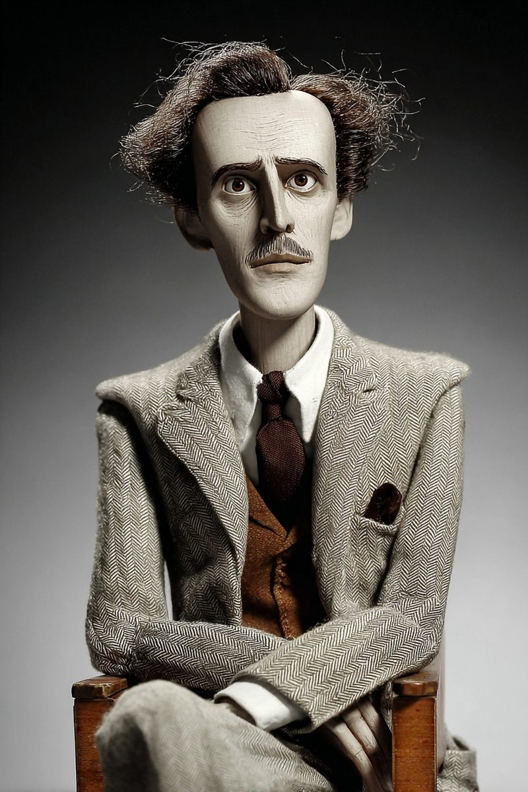
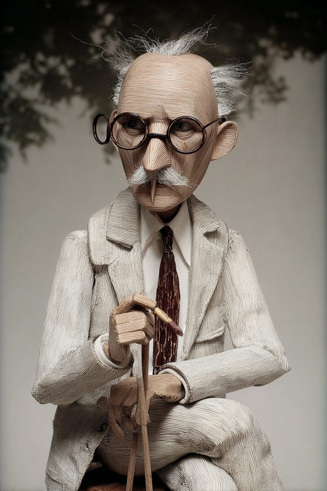

# Branding and AI — Wayback Sections

> Extracted from `chapters/`. Each entry corresponds to one chapter file.
> Sections are instructor-authored. Missing sections show a placeholder only.
> Do not edit this file directly — edit the source chapter file, then re-run extraction.

---

## Chapter 00: Branding and AI
*Source: `chapters/00-frontmatter.md`*

> **Section not yet authored.** No `## AI Wayback Machine` block found in this chapter file.
> To add this section, edit the source chapter file directly.

---

## Chapter 00: Introduction
*Source: `chapters/00-introduction.md`*

> **Section not yet authored.** No `## AI Wayback Machine` block found in this chapter file.
> To add this section, edit the source chapter file directly.

---

## Chapter 01: Chapter 1 — The Creative Engineer
*Source: `chapters/01-the-creative-engineer.md`*

## AI Wayback Machine

The ideas in this chapter didn't appear from nowhere. **Thorstein Veblen** spent the 1890s at the University of Chicago working out a problem the chapter has been working on under a different name: why do humans signal? In *The Theory of the Leisure Class* (1899) Veblen named *conspicuous consumption* — the pattern of acquiring costly things specifically because their cost is observable, and therefore signals capacity to acquire them. Spence formalized the mechanism eighty years later in markets for jobs and credentials. Veblen saw it first in markets for status and class.


*Thorstein Veblen, c. 1880s. AI-generated portrait based on a public domain photograph.*

**Run this:**

```
Who was Thorstein Veblen, and how does his account of conspicuous consumption connect to Spence's signaling mechanism — and to the chapter's claim that *what* you signal has to change when the cost-structure of the old signal collapses? Keep it to three paragraphs. End with the single most surprising thing about his career or ideas.
```

→ Search **"Thorstein Veblen"** on Wikipedia after you run this. See what the model got right, got wrong, or left out.

**Now make the prompt better.** Try one of these:

- Ask it to explain *conspicuous consumption* in plain language, as if you've never read economic sociology
- Ask it to compare Veblen's leisure-class signaling to the GitHub-as-portfolio era of 2008–2020
- Add a constraint: "Answer as if you're writing the rationale for why Brand becomes the new costly signal when Build cheapens"

What changes? What gets better? What gets worse?

---

---

## Chapter 02: Chapter 2 — The Madison Framework
*Source: `chapters/02-the-madison-framework.md`*

## AI Wayback Machine

The ideas in this chapter didn't appear from nowhere. **Marshall McLuhan** spent the 1960s arguing — to a public that mostly didn't yet have the vocabulary for it — that the *medium* shapes the message it carries, and that the architecture of a communication system is the message far more than any individual transmission through it. The Madison framework's central claim is the same shape, applied to AI tooling: the structural choices in the workflow (parallel ingestion branches, audit logs, the role split across the five agents) are the brand long before the marketing copy is written.


*Marshall McLuhan, c. 1960s. AI-generated portrait based on a public domain photograph.*


*Puppet Art by [Nik Bear Brown](https://www.nikbearbrown.com/).*

**Run this:**

```
Who was Marshall McLuhan, and how does his claim that *the medium is the message* connect to the Madison framework's argument that an AI system's architecture *is* the brand — that the role split, the contracts, the audit trail are the message far more than any UI copy? Keep it to three paragraphs. End with the single most surprising thing about his career or ideas.
```

→ Search **"Marshall McLuhan"** on Wikipedia after you run this. See what the model got right, got wrong, or left out.

**Now make the prompt better.** Try one of these:

- Ask it to explain "the medium is the message" in plain language, without quoting *Understanding Media*
- Ask it to compare McLuhan's hot-vs-cool media distinction to the difference between a chatbot interface and an agentic workflow
- Add a constraint: "Answer as if you're writing the architectural rationale for a five-agent Madison-style system"

What changes? What gets better? What gets worse?

---

**Tags:** madison-framework · multi-agent-systems · ReAct · n8n · architecture-as-brand · cursor · devin · agent-loop · orchestration · INFO-7375

---

## Chapter 03: Chapter 3 — Jungian Brand Archetypes as a System
*Source: `chapters/03-jungian-brand-archetypes-as-a-system.md`*

## AI Wayback Machine
The ideas in this chapter didn't appear from nowhere. **Carl Jung** is the source the chapter has been borrowing from. The twelve archetypes Margaret Mark and Carol Pearson catalogued for marketing in *The Hero and the Outlaw* (2001) are downstream of Jung's argument that certain figures — Hero, Sage, Caregiver, Trickster, Lover — recur across cultures because they correspond to durable patterns in human psychology, not to any particular author's invention. The chapter has used the framework as a strategic instrument; Jung intended it as a description of the unconscious. The shadow side of the archetype, which the chapter takes seriously, is also Jung's idea — the failure mode that the strength of an archetype tends to produce when taken too far.


*Carl Jung, c. 1910s. AI-generated portrait based on a public domain photograph.*


*Puppet Art by [Nik Bear Brown](https://www.nikbearbrown.com/).*

**Run this:**

```
Who was Carl Jung, and how does his concept of *archetypes* connect to using a twelve-figure framework as a strategic anchor for brand decisions — including the chapter's argument that the *shadow* of an archetype is as load-bearing as the archetype itself? Keep it to three paragraphs. End with the single most surprising thing about his career or ideas.
```

→ Search **"Carl Jung archetypes"** on Wikipedia after you run this. See what the model got right, got wrong, or left out.

**Now make the prompt better.** Try one of these:

- Ask it to explain *the collective unconscious* in plain language, as if you've never read psychoanalytic theory
- Ask it to compare Jung's account of the shadow to the chapter's worked examples of archetypes failing under pressure
- Add a constraint: "Answer as if you're writing the warning about archetype-shadow risk in a startup's brand strategy doc"

What changes? What gets better? What gets worse?

---

*Tags: brand-archetypes · jung · mark-pearson · tropicana · gap · new-coke · innocent · sage · archetype-drift · shadow · INFO-7375*

---

## Chapter 04: Chapter 4 — Product Requirements and Scope
*Source: `chapters/04-product-requirements-and-scope.md`*

## AI Wayback Machine

The ideas in this chapter didn't appear from nowhere. **Adele Goldstine** wrote the *Operator's Manual for the ENIAC* in 1946 — the first complete specification of an electronic computer system. The manual was 168 pages of decisions about what ENIAC could be made to do, what inputs it would accept, what outputs it would produce, what configurations were and were not supported. Half the work was naming what the machine could do. The other half — the part that makes it the foundational PRD of the computing era — was naming, with equal precision, what it could not. The chapter's $100,000 no is in the same lineage: scope is defined by the boundary line between what is in and what is out, written down before the build starts.


*Adele Goldstine, c. 1940s. AI-generated portrait based on a public domain photograph.*

**Run this:**

```
Who was Adele Goldstine, and how does her work writing the first ENIAC
operator's manual connect to the chapter's argument that a PRD's most
important content is the explicit *no* — the boundary that decides what
the product is by deciding what it isn't? Keep it to three paragraphs.
End with the single most surprising thing about her career or ideas.
```

→ Search **"Adele Goldstine"** on Wikipedia after you run this. See what the model got right, got wrong, or left out.

**Now make the prompt better.** Try one of these:

- Ask it to explain why machine specifications need to enumerate negative behavior, in plain language
- Ask it to compare Goldstine's ENIAC manual structure to the structure of the PRD this chapter teaches
- Add a constraint: "Answer as if you're writing the *out of scope* section of an AI-tool PRD"

What changes? What gets better? What gets worse?

---

---

## Chapter 05: Chapter 5 — Data Pipelines and Workflow Automation
*Source: `chapters/05-data-pipelines-and-workflow-automation.md`*

## AI Wayback Machine

The ideas in this chapter didn't appear from nowhere. **Joan Robinson** developed the formal economics of imperfect competition in the 1930s — the math of markets where one party has dominant power because the other parties have nowhere else to go. *Monopsony*, the term she coined, is exactly the structure of the Apollo–Reddit relationship: one buyer (the platform), many sellers (the third-party developers), no realistic alternative. Robinson's argument is that under monopsony the dominant party can change the contract terms unilaterally, capturing surplus that would be split under genuine competition. Apollo experienced that capture in real time, in 2023, with three months' notice. The chapter's design disciplines — document the contract, build degraded modes, monitor for drift — are how a pipeline survives life inside someone else's monopsony.


*Joan Robinson, c. 1940s. AI-generated portrait based on a public domain photograph.*


*Puppet Art by [Nik Bear Brown](https://www.nikbearbrown.com/).*

**Run this:**

```
Who was Joan Robinson, and how does her concept of *monopsony* connect to the platform-vs-third-party-developer dynamic the Apollo case illustrates — where the upstream party can change the contract unilaterally because the downstream party has no realistic alternative? Keep it to three paragraphs. End with the single most surprising thing about her career or ideas.
```

→ Search **"Joan Robinson economist"** on Wikipedia after you run this. See what the model got right, got wrong, or left out.

**Now make the prompt better.** Try one of these:

- Ask it to explain *monopsony* in plain language, as if you've never taken an economics course
- Ask it to compare Robinson's analysis of dominant-buyer markets to the platform-API ruptures (Reddit, Twitter, Heroku) named in this chapter
- Add a constraint: "Answer as if you're writing the risk section of a PRD for a tool that depends on a single platform API"

What changes? What gets better? What gets worse?

---

*Tags: data-pipeline · n8n · workflow-automation · reddit-api · apollo · pipeline-fragility · external-contracts · degraded-mode · brand-reliability · ETL · inference-pipeline · madison-intelligence-agent · INFO-7375*

---

## Chapter 06: Chapter 6 — AI Intelligence and Multi-Agent Systems
*Source: `chapters/06-ai-intelligence-and-multiagent-systems.md`*

## AI Wayback Machine

The ideas in this chapter didn't appear from nowhere. **Herbert Simon** spent five decades arguing that intelligent action — by humans, by organizations, by machines — is what *bounded rationality* allows under real constraints of attention, time, and computation. His 1969 *The Sciences of the Artificial* is the foundational text on designing systems whose intelligence is distributed across specialized parts that cooperate. The Madison framework's five-agent architecture is in that lineage: no single agent is general-purpose; each is bounded to a competence; their cooperation is the system's intelligence. Simon also predicted, in 1965, that machines would be capable of doing any work a human could do within twenty years — a prediction the field is still arguing about. The chapter's caution — that multi-agent does not mean omni-agent — is Simon's caution.


*Herbert A. Simon, c. 1970s. AI-generated portrait based on a public domain photograph.*

**Run this:**

```
Who was Herbert Simon, and how do his concepts of *bounded rationality* and *near-decomposability* connect to the design of multi-agent AI systems where each agent is deliberately specialized rather than general-purpose? Keep it to three paragraphs. End with the single most surprising thing about his career or ideas.
```

→ Search **"Herbert A. Simon"** on Wikipedia after you run this. See what the model got right, got wrong, or left out.

**Now make the prompt better.** Try one of these:

- Ask it to explain *bounded rationality* in plain language, as if you've never read decision theory
- Ask it to compare Simon's near-decomposability argument to the role split across the five Madison agents
- Add a constraint: "Answer as if you're writing the design rationale for why your multi-agent system has five roles instead of one general agent"

What changes? What gets better? What gets worse?

---

*Tags: multi-agent · CrewAI · AutoGPT · agent-architecture · orchestrated-vs-autonomous · madison-marketmind · production-reliability · INFO-7375*

---

## Chapter 07: Chapter 7 — Interface Design and Deployment
*Source: `chapters/07-interface-design-and-deployment.md`*

## AI Wayback Machine

The ideas in this chapter didn't appear from nowhere. **Vannevar Bush** published *As We May Think* in *The Atlantic* in July 1945 — the essay that imagined the *memex*, a desk-sized machine in which a researcher could store every book, document, and communication, link them into associative trails, and consult the trails later as a kind of externalized memory. The memex never shipped; the argument shaped every interface that followed. Bush's central claim is the chapter's: the interface is not a finishing layer on a finished product. It is the contract between the machine's capability and the human's attention, and a poorly written contract makes the capability inaccessible regardless of how powerful it is.


*Vannevar Bush, c. 1940s. AI-generated portrait based on a public domain photograph.*


*Puppet Art by [Nik Bear Brown](https://www.nikbearbrown.com/).*

**Run this:**

```
Who was Vannevar Bush, and how does his vision of the *memex* connect to
the chapter's claim that an interface is a contract between the system's
capability and the user's attention — and that the contract has to be
designed before the deployment, not after? Keep it to three paragraphs.
End with the single most surprising thing about his career or ideas.
```

→ Search **"Vannevar Bush memex"** on Wikipedia after you run this. See what the model got right, got wrong, or left out.

**Now make the prompt better.** Try one of these:

- Ask it to explain the *memex* in plain language, as if you've never read *As We May Think*
- Ask it to compare Bush's associative-trails idea to a modern AI tool's chat-history-as-context model
- Add a constraint: "Answer as if you're writing the interface-design rationale for the deployed Madison tool"

What changes? What gets better? What gets worse?

---

---

## Chapter 08: Chapter 8 — Brand Strategy
*Source: `chapters/08a-personal-brand-path-brand-strategy.md`*

## AI Wayback Machine

The ideas in this chapter didn't appear from nowhere. **Helen Lansdowne Resor** joined J. Walter Thompson in 1908 and over the next four decades defined what personal brand strategy could look like in a profession that did not yet have a name for it. Her copy for Woodbury Soap (*A Skin You Love to Touch*) and Pond's was the first major American advertising to ground product appeal in subjective experience rather than function. She built her career, her positioning, and her own brand inside a male-dominated industry by being unmistakably specific about who she wrote for and what kind of work she would and would not do. The chapter's argument — that a brand is a constraint set, not a description — is Resor's working method, applied to her own career a century before the language of personal brand existed.


*Helen Lansdowne Resor, c. 1920s. AI-generated portrait based on a public domain photograph.*

**Run this:**

```
Who was Helen Lansdowne Resor, and how does her career — building a personal brand inside JWT in the 1910s–1940s — connect to the chapter's argument that a brand strategy is a *constraint set* (the things you systematically refuse) rather than a description of what you do? Keep it to three paragraphs. End with the single most surprising thing about her career or ideas.
```

→ Search **"Helen Lansdowne Resor"** on Wikipedia after you run this. See what the model got right, got wrong, or left out.

**Now make the prompt better.** Try one of these:

- Ask it to explain why *negative space* in personal positioning compounds over a career, in plain language
- Ask it to compare Resor's deliberate refusals — which clients to take, which work to decline — to the negative-space list this chapter requires
- Add a constraint: "Answer as if you're writing the rationale for the five items you refuse to do as a Creative Engineer"

What changes? What gets better? What gets worse?

---

*Tags: brand-strategy · startup-brand · stripe · sage-archetype · developer-first · negative-space · UVP · mission-vision-values · naming · archetype-company-level · INFO-7375*

---

## Chapter 08: Chapter 8 (Startup Brand Path) — Brand Strategy
*Source: `chapters/08b-startup-brand-path-brand-strategy.md`*

## AI Wayback Machine

The ideas in this chapter didn't appear from nowhere. **Bill Bernbach** co-founded DDB in 1949 and over the next two decades built the work that defined what disruptive-startup brand could look like — *Think Small* for Volkswagen, *We Try Harder* for Avis, *You Don't Have to Be Jewish to Love Levy's*. Each campaign worked the same move: name the thing the incumbent's brand refused to acknowledge — the car is small, we are #2, the bread is Jewish — and turn the refusal into the position. Bernbach's central practice — writing brand strategy from the audience's existing skepticism rather than from the company's preferred self-image — is the chapter's working method. The Stripe inversion is an instance of it. The negative-space list is the deliberate version of it.


*Bill Bernbach, c. 1960s. AI-generated portrait based on a public domain photograph.*

**Run this:**

```
Who was Bill Bernbach, and how do his disruptive-startup campaigns
(*Think Small*, *We Try Harder*) connect to the chapter's argument
that a startup brand strategy is built from what the incumbent refuses
to say — and that the *refusal* is the position? Keep it to three
paragraphs. End with the single most surprising thing about his career
or ideas.
```

→ Search **"Bill Bernbach DDB"** on Wikipedia after you run this. See what the model got right, got wrong, or left out.

**Now make the prompt better.** Try one of these:

- Ask it to explain why startup brands win by *naming* the thing the incumbent refuses to admit, in plain language
- Ask it to compare Bernbach's *Think Small* to the Stripe inversion analyzed in this chapter
- Add a constraint: "Answer as if you're writing the positioning paragraph for a startup competing against an entrenched incumbent"

What changes? What gets better? What gets worse?

---

---

## Chapter 09: Chapter 9 — Visual Identity Systems
*Source: `chapters/09-visual-identity-systems.md`*

## AI Wayback Machine

The ideas in this chapter didn't appear from nowhere. **Cipe Pineles** became the first independent female art director of a mainstream American magazine in 1942 and went on to define the visual systems of *Glamour*, *Charm*, *Mademoiselle*, *Seventeen*, and *Vogue* over the next four decades. Her argument — visible in the cover-to-cover coherence of every magazine she ran — was that an identity is not a logo. It is a system of decisions about typography, photography, illustration, white space, and how each issue's contents express the same editorial voice through visual choices a reader cannot articulate but immediately recognizes. The chapter's argument that a visual identity is a *system*, not a set of artifacts, is Pineles's working method translated from print-magazine to AI-product.


*Cipe Pineles, c. 1940s. AI-generated portrait based on a public domain photograph.*

**Run this:**

```
Who was Cipe Pineles, and how does her work building cover-to-cover visual systems for *Glamour*, *Seventeen*, and *Vogue* connect to the chapter's argument that visual identity is a system of disciplined choices rather than a logo plus a palette? Keep it to three paragraphs. End with the single most surprising thing about her career or ideas.
```

→ Search **"Cipe Pineles"** on Wikipedia after you run this. See what the model got right, got wrong, or left out.

**Now make the prompt better.** Try one of these:

- Ask it to explain why a visual *system* outperforms a visual *style* over time, in plain language
- Ask it to compare Pineles's editorial-design discipline to the visual-identity rules this chapter teaches for AI products
- Add a constraint: "Answer as if you're writing the visual-system rules for your Madison-style AI tool, governed by the archetype from Chapter 8"

What changes? What gets better? What gets worse?

---

*Tags: visual-identity · creative-brief · pepsi-logo · yahoo-logos · tropicana-redesign · WCAG-accessibility · color-palette · typography · wireframe · archetype-expression · INFO-7375*

---

## Chapter 10: Chapter 10 — Brand Storytelling
*Source: `chapters/10-brand-storytelling.md`*

## AI Wayback Machine

The ideas in this chapter didn't appear from nowhere. **Joseph Campbell** synthesized the comparative mythology of dozens of cultures into the structural argument of *The Hero with a Thousand Faces* (1949): that human beings, across history and geography, tell the same shape of story because the shape corresponds to the experience of becoming someone capable of returning to the world with something the world needed. The chapter borrows the structure as a brand-storytelling tool — call to adventure, refusal, threshold, ordeal, return with the elixir — but Campbell's deeper claim is the one the chapter rests on: the structure works because it is true to a pattern people recognize in themselves, not because it is a clever rhetorical trick.


*Joseph Campbell, c. 1950s. AI-generated portrait based on a public domain photograph.*


*Puppet Art by [Nik Bear Brown](https://www.nikbearbrown.com/).*

**Run this:**

```
Who was Joseph Campbell, and how does his Hero's Journey structure connect
to the chapter's argument that a brand story works when it lets the
*audience* recognize themselves as the hero — not when it positions the
founder or the company as the hero? Keep it to three paragraphs. End with
the single most surprising thing about his career or ideas.
```

→ Search **"Joseph Campbell mythologist"** on Wikipedia after you run this. See what the model got right, got wrong, or left out.

**Now make the prompt better.** Try one of these:

- Ask it to explain why audiences recognize the Hero's Journey structure even when they cannot name it, in plain language
- Ask it to compare Campbell's monomyth stages to the brand-story arc this chapter teaches
- Add a constraint: "Answer as if you're writing the launch-post narrative for an AI tool, with the user as the hero and the tool as the elixir"

What changes? What gets better? What gets worse?

---

---

## Chapter 11: Chapter 11 — Portfolio as Product
*Source: `chapters/11-portfolio-as-product.md`*

## AI Wayback Machine

The ideas in this chapter didn't appear from nowhere. **Charles and Ray Eames** built their portfolio across furniture, film, exhibitions, photography, and graphic design — the molded plywood chair, the Lounge Chair, the *Powers of Ten* short film, the IBM World's Fair pavilion, the Eames House itself — over four decades from 1941 onward. The portfolio reads as a single body of work, despite covering categories that have nothing to do with each other, because every piece is governed by the same design philosophy: rigorous problem framing, materials honestly used, the human experience as the unit of measurement. The chapter's argument that the portfolio is a *product* — a coherent artifact that compounds over time, not a directory of unrelated projects — is the Eames operating principle, applied to the Creative Engineer's first decade.


*Charles and Ray Eames, c. 1950s. AI-generated portrait based on a public domain photograph.*

**Run this:**

```
Who were Charles and Ray Eames, and how does their portfolio — varied across
furniture, film, and exhibition design but unified by a single design
philosophy — connect to the chapter's argument that the portfolio is itself
a product, with one coherent thesis underneath every artifact? Keep it to
three paragraphs. End with the single most surprising thing about their
career or ideas.
```

→ Search **"Charles and Ray Eames"** on Wikipedia after you run this. See what the model got right, got wrong, or left out.

**Now make the prompt better.** Try one of these:

- Ask it to explain how a portfolio across unrelated mediums can still cohere, in plain language
- Ask it to compare the Eameses' *Powers of Ten* to a Creative Engineer's case-study writing
- Add a constraint: "Answer as if you're writing the connecting thesis statement for a Creative Engineer's first ten-piece portfolio"

What changes? What gets better? What gets worse?

---

*Tags: portfolio · v0-vercel · framer-ai · brittany-chiang · linkedin-optimization · case-study · compounding · negative-space · coherence-audit · INFO-7375*

---

## Chapter 12: Chapter 12 — Professional Presence and Launch
*Source: `chapters/12-professional-presence-and-launch.md`*

## AI Wayback Machine

The ideas in this chapter didn't appear from nowhere. **Margaret Bourke-White** built a professional presence by deliberately crossing institutional boundaries that her field treated as fixed: first foreign photographer admitted into the Soviet Union (1930), first woman war correspondent attached to the U.S. Army Air Forces, first female photographer at *Life* magazine and the photographer of its first cover (1936), among the first journalists to document the liberation of Buchenwald. None of these crossings were accidents. Each was the result of a clear decision about which assignment to take, which to refuse, and how to make the case for the next one. The chapter's argument — that professional presence is the assembled artifact, not the byproduct of doing good work — is Bourke-White's working method, made explicit.


*Margaret Bourke-White, c. 1930s. AI-generated portrait based on a public domain photograph.*


*Puppet Art by [Nik Bear Brown](https://www.nikbearbrown.com/).*

**Run this:**

```
Who was Margaret Bourke-White, and how does her deliberate boundary-crossing — choosing the assignments that built a professional presence rather than waiting to be assigned them — connect to the chapter's argument that the resume, the deck, the social-coherence stack are an *assembled artifact* you build with intention, not a byproduct of doing good work? Keep it to three paragraphs. End with the single most surprising thing about her career or ideas.
```

→ Search **"Margaret Bourke-White"** on Wikipedia after you run this. See what the model got right, got wrong, or left out.

**Now make the prompt better.** Try one of these:

- Ask it to explain why presence has to be designed rather than earned passively, in plain language
- Ask it to compare Bourke-White's deliberate assignment choices to a Creative Engineer's portfolio-and-launch sequencing
- Add a constraint: "Answer as if you're writing the post-course plan that turns the next twelve months into a designed presence"

What changes? What gets better? What gets worse?

---

*Tags: professional-presence · pitch-deck · airbnb · kawasaki-10-20-30 · resume · ATS · launch · final-presentation · coherence · four-verb-framework · INFO-7375*

---

## Chapter 99: 99 Back Matter
*Source: `chapters/99-back-matter.md`*

> **Section not yet authored.** No `## AI Wayback Machine` block found in this chapter file.
> To add this section, edit the source chapter file directly.

---
